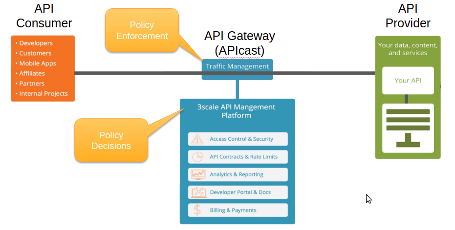

:scrollbar:
:data-uri:

== Overview

ifdef::showscript[]

Transcript:

Red Hat 3scale API Management is a flexible and scalable API management platform based on a distributed architecture.

The basic architecture diagram is shown here. Red Hat 3scale API Management mediates between the API consumers, shown on the left, and the API providers, shown on the right.

The architecture is hybrid, with separate traffic control and program management layers. The traffic management and API management layers can be deployed separately. The traffic between API consumer and API provider does not go through the 3scale cloud, which reduces latencies.

The API management platform, or AMP, component provides management capabilities, including API management, access control, security, rate limits, analytics, Developer Portal, billing, and account management. The APIcast gateway and the API management platform are covered in more details in subsequent modules.

Integration with the 3scale platform is accomplished by deploying traffic management agents, which enforce traffic policies, access control, and rate limits. The traffic management can be a custom APIcast gateway built on an NGINX web server and OpenResty, or a code plug-in library embedded within the API provider.

endif::showscript[]
