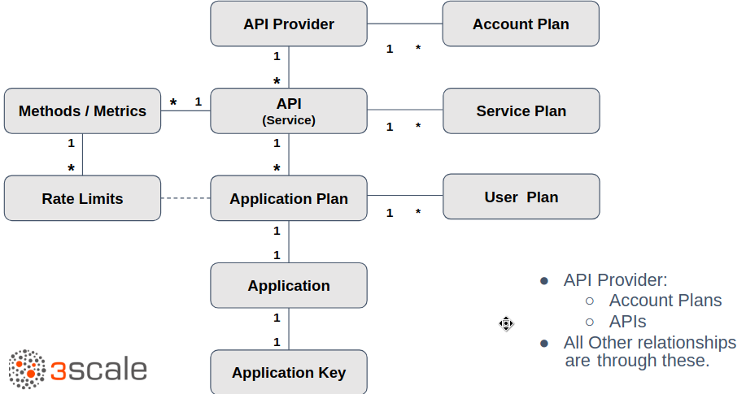

:scrollbar:
:data-uri:

== Data Models

.*API/Admin Data Model*

ifdef::showscript[]

Transcript:

This diagram shows the relationship between the various data objects in Red Hat 3scale API Management.

At the root of the relationship is the API provider. The API provider is the corporate or organization account on the 3scale SaaS platform, or the default provider user on a 3scale on-premise API management platform.

All other relationships are derived from this. The API provider can create one or more APIs or services to manage. The account plan is for managing the contract and the creation of developer accounts. Typically, the plan is managed at the application level, and account plans are left at a single default and unchanged.

The application plan defines access policies such as rate limits. Each service can have multiple application plans.

An application is the entity whose credentials are attached to each request. The credential is the application key.

A service plan is like an application plan but is applied at the service level to apply to all applications globally for the service.

A user plan is an optional end user plan that derives from the application plan and can apply limits to individual users.

endif::showscript[]
