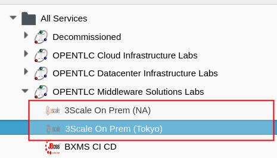
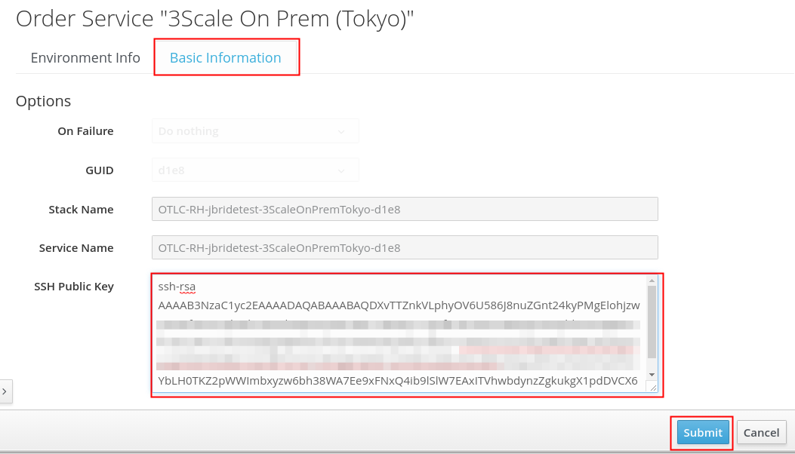
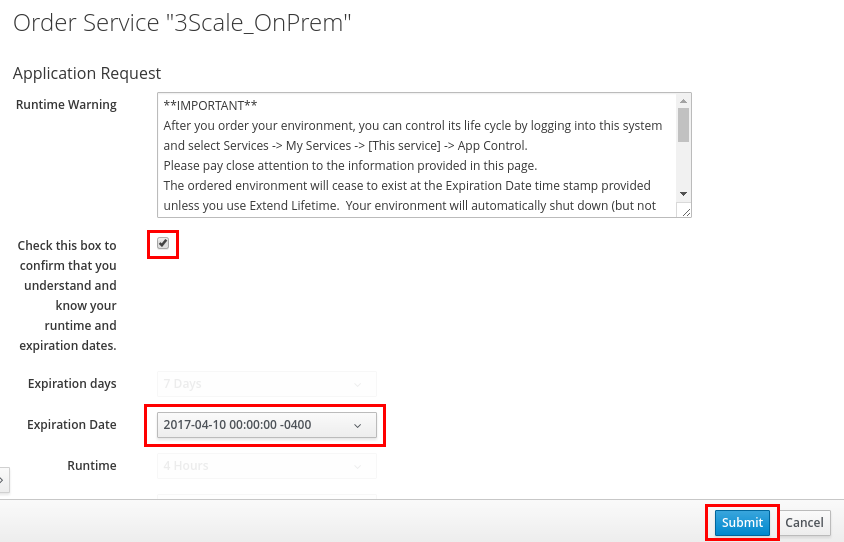
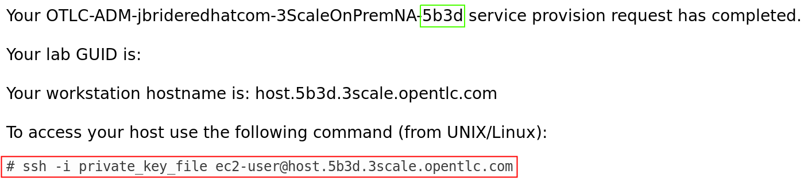
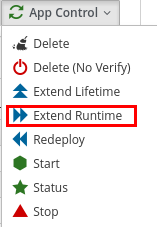

:scrollbar:
:data-uri:
:toc2:
:oc_wrapper: link:https://drive.google.com/open?id=0By9nzck4_tI0N19oeDhuVk5YSEE["oc-cluster wrapper^"]
:linkattrs:

== Environment Setup Lab

[IMPORTANT]
This course uses the 3scale AMP environment used in the `3scale Onpremise Implementation` course. 

.Goals
* Review the labs for this course
* Register for a lab environment
* Install OpenShift Container Platform
* Execute custom RESTful _outer tier_ microservices

.Prerequisites
* *Resources*
** An open broadband Internet connection
+
[IMPORTANT]
Make sure that the Internet connection is free of corporate proxies or other network rules that prevent access to remote servers on the Internet.

** An SSH client
** An SSH public-key pair
** An up-to-date browser, such as Google Chrome or Firefox
** Red Hat OPENTLC credentials

* *Skills*
** Experience deploying to an OpenShift Container Platform
** _Foundational_ experience managing APIs using Red Hat 3scale API Management

.Lab Environment

This course provides a lab virtual machine (VM) in the cloud. Red Hat strongly recommends that you use the lab VM.

The lab VM includes the following:

* Red Hat Enterprise Linux 7 (with Red Hat Training-supported Docker service enabled)
* 16 GB RAM
* 4 CPUs
* 20 GB disk space
* `Git` utility
* `root` access
* OpenShift Container Platform `oc` utility
* `java-1.8.0.-openjdk` and `java-1.8.0-openjdk-devel`
* Maven
* `Lua` 
* `OpenResty`

In addition, this lab environment allows for the installation of OpenShift Container Platform and the 3scale by Red Hat API Management Platform (AMP).

NOTE: The instructions for the labs in this course assume that you are using the provided lab environment.

:numbered:

== Register for Course VM and Log In

=== Sign Up
. Identify your Red Hat OPENTLC username.
+
[TIP]
If you are unsure of your Red Hat OPENTLC credentials, reset your credentials from the link:https://www.opentlc.com/pwm/private/Login[OPENTLC Account Management^] page. If you continue to have problems, email `open-program@redhat.com`.

. Using your OPENTLC credentials, log in to the link:https://labs.opentlc.com/[OPENTLC lab portal^]:
+
image::images/cf_login.png[]

. Navigate to *Services -> Catalogs -> OPENTLC Middleware Solutions Labs*.
. Select the *3scale On Prem* option closest to your region:
+

. On the next page, click *Order*.
. Switch to the *Basic Information* tab and paste in your public SSH key:
+

. Click *Submit*.
. Switch to the *Environment Info* tab.
. Read the *Runtime Warning* and then check the confirmation box.
. Make note of the expiration date, which is the date your lab is scheduled for deletion.
+
NOTE: You may request an extension to the expiration date. This is explained in a later section of this lab.

. Click *Submit*.
+

+
WARNING: Do not select *App Control -> Start* after ordering the lab. The lab is already starting. Selecting *Start* may corrupt the lab environment or cause other complications.

=== Connect

. Check your email in about 10 minutes for two messages:

.. One message has a subject similar to "Your <Name of 3scale On-Prem Service> provision request has started". It provides information about _when_ to connect to your lab environment.
.. The second message tells you that your lab environment is ready and provides information on _how_ to connect to it--please read through it in its entirety:
+

+
IMPORTANT: This email contains the external host URL of your lab environment. Save and flag this email as important for the seven days of its life cycle.

. Make a note of your lab *GUID* to use throughout the labs in this course.
* In the example shown here, the *GUID* of the lab host is `5b3d`.

. Observe that the host URL has the following structure: `host.<GUID>.3scale.opentlc.com`.

.. Make a note of your host URL to use throughout the labs in this course.

. Follow the directions in the second email to connect remotely using SSH to your new VM.

ifdef::showscript[]

=== Manage VM Status

The course VM is scheduled to shut down eight hours after it is started, so you may need to monitor and change the status of your VM from the OPENTLC lab portal.

. Log in to the link:https://labs.opentlc.com/[OPENTLC lab portal^].

. Select the service for the course VM to bring up the details page.

. At the top of the details page, click *App Control* and use the options to check the VM's status, start or stop the VM, or request to extend its lifetime or runtime:
+

+
NOTE: The course VM is provided for one week, and is destroyed after this time. You can request an extension so that the course VM is available for an additional week if desired.

endif::showscript[]

=== Switch to `jboss` User

After you have accessed the lab environment via SSH, you need to change users.

. Switch to the `jboss` operating system user:
+
[source,text]
-----
# sudo su - jboss
-----

* The `jboss` operating system user has `sudo` privileges.
+
IMPORTANT: For the remainder of this course, complete all of the tasks as the `jboss` user.

== Define Environment Variables

In this course, you use the {oc_wrapper} project to manage your OpenShift Container Platform environment.

You need to set a few environment-specific variables in your shell that can be leveraged throughout various commands in this course.

. As the `jboss` user, execute the following commands:
+
[source,text]
-----
$ echo "export GUID=<your lab environment GUID as provided in the confirmation email>" >> ~/.bashrc
$ echo "export EXTERNAL_HOST=host.\$GUID.3scale.opentlc.com" >> ~/.bashrc
$ echo "export OCP_WILDCARD_DOMAIN=cloudapps.\$GUID.3scale.opentlc.com" >> ~/.bashrc
-----

. Execute the `source ~/.bashrc` command.

== Install OpenShift Container Platform

. Create an OpenShift Container Platform environment named `3scale_workshop`.

.. As the `jboss` user, execute the following:
+
[source,text]
-----
$ sudo oc-cluster up 3scale_workshop \
      --public-hostname=$EXTERNAL_HOST \
      --routing-suffix=$OCP_WILDCARD_DOMAIN
-----

.. If you are prompted for the `jboss` user's password, enter `jboss`.
.. Note the values of the following parameters:
** `--public-hostname`: This parameter is used as the basis of the URL to the OpenShift Container Platform _master_ API.

** `--routing-suffix`: This parameter is used thereafter in OpenShift Container Platform to set the default host names of new applications provisioned in OpenShift Container Platform.

ifdef::showscript[]

*** Setting the value to `$OCP_WILDCARD_DOMAIN` causes OpenShift Container Platform to make use of the `*.xip.io` wildcard DNS service.
+
This is needed because the lab VMs do not come installed with a DNS (BIND) server. Typically, a DNS server is configured with OpenShift Container Platform to appropriately resolve the URLs of applications running in your OpenShift Container Platform server. This use of `xip.io` is a convenient mechanism for providing the needed link://https://en.wikipedia.org/wiki/Wildcard_DNS_record[wildcard DNS^] functionality for your OpenShift Container Platform environment without the need for installing BIND.
+
An example host name of a new _on-premise_ APIcast gateway application in your OpenShift Container Platform environment looks like this: `apigateway.apps.153.92.34.135.xip.io`.

endif::showscript[]

. Wait a few minutes for the provisioning of your OpenShift Container Platform environment to complete.
* When it is done, expect to see output similar to the following:
+
.Sample Output
[source,text]
-----

....

OpenShift server started.
   The server is accessible via web console at:
       https://10.0.0.1:8443

   You are logged in as:
       User:     developer
       Password: developer

   To login as administrator:
       oc login -u system:admin

-- Any user is sudoer. They can execute commands with '--as=system:admin'
-- 10 Persistent Volumes are available for use
-- User admin has been set as cluster administrator
switched to context "3scale_workshop".

-----

NOTE: This single node lab environment using the `oc cluster` capability is provided to you for the purpose of this course only. It is not recommended for a production environment.

ifdef::showscript[]
* `oc-cluster` needs to be controlled by `root`. Even if `/var/lib/docker.lock` has group settings to Docker, persistent volumes are still written in directories completely owned only by `root`.
endif::showscript[]

== Verify OpenShift Container Platform

You can check the status of your OpenShift Container Platform environment at any time with the following steps:

. Check the status of your OpenShift Container Platform environment:
+
[source,text]
----
$ sudo oc-cluster status
----
* Expect to see output similar to the following:
+
.Sample Output
[source,text]
----
oc cluster running. Current profile <3scale_workshop>
The OpenShift cluster was started 4 minutes ago

Web console URL: https://3scale-9253.rhpds.opentlc.com:8443

Config is at host directory /root/.oc/profiles/3scale_workshop/config
Volumes are at host directory /var/lib/origin/openshift.local.volumes
Data is at host directory /root/.oc/profiles/3scale_workshop/data
----

. Log in to OpenShift Container Platform as the `developer` user:
+
-----
# oc login https://$EXTERNAL_HOST:8443 -u developer
-----
* The `developer` user is OpenShift Container Platform lab environment.

. When prompted whether or not to use an insecure connection, enter `Y`.
. When prompted for the `developer` user's password, enter `developer`.

. Execute the following command to view the 10 pre-configured persistent volumes in this environment:
+
-----
# oc get pv --as=system:admin
-----
* Expect to see output similar to the following:
+
.Sample Output
[source,text]
-----
NAME      CAPACITY   ACCESSMODES   RECLAIMPOLICY   STATUS      CLAIM     REASON    AGE
vol01     10Gi       RWO,ROX,RWX   Recycle         Available                       10m
vol02     10Gi       RWO,ROX,RWX   Recycle         Available                       10m
vol03     10Gi       RWO,ROX,RWX   Recycle         Available                       10m
vol04     10Gi       RWO,ROX,RWX   Recycle         Available                       10m
vol05     10Gi       RWO,ROX,RWX   Recycle         Available                       10m
vol06     10Gi       RWO,ROX,RWX   Recycle         Available                       10m
vol07     10Gi       RWO,ROX,RWX   Recycle         Available                       10m
vol08     10Gi       RWO,ROX,RWX   Recycle         Available                       10m
vol09     10Gi       RWO,ROX,RWX   Recycle         Available                       10m
vol10     10Gi       RWO,ROX,RWX   Recycle         Available                       10m
-----

. Review the OpenShift Container Platform web console:

.. Identify the URL of the OpenShift Container Platform web console:
+
[source,text]
-----
$ echo -en "\nhttps://$EXTERNAL_HOST:8443\n\n"
-----

.. Open your browser and navigate to the URL you identified in the previous step.
.. Click through the warnings from your browser indicating that it has no knowledge of the Certificate Authority associated to your OpenShift Container Platform web console.
** The _OpenShift Container Platform web console_ in your lab environment is secured by default using a self-signed certificate.

.. From the OpenShift Container Platform web console login page, log in using the `developer`/`developer` credentials:
+
image::images/ocp_login.png[]

You now have a working OpenShift Container Platform lab environment from which to conduct an on-premise installation of the 3scale by Red Hat _APIcast_ and _API Management Platform (AMP)_ components.

== Appendix

. Delete the existing default project automatically created by the `oc cluster` utility:
+
[source,text]
-----
$ oc delete project myproject --as=system:admin
-----

=== Reference

The following resources are provided as suggested reading for 3scale by Red Hat.

NOTE: Some of these resources are hosted on internal Red Hat websites. Partners should coordinate closely with their Red Hat Account Representative regarding updated information that may be posted to these internal Red Hat websites.

* link:https://github.com/3scale[3scale Github Organization^]
* link:https://www.3scale.net/blog/[3scale Blog^]
* link:https://mojo.redhat.com/docs/DOC-1104042[3scale by Red Hat FAQ^]
* link:http://post-office.corp.redhat.com/mailman/listinfo/sme-apis["sme-apis mailing list^"]
* link:https://docs.google.com/document/d/1iYyn666wo1D02Wn0nxCS5NR1_rRmgPvkav-hMWiWyNE/edit#heading=h.1ft5mwfmvjh5["3scale by Red Hat One-Stop^"]

