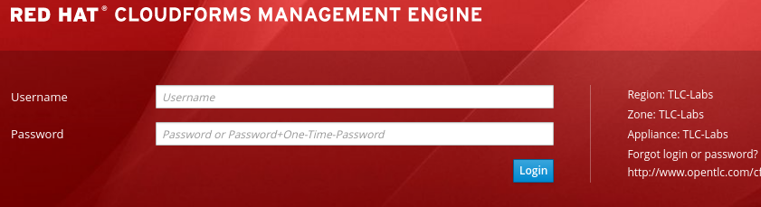

:scrollbar:
:data-uri:
:toc2:
:linkattrs:

== Environment Setup Lab

.Goals
* Register for lab environment
* Download and start course virtual machine (VM)
* Access Red Hat OpenShift Container Platform environment

.Required Resources
* Open broadband Internet connection
+
[IMPORTANT]
Make sure that the Internet connection is free of corporate proxies or other network rules that prevent access to remote servers on the Internet.

* Up-to-date browser such as Google Chrome or Firefox
* Red Hat OPENTLC credentials
* Installation of 64-bit link:https://www.virtualbox.org/wiki/Downloads[VirtualBox application^] or libvirt (if you are using Linux) on your local workstation
+
NOTE: The 64-bit virtualization technology is mandatory. The 32-bit virtualization does not work for this course.

* Minimum of two 64-bit CPUs and 2 GB RAM dedicated to course VM

.Skills

* Experience deploying to OpenShift Container Platform
* Foundational experience managing APIs using Red Hat 3scale API Management
** Familiarity with Red Hat Ansible Automation

:numbered:

== Remote OpenShift Environment

This course provides an OpenShift environment in the cloud. Red Hat strongly recommends that you use this remote OpenShift lab environment.

=== Sign Up
. Identify your Red Hat OPENTLC username.
+
[TIP]
If you are unsure of your Red Hat OPENTLC credentials, reset them from the link:https://www.opentlc.com/pwm/private/Login[OPENTLC Account Management^] page. If you have problems, email `open-program@redhat.com`.

. Using your OPENTLC credentials, log in to the link:https://labs.opentlc.com/[OPENTLC lab portal^]:
+

. Navigate to *Services -> My Services*.
. Delete all active services.
* Doing this allows you to order a service for this course.

. Navigate to *Services -> Catalogs -> OPENTLC Middleware Solutions Labs*.
. Select *3scale (OCP environment)*:
+

. On the next page, click *Order*, and on the form that appears, click *Submit*.
* Expect to receive an email from Red Hat with information about the course.

=== Connect

. Check your email for a message from Red Hat similar to the following:
+
[source,text]
-----
You have been enrolled in the Red Hat OPENTLC THREESCALE OpenShift environment.
You can access your environment by going to https://master.na1.openshift.opentlc.com:443 and logging in as jbride-redhat.com.

NOTICE: Your environment will expire and be deleted in 14 day(s) at 2017-08-24 00:00:00 -0400. In order to conserve resources we cannot archive or restore any data in this environment. All data will be lost upon expiration.
-----

. Identify your OpenShift lab environment GUID from the email you received, and make a note of it to use throughout this course.
* In the example above, the GUID is `na1`.

. Open a browser on your host machine and navigate to the URL identified in the confirmation email.
. Click through the warnings from your browser indicating that it has no knowledge of the Certificate Authority associated to your OpenShift Container Platform web console.
* The OpenShift Container Platform web console in your lab environment is secured by default with a self-signed certificate.

. From the OpenShift Container Platform web console's login page, log in using your OPENTLC credentials:
+
image::images/ocp_login.png[]

You now have a working OpenShift Container Platform lab environment from which to conduct an on-premise installation of 3scale by Red Hat's _APIcast_ and _API Management Platform (AMP)_ components.

== Lab Virtual Machine

This course also provides a VM with all of the client-side tooling you need for the course. Red Hat strongly recommends that you use this VM. The instructions for the labs assume that you are using this VM, which is provided in VDI format and can be run on your local workstation using VirtualBox or libvirt (if using Linux).

=== Acquire VirtualBox Image

. Download the `gpte_apimgmt_11.vdi` VirtualBox image directly from this link:https://drive.google.com/open?id=0B8mmXW6hJKdienFUZ1dWMExEVWM[link^].
+
[NOTE]
If you are participating in an on-site instructor led training (ILT), the instructor will pass around a USB drive with the course VM.

=== VM Operating System Credentials

* The default username/password for VM is `jboss/jboss`.
* The `jboss` operating system user has `sudo` access.

=== Install

The course VM can be run in either VirtualBox or libvirt. Choose the first or the second procedure below depending on the virtualization technology you are using.

==== VirtualBox

NOTE: The course VM does not include a window manager. Therefore, you may want to use SSH to access the VM from your host so that you can copy and paste commands from your host to the VM. With VirtualBox, use a _bridged adapter_ network configuration.

. Start VirtualBox on your local workstation and navigate to *Machine -> New*.
. In the *Create Virtual Machine* panel, populate the fields with these entries:
* *Name:* `gpte-apimgmt`
* *Type*: `Linux`
* *Version*: `Red Hat (64-bit)`
. Click *Next*.
. In the *Memory* panel, specify `1024 MB` of RAM, and click *Next*.
. In the *Hard Disk* panel:
.. Select *Use an existing virtual hard disk file*.
.. Browse your hard drive and select the downloaded VDI image.
.. Click *Create*.
. Add networking:
.. To use SSH to access your virtual machine from your host:
... Assign the VM an IP address that is accessible by the host machine.
... Set up a bridged adapter network configuration for your VM.
.. To set up VirtualBox networking, refer to the  link:https://www.virtualbox.org/manual/ch06.html[VirtualBox documentation^].
* Virtual Box networking is outside the scope of this lab.

. Click *Start*.
* The VM is provided without a window manager.
. At the command prompt, enter `jboss` and `jboss` for the username and password.

==== Libvirt

If your host machine is Red Hat Enterprise Linux, CentOS, or Fedora, the VDI can be run directly in libvirt. You do not need to install VirtualBox.

`libvirtd` and the corresponding tooling are outside the scope of this lab. But one tip is that this RPM package needs to be installed: `libvirt-daemon-driver-vbox.x86_64`.

=== SSH

If your VM has an IP address that is accessible by the host, then you should be able to access it via SSH.

. On the VM, open a console window.

. Determine the IP address assigned to the VM:
+
[source,text]
-----
$ ip addr show
-----
. From your host machine, use SSH to access your VM as the `jboss` user:
+
[source,text]
-----
$ ssh jboss@<ip address of your virtual machine>
-----
. Verify that the VM can access the Internet:
+
-----
$ ping -c 5 8.8.8.8
-----
+
IMPORTANT: For the remaining labs in this course, complete all of the tasks in this VM as the `jboss` user.

ifdef::showscript[]

* Recommended: Enable <<vbga>> to allow the VM to use the full display resolution of your host machine.

endif::showscript[]

=== Define Environment Variables

You need to set a few environment-specific variables in your shell that can be leveraged by various commands in this course.

. As the `jboss` user, execute each of the following commands, one at a time:
+
[source,text]
-----
$ echo "export GUID=<your lab environment GUID as provided in the confirmation email>" >> ~/.bashrc
$ echo 'export OCP_WILDCARD_DOMAIN=apps.$GUID.openshift.opentlc.com' >> ~/.bashrc
$ echo 'export OCP_USER_ID=<your OCP USER ID>' >> ~/.bashrc
-----

. Set an environment variable with your initials:
+
[source,text]
-----
$ echo "export OCP_PROJECT_PREFIX=<your OCP USER ID with dashes>" >> ~/.bashrc
-----
* OpenShift project names need to be unique within an OpenShift cluster. This ensures that your project names begin with a unique prefix. This environment variable is used throughout the labs. As an example, if your `OCP_USER_ID` is `sjayanti-redhat.com`, the `OCP_PROJECT_PREFIX` would be set to `sjayanti-redhat-com`.

. Enable the new environment variables in your existing shell:
+
[source,text]
-----
$ source ~/.bashrc
-----

=== VM Components

The lab VM includes the following:

* CentOS 7
* `root` access
* OpenShift Container Platform's `oc` utility
* `java-1.8.0.-openjdk` and `java-1.8.0-openjdk-devel`
* Maven
* `Git` utility
* cURL
* `wget`
* Docker
* link:https://stedolan.github.io/jq/https://stedolan.github.io/jq/[jq^]
* link:http://xmlstar.sourceforge.net/overview.php[xmlstarlet^]
* link:https://www.openssl.org/[openssl^]
* `jboss` operating system user (with `sudo` privileges)
* Clone of course's link:https://github.com/gpe-mw-training/3scale_development_labs.git[lab assets^]

=== Authenticate to OpenShift Using `oc` Utility

Your lab VM includes the `oc` utility to allow you to interact from the command line with your OpenShift Container Platform environment.

You can authenticate to your OpenShift Container Platform environment as follows:

. Verify that you are logged in as the `jboss` operating system user.
. Run the following command:
+
[source,text]
-----
$ oc login https://master.$GUID.openshift.opentlc.com -u $OCP_USER_ID
-----

== Appendix

=== References

The following resources are suggested reading for 3scale by Red Hat.

NOTE: Some of these resources are hosted on internal Red Hat web sites. Partners should coordinate closely with their Red Hat Account Representative regarding updated information that may be posted to these internal Red Hat web sites.

* link:https://github.com/3scale["3scale GitHub Organization^"]
* link:https://www.3scale.net/blog/["3scale Blog^"]
* link:https://mojo.redhat.com/docs/DOC-1104042["3scale by Red Hat FAQ^"]
* link:http://post-office.corp.redhat.com/mailman/listinfo/sme-apis["sme-apis mailing list^"]
* link:https://docs.google.com/document/d/1iYyn666wo1D02Wn0nxCS5NR1_rRmgPvkav-hMWiWyNE/edit#heading=h.1ft5mwfmvjh5["3scale by Red Hat One-Stop^"]

=== YAML Tips and Tricks

There are a few instances in this course where you are asked to edit an OpenShift Container Platform object, such as a deployment configuration object. OpenShift Container Platform objects are typically represented in YAML format, so you may be asked to edit a YAML configuration.

Editing YAML configurations can be a bit tricky if you do not have previous experience. For example, spacing and indentation matter.

Editing OpenShift Container Platform resources in a YAML representation is particularly tricky. If you make a YAML syntax error, OpenShift Container Platform provides no information about the root problem. Instead, it simply rejects the change without any explanation.

Red Hat recommends that you spend some time using YAML. Here are two useful tutorials:

* link:https://github.com/Animosity/CraftIRC/wiki/Complete-idiot's-introduction-to-yaml["Complete idiot's introduction to yaml^"]
* link:http://keleshev.com/yaml-quick-introduction["YAML: Quick Introduction^"]

ifdef::showscript[]
[[vbga]]
=== VirtualBox Guest Additions

The default display resolution of the VM is rather low at 1042 x 768. This can lead to frustration as you work through the labs of this course. VirtualBox's Guest Additions allow VMs to use the full resolution of a host's display. If you are using a host computer with high resolution, Red Hat recommends enabling Guest Additions in your VirtualBox environment.

This section explains how to install and enable VirtualBox Guest Additions.

==== Install Guest Additions

The VirtualBox install comes with Guest Additions already installed. No further tasks are required if VirtualBox is installed from the link:https://www.virtualbox.org/wiki/Downloads[download site^].

==== Enable Guest Additions in VM

. Verify that that the VM is started.
. In the top panel of the VirtualBox window, select *Devices -> Insert Guest Additions CD Image*:
+
image::images/select_ga.png[]

. Select *Open Autorun Prompt* and click *OK*:
+
image::images/ga_prompt.png[]
. Click *Run*:
+
image::images/ga_run.png[]
. When prompted for the password of the `root` operating system user, enter `jboss` and click *Authenticate*.
* A terminal window in the VM opens and begins to build the Guest Additions kernel modules in the VM.
. After a minute or two, when you are prompted to close the window, press *Return*:
+
image::images/ga_building.png[]

. Shut down and restart the VM.
* This causes the new instance of the VM to use Guest Additions.

==== Increase VM Screen Resolution

. After the VM restarts, navigate to *System -> Preferences -> Hardware -> Displays*:
+
image::images/nav_display.png[]
. Click the *Resolution* list.
* Note that you now have more resolution options:
+
image::images/display_options.png[]
. Select the highest display resolution provided by your host operating system.
. At the bottom of the *Monitor Preferences* dialog, click *Apply*.

endif::showscript[]
