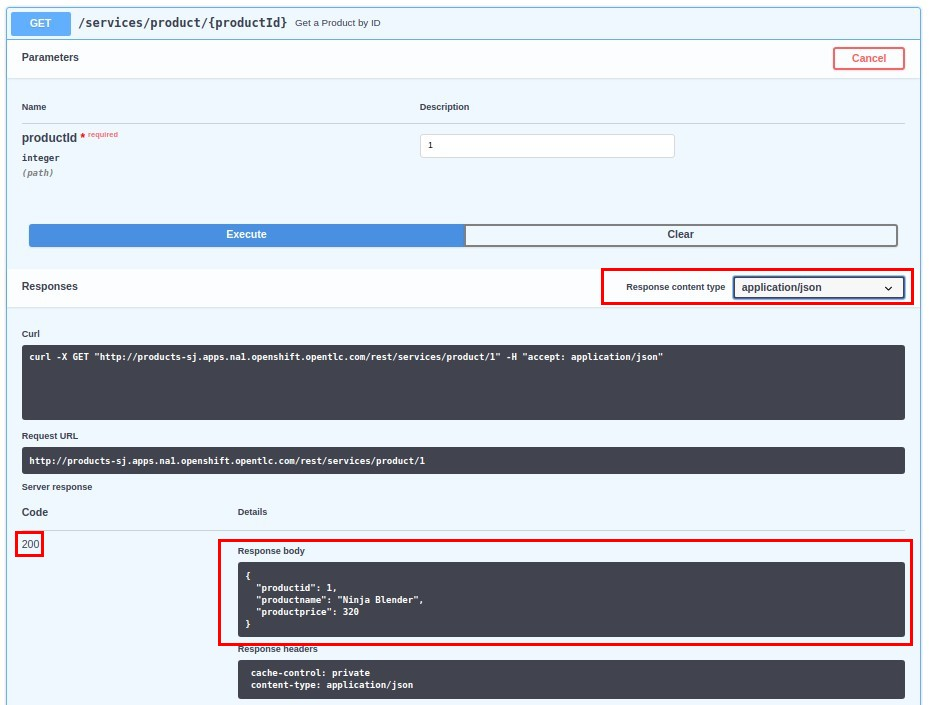

:scrollbar:
:data-uri:
:linkattrs:
:toc2:

== Lab Environment and Business Services

In this lab you familiarize yourself with the course's lab assets and deploy RESTful business services to Red Hat OpenShift^(R)^ Container Platform.

.Goals
* Review lab environment and client VM setup
* Learn about the course's lab assets
* Deploy business service APIs in your OpenShift environment

:numbered:
== Lab Environment

=== Remote VM
This course uses the same lab environment that you provisioned in the prerequisite course that covered implementation of Red Hat 3scale API Management. 
If your lab environment is still available, then you can continue to use the same OpenShift Container Platform and Red Hat 3scale API Management environment as you used in the previous course.

IMPORTANT: The OPENTLC lab environment is automatically deleted after 7 days. 
Prior to the deletion of your lab environment, you can log in to the link:https://labs.opentlc.com[OPENTLC Lab portal] and extend the lifetime of your environment by one more week. 

If your lab environment has been deleted, then you'll need to re-provision a new lab environment.
Please refer to the first couple of labs of the _Red Hat 3scale Implementation_ course for details.

=== Shell Environment Variables

Recall from the first lab of the _3scale Implementation_ pre-requisite course that you permanently set the following environment variables in shell of your virtual machine:

. *OCP_WILDCARD_DOMAIN*
+
Wildcard DNS of your OpenShift environment.

. *OCP_PROJECT_PREFIX*
+
Unique identifier used to deconflict OpenShift project names across a shared OpenShift cluster.

. *$OCP_USERNAME*
+
Name of user that will serve as the API Provider in this lab.

. *API_MANAGER_NS*
+
Name of OpenShift project where API Manager is deployed to.

Ensure that all of these environment variables are still set.

=== API Manager
Your remote VM should be provisioned with the Red Hat 3scale API Manager as per the intructions in the _Red Hat 3scale Implementation_ course.

. You should have _view_ access to the API Manager provisioned in the following namespace:  `API_MANAGER_NS` .

. You should be able to access the Admin Portal of the default _tenant_ of the API Manager by navigating to the output of the following:
+
-----
$ echo -en "\nhttps://`oc get route system-provider-admin -n $API_MANAGER_NS --template "{{.spec.host}}"` \n\n"
-----
+
Authenticate by using credentials of:   admin / admin.

=== Lab Assets

To support the lab exercises, you need RESTful business services that you can manage and secure. 
The configurations for these services  are provided in the lab assets. In this exercise, you explore these business services.

. SSH into your remote lab vm as the non-root operating system user.
. Ensure the following directory exists:
+
-----
$ mkdir -p $HOME/lab/
-----

. Clone the latest `3scale_developer_labs`:
+

-----
$ git clone https://github.com/gpe-mw-training/3scale_development_labs $HOME/lab/3scale_development_labs
-----

. Examine the subdirectory structure of the labs and note the available subprojects:
* *Products*: JEE application that exposes a JAX-RS REST API. This is the business API that you manage using Red Hat 3scale API Management.
* *Stores*: JBoss^(R)^ EAP application that exposes a CXF SOAP API web service.
* *StoresFIS*:  JBoss Fuse camel application that exposes a REST API and routes to the Stores SOAP service.
* *templates*: OpenShift templates for defining the service build and deployment parameters of your project.
* *3scale-Swagger-Import*: Custom tool for importing API definitions using OpenAPI Specifications (OAS) into Red Hat 3scale API Management.
* *DevPortal*: Files related to customizing 3scale by Red Hat's Developer Portal.
* *Stock* : JBoss Data Virtualization application providing a REST API for accessing Stock details across PostgreSQL and MySQL databases.
* *Coolstore* : Homework assignment assets based on the JBoss Demo CoolStore microservices application.

=== ClusterQuota

A Cluster Admin of a production OpenShift environment typically applies clusterquotas and limitranges.

In this section of the lab, you will impersonate the OCP cluster admin and apply link:https://access.redhat.com/documentation/en-us/openshift_container_platform/3.11/html-single/developer_guide/#dev-quotas[quotas] to the user:

The quotas will constrain the aggregate resource consumption of all projects associated with that user.

. Impersonate cluster admin and set a cluster quota on the user: $OCP_USERNAME
+
-----
$ oc create clusterquota clusterquota-$OCP_USERNAME \
        --project-annotation-selector=openshift.io/requester=$OCP_USERNAME \
        --hard requests.cpu="1Gi" \
        --hard limits.cpu="2Gi"  \
        --hard requests.memory="4Gi" \
        --hard limits.memory="8Gi" \
        --hard configmaps="5" \
        --hard pods="10" \
        --hard persistentvolumeclaims="3"  \
        --hard services="15" \
        --hard secrets="15" \
        --hard requests.storage="10Gi" \
        --as=system:admin
-----
+
The templates and instructions provided in this course will provision runtimes that satisfy the constraints of these clusterquotas.

=== LimitRange
Your OpenShift environment is configured to create a new _LimitRange_ upon creation of a new project.

This LimitRange is specified by the OpenShift cluster admin.

In the next section when you create the project where your backend business services will reside, you can view the corresponding LimitRange that the cluster admin has imposed on your project.

[[bservice_deployment]]
== Products API 

In this section you deploy the Products API on a Red Hat JBoss Enterprise Application Platform (EAP) container running on OpenShift. 
The products data exists in a PostgreSQL database, which is deployed to the same OpenShift namespace.

=== Optional: Understand the Products API

The lab assets that you previously cloned include everything needed to build and run the _Products API_.

Specific to the Products API, study the following from your lab assets:

. *~/lab/3scale_development_labs/templates/products-api.json*
. *~/lab/3scale_development_labs/Products/src/main/java*

To test your understanding of the _Products API_ assets, answer the following questions:

. What source code is compiled in the _BuildConfig_ object responsible for creating the Products container image ?
. How is the PostgreSQL based Products database seeded with data ?
. The REST API of the Products service will generate a _swagger.yaml_ configuration file that defines the resources and HTTP methods exposed by the API.
+
This _swagger.yaml_ is exposed by the Products service at runtime and can be viewed in a tool such as:  http://editor.swagger.io .
+
What is used to generate the _swagger.yaml_ configuration ?

=== Create New Project for Products API Services

. Using the `oc` utility found in the course virtual machine, log into the master API of your OpenShift environment.
+
NOTE: The login session to your OpenShift environment is valid for 24 hours.  Every 24 hours, you'll have to re-authenticate using the `oc` utility and subsequently re-generate a new session.

. Create a new project for your Products API business service applications:
+

-----
$ oc new-project $OCP_PROJECT_PREFIX-products-api \
     --display-name="Products API" \
     --description="Products API Business Services"
-----

. Annotate the products-api project such that its resources are managed by a cluster quota:
+
-----
$ oc annotate namespace $OCP_PROJECT_PREFIX-products-api openshift.io/requester=$OCP_USERNAME --overwrite --as=system:admin
-----

=== Deploy and Test `products` API Service

. Import the jboss-eap-7 image streams into the OpenShift namespace

.. The _products_ API deploys on Red Hat JBoss EAP 7.
.. It's likely that your lab environment does not include the appropriate JBoss EAP 7 image stream in the _openshift_ namespace.
.. Import the JBoss EAP 7 image stream as follows:
+
-----
$ oc create -f https://raw.githubusercontent.com/jboss-openshift/application-templates/ose-v1.4.17/eap/eap71-image-stream.json -n openshift --as=system:admin

...

imagestream.image.openshift.io/jboss-eap71-openshift created
-----
+
NOTE:  To execute the above command, the OCP user you are logged into needs the ability to _impersonate_ the OCP cluster admin.
Please refer to the _3scale Implementation_ pre-requisite for more details about _impersonating_ the cluster admin user.

. Import the `products-api` template to your OpenShift environment:
+

-----
$ oc create -f ~/lab/3scale_development_labs/templates/products-api.json
-----

. Create a new application using the `products-api` template:
+
-----
$ oc new-app --template=products-api --param HOSTNAME_HTTP=products-$OCP_PROJECT_PREFIX.$OCP_WILDCARD_DOMAIN
-----

.. Wait until your `products-api` build has completed
+
-----
$ oc get build

NAME             TYPE      FROM          STATUS     STARTED              DURATION
products-api-1   Source    Git@c72fb68   Complete   About a minute ago   59s
-----

.  Wait until the `productsdb` dc has fully started:
+
-----
$ oc get dc productsdb

NAME         REVISION   DESIRED   CURRENT   TRIGGERED BY
productsdb   1          1         1         config
-----

. Resume the paused _products-api_ dc:
+
-----
$ oc rollout resume dc/products-api
-----

. Wait until the corresponding _products-api_ pod has started:
+
-----
$ oc get pods

...

NAME                               READY     STATUS      RESTARTS   AGE
products-api-1-build               0/1       Completed   0          5m
products-api-1-02s28               1/1       Running     0          4m
productsdb-1-39dkc                 1/1       Running     0          5m
-----
+
NOTE: It takes about 2-3 minutes for the application to be deployed. 
Before continuing to the next steps, confirm that your pods show a `Running` status, that the related build is complete, and that there are no deployment tasks running.
 
. Get the route details:
+
-----
$ oc get routes
-----
+
.Sample Output

-----
products-api               products-sjayanti-redhat-com.apps.na1.openshift.opentlc.com                  products-api           <all>                   None
-----

* This is the URL to connect to the Products API service. 
* It uses the format `http://products-$OCP_PROJECT_PREFIX.$OCP_WILDCARD_DOMAIN`.

=== Smoke Test

. Test that the `products` API service accepts requests and returns the correct response:
+
-----
$ curl -v -k http://`oc get route products-api -o template --template {{.spec.host}} -n $OCP_PROJECT_PREFIX-products-api`/rest/services/product/1
-----
+
.Sample Output

-----
..

{"productid":1,"productname":"Ninja Blender","productprice":320.0}
-----

. A list of all products can be retrieved by executing the following: 
+
-----
$ curl -X GET http://`oc get route/products-api -o template --template {{.spec.host}} -n $OCP_PROJECT_PREFIX-products-api`/rest/services/products | python -m json.tool
-----
+
Expect to see a list of products that were seeded into your PostgreSQL based Products database.

=== Documentation

Your Products service provides a _swagger.yaml_ configuration file that documents the resources that it exposes.

To gain access to this _swagger.yaml_ config file, point your browser to the output of the following command:

-----
$ echo http://`oc get route/products-api -o template --template {{.spec.host}} -n $OCP_PROJECT_PREFIX-products-api`/rest/swagger.yaml
-----

Via your browser, you can download this _swagger.yaml_ configuration file to your local filesystem and skim through it.

This Swagger documentation can be better visualized in a tool such as:  http://editor.swagger.io

. In a new browser window, navigate to `http://editor.swagger.io/`.
. Select *File -> Import URL*.
. Enter the URL of your business API swagger specification.  This URL can be determined by executing the following:
+
-----
$ echo http://`oc get route/products-api -n $OCP_PROJECT_PREFIX-products-api -o template --template {{.spec.host}}`/rest/swagger.yaml
-----

. Click *OK*.
. In line 6, replace *host* from *localhost:8080* to the route URL for the products API. ie; the output of the following:
+
-----
$ echo "$(oc get route/products-api -n $OCP_PROJECT_PREFIX-products-api -o template --template {{.spec.host}})"
-----

. Notice that the methods, relative paths and sample request/response are loaded on the screen.
+
image::images/3scale_amp_products_api_swagger.png[]
+
. Pay particular attention to the 4 REST services, corresponding HTTP methods, relative path, HTTP scheme and descriptions.
+
image::images/3scale_amp_products_api_swagger_2.png[]
+
. You can send sample requests to the API for each method to get an understanding of the request and response types.
+
image::images/3scale_amp_products_api_swagger_3.png[]
+
. Notice the response and response content types for each request.
+

Now that you are familiar with the API, the next step is to define the methods and mappings for the API in the 3scale API Management portal.

The `products` REST API service is now running and exposed to external clients. 
In later lab exercises, you manage and secure these mock business services using Red Hat 3scale API Management.
