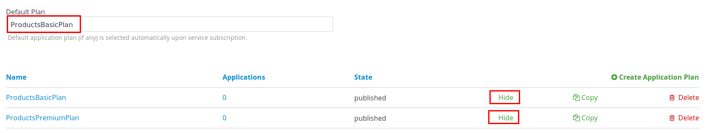
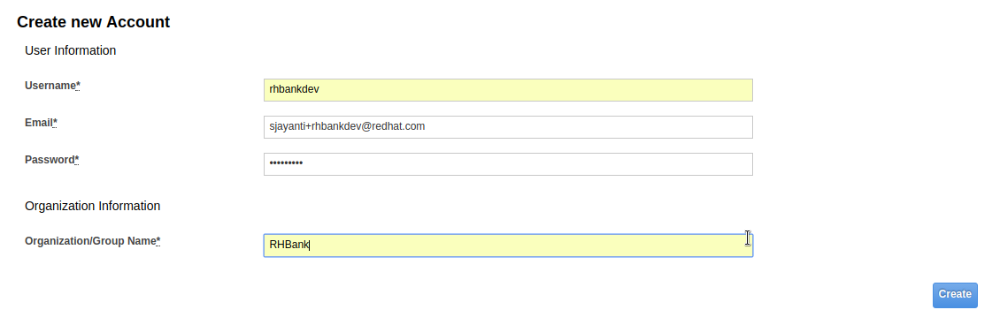
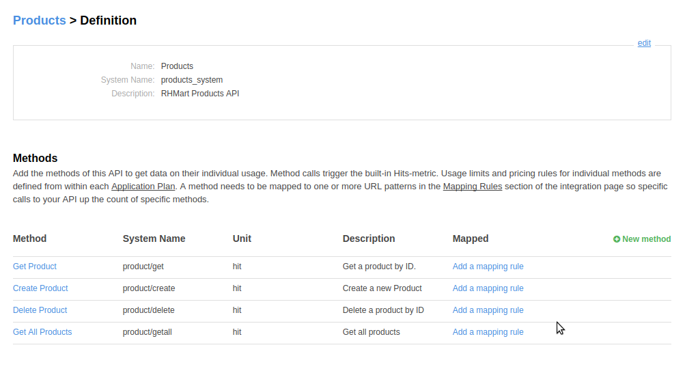
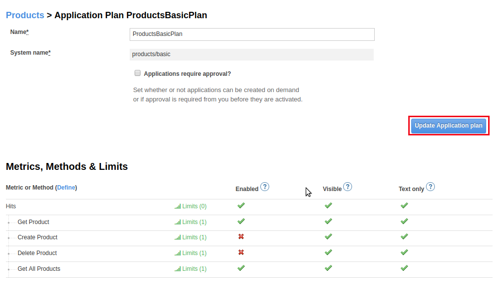
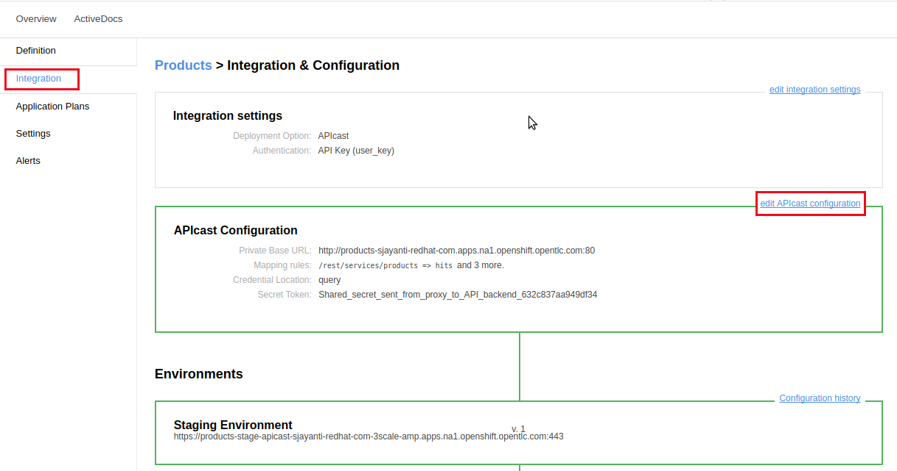

:scrollbar:
:data-uri:
:toc2:

== Metrics, Methods, and Rate Limits Lab

.Overview

In this lab you secure and manage the Products API REST JEE application deployed in the previous lab. 

In particular, _methods_, _metrics_, and _rate limits_ are defined and used.

.Goals

* Expose Products API REST service with 3scale AMP
* Create application plans for basic and premium users
* Define methods and metrics
* Apply rate limits for basic users to control access to the API

.Prerequisites
* Completion of the previous labs in this course
* `OCP_WILDCARD_DOMAIN` environment variable set in your shell
+
TIP: To check if your shell still has this environment variable set, execute the `echo $OCP_WILDCARD_DOMAIN` command. If the variable is no longer set, return to the first lab in this course and follow the steps there to set it again.

* 3scale Admin Portal URL and user credentials to log in

:numbered:

== Initial API Resources

In this section you expose the Products API business services created in an earlier lab using 3scale by Red Hat's APIcast gateway. You use 3scale by Red Hat's Admin Portal to create the accounts, applications, application plans, services, and API definitions.

=== Log In to Admin Portal

. In a browser window, access 3scale by Red Hat's Admin Portal.
+
NOTE: The URL for 3scale by Red Hat's Admin Portal was noted in the previous lab. It should use the following form: `https://$OCP_PROJECT_PREFIX-3scale-admin.$OCP_WILDCARD_DOMAIN`, where `$OCP_PROJECT_PREFIX` and `$OCP_WILDCARD_DOMAIN` are the values set in your `~/.bashrc`.

. Log in to 3scale by Red Hat's Admin Portal using your credentials:
+
image::images/3scale_amp_admin_portal_login.png[]

. Navigate to *Developers* and suspend the default `Developer` user (if not already supended) :
+
image::images/3scale_amp_admin_delete_developers.png[]
+
NOTE:  Suspension of this `Developer` user will reduce possible confusion later on in this lab.
If this default `Developer` account is not suspended, new API services that are defined will automatically have a default _application_ (with corresponding API keys) created for this user.
You'll then have to subsequently make sure you are using the desired _application_ and not this default _application_ associated with this default _developer_ account.

=== Define Products API Service

In this section you define a service that manages access to the Products API business service that you provisioned in the previous lab.

. Navigate to the *API* tab.
+
NOTE: Note that a service is already defined for a _Echo API_. This service is useful for simple route testing, so do not delete it.

. Click *Create Service* to create a new service with the following information:
* *Name*: `Products`
* *System Name*: `products_system`
* *Description*: `RHMart Products API`
* *Gateway*: `NGINX APIcast self-managed`
* *Authentication*: `API Key (user_key)`
+
image::images/3scale_amp_products_create_service_1.png[]

. Do not change the remaining default fields, and click *Create Service*:
+
image::images/3scale_amp_products_create_service_2.png[]

=== Define Application Plan

Plans are used for granting access to specific APIs and endpoints, limiting traffic, and monetizing API usage. Application plans let you configure access rights to an API by specifying rate limits and pricing rules. All applications must be associated with a plan. Application plans can be customized for each application.

In this section of the lab, you'll create two new Application Plans for the *Products* service.
 

. In the APIs section, expand the *Products* API and scroll down to the *Published Application Plans* section.
+
image::images/3scale_amp_products_app_plan.png[]
. Create `ProductsBasicPlan`:
.. Click *Create Application Plan*.
.. Use the following parameters:
* *Name*: `ProductsBasicPlan`
* *System Name*: `products/basic`
.. Click *Create Application Plan*:
+
image::images/3scale_amp_products_app_plan2.png[]

. Create another application plan with the name `ProductsPremiumPlan` and a system name of `products/premium`.
* The `ProductPremiumPlan` is used in later labs in this course.
. For *Default Plan*, select *ProductsBasicPlan*.
. Click *Publish* for both *ProductsBasicPlan* and *ProductsPremiumPlan*:
+

=== Define Accounts and Users

. Click *Developers*.
. Click *Create*.
. Create a new account with the following credentials:
* *Username*: `rhbankdev`
* *Email*: `_Provide unique email address_`
* *PASSWORD*: `_Provide unique, easy-to-remember password_`
* *Organization/Group Name*: `RHBank`
+

=== Create Application

In this section you associate an application to your previously defined users. This generates a user key for the application. The user key is used as a query parameter to the HTTP request to invoke your business services via your on-premise APIcast gateway.

. Navigate to the *Developers* tab.
. Select *RHBank* -> *Application*.
+
image::images/3scale_amp_products_create_app.png[]
+
. Click *Create Application*.
. Enter the following values:
* *Application plan*: `ProductsBasicPlan`
* *Service plan*: `Default`
* *Name*: `ProductsApp`
* *Description*: `Products Application`
+
image::images/3scale_amp_products_create_app2.png[]

. After the application is created, make a note of the user key:
+
image::images/3scale_amp_products_app_plan_userkey.png[]

== Create Mappings and Methods

=== Investigate Products API

In order to create the methods and mappings, it is important to understand the API specification for the Products API. The Products API provides a Swagger specification which we can use to check out the documentation for the API.

To access the Swagger documentation, follow the steps below:

. In a new browser window, navigate to `http://editor.swagger.io/`.
. Select *File -> Import URL*.
. Enter the URL of your business API swagger specification:
+
`http://products-$OCP_PROJECT_PREFIX.$OCP_WILDCARD_DOMAIN/rest/swagger.yaml`
+
IMPORTANT: The values do not resolve in the browser, so you need to provide the full path, for example: `http://products-sjayanti-redhat-com.apps.na1.openshift.opentlc.com:80/rest/swagger.yaml`

. Click *OK*.
. In line 6, replace *host* from *localhost:8080* to the URL for the products API e.g products-$OCP_PROJECT_PREFIX.$OCP_WILDCARD_DOMAIN
+
IMPORTANT: The values do not resolve in the browser, so you need to provide the full path, for example: `http://products-sjayanti-redhat-com.apps.na1.openshift.opentlc.com`
+
. Notice that the methods, relative paths and sample request/response are loaded on the screen.
+

+
. Pay particular attention to the 4 REST services, corresponding HTTP methods, relative path, HTTP scheme and descriptions.
+

+
. You can send sample requests to the API for each method to get an understanding of the request and response types.
+

+
. Notice the response and response content types for each request.
+
image::images/3scale_amp_products_api_swagger_4.png[]

Now that you are familiar with the API, the next step is to define the methods and mappings for the API in the 3scale API Management portal.

=== Methods

. Navigate to the *API* tab.
. In the *Products* service, select *Integration*.
. Click *add the base URL of your API and save the configuration*:
+
image::images/3scale_amp_products_api_integration1.png[]
+
. Expand the *Mapping Rules* section.
. Click *Define Metric/method*.
. In the *Methods* section, click *New method*.
. Enter the following values:
* *Friendly name*: `Get Product`
* *System name*: `product/get`
* *Description*: `Get a product by ID`
. Click *Create Method*:
+
image::images/3scale_amp_products_create_method.png[]

. Repeat steps 6 to 8 for the following methods:
+
[options="header"]
|=======================
|Friendly name|System name|Description
|`Create Product`|`product/create`|`Create a new product.`
|`Delete Product`|`product/delete`|`Delete a product by ID.`
|`Get All Products`|`product/getall`|`Get all products.`
|=======================
+

=== Mappings

. For the *Get Product* method, click *Add a mapping rule*.
. Click *edit*.
. Enter the following values:
* *Verb*: `GET`
* *Pattern*: `/rest/services/product/`
* *Method*: `product/get`
. Repeat steps 10 to 12 for the other mapping rules:
+
[options="header"]
|=======================
|Verb|Pattern|Method
|`POST`|`/rest/services/product`|`product/create`
|`DELETE`|`/rest/services/product/`|`product/delete`
|`GET`|`/rest/services/products`|`product/getall`
|=======================
+
image::images/3scale_amp_products_create_all_mappings.png[]

== Create Stage and Prod Routes

. From the command line, verify that you are logged in to OpenShift.
. Verify that you are in the *3scale AMP* project:
+
[source,text]
-----
$ oc project $OCP_PROJECT_PREFIX-3scale-amp
-----

. Get the list of `apicast` routes defined in the project:
+
[source,text]
-----
$ oc get routes | grep apicast
-----
+
.Sample Output
-----
NAME                           HOST/PORT                                                              PATH      SERVICES             PORT      TERMINATION   WILDCARD
api-apicast-production-route   api-user76-3scale-apicast-production.apps.6a94.openshift.opentlc.com             apicast-production   gateway   edge/Allow    None
api-apicast-staging-route      api-user76-3scale-apicast-staging.apps.6a94.openshift.opentlc.com                apicast-staging      gateway   edge/Allow    None
backend-route                  backend-user76-3scale.apps.6a94.openshift.opentlc.com                            backend-listener     http      edge/Allow    None
system-developer-route         user76-3scale.apps.6a94.openshift.opentlc.com                                    system-developer     http      edge/Allow    None
system-provider-admin-route    user76-3scale-admin.apps.6a94.openshift.opentlc.com                              system-provider      http      edge/Allow    None
-----

. Delete these default routes:
+
[source,text]
-----
$ oc delete route api-apicast-production-route
$ oc delete route api-apicast-staging-route
-----

. Create new routes to the staging and production APIcast gateways:
+
[source,text]
-----
$ oc create route edge products-staging-route \
 --service=apicast-staging \
 --hostname=products-staging-apicast-$OCP_PROJECT_PREFIX.$OCP_WILDCARD_DOMAIN

$ oc create route edge products-production-route \
 --service=apicast-production \
 --hostname=products-production-apicast-$OCP_PROJECT_PREFIX.$OCP_WILDCARD_DOMAIN
-----

. Verify that the routes were created successfully:
+
[source,text]
-----
$ oc get routes  | grep products
-----
+
.Sample Output
-----
products-production-route       products-production-apicast-user76.apps.na1.openshift.opentlc.com               apicast-production        gateway   edge          None
products-staging-route          products-staging-apicast-user76.apps.na1.openshift.opentlc.com                  apicast-staging           gateway   edge          None
-----

=== Assign API Endpoints

. Return to 3scale by Red Hat's Admin Portal.
. Enter the products API and business service routes to the configuration:
* *Private base URL*: Route into the products API business service endpoint
+
IMPORTANT: This is the route you set in the Business Services Lab. It should be `http://products-$OCP_PROJECT_PREFIX.$OCP_WILDCARD_DOMAIN:80`. Note that the values do not resolve on 3scale AMP, so you need to provide the full path--for example: `http://products-sjayanti-redhat-com.apps.na1.openshift.opentlc.com:80`
+
NOTE: If your business service is running in the same OpenShift cluster as your APIcast gateway, then you can use the service endpoint instead of the route endpoint. The service endpoint will be the service host and port information is provided in the service description, as shown below: 
+

+
* *Staging public base URL*: Route to the products APIcast staging endpoint
+
IMPORTANT: This is the staging route URL you created in the previous section. It should be `https://products-staging-apicast-$OCP_PROJECT_PREFIX.$OCP_WILDCARD_DOMAIN:443`. Note that the values do not resolve on 3scale AMP, so you need to provide the full path--for example: `products-staging-apicast-sjayanti-redhat-com.apps.na1.openshift.opentlc.com:443`.
+
* *Production public base URL*: Route to the products APIcast production endpoint
+
IMPORTANT: This is the production route URL you created in the previous section. It should be `https://products-production-apicast-$OCP_PROJECT_PREFIX.$OCP_WILDCARD_DOMAIN:443`. Note that the values do not resolve on 3scale AMP, so you need to provide the full path--for example: `https://products-production-apicast-sjayanti-redhat-com.apps.na1.openshift.opentlc.com:443`.

* *API test GET request*: `/rest/services/product/1`

. Do not change the remaining values, and click *Update the Staging Environment*.
* 3scale AMP tests the connection, and the route turns green when the API routing is successful. 
* Note the following message: *Connection between client, gateway & API is working correctly as reflected in the analytics section.*

. Make a request based on the `curl` request generated in the client to verify that the staging API URL is accessed correctly:
+
image::images/3scale_amp_products_curl_test_url.png[]
+
NOTE: When running the `curl` request from the command line, you need to add a `-k` argument to the request for the request to execute correctly.
. Once the request is successful, click *Promote to Production* and test the `curl` request for production.

== Rate Limiting

In this section you configure and test a rate-limiting policy in an application plan for the API created in the previous section.

=== Introduction

Rate limits allow you to throttle access to your API resources. You can configure different limits for separate developer segments through the use of application plans.

Once you have rate limits in place, these limits control the responses a developer receives when he or she makes authorization request calls to the backend service using 3scale. The limits are configured in the Admin Portal, and are enforced by the APIcast gateway during service invocation. The gateway receives the configuration information from the 3scale backend which contains the rate limits for the different application plans within each service. 

The sequence of steps is as follows:

. APIcast refreshes itself with the latest API configurations from the backend every 5 minutes (or as configured).
. APIcast implements a local in-memory cache for authorization keys and metrics.
. With every inbound request to a backend service, APIcast uses an asynch transport to make an `authrep` request to the backend listener API in 3scale.
. An `authrep` response from the 3scale backend updates the local apicast cache.
. APIcast rejects all subsequent inbound requests if the backend determines that the rate limit has been exceeded.

In this lab, you will check the rate limiting in the context of the Products API. 

You will create an ApplicationPlan called _ProductsBasicPlan_.
Only some of the methods of the products API will be enabled with this application plan.

In a later lab of this course, you will create a different application plan (named _ProductsPremiumPlan_) that will have all of the methods of the products API enabled.

=== Set Rate Limits

. In 3scale by Red Hat's Admin Portal, verify that you are logged in, and then click the *APIs* tab.
. Expand the *Products* API.
. Click *Published Application Plans*.
. Select *ProductsBasicPlan*:
+
image::images/3scale_amp_products_app_plan_limit1.png[]

. Scroll down to the *Metrics, Methods & Limits* section.
. Disable the *Create Product* and *Delete Product* methods by clicking the green check marks in the *Enabled* column:
+
image::images/3scale_amp_products_app_plan_limit2.png[]

. For the *Get Product* method, click *Limits*.
. Click *New usage limit*:
+
image::images/3scale_amp_products_app_plan_limit3.png[]

. Enter the following values:
* *Period*: `hour`
* *Max. value*: `5`

. Click *Create usage limit*:
+
image::images/3scale_amp_products_app_plan_limit4.png[]

. Enter a new usage limit for the *Get All Products* method with the following values:
* *Period*: `minute`
* *Max. value*: `1`
. Click *create usage limit*.
. Click *Update Application plan*:
+

=== Test Rate Limits

. Click the *Integration* tab.
. Click *edit APIcast configuration*:
+

. Copy the `curl` request link.
+
image::images/3scale_amp_products_curl_test_url.png[]
+
NOTE: When running the `curl` request from the command line, you need to add a `-k` argument to the request for the request to execute correctly.
+
* The request is to URL `rest/services/product/1`, so it makes a `GET` request to the `Get` method configured.

. Make 5 requests to the URL and notice that the response is correct.
+
.Sample Output
[source,text]
-----
{"productid":1,"productname":"Ninja Blender","productprice":320.0}

-----
+
. Make a 6th request, and expect the following response:
+
.Sample Output
[source,text]
-----
..
< HTTP/1.1 403 Forbidden
..
* Connection #0 to host products-stage-apicast-sjayanti-redhat-com-3scale-amp.apps.na1.openshift.opentlc.com left intact
Authentication failed
-----
+
* Because the limit set for the `Get` method is 5 requests per hour, the 6th and subsequent requests produce an HTTP 403 response.

. Repeat the test for the `/rest/services/products` endpoint to test the limit for the *Get All Products* method.
* In the above `curl` request, replace the URL `rest/services/product/1` with `/rest/services/products`.
+

+
NOTE: When running the `curl` request from the command line, you need to add a `-k` argument to the request for the request to execute correctly.
+
* Because the limit is set to 1 request per minute, expect an *HTTP 403 Forbidden* response on subsequent requests.
+
.Sample Output
[source,text]
-----
..
< HTTP/1.1 403 Forbidden
..
* Connection #0 to host products-stage-apicast-sjayanti-redhat-com-3scale-amp.apps.na1.openshift.opentlc.com left intact
Authentication failed
-----
+
NOTE: In the SaaS version of 3scale AMP (and in a future release of 3scale on-premise), you can create pricing rules for your APIs in the application plans. This functionality is out of scope for this lab.

=== Test Rate Limits in Production (Bonus)

Now, try the following steps:

. Promote the Products API service to Production.
. Bounce the APIcast production pod for the configuration to be updated.
. Try sending the requests to the rate limit URLs as in the previous section. Alternate between production and staging URLs.

To test your understanding of the rate limits, try to answer the following questions:

. What do you observe when you send requests to the production URL and the staging URL?
. Does the invocation against the staging URL impact the rate limits as in the production URL?
. Is the rate limit effective separately for staging and production URLs or does the rate limit apply cumulatively for both URLs?
. Why do you think rate limit behaviour is this way?

=== Test Disabled Methods (Bonus)

What response code would you expect to receive if you attempt to create or delete a product from your API managed Products API ?

Try it out to confirm.

