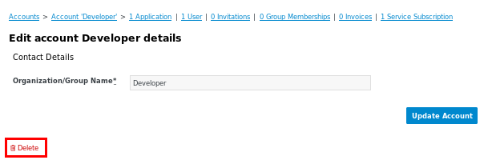
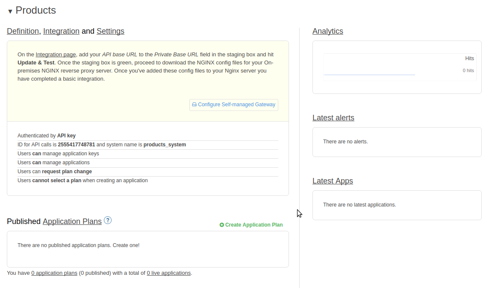
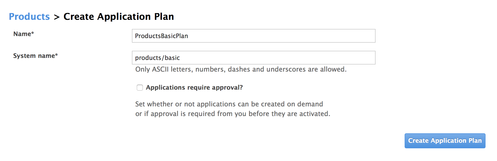
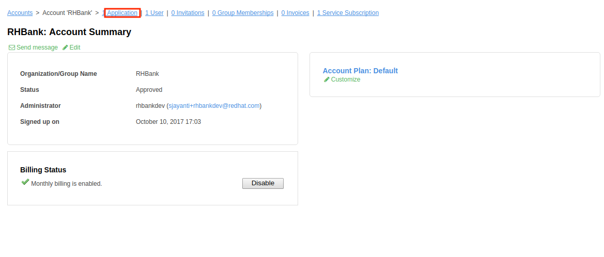
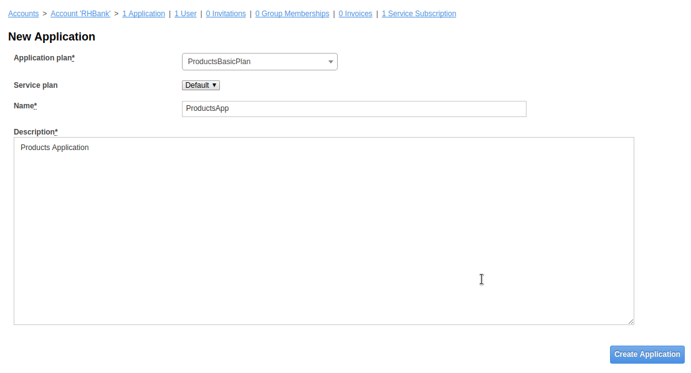
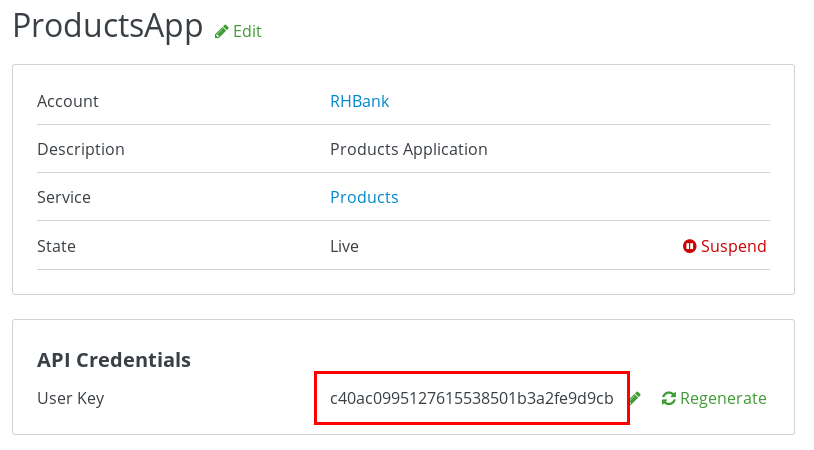
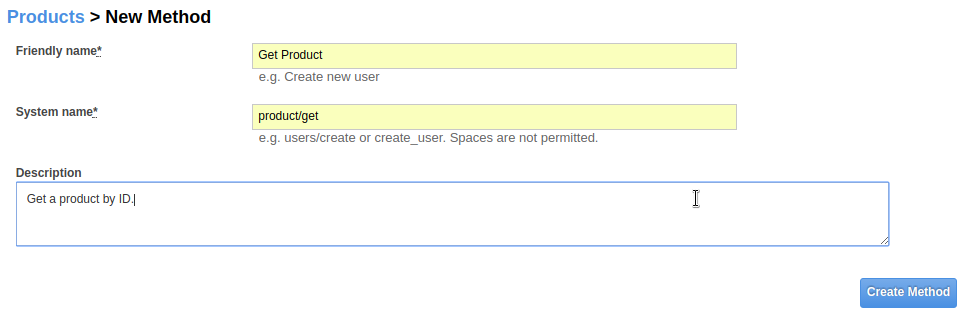
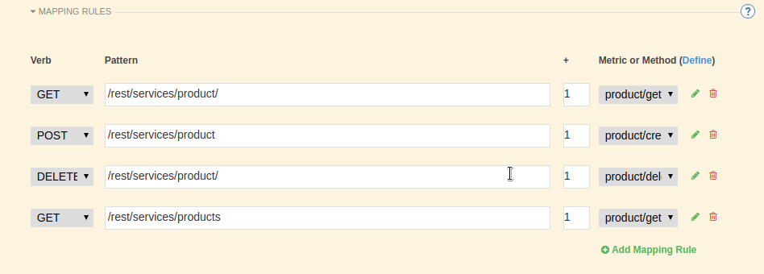
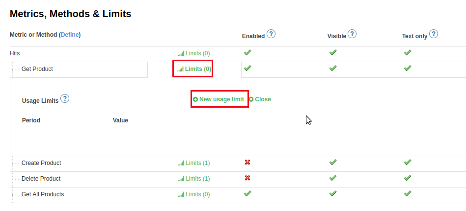

:scrollbar:
:data-uri:
:toc2:

== Metrics, Methods, and Rate Limits Lab

.Overview

In this lab you secure and manage the JEE application that exposes the RESTful Products API. 

In particular, _methods_, _metrics_, and _rate limits_ are defined and used.

.Goals

* Expose RESTful Products API with 3scale AMP
* Create application plans for basic and premium users
* Define methods and metrics
* Apply rate limits for basic users to control access to the API

.Prerequisites
* 3scale Admin Portal URL and user credentials to log in

:numbered:

== Manage API Resources

In this section you expose the Products API business services created in an earlier lab using 3scale by Red Hat's APIcast gateway. 
You use 3scale by Red Hat's Admin Portal to create the accounts, applications, application plans, services, and API definitions.

=== Default _Developer_ Account

A new API Manager typically comes provisioned with a default account called:  `Developer`.
If you have not already done so, this default _Developer_ account can be deleted.

Deletion of this `Developer` account will reduce possible confusion later on in this lab.
If this default `Developer` account is not suspended, new API services that are defined will automatically have a default _application_ (with corresponding API keys) created for this user.
You'll then have to subsequently make sure you are using the desired _application_ and not this default _application_ associated with this default _developer_ account.

. In a browser window, access Admin Portal of the default tenant provisioned with your API Manager.

. Navigate to the *Audience* perspective (from the drop-down in the top panel of the Admin Portal).
. Navigate to `Accounts -> Listing` and click the _Developer_ account (if not already deleted).
. Click the green `edit` link.
. Delete the default `Developer` account :
+

=== Define Products API Service

In this section you define an API service that manages access to the Products API business service that you provisioned in the previous lab.

. In the Admin Portal, select the *Dashboard* perspective from the drop-down in the top panel.

. In the `APIs` section of the page, click *NEW API * 
. Populate the form to create a new API with the following information:
* *Name*: `Products`
* *System Name*: `products_system`
* *Description*: `RHMart Products API`
. Click `Add API`

=== Define Application Plans

Plans are used for granting access to specific APIs and endpoints, limiting traffic, and monetizing API usage. 
Application plans let you configure access rights to an API by specifying rate limits and pricing rules. All applications must be associated with a plan.  
Multiple custom application plans can be defined for an API.

In this section of the lab, you'll create two new Application Plans for the *Products* service.
 

. In the APIs section, expand the *Products* API and scroll down to the *Published Application Plans* section.
+

. Create `ProductsBasicPlan`:
.. Click *Create Application Plan*.
.. Use the following parameters:
* *Name*: `ProductsBasicPlan`
* *System Name*: `products/basic`
.. Click *Create Application Plan*:
+

. Create another application plan with the name `ProductsPremiumPlan` and a system name of `products/premium`.
* The `ProductPremiumPlan` is used in later labs in this course.

. In the `Application Plans` listing page, select *ProductsBasicPlan* from the _Default Plan_ drop-down.

. Click *Publish* for both *ProductsBasicPlan* and *ProductsPremiumPlan*:
+
image::images/3scale_amp_products_app_plan_publish.png[]

=== Define Accounts and Users

. Navigate to  *Audience -> Accounts -> Listing*.
. Click *Create*.
. Create a new account with the following credentials:
* *Username*: `rhbankdev`
* *Email*: `_Provide unique email address_`
* *PASSWORD*: `_Provide unique, easy-to-remember password_`
* *Organization/Group Name*: `RHBank`
+
image::images/3scale_amp_products_create_dev.png[]

=== Create Application

In this section you associate an application to your previously defined users. 
This generates a user key for the application. 
The user key is used as a query parameter to the HTTP request to invoke your business services via your on-premise APIcast gateway.

NOTE: It's likely that an _application_ was already auto-generated and an association made between the _RHBank_ account and the _ProductsBasicPlan_ Application Plan.
If so, you can delete this auto-generated Application.
Follow the instructions below to gain practice in creating a new Application.

. Navigate to  *Audience -> Accounts -> Listing*.
. Select *RHBank* -> *0 Applications*.
+

+
. Click *Create Application*.
. Enter the following values:
* *Application plan*: `ProductsBasicPlan`
* *Service plan*: `Default`
* *Name*: `ProductsApp`
* *Description*: `Products Application`
+

. After the application is created, make a note of the user key:
+

== Create Methods and Mappings

From the previous lab, recall the resources exposed by the Products API when you reviewed them in: http://editor.swagger.io.
This understanding of the Products API will now be utilized to define _methods_ in 3scale and map those methods to the resources exposed by your Products API.

Afterwards, in a later section of this lab, we'll use those methods to define _rate limits_ and collect utilization _metrics_ on each of those Product API resources.

=== Methods

Your RESTful backend service exposes _resources_ via different HTTP verbs.
In a similar manner, your 3scale API defines corresponding _methods_.

In this section of the lab, you define various API _methods_ that correspond with the various resources exposed by the _products_ API.

. Navigate to the *API:Products* perspective.
. Select *Integration*.
. Click *add the base URL of your API and save the configuration*:
+
image::images/3scale_amp_products_api_integration1.png[]
+
. Expand the *Mapping Rules* section.
. Click *Define Metric/method*.
. In the *Methods* section, click *New method*.
. Enter the following values:
* *Friendly name*: `Get Product`
* *System name*: `product/get`
* *Description*: `Get a product by ID`
. Click *Create Method*:
+

. Repeat steps 6 to 8 for the following methods:
+
[options="header"]
|=======================
|Friendly name|System name|Description
|`Create Product`|`product/create`|`Create a new product.`
|`Delete Product`|`product/delete`|`Delete a product by ID.`
|`Get All Products`|`product/getall`|`Get all products.`
|=======================
+
image::images/3scale_amp_products_create_all_methods.png[]

=== Mappings

Now that API _methods_ have been defined, in this section of the lab you create mappings between those API _methods_ and the actual _resource_ and HTTP verb exposed by the _products_ RESTful service.

. For the *Get Product* method, click *Add a mapping rule*.
. Click *edit*.
. Enter the following values:
* *Verb*: `GET`
* *Pattern*: `/rest/services/product/`
* *Method*: `product/get`
. Repeat steps 10 to 12 for the other mapping rules:
+
[options="header"]
|=======================
|Verb|Pattern|Method
|`POST`|`/rest/services/product`|`product/create`
|`DELETE`|`/rest/services/product/`|`product/delete`
|`GET`|`/rest/services/products`|`product/getall`
|=======================
+

== Product API Stage and Prod Routes

Remote clients will invoke your Products API via a routes assigned to your API gateway stage and production services.

Use the API gateways found in your $GW_PROJECT project.

. From the command line, verify that you are logged in to OpenShift.

. Get the list of routes defined in the $GW_PROJECT :
+
-----
$ oc get route -n $GW_PROJECT | grep apicast
-----
+
.Sample Output
-----

swarm-prod-apicast-user1    swarm-prod-apicast-user1.apps.clientvm.1677.openshift.opentlc.com              prod-apicast    gateway   edge/Allow    None
swarm-stage-apicast-user1   swarm-stage-apicast-user1.apps.clientvm.1677.openshift.opentlc.com             stage-apicast   gateway   edge/Allow    None
-----

. Delete all of these routes:
+
-----
$ oc delete route --all -n $GW_PROJECT
-----

. Create new routes to the staging and production APIcast gateways:
+
-----
$ oc create route edge products-staging-route \
 --service=stage-apicast \
 --hostname=products-staging-apicast-$OCP_PROJECT_PREFIX.$OCP_WILDCARD_DOMAIN \
 -n $GW_PROJECT

$ oc create route edge products-production-route \
 --service=prod-apicast \
 --hostname=products-production-apicast-$OCP_PROJECT_PREFIX.$OCP_WILDCARD_DOMAIN \
 -n $GW_PROJECT
-----

=== Assign API Endpoints

. Return to 3scale by Red Hat's Admin Portal.
. In the _Integration_ page for your _products API_, populate the private and public base URLs:

..  *Private base URL*: URL of the products API business service endpoint. The value will be the output of the following:
+
-----
$ echo -en "\n\nhttp://products-api.$OCP_PROJECT_PREFIX-products-api:8080\n\n"
-----

.. *Staging public base URL*: Route to the products staging endpoint. The value will be the output of the following:
+
-----
$ echo -en "\n\nhttps://`oc get route products-staging-route -o template --template {{.spec.host}} -n $GW_PROJECT`:443\n\n"
-----

.. *Production public base URL*: Route to the products production endpoint. The value will be the output of the following:
+
-----
$ echo -en "\n\nhttps://`oc get route products-production-route -o template --template {{.spec.host}} -n $GW_PROJECT`:443\n\n"
-----

* *API test GET request*: `/rest/services/product/1`

. Do not change the remaining values, and click *Update the Staging Environment*.
* 3scale API Manager tests the connection, and the route turns green when the API routing is successful. 
* Note the following message: *Connection between client, gateway & API is working correctly as reflected in the analytics section.*

. Make a request based on the `curl` request generated in the client to verify that the staging API URL is accessed correctly:
+
image::images/3scale_amp_products_curl_test_url.png[]

. Once the request is successful, click *Promote to Production* and test the `curl` request for production.
+
Recall that you may have to wait up to 5 minutes for the new _proxy_ state to be synchronized in your production API gateway.
Alternatively, you could redeploy your production API gateway if you don't want to wait. 

== Rate Limiting

In this section you configure and test a rate-limiting policy in an application plan for the API created in the previous section.

=== Introduction

Rate limits allow you to throttle access to your API resources. You can configure different limits for separate developer segments through the use of application plans.

Once you have rate limits in place, these limits control the responses a developer receives when he or she makes authorization request calls to the backend service using 3scale. 
The limits are configured in the Admin Portal, and are enforced by the API gateway during service invocation. 
The gateway receives the configuration information from the 3scale backend which contains the rate limits for the different application plans within each service. 

The sequence of steps is as follows:

. API gateway refreshes itself with the latest API configurations from the backend every 5 minutes (or as configured).
. API gateway implements a local in-memory cache for authorization keys and metrics.
. With every inbound request to a backend service, API gateway uses an asynch transport to make an `authrep` request to the backend listener API in 3scale.
. An `authrep` response from the 3scale backend updates the local API gateway cache.
. API gateway rejects all subsequent inbound requests if the backend determines that the rate limit has been exceeded.

In this lab, you will check the rate limiting in the context of the Products API. 

You will create an ApplicationPlan called _ProductsBasicPlan_.
Only some of the methods of the products API will be enabled with this application plan.

In a later lab of this course, you will create a different application plan (named _ProductsPremiumPlan_) that will have all of the methods of the products API enabled.

=== Set Rate Limits

. In the Admin Portal, expand the *Products* API.
. Click *Published Application Plans*.
. Select *ProductsBasicPlan*:
+
image::images/3scale_amp_products_app_plan_limit1.png[]

. Scroll down to the *Metrics, Methods & Limits* section.
. Disable the *Create Product* and *Delete Product* methods by clicking the green check marks in the *Enabled* column:
+
image::images/3scale_amp_products_app_plan_limit2.png[]

. For the *Get Product* method, click *Limits*.
. Click *New usage limit*:
+

. Enter the following values:
* *Period*: `hour`
* *Max. value*: `5`

. Click *Create usage limit*:
+
image::images/3scale_amp_products_app_plan_limit4.png[]

. Enter a new usage limit for the *Get All Products* method with the following values:
* *Period*: `minute`
* *Max. value*: `1`
. Click *create usage limit*.
. Click *Update Application plan*:
+
image::images/3scale_amp_products_app_plan_limit5.png[]

=== Test Rate Limits

. Click the *Integration* tab.
. Click *edit APIcast configuration*:
+
image::images/3scale_amp_products_app_plan_limit6.png[]

. Copy the `curl` request link.
+
image::images/3scale_amp_products_curl_test_url.png[]
+
* The request is to URL `rest/services/product/1`, so it makes a `GET` request to the `Get` method configured.

. Make 5 requests to the URL and notice that the response is correct.
+
.Sample Output

-----
{"productid":1,"productname":"Ninja Blender","productprice":320.0}

-----
+
. Make a 6th request, and expect the following response:
+
.Sample Output

-----
..
< HTTP/1.1 429 Too Many Requests
..
* Connection #0 to host products-stage-apicast-sjayanti-redhat-com-3scale-amp.apps.na1.openshift.opentlc.com left intact

Limits exceeded
-----
+
* Because the limit set for the `Get` method is 5 requests per hour, the 6th and subsequent requests produce an HTTP 429 response.

. Repeat the test for the `/rest/services/products` endpoint to test the limit for the *Get All Products* method.
* In the above `curl` request, replace the URL `rest/services/product/1` with `/rest/services/products`.
+
image::images/3scale_amp_products_curl_test_url_2.png[]
+
NOTE: When running the `curl` request from the command line, you need to add a `-k` argument to the request for the request to execute correctly.
+
* Because the limit is set to 1 request per minute, expect an *HTTP 429 Forbidden* response on subsequent requests.
+
.Sample Output

-----
..
< HTTP/1.1 429 Forbidden
..
* Connection #0 to host products-stage-apicast-sjayanti-redhat-com-3scale-amp.apps.na1.openshift.opentlc.com left intact
Limits exceeded
-----
+
NOTE: In the SaaS version of 3scale AMP (and in a future release of 3scale on-premise), you can create pricing rules for your APIs in the application plans. This functionality is out of scope for this lab.

=== Test Rate Limits in Production (Bonus)

Now, try the following steps:

. Promote the Products API service to Production.
. Bounce the APIcast production pod for the configuration to be updated.
. Try sending the requests to the rate limit URLs as in the previous section. Alternate between production and staging URLs.

To test your understanding of the rate limits, try to answer the following questions:

. What do you observe when you send requests to the production URL and the staging URL?
. Does the invocation against the staging URL impact the rate limits as in the production URL?
. Is the rate limit effective separately for staging and production URLs or does the rate limit apply cumulatively for both URLs?
. Why do you think rate limit behaviour is this way?

=== Test Disabled Methods (Bonus)

What response code would you expect to receive if you attempt to create or delete a product from your API managed Products API ?

Try it out to confirm.

