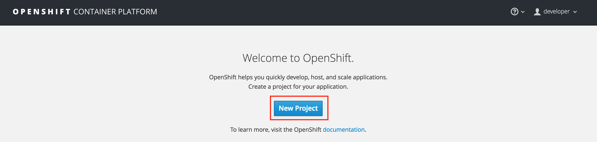
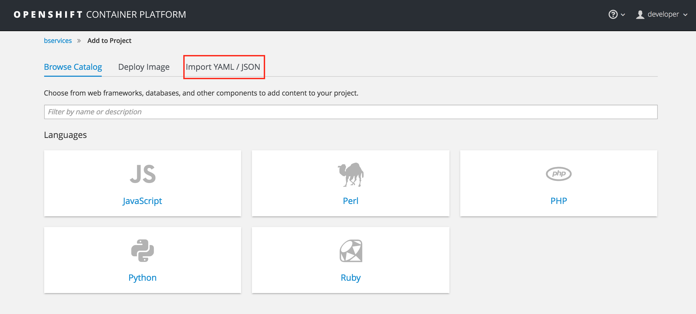
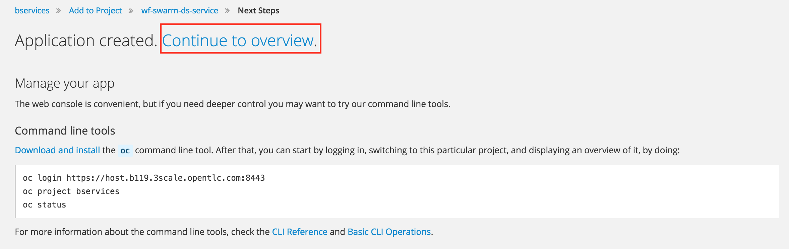
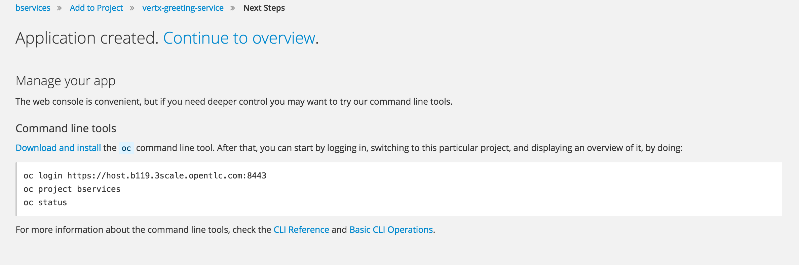

:scrollbar:
:data-uri:
:linkattrs:
:toc2:
:wildfly_swarm: link:http://wildfly-swarm.io/[Wildfly Swarm^]
:vertx: link:http://vertx.io/http://vertx.io/["Vert.x^"]

== Business Services Lab

In this lab, you orient yourself with the course's lab assets and deploy RESTful business services to OpenShift Container Platform.

.Goals
* Learn about course lab assets
* Learn about Vert.x and Wildfly Swarm-based RESTful services

:numbered:
== Explore Lab Assets

To support the lab exercises for this course, you need a couple of mock RESTful business services that you can manage and secure. These are provided in the lab assets. In this exercise, you explore these simple business services.

. At the shell prompt of your remote lab environment, make sure you are using the `jboss` user.
. Change to the `$HOME/lab/3scale_onpremise_implementation_labs/` directory.
. Pull the latest changes (if any) from the master branch:
+
[source,text]
-----
$ git pull origin master
-----

. Examine the `services` subdirectory and note the two services written in Java that expose RESTFul APIs:
.. `wf_swarm_datestamp_service`: built using the community {wildfly_swarm} project

.. `vertx_greeting_service`: built using the community {vertx} project

* In future labs, you run these services in your OpenShift Container Platform environment and use an _on-premise_ installation of Red Hat 3scale API Management to manage and secure the APIs of these services.

In order to become more acquainted with the services, the following optional sections allow for building and testing the services in a non-OpenShift environment. If you feel comfortable with the business services, feel free to skip to the <<bservice_deployment>> section.

=== Build Business Services (Optional)

The two mock RESTful services are provided in source code format as Maven projects. As such, they must be compiled and archived.

. As the `jboss` user, change to the `$HOME/lab/3scale_onpremise_implementation_labs/services` directory.
. Run the  `mvn clean package -DskipTests` command.
* Expect the build to execute quickly because your lab VM comes with a seeded local Maven repository in the `$HOME/.m2/repository` directory.
. Confirm that the build results look similar to the following:
+
.Sample Output
[source,text]
-----
...

[INFO] Reactor Summary:
[INFO]
[INFO] examples-parent .................................... SUCCESS [  0.206 s]
[INFO] WildFly Swarm Examples: JAX-RS swagger ............. SUCCESS [ 26.137 s]
[INFO] vertx-raml ......................................... SUCCESS [  5.292 s]
[INFO] ------------------------------------------------------------------------
[INFO] BUILD SUCCESS
[INFO] ------------------------------------------------------------------------
-----

. Enable the Swarm and Vert.x services:
+
[source,text]
----
$ sudo systemctl enable wfswarm.service
$ sudo systemctl enable vertx.service
----

=== Test Swarm Business Service Locally (Optional)

In this section, you start your Swarm-based mock business service.

. As the `jboss` user in your remote lab environment, execute the following:
+
[source,text]
-----
$ sudo systemctl restart wfswarm.service
-----

. Invoke the Swarm RESTful mock business service:
+
[source,text]
-----
$   curl $HOSTNAME:9180/time/now
-----
+
.Sample Output
[source,text]
----
..

{"value" : "The time is 2017-05-12T13:45:32.856Z"}
----

=== Test Vert.x Business Service Locally (Optional)

In this section you start your Vert.x-based mock business service.

. As the `jboss` user in your remote lab environment, execute the following:
+
[source,text]
-----
$ sudo systemctl restart vertx.service
-----

. Invoke the Vert.x RESTful mock business service:
+
[source,text]
-----
$   curl $HOSTNAME:9080/hello
-----

. Shut down these test services:
+
[source,text]
-----
$ sudo systemctl stop wfswarm.service
$ sudo systemctl stop vertx.service
-----

[[bservice_deployment]]
== Deploy Business Services in OpenShift Container Platform

There are link:https://developers.redhat.com/blog/2016/06/29/four-different-approaches-to-run-wildfly-swarm-in-openshift/[numerous approaches^] to deploying applications to OpenShift Container Platform. In this lab, you utilize the _use a pre-built image from Docker registry_ approach. The Wildfly Swarm and Vert.x business services provided in this lab already have container images that are publicly available in a Docker registry.

=== Create New Project for Business Services

. Open a browser window and navigate to the OpenShift Management Console URL
+
NOTE: The URL for Management Console is https://${EXTERNAL_HOST}:8443/
+
image::images/ocp_login.png[]
+
. Login as user `developer` with password `developer`. 

. Create a new project for your mock RESTful business service applications:
.. Click on `New Project` button.
+

+
.. Enter Name `bservices`, Display Name `bservices` and Description `Business Services to be secured and managed by 3scale`.
+

+
.. Click on the `Create` button.

. You are now in the `bservices` project home page and can deploy the business services in this project.
+

=== Deploy and Test Swarm-Based Business Service

. In the Project home page, click on `Deploy Image` tab.
+

+
. Deploy the WildFly Swarm docker image available in the registry `docker.io/rhtgptetraining/wf_swarm_datestamp_service:1.0`:
.. Select the radio button for `Image Name`.
.. Enter the image registry URL: `docker.io/rhtgptetraining/wf_swarm_datestamp_service:1.0`.
.. Click on the search button.
+

+
.. The image will be fetched by OCP and details displayed.
+

+
NOTE: Ignore the warning as it does not impact the test cases in the local environment.
+
.. Enter the name of service as `wf-swarm-ds-service`.
.. Scroll down and click on the `Create` button.
.. The image will now be downloaded and deployed.
+

+
.. Click on `Continue to Overview` link to go to the project home page.
.. Wait for a couple of minutes for the application pod to become blue, indicating the application is deployed and started successfully on OCP.
+

+
. Create a secure route that exposes the Swarm service:
.. Click on `Create Route`.
.. Keep the default values for Name, Path, Hostname, Service, and Target Port.
.. Click on `Secure Route` check box.
.. Select TLS Termination as `Edge`.
+

+
.. Scroll down and click on `Create` button.
.. Now you can see the application service with a route URL.
+
image::images/ocp_wfswarm_pod_with_route.png[]
+
NOTE: Copy the route URL. This URL will be used to connect to the Swarm business service. This URL will be referred to as `$WF_SWARM_SERVICE_ROUTE` in the rest of the course.
. Test the swarm based business service deployed in your OCP environment:

. Wait until your Swarm-based pod has fully started, then test the business service implementation from the terminal using following command:
+
[source,text]
-----
$ curl -v -k “$WF_SWARM_SERVICE_ROUTE/time/now"
-----

* Expect to see a response similar to the following:
+
.Sample Output
[source,text]
-----
..

{"value" : "The time is 2017-05-12T13:45:32.856Z"}
-----

=== Deploy and Test Vert.x-Based Business Service

. In the project home page, click on `Add to Project`.
. Click on `Deploy Image` tab.
+

+
. Deploy the Vertx Greeting service docker image available in the registry `docker.io/rhtgptetraining/vertx-greeting-service:1.0`:
.. Select the radio button for `Image Name`.
.. Enter the image registry URL: `docker.io/rhtgptetraining/vertx-greeting-service:1.0`.
.. Click on the search button.
+

+
.. The image will be fetched by OCP and details displayed.
+

+
NOTE: Ignore the warning as it does not impact the test cases in the local environment.
+
.. Enter the name of service as `vertx-greeting-service`.
.. Scroll down and click on the `Create` button.
.. The image will now be downloaded and deployed.
+

+
.. Click on `Continue to Overview` link to go to the project home page.
.. Wait for a couple of minutes for the application pod to become blue, indicating the application is deployed and started successfully on OCP.
+

+
. Create a secure route that exposes the Vertx service:
.. Click on `Create Route`.
.. Keep the default values for Name, Path, Hostname, Service, and Target Port.
.. Click on `Secure Route` check box.
.. Select TLS Termination as `Edge`.
+

+
.. Scroll down and click on `Create` button.
.. Now you can see the application service with a route URL.
+

+
NOTE: Copy the route URL. This URL will be used to connect to the Swarm business service. This URL will be referred to as `$VERTX_SERVICE_ROUTE` in the rest of the course.
. Test the swarm based business service deployed in your OCP environment:

. Wait until your Swarm-based pod has fully started, then test the business service implementation from the terminal using following command:
+
[source,text]
-----
$ curl -v -k “$VERTX_SERVICE_ROUTE/hello”
-----

* Expect to see a response similar to the following:
+
.Sample Output
[source,text]
-----
..

{"greeting":"Hello World!"}
-----

ifdef::showscript[]

== Set Up `nginx` Reverse Proxy

Now that your mock business services are running, in this exercise you expose them to clients outside your remote lab environment. You do this by configuring one `nginx` server as a reverse-proxy with routes to both mock business services.

Your lab environment comes installed with `nginx`. It is not, however, configured or enabled as an operating system service.

=== Start `nginx`

. Make a backup of the existing master `nginx.conf` configuration file:
+
[source,text]
-----
$ sudo cp /etc/nginx/nginx.conf /etc/nginx/nginx.conf.org
-----

. Enable and start the `nginx.service`:
+
[source,text]
-----
$ sudo systemctl enable nginx.service
$ sudo systemctl start nginx.service
-----

. Determine the external host URL of your lab environment:
+
[source,text]
-----
$ echo $HOSTNAME
-----

* Expect to see output similar to the following:
+
.Sample Output
[source,text]
-----
3scale-3419.rhpds.opentlc.com
-----

. Open a browser from your local workstation and navigate to the host URL of your lab VM using default HTTP port 80:
+
image::images/nginx_homepage.png[]

=== Configure Reverse Proxy Servers

In this section, you configure `nginx` as a reverse proxy to both of your mock business services.

==== Set Up Vert.x Business Service Reverse Proxy

. From your remote lab environment, find the URL to your Vert.x business service:
+
[source,text]
-----
$ echo -en "\nvertx.bservice.`dig +short @8.8.8.8 $HOSTNAME`.xip.io\n\n"
-----
+
.Sample Output
[source,text]
-----
vertx.bservice.176.126.89.205.xip.io
-----
* You use this value in the next step to set the `server_name` property.

. Add the following below the default `server { ... }` section in the `/etc/nginx/nginx.conf` file:
+
[source,text]
-----
    # configs for vertx business service
    upstream vertxservice  {
      server 10.0.0.1:9080;
    }

    server {
        listen       10.0.0.1:80;
        server_name  <url of vertx mock business service >;
        root         /usr/share/nginx/html;

        location / {
          proxy_pass  http://vertxservice;
          proxy_next_upstream error timeout invalid_header http_500 http_502 http_503 http_504;
          proxy_redirect off;
          proxy_buffering off;
          proxy_set_header        Host            < url of vertx mock business service > ;
          proxy_set_header        X-Real-IP       $remote_addr;
          proxy_set_header        X-Forwarded-For $proxy_add_x_forwarded_for;
        }
    }
-----

. Save your changes.
. Bounce `nginx`:
+
[source,text]
-----
$ sudo systemctl restart nginx.service
-----

. View the RAML documentation of your remote Vert.x business service by executing the following in your remote lab environment:
+
[source,text]
-----
$ echo -en "\nvertx.bservice.`dig +short @8.8.8.8 $HOSTNAME`.xip.io?raml=/api/hello.raml\n\n"
-----

. In your browser, navigate to the resulting URL.

. Invoke the remote Vert.x business service:
+
[source,text]
-----
$ echo -en "\nvertx.bservice.`dig +short @8.8.8.8 $HOSTNAME`.xip.io/hello\n\n"
-----
+
.Sample Output
[source,text]
-----
vertx.bservice.176.126.89.205.xip.io/hello
-----
+
NOTE: Make a note of this URL to use later when securing it with the APIcast gateway.

. In your browser, navigate to the resulting URL.

=== Set Up Wildfly Swarm Business Service Reverse Proxy

. From your remote lab environment, find the URL to your Swarm business service:
+
[source,text]
-----
$ echo -en "\nswarm.bservice.`dig +short @8.8.8.8 $HOSTNAME`.xip.io\n\n"
-----
+
.Sample Output
[source,text]
-----
swarm.bservice.176.126.89.205.xip.io
-----
* You use this value in the next step to set the `server_name` property.

. Add the following below the default `server { ... }` section in the `/etc/nginx/nginx.conf` file:
+
[source,text]
-----
    # config for swarm business service
    upstream swarmservice  {
      server 10.0.0.1:9080;
    }

    server {
        listen       10.0.0.1:80;
        server_name  < url of swarm mock business service >;
        root         /usr/share/nginx/html;

        location / {
          proxy_pass  http://swarmservice;
          proxy_next_upstream error timeout invalid_header http_500 http_502 http_503 http_504;
          proxy_redirect off;
          proxy_buffering off;
          proxy_set_header        Host            < url of swarm mock business service > ;
          proxy_set_header        X-Real-IP       $remote_addr;
          proxy_set_header        X-Forwarded-For $proxy_add_x_forwarded_for;
        }
    }
-----

. Save your changes.
. Bounce `nginx`:
+
[source,text]
-----
$ sudo systemctl restart nginx.service
-----

. View the Swagger documentation of your remote Swarm business service:
+
[source,text]
-----
$ echo -en "\nswarm.bservice.`dig +short @8.8.8.8 $HOSTNAME`.xip.io/swagger.json\n\n"
-----

. Invoke the remote Swarm business service:
+
[source,text]
-----
$ echo -en "\nswarm.bservice.`dig +short @8.8.8.8 $HOSTNAME`.xip.io/time/now\n\n"
-----
+
.Sample Output
[source,text]
-----
swarm.bservice.176.126.89.205.xip.io/time/now
-----
+
NOTE: Make a note of this URL to use later when securing it with the APIcast gateway.

. In your browser, navigate to the resulting URL.

You now have two mock RESTful business services running and exposed to external clients. In later lab exercises, you learn how to manage and secure these mock business services using Red Hat 3scale API Management.

endif::showscript[]
