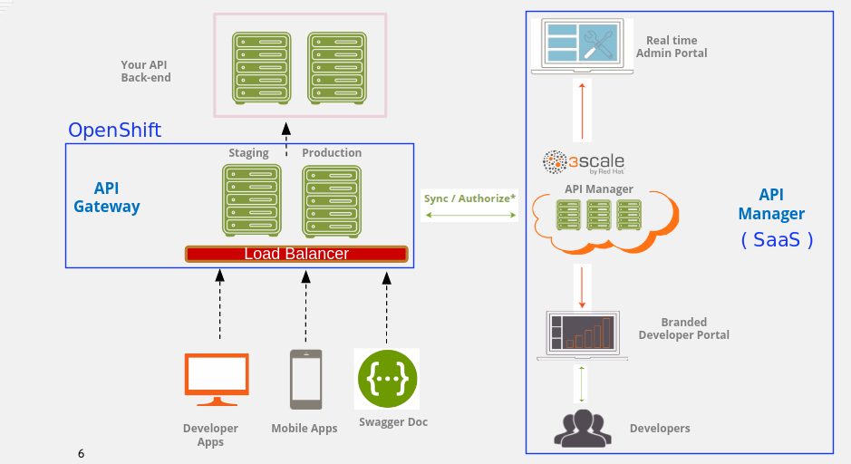
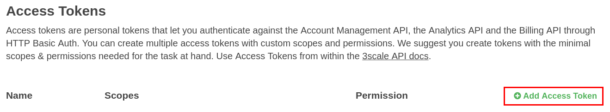

:scrollbar:
:data-uri:
:toc2:
:linkattrs:

== Hybrid Deployment Lab

.Goals
* Manage RESTful endpoints using an on-premise APIcast gateway (installed in OpenShift Container Platform) communicating with the public 3scale by Red Hat SaaS AMP environment.

.Prerequisites
* Completion of the previous labs of this course
* An existing 3scale by Red Hat Enterprise SaaS account
+
IMPORTANT: To continue with this lab, your 3scale by Red Hat SaaS account _must_ be enabled as an Enterprise account. See the appendix in the _Environment Setup Lab_ for details on enabling your account as Enterprise.

* The URL and admin access to your Admin Portal
+
NOTE: The URL is similar to this: `https://<your-3scale-domain>-admin.3scale.net/`.

:numbered:

== Overview

In the previous labs, you installed and configured an OpenShift Container Platform environment and Products API services. In this lab, you install the APIcast gateway in your OpenShift Container Platform environment and use it to manage the Products service APIs. The APIcast gateway communicates with the 3scale by Red Hat SaaS AMP back-end environment.

This approach is referred to as a _hybrid_ architecture topology.

== Provision On-Premise APIcast

In this exercise, you provision an _on-premise_ APIcast environment in your OpenShift Container Platform environment.

=== Review Prerequisites

Before provisioning an on-premise APIcast environment, check the following regarding your 3scale by Red Hat SaaS account:

. Make sure that the `$OCP_WILDCARD_DOMAIN` environment variable you set in a previous lab is still set in your shell.
* This is your OpenShift Container Platform lab environment wildcard domain name.
+
NOTE: See link:https://en.wikipedia.org/wiki/Wildcard_DNS_record[Wildcard DNS Record^] for more information.

. Make note of your SaaS tenant name:
* The tenant name of your 3scale by Red Hat domain is referenced in the URL to your Admin Portal, which looks similar to this: `https://<your 3scale tenantname>-admin.3scale.net/p/admin/dashboard`.
. In the environment where your `oc` utility resides, set your tenant name (also known as the domain name) as a shell environment variable to be used later in shell scripts:
+
[source,text]
-----
$ echo "export THREESCALE_SAAS_TENANT_NAME=<your 3scale domain>" >> ~/.bashrc

-----
+
NOTE: Set the environment variable to just your unique domain name. Do not include the `-admin.3scale.net` suffix.

. Confirm that your Access Token has the correct settings:
+
NOTE: If you completed the prerequisites for this course, you should have an Access Token for your 3scale by Red Hat SaaS account.

.. If your Access Token is lost, create a new one by clicking the *Gear* icon at the top and navigating to *Personal Settings -> Tokens -> Add Access Token*:
+

.. Make sure the scope of your Access Token includes access to all three APIs: Billing, Account Management, and Analytics.
.. Make sure that your Access Token has read/write permissions.

. In the environment where your `oc` utility resides, set your SaaS Access Token as a shell environment variable to be used later in shell scripts:
+
[source,text]
-----
$ echo "export THREESCALE_SAAS_ACCESS_TOKEN=<access token>" >> ~/.bashrc
$ source ~/.bashrc
-----

. Confirm that your APIcast gateway is able to pull `services.json` with the existing settings:
+
[source,text]
-----
$ curl -v https://${THREESCALE_SAAS_ACCESS_TOKEN}@${THREESCALE_SAAS_TENANT_NAME}-admin.3scale.net/admin/api/services.json | python -m json.tool
-----
* Expect this command at a minimum to return with an HTTP 200 and a list of available configured services in JSON format for your 3scale by Red Hat SaaS environment.
* Your APIcast gateway executes an identical HTTP request.

=== Install APIcast Resources

In this exercise, you install the on-premise APIcast resources in your OpenShift Container Platform environment. Your APIcast environment consists of two load-balanced APIcast pods and a single service to those pods.

. Create a new OpenShift Container Platform project for your APIcast on-premise resources:
+
[source,text]
-----
$ oc new-project $OCP_PROJECT_PREFIX-3scale-apicast \
     --display-name="3scale-apicast" \
     --description="3scale apicast integrated with 3scale SaaS AMP"
-----

. If not already there, switch to the new project:
+
[source,text]
-----
$ oc project $OCP_PROJECT_PREFIX-3scale-apicast
-----

. Define a new secret for basic authentication to the public 3scale by Red Hat SaaS environment:
+
[source,text]
-----
$ oc secret new-basicauth apicast-configuration-url-secret \
     --password=https://${THREESCALE_SAAS_ACCESS_TOKEN}@${THREESCALE_SAAS_TENANT_NAME}-admin.3scale.net

-----
* Note that the new secret's name is `apicast-configuration-url-secret`, which corresponds to the default value of the `CONFIGURATION_URL_SECRET` parameter defined on lines 104-106 of the `apicast.yml` template.

* Also note that the value of the `--password` parameter is the URL to the Admin Portal, which corresponds to the `THREESCALE_PORTAL_ENDPOINT` container environment variable defined in lines 28-32 of the `apicast.yml` template.

. Provision the APIcast resources in your OpenShift Container Platform environment:
+
[source,text]
-----
$ oc new-app \
    -f https://raw.githubusercontent.com/3scale/3scale-amp-openshift-templates/2.0.0.GA/apicast-gateway/apicast.yml \
    -p RESPONSE_CODES=true \
    -p LOG_LEVEL=debug > /tmp/apicast_provision.txt
-----

* Note that the `LOG_LEVEL` was set to `debug`, which allows you to observe traffic between your APIcast gateway and the remote 3scale by Red Hat SaaS environment.
+
NOTE: For detailed information on all of the parameters that can be specified when provisioning the APIcast gateway in an OpenShift Container Platform environment, see  link:https://github.com/3scale/apicast/blob/master/doc/parameters.md[this documentation^].

. Allow a couple of minutes for the Red Hat-supported APIcast container image to download and start.
. Once it is running, confirm that you see two pods similar to the following:
+
[source,text]
-----
$ oc get pods
-----
+
.Sample Output
[source,text]
-----
NAME              READY     STATUS    RESTARTS   AGE
apicast-5-lvzp6   1/1       Running   0          17h
apicast-5-ertg4   1/1       Running   0          17h
-----

* There are two `apicast` pods because the `apicast` template by default specifies two replicas, which is ideal for providing load balancing in typical production environments.

. Spin down one of the replicas to ensure that all possible traffic always flows through the `apicast` container you are observing:
+
[source,text]
-----
$ oc scale --replicas=1 dc apicast
-----
* This enables you to conduct functional testing.

. Study the log from your `apicast` container and look for a statement similar to the following:
+
.Sample Output
[source,text]
-----
[debug] 1#1: [lua] configuration_loader.lua:103: init(): downloaded configuration: {"services":{}}
-----

* This log statement indicates the following:

** Your APIcast gateway has created a connection with the account management API of the remote 3scale by Red Hat SaaS environment using the Access Token set in the `apicast-configuration-url-secret`.
** Via that connection, the APIcast gateway has queried the 3scale by Red Hat SaaS environment for a list of services.
+
NOTE: The terms "API" and "service" are used to refer to API services, which are logical bundles of one or more methods (or endpoints) that are accessible. A given API provider may expose one or more of these API services.

** There are currently zero services that the APIcast gateway should proxy. As such, you can expect that all requests to your on-premise APIcast route result in an HTTP 503 error.

=== Create Routes for Business Service APIs

In this section, you expose a single service with two different _routes_, one for staging, and one for production Gateway to the Products API service.

In this scenario, you want the single on-premise APIcast gateway to manage the RESTful endpoints of your business services. You do this by configuring _host-based routing_. Inbound traffic from remote clients to your single APIcast gateway uses different URLs. Based on these URLs, your APIcast gateway routes to the appropriate business service.

image::images/apicast_host_routing.png[]

Use these steps to create the unique routes to your newly provisioned APIcast gateway:

. Define a route to the APIcast gateway for routing traffic to the Products API staging:
+
[source,text]
-----
$ oc create route edge products-staging-apicast \
     --service=apicast \
     --hostname=products-staging-apicast-$OCP_PROJECT_PREFIX.$OCP_WILDCARD_DOMAIN
-----
* This exposes the existing APIcast service to a staging URL.

. In a similar manner, create an additional secure route to the APIcast gateway for routing production traffic to the Products API business service.
+
[source,text]
-----
$ oc create route edge products-production-apicast \
     --service=apicast \
     --hostname=products-production-apicast-$OCP_PROJECT_PREFIX.$OCP_WILDCARD_DOMAIN
-----
. Confirm that you now have two routes similar to the following in your `3scale-apicast` project:
+
.Sample Output
[source,text]
-----
NAME                  HOST/PORT                                       SERVICES   PORT      TERMINATION   WILDCARD
products-production-apicast   products-production-apicast-sjayanti-redhat-com.apps.na1.openshift.opentlc.com                       apicast    proxy     edge          None
products-staging-apicast      products-staging-apicast-sjayanti-redhat-com.apps.na1.openshift.opentlc.com                       apicast    proxy     edge          None
-----

At this point in the lab, you have an on-premise APIcast gateway that is just about ready to begin managing traffic. The subsequent labs will guide you through the process of creating API services in 3scale Management Platform in order to route the traffic to your backend API services.

ifdef::showscript[]

== Support Considerations for APIcast

* Red Hat provides full support for NGINX/OpenResty deployed using the Red Hat OpenShift Container Platform templates and Docker images when running on Red Hat Enterprise Linux.

** If NGINX/OpenResty Docker images are deployed on Linux platforms other than Red Hat Enterprise Linux, Red Hat provides commercially reasonable support.

** In either of these two scenarios, Red Hat excludes support for custom gateway logic and for non-gateway use cases, such as simultaneously using NGINX for other reverse proxy use cases, or for content caching.

* If NGINX/OpenResty is deployed natively, Red Hat provides commercially reasonable support for the standard gateway logic but not for the installation and operation of NGINX itself nor custom gateway logic.

* Using APIcast with private APIs: See the bottom section of link:https://support.3scale.net/docs/deployment-options/apicast-overview[APIcast Overview^].

endif::showscript[]
