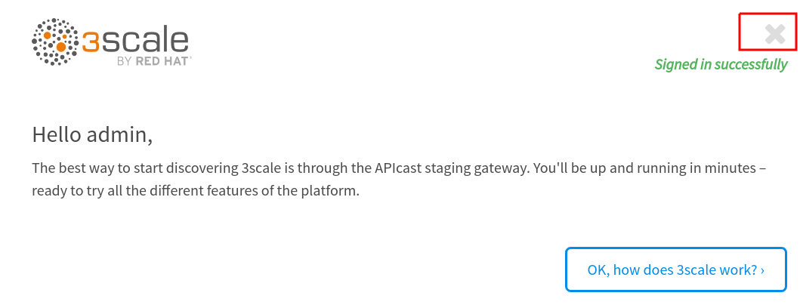
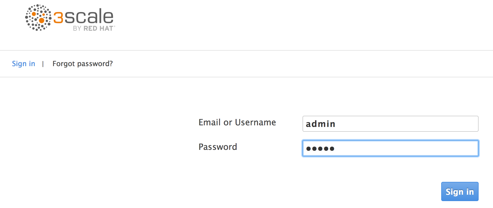

:scrollbar:
:data-uri:
:toc2:
:linkattrs:

== On-Premise 3scale API Management Installation Lab

.Goal
* Provision the _self-managed_ Red Hat API management platform (AMP) component and its built-in APIcast components

.Prerequisites
* Completion of the Business Services Lab where RESTful endpoints of two microservices are exposed
* A running student lab environment for this course
* `OCP_WILDCARD_DOMAIN` environment variable set in your shell
* `OCP_PROJECT_PREFIX` environment variable set in your shell
+
TIP: To check if your shell still has this environment variable set, run the `echo $OCP_WILDCARD_DOMAIN` command. If the variable is no longer set, return to the first lab in this course and follow the steps there to set it again.

:numbered:

== Overview

As of the 2.0 release of Red Hat 3scale API Management, the AMP component is available for on-premise installation. In an on-premise environment, the AMP component is available only in OpenShift Container Platform on Red Hat Enterprise Linux.

In this lab you deploy an AMP environment in your existing OpenShift Container Platform lab environment. It is important that you use the provided student lab environment, because it includes the following items that are critical for this lab:

* Red Hat OpenShift Container Platform 3.5
* Adequate hardware resources: 16 GB RAM and 4 CPUs

== Install AMP Environment

An on-premise 3scale by Red Hat AMP environment must run in an OpenShift Container Platform v3.3, v3.4, or v3.5 environment running on Red Hat Enterprise Linux 7. Your lab environment meets these requirements.

In this exercise, you install 3scale by Red Hat's AMP resources in your lab environment.

. Create a new OpenShift Container Platform project for your AMP resources:
+
[source,text]
-----
$ oc new-project $OCP_PROJECT_PREFIX-3scale-amp \
         --display-name="3scale-amp" \
         --description="3scale AMP component"
-----

. Confirm that you now have two OpenShift Container Platform projects in your lab environment:
* `$OCP_PROJECT_PREFIX-bservices`
* `$OCP_PROJECT_PREFIX-3scale-amp`
+
IMPORTANT: When you run commands using the `oc` utility, pay attention to which project you are working in.

. Deploy the on-premise AMP component:
+
[source,text]
-----
$  oc new-app \
       -f ~/lab/3scale_onpremise_implementation_labs/resources/3scale_template_with_requests_and_limits.yml \
      --param ADMIN_PASSWORD=admin \
      --param TENANT_NAME=$OCP_PROJECT_PREFIX-3scale \
      --param WILDCARD_DOMAIN=$OCP_WILDCARD_DOMAIN > /tmp/3scale_amp_provision_details.txt
-----

. Review the output from creating your new AMP application:
+
[source,text]
-----
$ cat /tmp/3scale_amp_provision_details.txt
-----
+
.Sample Output
[source,text]
-----

Login on https://3scale-admin.apps.176.126.90.137.xip.io as admin/c2rl6m1u     <1>

* With parameters:
    * AMP_RELEASE=2.0.0-ER4-redhat-2
    * ADMIN_PASSWORD=admin
    * ADMIN_USERNAME=admin
    * APICAST_ACCESS_TOKEN=vf1erllf # generated
    * ADMIN_ACCESS_TOKEN=b8t5hvpo0dgoaevw # generated
    * WILDCARD_DOMAIN=apps.176.126.90.137.xip.io
    * SUBDOMAIN=3scale
    * MySQL User=mysql
    * MySQL Password=yctiv77e # generated
    * MySQL Database Name=system
    * MySQL Root password.=dyl5bftg # generated
    * SYSTEM_BACKEND_USERNAME=3scale_api_user
    * SYSTEM_BACKEND_PASSWORD=dpkgdrdc # generated
    * REDIS_IMAGE=rhscl/redis-32-rhel7:3.2-5.4
    * SYSTEM_BACKEND_SHARED_SECRET=xfxtqjvk # generated
    * SYSTEM_APP_SECRET_KEY_BASE=cead8c4c8061108be756537cd87d47ca7ad625107ccd3ddb4a7e1e7a2e4c8363c07e832da7081b511e30eabedd77062686a4d66582082747add5db02176ee4ae # generated
    * APICAST_MANAGEMENT_API=status
-----
+
<1> Admin portal URL

. Make note of the admin portal URL and corresponding authentication credentials.

=== Confirm Successful End State

. Confirm that all of your AMP pods are in a `Running` state:
+
[source,text]
-----
$ oc get pods
-----
+
.Sample Output
[source,text]
-----

NAME                         READY     STATUS    RESTARTS   AGE
apicast-production-1-gbc76   1/1       Running   2          4m
apicast-staging-1-z7p27      1/1       Running   0          4m
backend-cron-1-z29n9         1/1       Running   1          4m
backend-listener-1-mdzq0     1/1       Running   0          4m
backend-redis-1-p060v        1/1       Running   0          4m
backend-worker-1-q5rh1       1/1       Running   1          4m
system-app-1-4j7mr           2/2       Running   0          3m
system-memcache-1-7wwrj      1/1       Running   0          4m
system-mysql-1-gp6qf         1/1       Running   0          4m
system-redis-1-qrjrh         1/1       Running   0          4m
system-resque-1-wk6vj        2/2       Running   1          4m
system-sidekiq-1-87g1n       1/1       Running   1          4m
system-sphinx-1-fp2d0        1/1       Running   1          4m
-----

. After provisioning is complete, point your browser to the URL contained in the output of the AMP provisioning command:
+
[source,text]
-----
$ cat /tmp/amp_provision_details.txt | more
-----
+
.Sample Output
[source,text]
-----
...

system
     ---------
     Login on https://3scale-admin.apps.13.58.43.125.xip.io as admin/5esykutl

...
-----

. After you log in, expect to see a welcome screen similar to the following:
+

. From here, you can watch a demo by clicking *OK, how does 3scale work?*, or click *x* in the top right corner to continue.

=== Enable `debug` Log Level in New APIcast Gateways

. Set the log level of your `apicast-production` pods:
+
[source,text]
-----
$ oc patch dc/apicast-production --patch '{"spec":{"template":{"spec":{"containers":[{"name":"apicast-production", "env": [{"name":"APICAST_LOG_LEVEL","value":"debug" }]}]}}}}'

-----

* This executes an automatic roll-out of your `apicast-production` pod.
. Make a similar change to your `apicast-staging` pod.
. After provisioning is complete, point your browser to 3scale by Red Hat's URL and log in as `admin`.
+

+
. After you log in, expect to see a welcome screen similar to the following:
+

* From here, you can watch a demo by clicking *OK, how does 3scale work?*, or click *x* in the top right corner to continue.

Your 3scale AMP environment is now ready to run the course labs.
