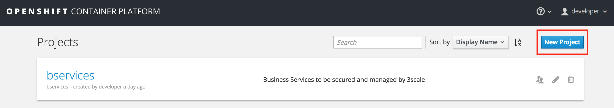
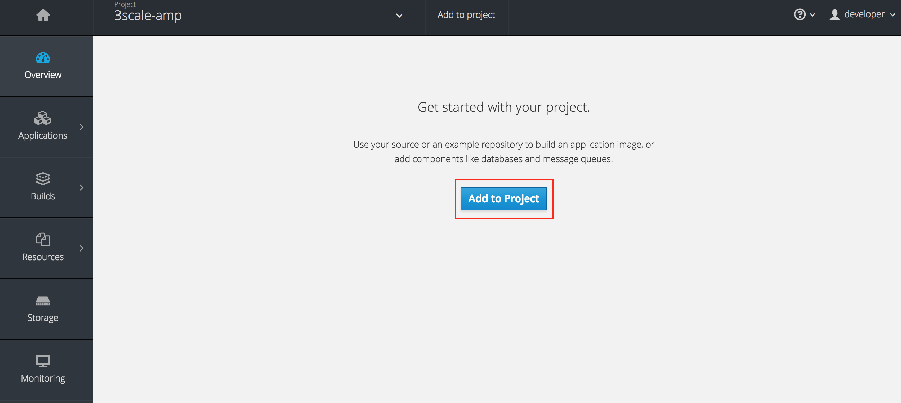
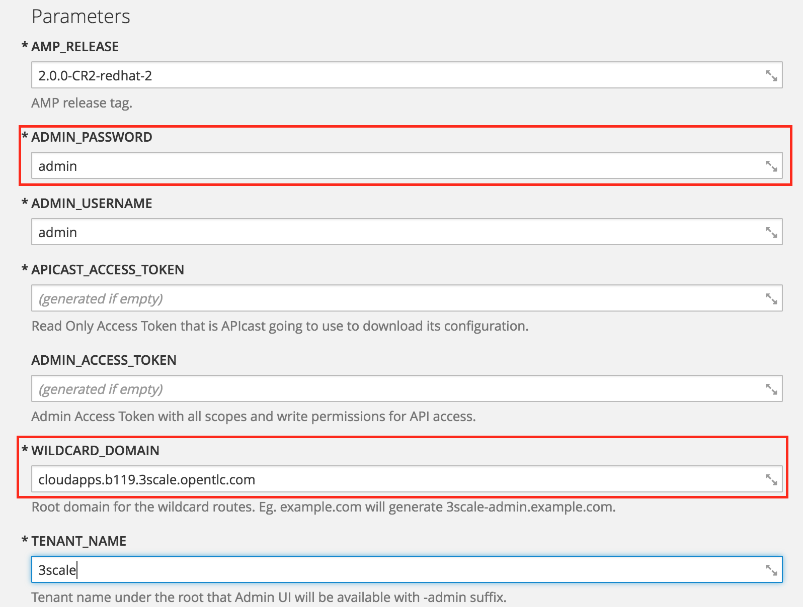
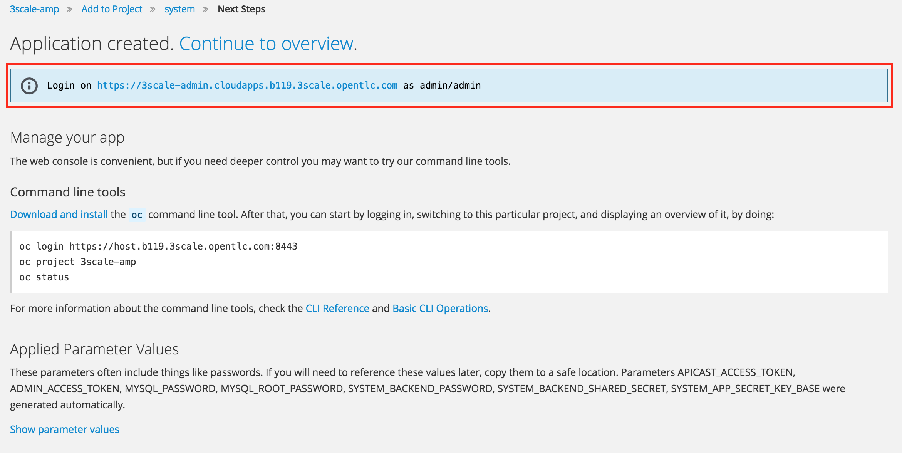

:scrollbar:
:data-uri:
:toc2:
:linkattrs:

== On-Premise API Management Platform Installation Lab

.Goals
* Provision a _self-managed_ 3scale by Red Hat AMP and its built-in APIcast components

.Prerequisites
* Completion of the _Business Services_ lab where RESTful endpoints of two microservices were exposed
* A running student lab environment for this course
* The `OCP_WILDCARD_DOMAIN` environment variable set in your shell
+
TIP: To check if your shell still has this environment variable set, execute the `echo $OCP_WILDCARD_DOMAIN` command. If the variable is no longer set, return to the first lab in this course and follow the steps there to set it again.

* Four PVs, each with a minimum of 2 GB and `ReadWriteOnce` and `ReadWriteMany` access
+
NOTE: The APIcast pod does not use persistent volumes (PVs), which is why you have not needed them up to now. The AMP component, however, _does_ use PVs.
+
TIP: To confirm that your OpenShift Container Platform lab environment has the required PVs,  execute the `$ oc get pv --as=system:admin` command.

:numbered:

== Overview

As of the 2.0 release of Red Hat 3scale API Management, the API management platform (AMP) is available for on-premise installation. In an on-premise environment, the AMP component is only available in the OpenShift Container Platform on Red Hat Enterprise Linux.

In this lab, you deploy an AMP environment in your existing OpenShift Container Platform lab environment. It is important that you use the provided student lab environment, as it includes the following items that are critical for this lab:

* OpenShift Container Platform 3.5
* Adequate hardware resources: 16 GB RAM and 4 CPUs

== Install AMP Environment

An on-premise 3scale by Red Hat AMP environment must run in an OpenShift Container Platform (v3.3, v3.4 or v3.5) environment running on Red Hat Enterprise Linux 7. Your lab environment meets these requirements.

In this exercise, you install the 3scale by Red Hat AMP resources in your lab environment.

=== Create a New Project for AMP

. Open a browser window and navigate to the OpenShift Management Console URL
+
NOTE: The URL for Management Console is https://${EXTERNAL_HOST}:8443/
+
image::images/ocp_login.png[]
+
. Login as user `developer` with password `developer`. 

. Create a new project for your API Management Platform applications:
.. Click on `New Project` button.
+

+
.. Enter Name `3scale-amp`, Display Name `3scale-amp` and Description `3scale AMP component`.
+

.. Click on the `Create` button.

. You are now in the `3scale-amp` project home page and can deploy the AMP in this project.

=== Deploy AMP Using Application Template

. In a browser window, navigate to the AMP Template URL: `https://raw.githubusercontent.com/3scale/3scale-amp-openshift-templates/2.0.0.GA-redhat-2/amp/amp.yml`
+
NOTE: This template needs to be uploaded to the OCP environment in order to create a new application.

. In the OCP Management Web Console, navigate to the 3scale_amp project page.
+

+
. Click on `Add to Project`.
. Click on `Import YAML/JSON`.
. In the text field, copy and paste the complete text from the URL: `https://raw.githubusercontent.com/3scale/3scale-amp-openshift-templates/2.0.0.GA-redhat-2/amp/amp.yml`
+

+
. Click on `Create`.
. A pop-up window appears. Select `Process the Template` option.
+

+
. In the next screen, edit the following parameters:
.. `ADMIN_PASSWORD`: `admin`
.. `WILDCARD_DOMAIN`: $OCP_WILDCARD_DOMAIN
+
TIP: $OCP_WILDCARD_DOMAIN is the parameter set in the user’s `~/.bashrc`. You can find this value by using the command `echo $OCP_WILDCARD_DOMAIN.
+

+
. Scroll down and click on `Create`.
. Note the information for logging in to the 3scale portal:
+

+
NOTE: Keep a note of the URL and user credentials, so that you can access the 3scale AMP Portal when it is provisioned.
+
. Click on `Go to Overview`, and wait until all the pods are started.
. You can find the list of pods required for AMP here:
+

+
. Once the provisioning is complete, point your browser to the URL of the 3scale admin and login.
+

+
. Once you have logged in, expect to see a welcome screen similar to the following:
+

. From here, you can see a demo by clicking *OK, how does 3scale work?*, or click "x" in the top right corner to continue.

Congratulations, your 3scale AMP environment is now ready and you can use it for running the labs in this course.
