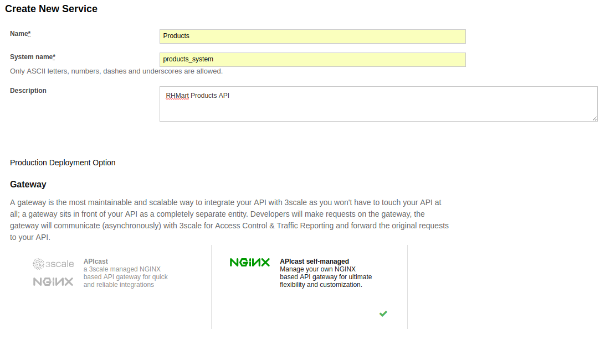
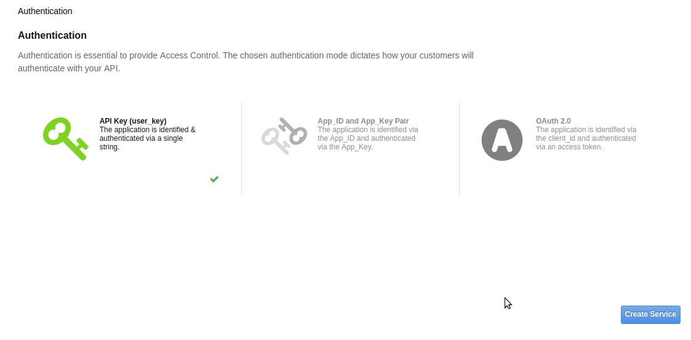
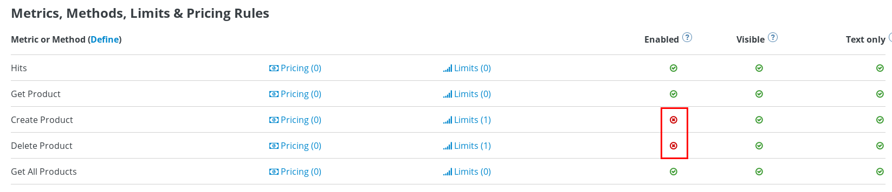
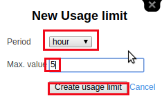

:scrollbar:
:data-uri:
:toc2:
:numbered:

= Metrics, Methods and Rate Limits

.Goals:

. Expose Products API REST Service with 3scale.
. Create Application Plans for Basic and Premium users.
. Define methods and metrics
. Apply rate limits for basic users to control access to the API.

.Prerequisites
* Completion of the previous labs of this course
* * The `OCP_WILDCARD_DOMAIN` environment variable set in your shell
+
TIP: To check if your shell still has this environment variable set, execute the `echo $OCP_WILDCARD_DOMAIN` command. If the variable is no longer set, return to the first lab in this course and follow the steps there to set it again.
+
* 3scale Admin Portal URL and user credentials to login.

== Overview

In this lab, you will secure and manage the Products API REST JEE application deployed in the previous lab. 

In particular, _methods_, _metrics_ and _rate limits_ will be defined and utilized.

== Initial API resources

Now, you will expose the Products API business services created in an earlier lab using the 3scale APICast Gateway. We will use the 3scale Admin Portal to create the accounts, applications, application plans, services and API definitions.

=== Log into Admin Console

. In a browser window, access the 3scale AMP Admin Portal URL.
+
NOTE: The 3scale admin portal is as noted in the previous lab. It should be of the form *https://$OCP_PROJECT_PREFIX-3scale-admin.$OCP_WILDCARD_DOMAIN*, where $OCP_PROJECT_PREFIX and $OCP_WILDCARD_DOMAIN are the values set in your ~/.bashrc.
+
. Login to the 3scale portal using your login credentials.
+
image::images/3scale_amp_admin_portal_login.png[]
+
. Navigate to `Developers` and delete the default user `Developer`.
+
image::images/3scale_amp_admin_delete_developers.png[]

=== Define ProductsAPI Service

In this section, you define a service that manages access to the Products API business service that you provisioned in the previous lab.

. Navigate to the API tab.
+
NOTE: Notice that there is already a service defined for Echo API. This is useful for testing the 3scale routing, so do not delete this service.
+
. Click on `Create Service` to create a new service with following information:
.. `Name` : `Products`
.. `System Name` : `products_system`
.. `Description` : `RHMart Products API`
.. `Gateway : `NGINX APIcast self-managed`
.. `Authentication` : `API Key (user_key)`
+

+
. Keep the rest of the default fields unchanged and click on `Create Service` button.
+

=== Define Application Plan

Plans are used for granting access to specific APIs and endpoints, limiting traffic and monetizing API usage. Application plans let you configure access rights to an API by specifying rate limits and pricing rules. All applications must be associated with a plan. Application plans can be customized for each application.

. In the newly created `Products` service, create a new Application Plan.
+
image::images/3scale_amp_products_app_plan.png[]
+
. In the APIs section, expand the `Products` API and scroll down to the *Published Application Plans* section.
. Click on `Create Application Plan` link.
. Use the following parameters:
.. `Name` : `ProductsBasicPlan`
.. `System Name` : `products/basic`
. Click on `Create Application Plan` link.
+
image::images/3scale_amp_products_app_plan2.png[]
+
. Create another Application Plan with Name `ProductsPremiumPlan` and System Name `products/premium`.
. Select the *ProductsBasicPlan* as Default Plan.
. Click on the *Publish* link for both `ProductsBasicPlan` and `ProductsPremiumPlan`.
+
image::images/3scale_amp_products_app_plan_publish.png[]

=== Define accounts and users

. Click on the `Developers` link.
. Click on `Create`.
. Create a new account `RHMart` with following credentials:
.. `Username`: `rhbankdev`
.. `Email` : PROVIDE A UNIQUE EMAIL ADDRESS
.. `PASSWORD`: PROVIDE A UNIQUE EASY TO REMEMBER PASSWORD
.. `Organization/Group Name` : `RHBank`
+
image::images/3scale_amp_products_create_dev.png[]

=== Create Application

In this section, you associate an application to your previously defined users. This generates a user key to the application. The user key is used as a query parameter to the HTTP request to invoke your business services via your on-premise APIcast gateway.

. Navigate to the `Developers` tab.
. Select the `RHBank` account and click on `1 Application` breadcrumb.
+
image::images/3scale_amp_products_create_app.png[]
+
NOTE: Notice that the default service `Echo API` is automatically associated with the *RHBank* account.
+
. Click on `Create Application` link.
. Enter the following values:
.. `Application Plan` : `ProductsBasicPlan`
.. `Service Plan` : `Default`
.. `Name`: `ProductsApp`
.. `Description` : `Products Application.`
+
image::images/3scale_amp_products_create_app2.png[]
+
. After the Application is created, make a note of the User Key.
+
image::images/3scale_amp_products_app_plan_userkey.png[]

== Create Mappings and Methods for Products Integration

. Navigate to the API tab.
. In the `Products` service, select *Integration*.
. Click on `add the base URL of your API and save the configuration.` button.
+
image::images/3scale_amp_products_api_integration1.png[]
+
. Expand the `Mapping Rules` section.
. Click on `Define Metric/method` link.
. Click on `New method` link in the `Methods` section.
. Enter the following values:
.. *Friendly Name*: Get Product
.. *System Name*: product/get
.. *Description*: Get a product by ID.
. Click on the `Create Method` button.
+
image::images/3scale_amp_products_create_method.png[]
+
. Repeat the process for the following methods:
+
.Methods Table
[options="header"]
|=======================
|Friendly Name|System Name|Description
|Create Product|product/create|Create a new Product
|Delete Product|product/delete|Delete a product by ID
|Get All Products|product/getall|Get all products
|=======================
+
image::images/3scale_amp_products_create_all_methods.png[]
+
. Now click on `Add a mapping rule` for *Get Product* method.
. Click on the edit icon.
. Enter the following values:
.. *Verb*: GET
.. *Pattern*: /rest/services/product/
.. *Method*: product/get 
. Now repeat the process for the other mapping rules:
+
.Mapping Rules Table
[options="header"]
|=======================
|Verb|Pattern|Method
|POST|/rest/services/product|product/create
|DELETE|/rest/services/product/|product/delete
|GET|/rest/services/products|product/getall
|=======================
+
image::images/3scale_amp_products_create_all_mappings.png[]

== Create Routes for staging and Production APIcast

. From the command line, ensure you are logged in to openshift.
. Ensure you are in the `3scale AMP` project.
+
[source,text]
-----
$ oc project $OCP_PROJECT_PREFIX-3scale-amp
-----
+
. Get the list of routes defined in the project:
+
[source,text]
-----
$ oc get routes
NAME                           HOST/PORT                                                              PATH      SERVICES             PORT      TERMINATION   WILDCARD
api-apicast-production-route   api-user76-3scale-apicast-production.apps.6a94.openshift.opentlc.com             apicast-production   gateway   edge/Allow    None
api-apicast-staging-route      api-user76-3scale-apicast-staging.apps.6a94.openshift.opentlc.com                apicast-staging      gateway   edge/Allow    None
backend-route                  backend-user76-3scale.apps.6a94.openshift.opentlc.com                            backend-listener     http      edge/Allow    None
system-developer-route         user76-3scale.apps.6a94.openshift.opentlc.com                                    system-developer     http      edge/Allow    None
system-provider-admin-route    user76-3scale-admin.apps.6a94.openshift.opentlc.com                              system-provider      http      edge/Allow    None
-----
+
. Delete the default routes `api-apicast-production-route` and `api-apicast-staging-route`.
+
[source,text]
-----
$ oc delete route api-apicast-production-route
$ oc delete route api-apicast-staging-route
-----
+
. Create new route to the Staging and Production APICast gateways.
+
[source,text]
-----
$ oc create route edge products-staging-route \
 --service=apicast-staging \
 --hostname=products-staging-apicast-$OCP_PROJECT_PREFIX.$OCP_WILDCARD_DOMAIN

$ oc create route edge products-production-route \
 --service=apicast-production \
 --hostname=products-production-apicast-$OCP_PROJECT_PREFIX.$OCP_WILDCARD_DOMAIN
-----
+
. check that the routes are created successfully.
+
[source,text]
-----
$ oc get routes

NAME                          HOST/PORT                                                            PATH      SERVICES             PORT      TERMINATION   WILDCARD
backend-route                 backend-user76-3scale.apps.6a94.openshift.opentlc.com                          backend-listener     http      edge/Allow    None
products-production-route     products-production-apicast-user76.apps.6a94.openshift.opentlc.com             apicast-production   gateway   edge          None
products-staging-route        products-staging-apicast-user76.apps.6a94.openshift.opentlc.com                apicast-staging      gateway   edge          None
system-developer-route        user76-3scale.apps.6a94.openshift.opentlc.com                                  system-developer     http      edge/Allow    None
system-provider-admin-route   user76-3scale-admin.apps.6a94.openshift.opentlc.com                            system-provider      http      edge/Allow    None

-----

=== Create Public & Private APIs for Products Integration

. Return to the admin console of your API Managment Platform.
. Enter the Products API and Business Service routes to the configuration:
.. `Private Base URL` : _Route to the Products API Business Service Endpoint_
+
IMPORTANT: This is the route you set in the Business Services lab, and should be `http://products-$OCP_PROJECT_PREFIX.$OCP_WILDCARD_DOMAIN:80`. Please note that the values will not be resolved on 3scale AMP, so you need to provide the full path, e.g `http://products-sjayanti-redhat-com.apps.na1.openshift.opentlc.com:80`
+
.. `Staging Public Base URL` : _Route to the Products APICast Staging Endpoint_
+
IMPORTANT: This is the staging route URL you created in the previous section. It should be `https://products-staging-apicast-$OCP_PROJECT_PREFIX.$OCP_WILDCARD_DOMAIN:443`. Please note that the values will not be resolved on 3scale AMP, so you need to provide the full path, e.g `products-staging-apicast-sjayanti-redhat-com.apps.na1.openshift.opentlc.com:443`.
+
.. `Production Public Base URL` : _Route to the Products APICast Production Endpoint_
+
IMPORTANT: This is the production route URL you created in the previous section. It should be `https://products-production-apicast-$OCP_PROJECT_PREFIX.$OCP_WILDCARD_DOMAIN:443`. Please note that the values will not be resolved on 3scale AMP, so you need to provide the full path, e.g `https://products-production-apicast-sjayanti-redhat-com.apps.na1.openshift.opentlc.com:443`.
+
.. `API test GET Request` : `/rest/services/product/1`
. Keep the rest of the values unchanged and click on `Update the Staging Environment`.
NOTE: 3scale tests the connection and the route turns green when the API routing is successful. Notice the following message: `Connection between client, gateway & API is working correctly as reflected in the analytics section.`
. Now make a request based on the curl request generated in the Client to ensure the staging API URL is accessed correctly.
+
image::images/3scale_amp_products_curl_test_url.png[]
+
. Once it is successful, `Promote to Production` and test the curl request for Production. 

== Rate Limiting

In this lab, you configure and test a rate limiting policy in an application plan for the API created in the previous lab. 

=== Set Rate Limits

. In the 3scale Management Portal, ensure you are logged in, and click on `APIs` tab.
. Expand the `Products` API.
. Click on `Published Application Plans` section.
. Choose the `ProductsBasicPlan`. 
+
image::images/3scale_amp_products_app_plan_limit1.png[]
+
. Scroll down to the `Metrics, Methods & Limits` section.
. Disable both `Create` and `Delete` methods by clicking on their Enabled column.
+

+
. Click on the `Limits` link for the *Get Product* method.
. Click on the `New usage limit` link.
+
image::images/3scale_amp_products_app_plan_limit3.png[]
+
. Enter the following values and click `Create usage limit`:
.. *Period*: hour
.. *Max. value*: 5
+

+
. Similarly, enter a new usage limit for the *Get all Products* method with the following values:
.. *Period*: minute
.. *Max. value*: 1
. Click on `create usage limit`.
. Now click on `Update Appliction plan`.
+
image::images/3scale_amp_products_app_plan_limit5.png[]

=== Test the Rate Limits

. Click on the `Integration` tab.
. Click on the `edit APIcast configuration` link.
+
image::images/3scale_amp_products_app_plan_limit6.png[]
+
. Copy the curl request link. 
+
NOTE: The request is to URL `rest/services/product/1`, so it makes a GET request to the `Get Method` method configured.
+
. Make 5 request to the URL.
+
[source,text]
-----
$ curl -v -k "https://products-stage-apicast-sjayanti-redhat-com-3scale-amp.apps.na1.openshift.opentlc.com:443/rest/services/product/1?user_key=0c25e59b6e7027552bdfd97440ddee51"
-----
+
. On the 6th request, you should expect the following response:
+
.Sample Output
[source,text]
-----
..
< HTTP/1.1 403 Forbidden
..
* Connection #0 to host products-stage-apicast-sjayanti-redhat-com-3scale-amp.apps.na1.openshift.opentlc.com left intact
Authentication failed
-----
+
NOTE: As the limit set for the `Get Method` is 5 requests/hour, the 6th and subsequent requests get a HTTP 403 response.
+
. Repeat the same test for the endpoint `/rest/services/products` to test the limit for `Get all Methods` method.
+
[source,text]
-----
$ curl -v -k "https://products-stage-apicast-sjayanti-redhat-com-3scale-amp.apps.na1.openshift.opentlc.com:443/rest/services/products?user_key=0c25e59b6e7027552bdfd97440ddee51"
-----
+
. As the limit is set to 1 request/minute, you should notice a HTTP 403 Forbidden response on subsequent requests.

In the SaaS version of 3Scale AMP (and in a future release of 3Scale on-premises) you can create pricing rules for your APIs in the application plans. This functionality is out of scope for this lab.

Congratulations, this lab is now complete.

ifdef::showscript[]
endif::showscript[]
