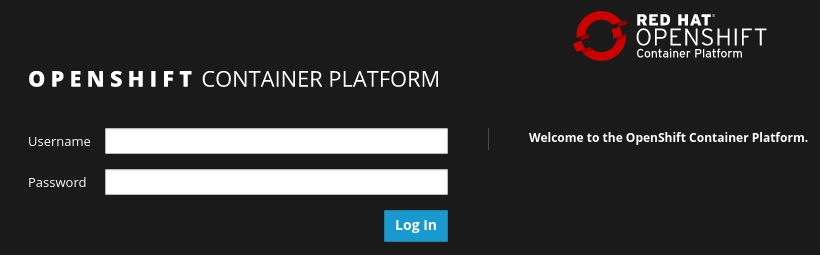

:scrollbar:
:data-uri:
:toc2:
:numbered:

= Using Red Hat 3Scale API Management Lab

.Goals:

. Use the 3scale Admin Portal, REST APIs and Command Line Interface to manage RESTful APIs using the AMP hosted on OpenShift Container Platform.

.Prerequisites
* Completion of the previous labs of this course
* * The `OCP_WILDCARD_DOMAIN` environment variable set in your shell
+
TIP: To check if your shell still has this environment variable set, execute the `echo $OCP_WILDCARD_DOMAIN` command. If the variable is no longer set, return to the first lab in this course and follow the steps there to set it again.
+
* 3scale Admin Portal URL and user credentials to login.
+
IMPORTANT: The 3scale URL for your lab environment will be `https://3scale-admin.$OCP_WILDCARD_DOMAIN`. The userid/password is `admin/admin`.

== Overview

In the previous labs, you installed and configured an OpenShift Container Platform environment, installed the AMP On-premise, and RESTFul business services. In this lab, you install use the AMP to manage the RESTful business service APIs. 

Use your new on-premise 3scale by Red Hat AMP to manage and monitor your business services. A deployment topology of your two business service clients invoking your on-premise APIcast and AMP environment is as shown here:

NOTE: The business services for Vertx and Swarm are the ones created in the earlier lab in the `bservices` project. Please confirm that the project exists and the services are available.

== Create Routes for Business Service APIs

You now have both APIcast and AMP environments installed on-premise in your OpenShift Container Platform lab environment.

. Open a browser window and navigate to the OpenShift Management Console URL
+
NOTE: The URL for Management Console is https://${EXTERNAL_HOST}:8443/
+

+
. Login as user `developer` with password `developer`. 
. Navigate to the `3scale-amp` project.
. Delete the out-of-the-box default routes that are assigned to both of your new `apicast` gateways.
.. Navigate to `Applications` -> `Routes`.
.. Delete the route `api-apicast-production-route`.
+

+
.. Delete the route `api-apicast-staging-route`.
+
image::images/ocp_amp_delete_apicast_stage_route.png[]
+
. For each business service, create an HTTPS route for both of your new `apicast` gateways. 
.. For swarm, create the `swarm-stage-apicast` route for the staging environment.
+
image::images/ocp_amp_apicast_stage_swarm_route.png[]
+
.. Similarly, create the `swarm-prod-apicast` route for the production environment.
+
image::images/ocp_amp_apicast_prod_swarm_route.png[]
+
.. Repeat the process to create the `vertx-stage-apicast` and `vertx-prod-apicast` routes.
.. You should now have the following routes in your list:
+
image::images/ocp_amp_list_routes.png[]

== API Management Using 3scale AMP Admin Portal

== API Management Using 3scale REST APIs

== API Management Using 3scale Command Line Interface (CLI)

[blue]#Congratulations!#.

ifdef::showscript[]
endif::showscript[]
