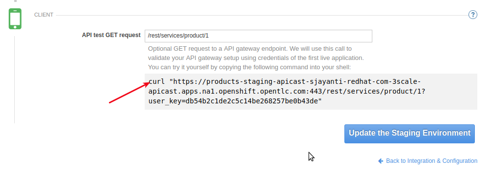

:scrollbar:
:data-uri:
:toc2:
:numbered:

= Using Red Hat 3Scale API Management Lab

In this lab, you will create your first API Management Service in 3Scale AMP, exposing the Products API REST JEE application deployed in the previous lab. 

.Goals:

. Expose Products API REST Service with 3scale.
. Create Application Plans for Basic and Premium users.
. Apply rate limits for basic users to control access to the API.

.Prerequisites
* Completion of the previous labs of this course
* * The `OCP_WILDCARD_DOMAIN` environment variable set in your shell
+
TIP: To check if your shell still has this environment variable set, execute the `echo $OCP_WILDCARD_DOMAIN` command. If the variable is no longer set, return to the first lab in this course and follow the steps there to set it again.
+
* 3scale Admin Portal URL and user credentials to login.

== Overview

In the previous labs, you installed and configured an OpenShift Container Platform environment, installed the APICast On-premise, and REST API business services. In this lab, you use the 3scale SaaS AMP to manage the business service APIs. 

== API Management Using 3scale AMP Admin Portal

Now, you will expose the Products API business services created in an earlier lab using the 3scale APICast Gateway. We will use the 3scale SaaS Portal to create the accounts, applications, application plans, services and API definitions.

=== Login

. In a browser window, access the 3scale SaaS Admin Portal URL.
+
NOTE: The 3scale admin portal is as noted in the previous lab. It should be of the form https://<<your_domain>>-admin.3scale.net, where <<your_domain>> is the THREESCALE_DOMAIN_NAME of your account on 3scale.net.
+
. Login to the 3scale portal using your login credentials.
+
image::images/3scale_amp_admin_portal_login.png[]
+
. Navigate to `Developers` and delete the default user `John Doe`.
+
image::images/3scale_amp_admin_delete_developers.png[]

=== Define ProductsAPI Service

In this section, you define a service that manages access to the Products API business service that you provisioned in the previous lab.

. Navigate to the API tab.
+
NOTE: Notice that there is already a service defined for Echo API. This is useful for testing the 3scale routing, so do not delete this service.
+
. Click on `Create Service` to create a new service with following information:
.. `Name` : `Products`
.. `System Name` : `products_system`
.. `Description` : `RHMart Products API`
.. `Gateway : `NGINX APIcast self-managed`
.. `Authentication` : `API Key (user_key)`
+
image::images/3scale_amp_products_create_service_1.png[]
+
. Keep the rest of the default fields unchanged and click on `Create Service` button.
+
image::images/3scale_amp_products_create_service_2.png[]

=== Define Application Plan

Plans are used for granting access to specific APIs and endpoints, limiting traffic and monetizing API usage. Application plans let you configure access rights to an API by specifying rate limits and pricing rules. All applications must be associated with a plan. Application plans can be customized for each application.

. In the newly created `Products` service, create a new Application Plan.
+
image::images/3scale_amp_products_app_plan.png[]
+
. In the APIs section, expand the `Products` API and scroll down to the *Published Application Plans* section.
. Click on `Create Application Plan` link.
. Use the following parameters:
.. `Name` : `ProductsBasicPlan`
.. `System Name` : `products/basic`
. Click on `Create Application Plan` link.
+
image::images/3scale_amp_products_app_plan2.png[]
+
. Create another Application Plan with Name `ProductsPremiumPlan` and System Name `products/premium`.
. Select the *ProductsBasicPlan* as Default Plan.
. Click on the *Publish* link for both `ProductsBasicPlan` and `ProductsPremiumPlan`.
+
image::images/3scale_amp_products_app_plan_publish.png[]

=== Define accounts and users

. Click on the `Developers` link.
. Click on `Create`.
. Create a new account `RHMart` with following credentials:
.. `Username`: `rhbankdev`
.. `Email` : PROVIDE A UNIQUE EMAIL ADDRESS
.. `PASSWORD`: PROVIDE A UNIQUE EASY TO REMEMBER PASSWORD
.. `Organization/Group Name` : `RHBank`
+
image::images/3scale_amp_products_create_dev.png[]

=== Create Application

In this section, you associate an application to your previously defined users. This generates a user key to the application. The user key is used as a query parameter to the HTTP request to invoke your business services via your on-premise APIcast gateway.

. Navigate to the `Developers` tab.
. Select the `RHBank` account and click on `1 Application` breadcrumb.
+
image::images/3scale_amp_products_create_app.png[]
+
NOTE: Notice that the default service `Echo API` is automatically associated with the *RHBank* account.
+
. Click on `Create Application` link.
. Enter the following values:
.. `Application Plan` : `ProductsBasicPlan`
.. `Service Plan` : `Default`
.. `Name`: `ProductsApp`
.. `Description` : `Products Application.`
+
image::images/3scale_amp_products_create_app2.png[]
+
. After the Application is created, make a note of the User Key.
+
image::images/3scale_amp_products_app_plan_userkey.png[]

=== Create Mappings and Methods for Products Integration

. Navigate to the API tab.
. In the `Products` service, select *Integration*.
. Click on `add the base URL of your API and save the configuration.` button.
+

+
. Expand the `Mapping Rules` section.
. Click on `Define Metric/method` link.
. Click on `New method` link in the `Methods` section.
. Enter the following values:
.. *Friendly Name*: Get Product
.. *System Name*: product/get
.. *Description*: Get a product by ID.
. Click on the `Create Method` button.
+
image::images/3scale_amp_products_create_method.png[]
+
. Repeat the process for the following methods:
+
.Methods Table
[options="header,footer"]
|=======================
|Friendly Name|System Name|Description
|Create Product|product/create|Create a new Product
|Delete Product|product/delete|Delete a product by ID
|Get All Products|product/getall|Get all products
|=======================
+
image::images/3scale_amp_products_create_all_methods.png[]
+
. Now click on `Add a mapping rule` for *Get Product* method.
. Click on the edit icon.
. Enter the following values:
.. *Verb*: GET
.. *Pattern*: /rest/services/product/
.. *Method*: product/get 
. Now repeat the process for the other mapping rules:
+
.Mapping Rules Table
[options="header,footer"]
|=======================
|Verb|Pattern|Method
|POST|/rest/services/product|product/create
|DELETE|/rest/services/product/|product/delete
|GET|/rest/services/products|product/getall
|=======================
+
image::images/3scale_amp_products_create_all_mappings.png[]

=== Create Public & Private APIs for Products Integration

. Enter the Products API and Business Service routes to the configuration:
.. `Private Base URL` : _Route to the Products API Business Service Endpoint_
+
IMPORTANT: This is the route you set in the Business Services lab, and should be `http://projects-$OCP_PROJECT_PREFIX.$OCP_WILDCARD_DOMAIN:80`. Please note that the values will not be resolved on 3scale AMP, so you need to provide the full path, e.g `http://products-sjayanti-redhat-com.apps.na1.openshift.opentlc.com:80`
+
.. `Staging Public Base URL` : _Route to the Products APICast Staging Endpoint_
+
IMPORTANT: This is the staging route URL you set in the Hybrid APICast lab. It should be `https://products-staging-apicast-$OCP_PROJECT_PREFIX.$OCP_WILDCARD_DOMAIN:443`. Please note that the values will not be resolved on 3scale AMP, so you need to provide the full path, e.g `products-staging-apicast-sjayanti-redhat-com.apps.na1.openshift.opentlc.com:443`.
+
.. `Production Public Base URL` : _Route to the Products APICast Production Endpoint_
+
+
IMPORTANT: This is the production route URL you set in the Hybrid APICast lab. It should be `https://products-production-apicast-$OCP_PROJECT_PREFIX.$OCP_WILDCARD_DOMAIN:443`. Please note that the values will not be resolved on 3scale AMP, so you need to provide the full path, e.g `products-production-apicast-sjayanti-redhat-com.apps.na1.openshift.opentlc.com:443`.
+
.. `API test GET Request` : `/rest/services/product/1`
. Keep the rest of the values unchanged and click on `Update the Staging Environment`.
. Now make a request based on the curl request generated in the Client to ensure the staging API URL is accessed correctly.
+

+
. Once it is successful, `Promote to Production` and test the curl request for Production. 

ifdef::showscript[]
endif::showscript[]
