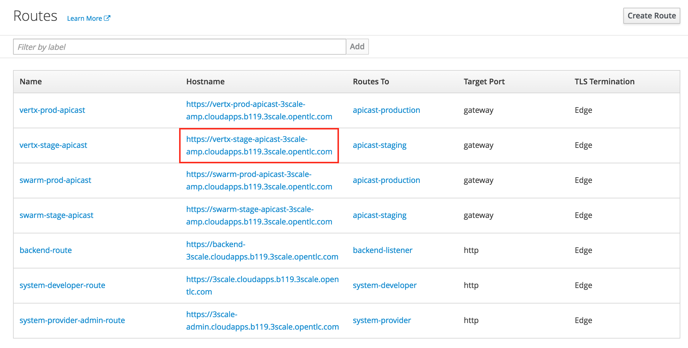

:scrollbar:
:data-uri:
:toc2:
:numbered:

= Using Red Hat 3Scale API Management Lab

.Goals:

. Use the 3scale Admin Portal, REST APIs and Command Line Interface to manage RESTful APIs using the AMP hosted on OpenShift Container Platform.

.Prerequisites
* Completion of the previous labs of this course
* * The `OCP_WILDCARD_DOMAIN` environment variable set in your shell
+
TIP: To check if your shell still has this environment variable set, execute the `echo $OCP_WILDCARD_DOMAIN` command. If the variable is no longer set, return to the first lab in this course and follow the steps there to set it again.
+
* 3scale Admin Portal URL and user credentials to login.
+
IMPORTANT: The 3scale URL for your lab environment will be `https://3scale-admin.$OCP_WILDCARD_DOMAIN`. The userid/password is `admin/admin`.

== Overview

In the previous labs, you installed and configured an OpenShift Container Platform environment, installed the AMP On-premise, and RESTFul business services. In this lab, you install use the AMP to manage the RESTful business service APIs. 

Use your new on-premise 3scale by Red Hat AMP to manage and monitor your business services. A deployment topology of your two business service clients invoking your on-premise APIcast and AMP environment is as shown here:

image::images/on_prem_amp_host_routing.png[]

NOTE: The business services for Vertx and Swarm are the ones created in the earlier lab in the `bservices` project. Please confirm that the project exists and the services are available.

== Create Routes for Business Service APIs

You now have both APIcast and AMP environments installed on-premise in your OpenShift Container Platform lab environment.

. Open a browser window and navigate to the OpenShift Management Console URL
+
NOTE: The URL for Management Console is https://${EXTERNAL_HOST}:8443/
+
image::images/ocp_login.png[]
+
. Login as user `developer` with password `developer`. 
. Navigate to the `3scale-amp` project.
. Delete the out-of-the-box default routes that are assigned to both of your new `apicast` gateways.
.. Navigate to `Applications` -> `Routes`.
.. Delete the route `api-apicast-production-route`.
+
image::images/ocp_amp_delete_apicast_prod_route.png[]
+
.. Delete the route `api-apicast-staging-route`.
+

+
. For each business service, create an HTTPS route for both of your new `apicast` gateways. 
.. For swarm, create the `swarm-stage-apicast` route for the staging environment.
+
image::images/ocp_amp_apicast_stage_swarm_route.png[]
+
.. Similarly, create the `swarm-prod-apicast` route for the production environment.
+

+
.. Repeat the process to create the `vertx-stage-apicast` and `vertx-prod-apicast` routes.
.. You should now have the following routes in your list:
+
image::images/ocp_amp_list_routes.png[]

== API Management Using 3scale AMP Admin Portal

Now, you will expose the VertX business services created in an earlier lab using the 3scale APICast Gateway. We will use the 3scale Admin Portal to create the accounts, applications, application plans, services and API definitions.

=== Login

. In a browser window, access the 3scale Admin Portal URL.
+
NOTE: The 3scale admin portal is as noted in the previous lab. It should be of the form https://3scale-admin.cloudapps.$GUID.3scale.opentlc.com, where $GUID is the unique GUID of your OPENTLC host.
+
. Login to the 3scale portal using credentials `admin/admin`.
+
image::images/3scale_amp_admin_portal_login.png[]
+
. Navigate to `Developers` and delete the default user `John Doe`.
+
image::images/3scale_amp_admin_delete_developers.png[]

=== Define accounts and users

. Create a new account `vertx_dev` with following credentials:
.. `Username`: `vertx_dev`
.. `Email` : PROVIDE A UNIQUE EMAIL ADDRESS
.. `PASSWORD`: PROVIDE A UNIQUE EASY TO REMEMBER PASSWORD
.. `Organization/Group Name` : `vertx_group`

=== Define VertX Service

In this section, you define a service that manages access to the Vertx business service that you provisioned in the previous lab.

. Navigate to the API tab.
. Create a new service with following information:
.. `Name` : `vertx_service`
.. `System Name` : `vertx_service`
.. `Authentication` : `API Key (user_key)`

=== Define Application Plan

. In the newly created `vertx_service`, create a new Application Plan.
. Use the following parameters:
.. `Name` : `vertx_app_plan`
.. `System Name` : `vertx_app_plan`

=== Create Application

In this section, you associate an application to your previously defined users. This generates a user key to the application. The user key is used as a query parameter to the HTTP request to invoke your business services via your on-premise APIcast gateway.

. Navigate to the `Developers` tab.
. Select the `vertx_account` and create a new application.
.. `Application Plan` : `vertx_app_plan`
.. `Service Plan` : `Default`
.. `Name`: `vertx_app`
.. `Description` : `Vertx business service application.`

. After the Application is created, make a note of the User Key.

=== Stage Vertx Service Integration

. Navigate to the API tab.
. In the `vertx_service`, select *Application Plans*.
. *Publish* the `vertx_app_plan`.
. In your `vertx_service`, select *Integration*.
. Enter the vertx API and Business Service routes to the configuration:
.. `Private Base URL` : _Route to the Vertx Business Service Endpoint_
+

+
.. `Staging Public Base URL` : _Route to the Vertx APICast Staging Endpoint_
+

+
.. `Production Public Base URL` : _Route to the Vertx APICast Production Endpoint_
+

+
.. Keep the rest of the configuration same and `Update & test in Staging Environment`.
.. `API test GET Request` : `/hello`

. Now make a request based on the curl request generated in the Client to ensure the staging API URL is accessed correctly.
. Once it is successful, `Promote to Production` and test the curl request for Production. 

== API Management Using 3scale REST APIs

In this lab, you will expose the WildFly Swarm business services created in an earlier lab using the 3scale APICast Gateway. We will use the REST API calls to create the accounts, applications, application plans, services and API definitions.

=== Identify Admin Access Token

You need the Admin Access Token for your new on-premise AMP environment. You use it when programmatically invoking the RESTful APIs of your 3scale by Red Hat on-premise AMP environment.

Follow the below steps to create the user token:

. Login to the 3scale admin portal using credentials `admin/admin`.
. Click on `Settings -> Personal Settings`
+
image::images/3scale_admin_settings_drop_down.png[]
+
. Click on `Tokens`.
+
image::images/3scale_admin_personal_settings.png[]
+
. Click on `Add Access Token`.
+
image::images/3scale_admin_personal_settings_add_token.png[]
+
. Enter the following values:
.. `Name` : *swarm_admin*
.. `Scopes` : *Select _Account Management API_ and _Analytics API_*
.. `Permission` : *Read & Write*
+
image::images/3scale_admin_personal_settings_add_token_form.png[]
+
. Click on `Create Access Token`.
. In the next page, copy the access token provided.
+
image::images/3scale_admin_personal_settings_post_add_token.png[]
+
. Save the access token as an environment variable `ON_PREM_ACCESS_TOKEN` in your client VM.
+
[source,text]
-----
$ echo "export ON_PREM_ACCESS_TOKEN=<your on-prem Account Management access token>" >> ~/.bashrc
$ source ~/.bashrc
-----

=== Review API Docs

In this section, you explore the documentation of the RESTful Admin APIs exposed by 3scale by Red Hat. This documentation is rendered using a technology called _ActiveDocs_, which is an implementation of the Swagger specification created by the 3scale by Red Hat team.

. Point your browser to the URL generated by the following:
+
[source,text]
-----
$ echo https://3scale-admin.$OCP_WILDCARD_DOMAIN/p/admin/api_docs
-----

. Note that the API documentation is segregated into three sections:

* *Service Management API*
+
image::images/service_mgmt_api.png[]
** Allows for the authorization and reporting of traffic.
** Uses a _service token_ for authentication.

*** Service tokens are automatically generated when a 3scale by Red Hat service is created, unique per that service, and are shared between the users of a particular account.

* *Account Management API*
** Uses an _access token_ for authentication.

*** Access tokens are personal tokens that allow for custom scopes.

* *Analytics API*
** Uses an _access token_ for authentication.

=== Create 3scale by Red Hat Resources Via Admin API

Every invocation of 3scale by Red Hat's APIs returns either an XML or JSON response. Create a directory to temporarily store them:
+
[source,text]
-----
$ export API_RESPONSE_DIR=/tmp/amp_api_responses
$ mkdir -p $API_RESPONSE_DIR
-----
* This enables you to review them when needed.

NOTE: For the REST requests below, you can either use `curl` or directly execute the REST requests from the api_docs documentation interface. 

In case you wish to use `curl` from the client VM, please install `xmlstarlet`  
+
[source,text]
-----
$ sudo yum install xmlstarlet

$ xmlstarlet --version
-----

==== Create Swarm Service & Service Plan

. List the existing services:
.. Using `curl`:
+
[source,text]
-----
$ curl -v -k -X GET "https://3scale-admin.$OCP_WILDCARD_DOMAIN/admin/api/services.xml" \
       -d "access_token=$ON_PREM_ACCESS_TOKEN" \
       | xmlstarlet format --indent-tab > $API_RESPONSE_DIR/existing_services.xml

$ cat $API_RESPONSE_DIR/existing_services.xml
-----
* Note that the response from the endpoint is in XML. Most of the 3scale by Red Hat Admin API endpoints return XML, with a few exceptions that return JSON. You encounter those exceptions toward the latter part of this lab.
* The use of `xmlstarlet format --indent-tab` is simply to pretty-print the XML response body.
+
.. Using  3scale admin API Documentation portal:
+
image::images/3scale_api_call_service_list.png[]
+
. Create the Swarm service:
.. `Request Type` : *POST*
.. `API` : *Service Create*
.. `access_token` : $ON_PREM_ACCESS_TOKEN
.. `name` : *swarm_service*
.. `system_name` : *swarm_service*
+
image::images/3scale_api_call_service_create.png[]
+
NOTE: Note the Service ID of the `swarm_service` created.
+
. Review the service plan for the `swarm_service`.
.. `Request Type` : *GET*
.. `API` : *Service Plan List*
.. `access_token` : $ON_PREM_ACCESS_TOKEN
.. `id` : <<swarm_service id>>
+
image::images/3scale_api_call_service_plan_list.png[]
+
NOTE: Note the service plan id of the default plan above.

==== Create Application Plan

. Create a `swarm_app_plan` via the Account Management API:
.. `Request Type` : *POST*
.. `API` : *Application Plan Create*
.. `access_token` : $ON_PREM_ACCESS_TOKEN
.. `name` : *swarm_app_plan*
.. `system_name` : *swarm_app_plan*
.. `service_id` : <<swarm_service id>>
+
image::images/3scale_api_call_application_plan_create.png[]
+
NOTE: Note the application plan id of the default plan above.
+

==== Create Limit for `hit` Metric

The 3scale by Red Hat Admin API allows you to define a `hit` metric on an application plan. For this lab, you set the `hit` metric to 100 requests per minute.

. Create hit metric via the Account Management API:
.. `Request Type` : *POST*
.. `API` : *Limit Create*
.. `access_token` : $ON_PREM_ACCESS_TOKEN
.. `application_plan_id` : <<swarm_app_plan id>>
.. `metric_id` : <<swarm_service metric hits id>>
.. `period` : `minute`
.. `value` : 100
+
image::images/3scale_api_call_metric_hits_create.png[]
+
NOTE: Note the metric and plan id of the limit above.

==== Create Account Plan

. Create a `swarm_account_plan` via the Account Management API:
.. `Request Type` : *POST*
.. `API` : *Account Plan Create*
.. `access_token` : $ON_PREM_ACCESS_TOKEN
.. `name` : *swarm_account_plan*
.. `system_name` : *swarm_account_plan*
+
image::images/3scale_api_call_account_plan_create.png[]
+
NOTE: Note the account plan id of the account plan above.

==== Set up Account and Users

. Create a `swarm_account` via the Signup Express endpoint of the Account Management API:
.. `Request Type` : *POST*
.. `API` : *Signup Express*
.. `access_token` : $ON_PREM_ACCESS_TOKEN
.. `org_name` : *swarm_account*
.. `username` : *swarm_dev*
.. `email` : <<enter a valid email id>>
.. `password` : <<enter the password you wish to use>>
.. `account_plan_id` : << swarm_account_plan id>>
.. `service_plan_id` : <<swarm_service_plan id>>
.. `application_plan_id` : <<swarm_app_plan id>>
+
IMPORTANT: Note the account id of the new user account above. Also note the *user_key* and save it. This is required to make requests to the APIs.

=== Configure Services

==== Update Service Proxy

For every service, there is one service proxy resource.

. Set the private base URL, the staging APIcast URL, and the production APIcast URL on the service proxy:
.. `Request Type` : *PATCH*
.. `API` : *Proxy Update*
.. `access_token` : $ON_PREM_ACCESS_TOKEN
.. `service_id` : *swarm_service id*
.. `endpoint` : <<swarm-prod-apicast route url>>
.. `api_backend` : <<swarm business service route url>>
.. `sandbox_endpoint` : <<swarm-stage-apicast route url>>
.. ‘api_test_path’ : */time/now*
+
NOTE: As some of these parameters are not available on the api_docs, you need to run the above command as a curl request. An example request is as below:
+
[source,text]
-----
$ curl -v -k -X PATCH "https://3scale-admin.$OCP_WILDCARD_DOMAIN/admin/api/services/$vertx_serviceId/proxy.xml" \
       -d "access_token=$ON_PREM_ACCESS_TOKEN" \
       -d "api_backend=https://wfswarmdatestampservice-bservices.cloudapps.ea62.3scale.opentlc.com:443" \
       -d "endpoint=https://swarm-prod-apicast-3scale-amp.cloudapps.ea62.3scale.opentlc.com:443" \
       -d "sandbox_endpoint=https://swarm_service-3scale-apicast-staging.cloudapps.ea62.3scale.opentlc.com:443" \
       | xmlstarlet format --indent-tab > $API_RESPONSE_DIR/swarm_service_proxy_update_response.xml

$ cat $API_RESPONSE_DIR/swarm_service_proxy_update_response.xml
-----
+
TIP: Check the `sandbox_endpoint` value. If it is not updated to your provided staging route endpoint, please use the Admin Console to update the same.

==== Promote

For every service proxy, there are two proxy configuration resource types:

* *sandbox*
* *production*

There can be multiple proxy configuration versions for each `proxy_config` type.

. Determine the ID of the sandbox environment `proxy_config`:
.. `Request Type` : *GET*
.. `API` : *Proxy Configs List*
.. `access_token` : $ON_PREM_ACCESS_TOKEN
.. `service_id` : *swarm_service id*
.. `environment` : *sandbox*
+
image::images/3scale_api_call_proxy_config_list.png[]
+
NOTE: Note the proxy config id of the environment above.

. Test the Staging Environment:
.. Make a curl request to the sandbox endpoint URL of APICast and test that the business service is being called correctly.
.. Use the user_key for the swarm_service as provided in the user creation of swarm_dev earlier.
.. Make a curl request to the swarm staging URL:
+
[source,text]
-----
$ curl -v -k GET "https://<<swarm-stage-apicast route url>>/time/now?user_key=<<user_key>>“ 
----- 

==== Promote to Production

. Determine the Version ID of the latest sandbox environment `proxy_config`:
.. `Request Type` : *GET*
.. `API` : *Proxy Config Show Latest*
.. `access_token` : $ON_PREM_ACCESS_TOKEN
.. `service_id` : *swarm_service id*
.. `environment` : *sandbox*
+
image::images/3scale_api_call_proxy_config_show_latest.png[]
+
NOTE: Note the version id of the environment above.
+
. Promote the sandbox environment to production:
.. `Request Type` : *POST*
.. `API` : *Proxy Config Promote*
.. `access_token` : $ON_PREM_ACCESS_TOKEN
.. `service_id` : *swarm_service id*
.. `environment` : *sandbox*
.. `version` : <<config version from previous command>>
.. `to` : *production*
+
image::images/3scale_api_call_proxy_config_promote.png[]
+
NOTE: Ensure the promotion has been successful.
.. Make a curl request to the swarm production URL:
+
[source,text]
-----
$ curl -v -k GET "https://<<swarm-prod-apicast route url>>/time/now?user_key=<<user_key>>“ 

== API Management Using 3scale Command Line Interface (CLI)

[blue]#Congratulations!#.

ifdef::showscript[]
endif::showscript[]
