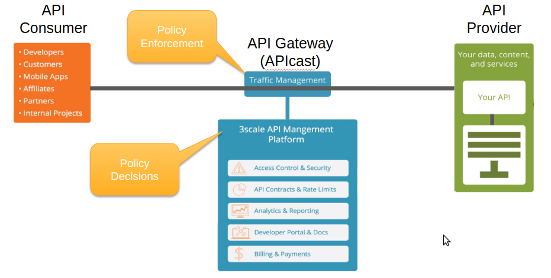

:scrollbar:
:data-uri:
:noaudio:

== 3scale API Management Overview

ifdef::showscript[]

=== Transcript

The 3scale API Management platform is a flexible, distributed architecture baed and scalable API Management platform. 

The basic 3Scale architecture diagram is shown here.
The 3scale API platform mediates between the API consumers, represented on the left, and the API providers, represented on the right.
3scale’s architecture is hybrid, with separate traffic control and program management layers. The traffic management and API management layers can be deployed separately. The traffic between API consumer and API provider does not go through the 3scale cloud, and thus latencies can be reduced.  

The API Management platform provides the management capabilities, including API Management, Access control, security, rate limits, analytics, developer portal, billing and account management. We will discuss both the APICast gateway and the API Management Platform in more details in the subsequent modules.

Integration with the 3scale platform is accomplished by deploying traffic management agents, which enforce traffic policies, access control, and rate limits. The traffic management could be a custom "APIcast" gateway built on NGINX web server and OpenResty, or a code plugin library embedded  within the API provider.

endif::showscript[]
