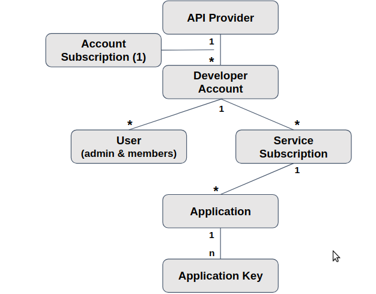

:scrollbar:
:data-uri:
:noaudio:

== Data Models

.*Account Data Model*

ifdef::showscript[]

Transcript:

This diagram shows the relationship between the various account-related data objects in 3scale. The relationships discussed here are the user and application entities. They show the data model from the perspective of the potential users, the developers. At the root of the relationship is again the API provider.

The account subscription relates to the API provider account. On a Red Hat 3scale API Management platform, usually SaaS, it is the account that the provider uses to log in to 3scale and manage APIs.

Developer accounts are the accounts subscribed to a particular API. Developer accounts are the parents of the applications. When a new developer subscribes to an API, an application is automatically created that allows the developer to make calls to that API.

User objects represent the end users of the application. They belong to a developer account, and can be admin users or normal users.

A service subscription is a contract, or plan, between an account and a service. Applications and application plans are used to enforce the contracts for the service, as shown in the previous slide.

endif::showscript[]
