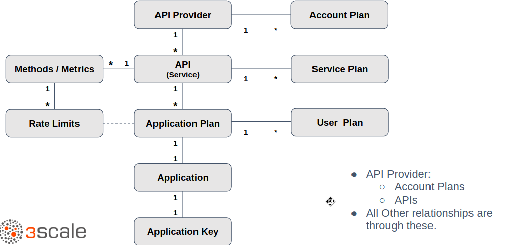

:scrollbar:
:data-uri:
:noaudio:

== API/Admin Data Model 

ifdef::showscript[]

=== Transcript

This diagram shows the relationship between the various data objects in 3scale. At the root of the relationship is the API Provider. The API Provider is the corporate or organisation account on 3scale SaaS platform, or the default provider user on the 3scale OnPremises API Management Platform.

All other relationships are derived from this. The API provider can create 1 or more APIs or services that they intend to manage. Account Plan is to manage the contract and creation of developer accounts. Typically, the plan is managed at the Application level, and account plans are left at a single default and unchanged.
Application Plan: Defines the policies for access like rate limits, etc. Each service can have multiple application plans.
Application: An application is the entity whose credentials are attached to each request. The credential is the Application key.
Service Plan: Like an application plan, but can be applied at the service level, to apply to all applications globally for the service.
User Plan: An optional end user plan can be created, which derives from the application plan, and can apply limits to individual users.

endif::showscript[]
