:scrollbar:
:data-uri:
:toc2:
:linkattrs:

== Custom Development Portal Lab

In this lab you create API documentation for the APIs managed by Red Hat 3scale API Management, learn about the Developer Portal and customization and explore additional role based access control features of 3scale.

.Goals
* Create API documentation for the Products API application
* Integrate the API documentation with 3scale API Management
* Customize the development portal
* Explore additional role based access control features available via both Application Plans and in the Developer Portal

:numbered:

== Reference

This lab will introduce you the Content Management System and Developer Portal.
However, you will likely want to reference additional documentation as you are working through this lab.

Suggested reference material is as follows:

* link:https://access.redhat.com/documentation/en-us/red_hat_3scale_api_management/2.4/html-single/developer_portal/[Developer Portal Overview]
* link:https://access.redhat.com/documentation/en-us/red_hat_3scale_api_management/2.4/html-single/developer_portal/#liquid-reference[Liquid Reference]
+
The same reference is also available by navigating your browser to the following in the Admin Portal:  _Documentation  (in the top right corner) -> Liquid Reference_
+
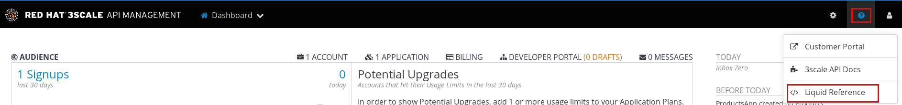

== API Documentation

In this section, you generate and test ActiveDocs documentation for the API created in the previous module.

ActiveDocs is not a replacement for the OpenAPI Specification; it is an instantiation of it. 
With ActiveDocs, you do not have to run your own OpenAPI server or deal with the UI components of the interactive documentation. 
The interactive documentation is served and rendered from your 3scale Developer Portal. 
For more information, see link:https://access.redhat.com/documentation/en-us/red_hat_3scale_api_management/2.4/html-single/api_documentation/[Create a (Swagger) Spec].

=== Customize Products API Swagger configs
In a previous lab, you have already been introduced to the OpenAPI  configuration file (in yaml representation) of your product API.

In this section of the lab, you will customize that swagger configuration so as to make it specific to your products API managed by your API gateway.

. In a new browser window, navigate to `http://editor.swagger.io/`.
. Select *File -> Import URL*.
. Enter the URL of your business API swagger specification as per the output of the following :
+
-----
$ echo -en "\n\nhttp://products-$OCP_PROJECT_PREFIX.$OCP_WILDCARD_DOMAIN/rest/swagger.yaml\n\n"
-----

. Click *OK*.
. The editor should now render the yaml as well as HTML representation of the _Products_ API:
+
iamge::images/products_swagger_editor.png[]

. In the YAML editor, make the following changes:
.. Line 6: Change the host to your `products-apicast-staging` route endpoint.  The value should be the output of the following:
+
-----
$ echo -en "\n\n`oc get route products-staging-route -o template --template {{.spec.host}} -n $GW_PROJECT`:443\n\n"
-----

.. Line 11: Change the scheme to `https`.
.. Line 24: Add the following lines to add a user key:
+

-----
        - name: "user_key"
          in: "query"
          type: string
          x-data-threescale-name: "user_keys"
          required: true
-----
+
image::images/3scale_amp_products_swagger1.png[]
+
The above config snippet will augment the Products API documentation with an indication that a _user_key_ field is required.
And, via the _x-data-threescale-name_ configuration, this field will be auto-filled with the user's actual API key when invoking this service from the API documentation.

.. Line 50: Repeat the previous change for line 24:
+
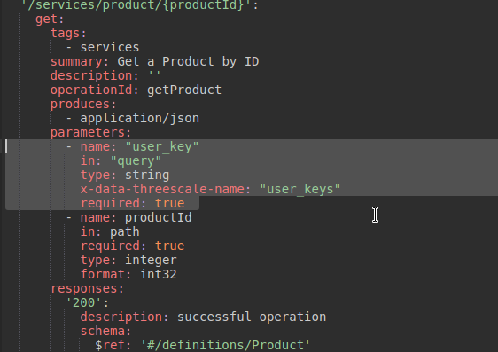

.. Line 74: Repeat the step to add the _user_key_ parameter.
.. Line 98: Delete the square brackets.
.. Line 99: Repeat the step to add the _user_key_ parameter:

. Select *File -> Convert and save as JSON*:
+
image::images/3scale_amp_products_swagger4.png[]

. Save the JSON file to your disk.
. Close the browser tab.

=== Create Documentation Using ActiveDocs

. Log in to your 3scale Admin Portal from the browser.
. Navigate to: *API:Products -> ActiveDocs*:
. Click *Create your first spec*:

. Enter the following values:
* *Name*: `Products`
* *System Name*: `products_spec`
* *Publish?*: Checked
* *Description*: `Products API Documentation`
+
image::images/3scale_amp_products_activedocs3.png[]

. In a text editor, open the `swagger.json` file created in the previous step.
. Copy the contents of `swagger.json` and paste it into the *API JSON Spec* window:
+
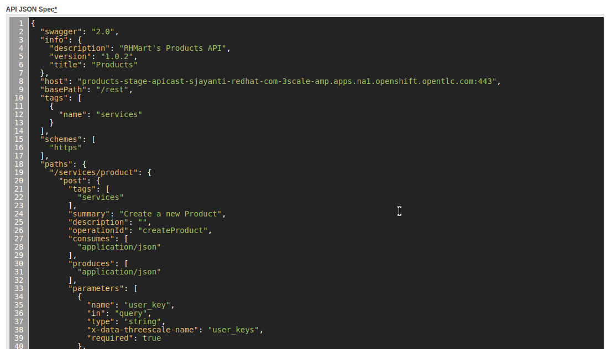

. Click *Create Service*.
+
image::images/3scale_amp_products_activedocs5.png[]

. If *Publish* appears at the top of the panel, click it.

=== Test the ActiveDocs API and Documentation

. Click *Get all Products* to expand the method.
. Go to the *Parameters* section.
. Populate the *user_key* value field with your application's API key.
. Select the *ProductsApp* user key.
. Click *Try it out*:
+
image::images/3scale_amp_products_activedocs6.png[]

.. If you get a *No response from server* error from the server, you need to accept the SSL certificate of the server by opening the request URL in a browser window and clicking *proceed to <URL>*:
+
image::images/3scale_amp_products_activedocs7.png[]

.. Return to ActiveDocs and try the request again. 
Expect it to return an HTTP *200* response code and the response body:
+
image::images/3scale_amp_products_activedocs8.png[]

== Determine URL of Dev Portal

From time to time, you'll likely need the URL to your developer portal.

The Content Management System  of your 3scale AMP provides a link at the following:  _Audience -> Developer Portal -> Visit Portal_.
Clicking that link will automatically redirect your browser to the URL of the developer portal.

The welcome email sent to new API consumers also includes the link to the developer portal.

Alternatively, you could just as easily determine this using the OpenShift oc utility:

-----
$ echo -en "\n\n`oc get route system-developer -n $API_MANAGER_NS --template "https://{{.spec.host}}"`\n\n"
-----

== Customize Developer Portal

In this lab you customize the Developer Portal for the Product API’s consumers. 
The Developer Portal can be fully customized via the built-in _Content Mangement System_ (CMS).

=== Import Logo Files

. Open a web browser and navigate to link:https://github.com/gpe-mw-training/3scale_development_labs/tree/master/DevPortal[3scale_development_labs/DevPortal].
. Download these two files:
* `RHMartBackground.jpg`
* `RHMartLogo.png`
. In the Admin Portal, navigate to *Audience -> Developer Portal -> Content* .
. To import the _RHMartLogo.png_ file, click *New Page -> New File*:
.. Enter the following:
* *Section*: `images`
* *Path*: `/images/RHMartLogo.png`
* *Attachment*: `RHMartLogo.png` from your local host
+
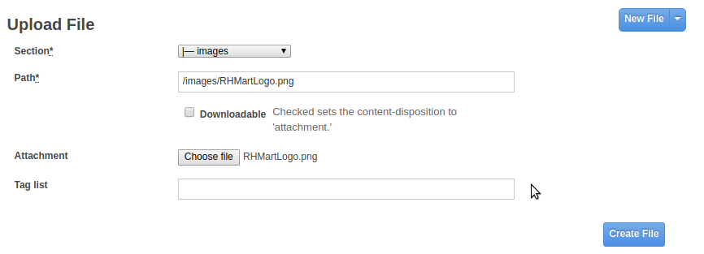
.. Click *Create File*

. To import the _RHMartBackground.png_ file, click *New File*.
.. Enter the following:
* *Section*: `images`
* *Path*:  `/images/RHMartBackground.png`
* *Attachment*: `RHMartBackground.png` from your local host
+
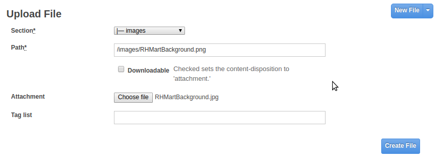

.. Click *Create File*.

=== Change the HTML/CSS

. Click *All*.
. Click the 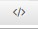 (Layouts) icon.
.. Click *Main layout*:
+
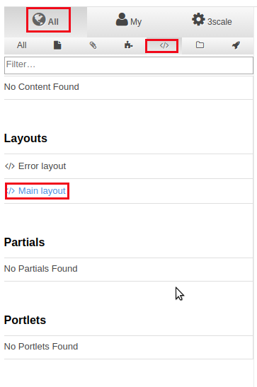
+
.. Delete line 41:
+

-----
            <a class="navbar-brand" href="/">{{  provider.name }}</a>
-----
+
.. Replace it with the following:
+

-----
            

               
            

-----
+
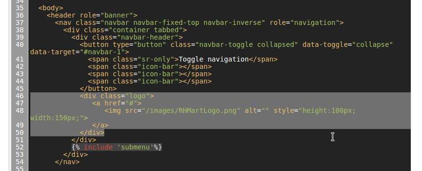

.. Scroll to the bottom of the page and click *Save*.

. Click the image:images/pages_ico.png[] (Pages) icon, and then click *Documentation*:
+
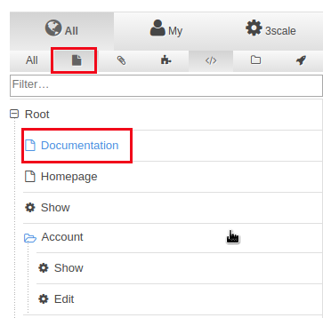

.. In line 3, replace `Echo` with `RHMart`.
.. Click *Save*:
+
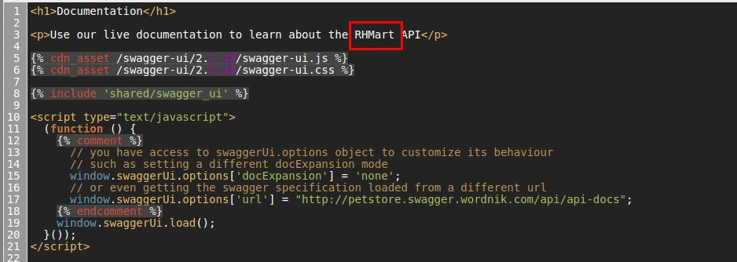
+
. Under Partials, click *shared/swagger_ui*:
+
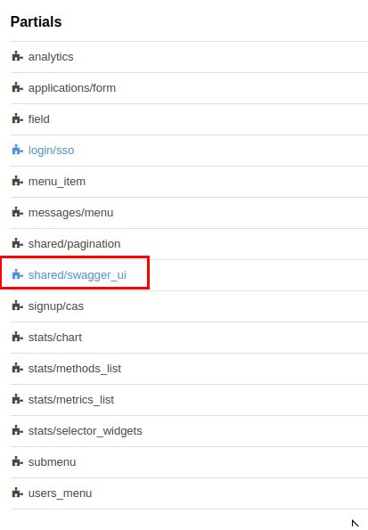
+
.. Change line 11 to the following:
+

-----
    var url = "{{provider.api_specs.products_spec.url}}";
-----
+
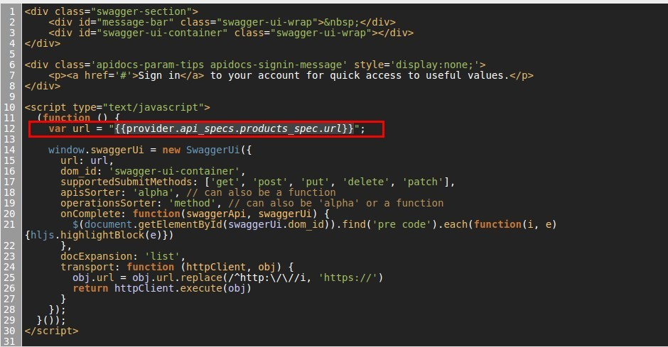
+
.. Click *Save*.
+
. Click *Homepage*:
+
image::images/3scale_amp_products_dev_portal8.png[]

.. Go to the HTML editor and replace line 5 with the following:
+

-----
            <h1 style="text-shadow: 4px 4px #000000;">RH Mart API</h1>
-----
.. Perform a search and replace of `Echo` (with a capital _E_) to `RHMart` in lines 19, 98, and 112.

.. Click *Save*.
. Under the *css* folder, click *default.css*:
+
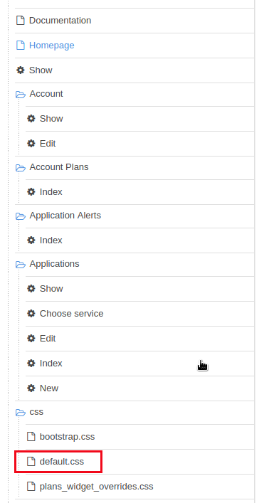

.. Replace line 22 with the following:
+

-----
            background-image: url('/images/RHMartBackground.jpg');
-----
+
.. Scroll down to the bottom of the page and click *Save*.
. Navigate to `Audience -> Developer Portal -> Drafts` and then click *Publish All*:
+
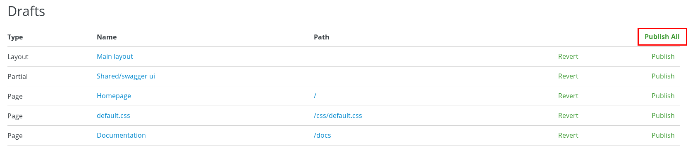

. When prompted to confirm the changes, click *OK*.

=== Test the Changes

. Click *Audience -> Developer Portal -> Visit Portal*:

. The Developer Portal opens in a new tab on your browser:
+
image::images/3scale_amp_products_dev_portal12.png[]

. Click *SIGN IN* at the top right, and log in as `rhbankdev` with the password provided in the previous lab.
. On the homepage, explore the *Applications* and *Statistics* sections.
+
image::images/3scale_amp_products_dev_portal13.png[]

. Click *Documentation*. Note that the ActiveDocs documentation created earlier is shown.
* You can test the API requests from this page:
+
image::images/3scale_amp_products_dev_portal14.png[]

== Additional Role Based Access Control

=== Premium App Plan with fully exposed Products API

In a previous lab, recall that you defined a _ProductsBasicPlan_ where both the _Create Product_ and _Delete Product_ methods are disabled.
Afterwards, an _application_ from this _ProductsBasicPlan_ app plan was set up for members of the `RHBank` group.

Subsequently, you could exepct a request for either of these methods to result in a *HTTP 429: Too Many Requests* error.

In this section of the lab, you will now define a different application plan and group that will have full access to all methods of the Products API.

Using the same steps:

. Create a new user `rhadmin` as part of the `RHAdmin` group
. Create an application using the `ProductsPremiumPlan` application plan
. Try the `Create Account` and `Delete Account` requests using the *user key* generated for this account.

.. Example request for `Create Account`:
+

-----
$ curl -k -X POST --header "Content-Type: application/json" --header "Accept: application/json" -d "{
  \"productid\": null,
  \"productname\": \"Samsung LED TV\",
  \"productprice\": 499.95}" "https://products-stage-apicast-sjayanti-redhat-com-3scale-amp.apps.na1.openshift.opentlc.com:443/rest/services/product?user_key=6e1bec836da1b3705da23635823f4f2d"

-----
+
The response should be the following:
+

-----
{"message":"Product created"}
-----

.. Example request for `Delete Account`:
+

-----
$ curl -k -X DELETE --header "Accept: application/json" "https://products-stage-apicast-sjayanti-redhat-com-3scale-amp.apps.na1.openshift.opentlc.com:443/rest/services/product/13?user_key=6e1bec836da1b3705da23635823f4f2d"

-----
+
The response should be the following:
+

-----
{"message":"Product 13 deleted"}
-----

=== Augment Dev Portal with Admin Section and Group

In this section you create a private section of the developer portal for access by users of the `RHAdmin` group.

. Log in to 3scale by Red Hat's Admin Portal using your credentials.
. Navigate to the _Content_ section of the Content Management System and then click *New Section*:
+
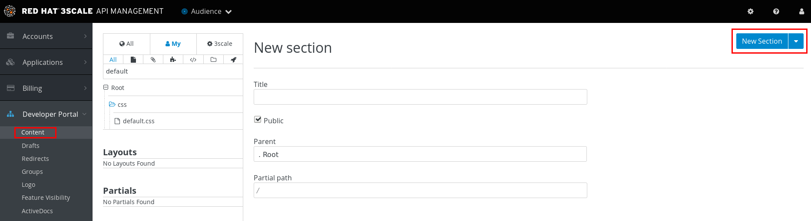

.. In the *New Section* form, provide the following information:
* *Title*: `admin`
* *Parent*: `Root`
* *Partial Path*: `/rhadmin`

.. Verify that *public* is unchecked, and click *Create Section*.
* Your new section appears in the main menu:
+
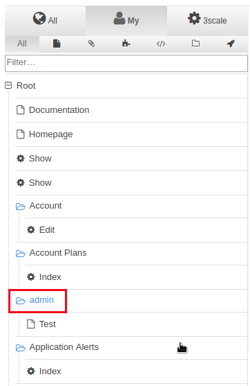

. Select *New Page -> New Page*:

.. In the *New Page* form, enter the following values:
* *Title*: `Admin Page`
* *Section*: `admin`
* *Path*: `/rhadmin/welcome`
* *Liquid enabled*: Checked
* *Text box*: Enter the following:
+

-----
<h2>Administration Portal</h2>

Hello <B>{{ current_user.username }}</B>, you are an Admin user of  <B>Account organization  {{ current_account.name }}</B>.

Welcome to the Administration Section of the portal.
-----
+
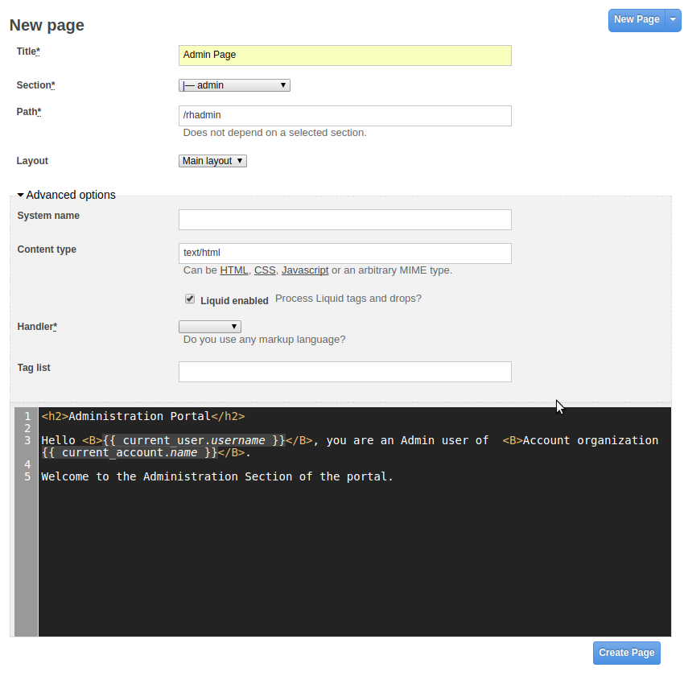

.. Click *Create Page*.
* You see the *Admin* page in the *admin* section on the menu:
+
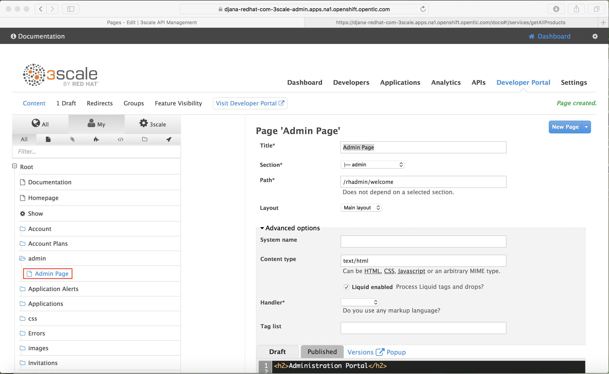

. Scroll down to the *Partials* section of the menu, and click *submenu*:
+
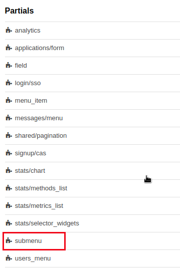

.. Add the following on line 38, after the `Documentation` item.
+

-----
        
          <li class="active">
            <a href="/rhadmin/welcome">Admin</a>
          </li>
        
-----
+
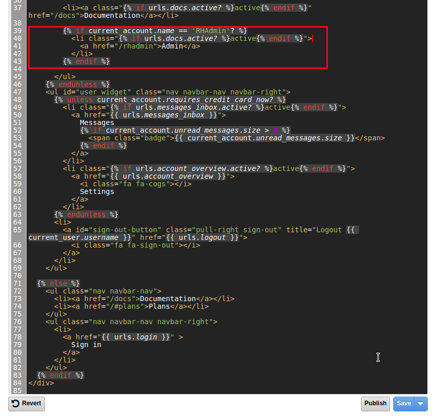

.. Click *Save*.
. Navigate to your *Drafts* and then click *Publish All*:
+
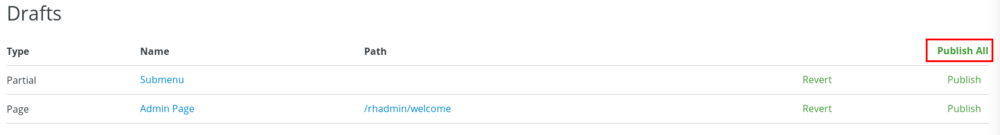
+
* All your changes are published and can be tested from the Developer Portal.

. Navigate to *Audience -> Developer Portal -> Groups*, and then click *Create Group*:

.. Enter the following values:
* *Name*: `RHAdmin`
* *Allowed Sections*: `admin`
.. Click *Create Group*.
. Navigate to the *Audience -> Accounts* section, and click the *RHAdmin* account.
+
TIP: This is the account you created in the previous section to use the *ProductsPremiumPlan*.

.. Click *O Group Memberships*:
+
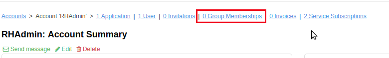

.. Select the *RHAdmin* group in the *Groups* list, and click *Save*:
+
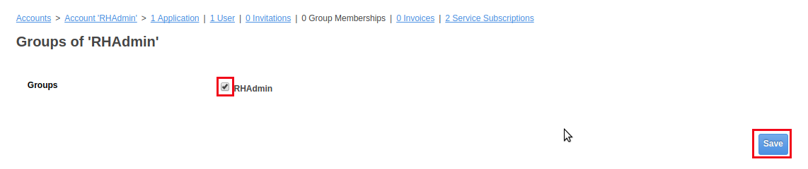

* The configuration for the Admin section and groups is complete and can be tested.

=== Test the Admin Group Section

. Open the Developer Portal and click *Sign In*.
. Log in as user `rhadmin` with the password you provided earlier:
+
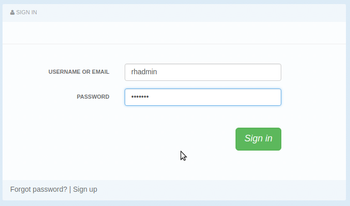
+

* Observe that the *ADMIN* link appears on the top menu.

. Click *ADMIN* and observe that the Administration Portal page appears:
+
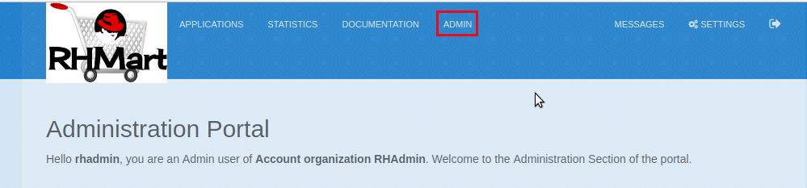

. Click the image:images/logout_ico.png[] (Log Out) icon to log out of the portal:
+
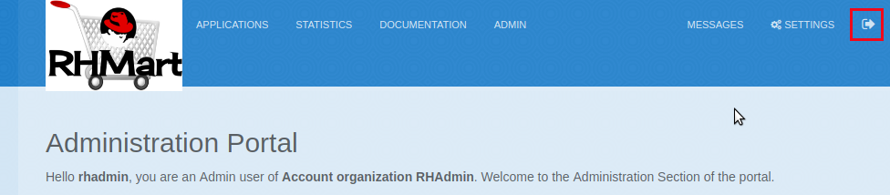

. Log in as user `rhbankdev` with the password provided during signup.
* Observe that because this user is a basic user, the *ADMIN* link is not available:
+
image::images/3scale_amp_products_dev_portal_groups_16.png[]

* If the `rhbankdev` user tries to access the `/rhadmin/welcome` link directly, an error message results:
+
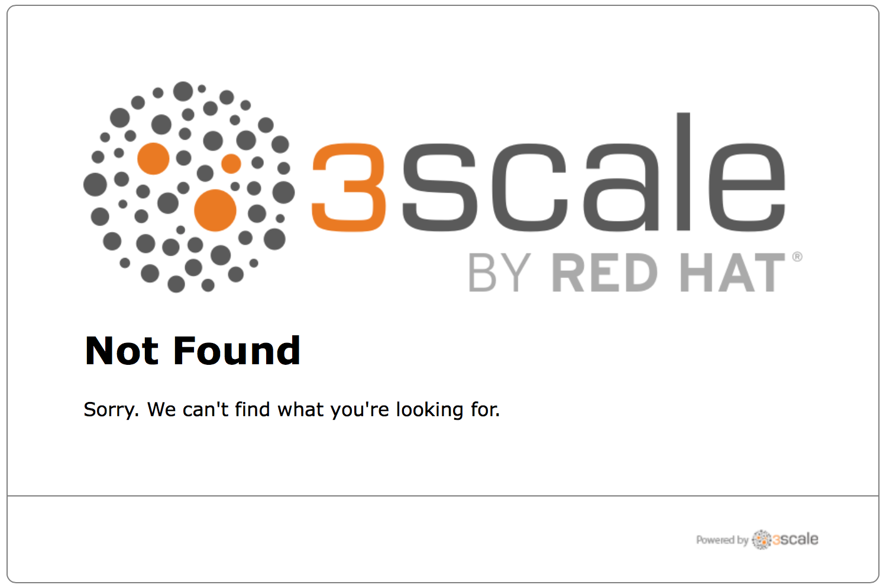

Groups and private sections can be used to control access to certain sections of the Developer Portal, or to ensure that different sections or layouts could be accessed depending on the user's role.
