:scrollbar:
:data-uri:
:toc2:
:linkattrs:

== Custom Development Portal Lab

In this lab you create API documentation for the APIs managed by Red Hat 3scale API Management, learn about the Developer Portal and customization, and create a client application to consume the APIs exposed.

.Goals
* Create API documentation for the Products API application
* Integrate the API documentation with 3scale API Management
* Create a custom development portal
* Create a client application to call the Products API

:numbered:

== API Documentation

In this section, you generate and test ActiveDocs documentation for the API created in the previous module.

ActiveDocs is not a Swagger replacement; it is an instantiation of it. With ActiveDocs, you do not have to run your own Swagger server or deal with the UI components of the interactive documentation. The interactive documentation is served and rendered from your 3scale Developer Portal. For more information, see link:https://support.3scale.net/docs/api-documentation/create-activedocs-spec["Create a (Swagger) Spec^"].

=== Customize Products API Swagger Docs

. In a new browser window, navigate to `http://editor.swagger.io/`.
. Select *File -> Import URL*.
. Enter the URL of your business API swagger specification:
+
`http://products-$OCP_PROJECT_PREFIX.$OCP_WILDCARD_DOMAIN/rest/swagger.yaml`
+
IMPORTANT: The values do not resolve in the browser, so you need to provide the full path, for example: `http://products-sjayanti-redhat-com.apps.na1.openshift.opentlc.com:80/rest/swagger.yaml`

. Click *OK*.
. In the YAML editor, make the following changes:
.. Line 6: Change the host to your `products-apicast-staging` route endpoint--for example:
+
`products-stage-apicast-sjayanti-redhat-com-3scale-amp.apps.na1.openshift.opentlc.com:443`
.. Line 11: Change the scheme to `https`.
.. Line 24: Add the following lines to add a user key:
+
[source,YAML]
-----
        - name: "user_key"
          in: "query"
          type: string
          x-data-threescale-name: "user_keys"
          required: true
-----
+
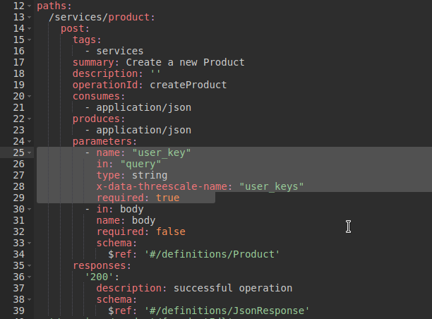
+
.. Line 50: Repeat step c (the change for line 24):
+
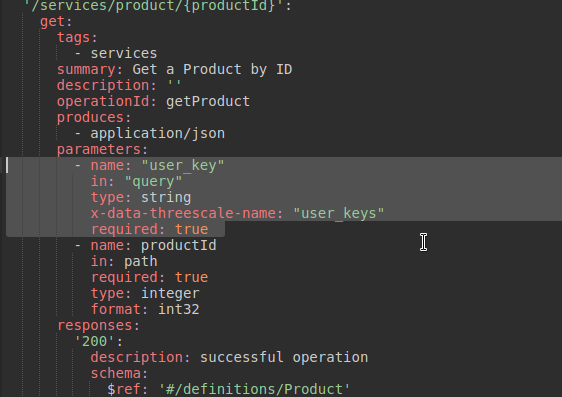

.. Line 74: Repeat step c.
.. Line 98: Delete the curly brackets.
.. Line 99: Repeat step c for adding a user key:
+
[source,YAML]
-----
        - name: "user_key"
          in: "query"
          type: string
          x-data-threescale-name: "user_keys"
          required: true
-----
+
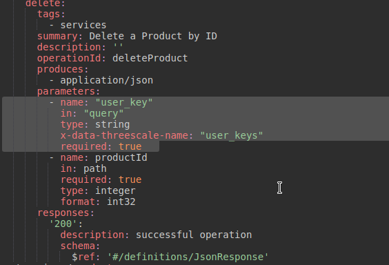

. Select *File -> Convert and save as JSON*:
+
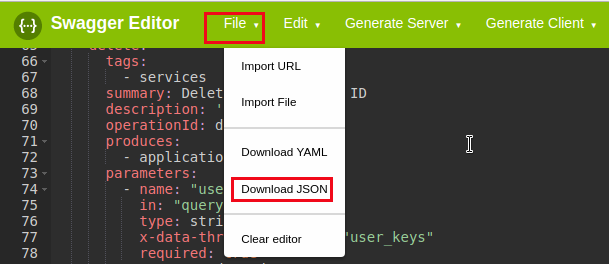

. Save the JSON file to your disk.
. Close the browser tab.

=== Create Documentation Using ActiveDocs

. Log in to your 3scale Admin Portal from the browser.
. Click the *APIs* tab.
. Click *ActiveDocs*:
+
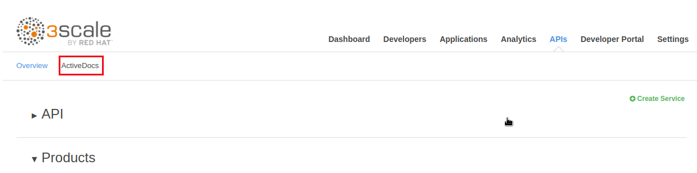

. Click *Create a new spec*:
+
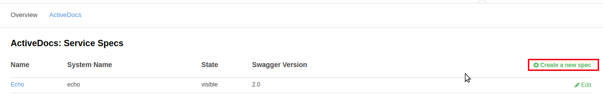

. Enter the following values:
* *Name*: `Products`
* *System Name*: `products_spec`
* *Publish?*: Checked
* *Description*: `Products API Documentation`
+
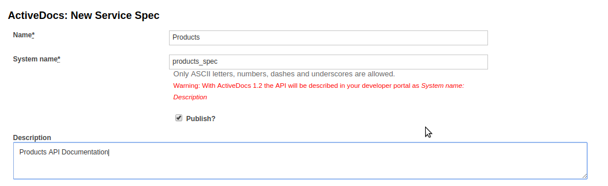

. In a text editor, open the `swagger.json` file created in the previous step.
. Copy the contents of `swagger.json` and paste it into the *API JSON Spec* window:
+
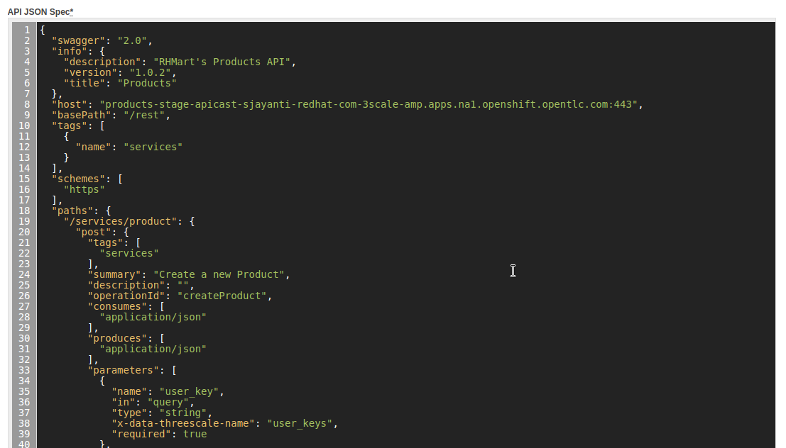

. Click *Create Service*.
+
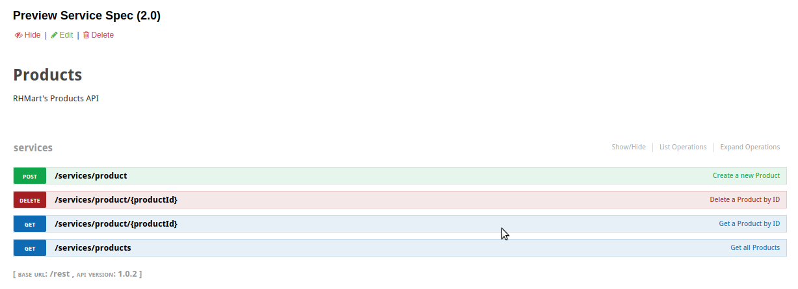

. If *Publish* appears at the top of the panel, click it.

=== Test the ActiveDocs API and Documentation

. Click *Get all Products* to expand the method.
. Go to the *Parameters* section.
. Click the *user_key* value field.
. Select the *ProductsApp* user key.
. Click *Try it out*:
+
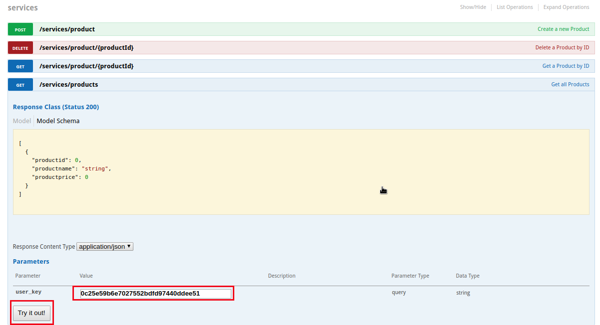
+
. If you get a *No response from server* error from the server, you need to accept the SSL certificate of the server by opening the request URL in a browser window and clicking *proceed to <URL>*:
+
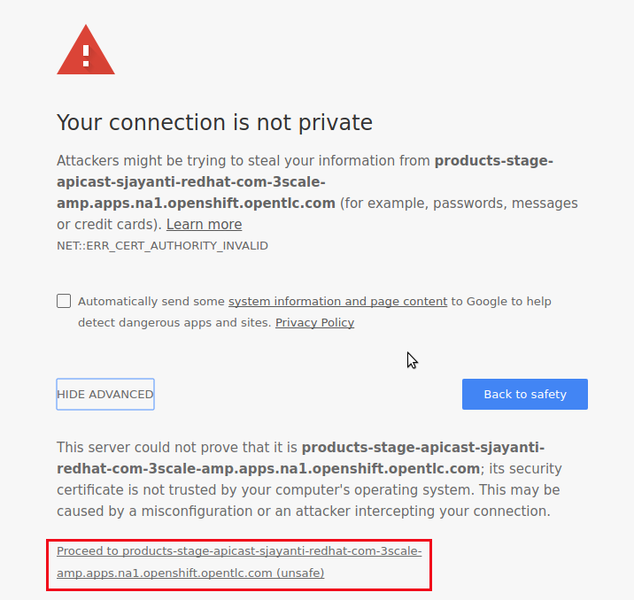

. Return to ActiveDocs and try the request again. Expect it to return an HTTP *200* response code and the response body:
+
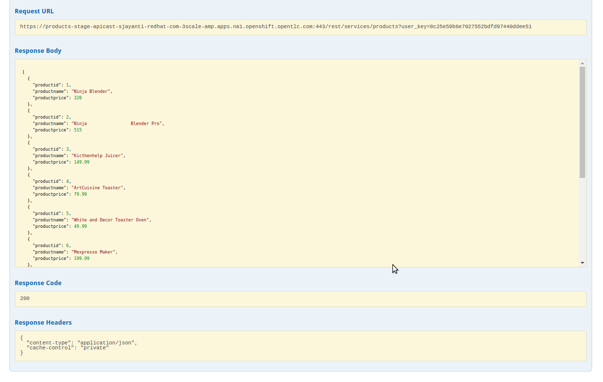

== Customize Developer Portal

In this lab you work on the Developer Portal for the API’s customers, partners, and users. The Developer Portal can be fully customized to meet your needs. See the link:https://support.3scale.net/docs/developer-portal/overview[Developer Portal Overview^] for more information.

=== Import Logo Files

. Open a web browser and navigate to link:https://github.com/gpe-mw-training/3scale_development_labs/tree/master/DevPortal["3scale_development_labs/DevPortal^"].
. Download these two files:
* `RHMartBackground.jpg`
* `RHMartLogo.png`
. Log in to 3scale by Red Hat's Admin Portal with your username and password.
. Click the *Developer Portal* tab, and then click *New Page -> New File*:
+
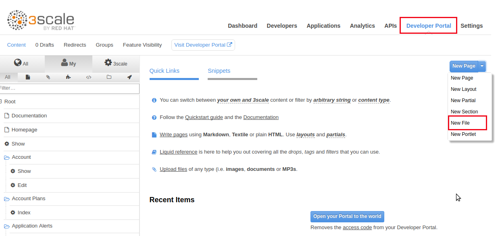

. Enter the following:
* *Section*: `images`
* *Path*: `/images/RHMartLogo.png`
* *Attachment*: `RHMartLogo.png` from your local host
+
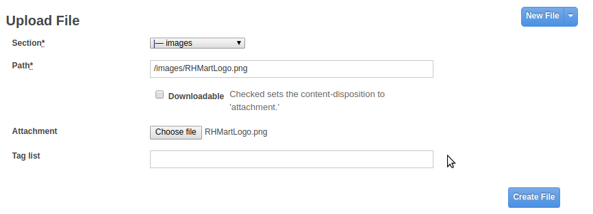

. Click *Create File*, and then click *New File*.
. Enter the following:
* *Section*: `images`
* *Path*:  `/images/RHMartBackground.png`
* *Attachment*: `RHMartBackground.png` from your local host
+
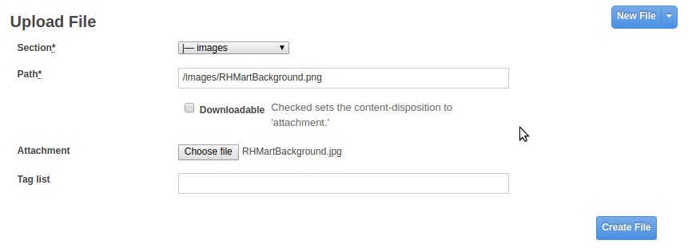

. Click *Create File*.

=== Change the HTML/CSS

. Click *All*.
. Click the 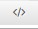 (Layouts) icon.
.. Click *Main layout*:
+
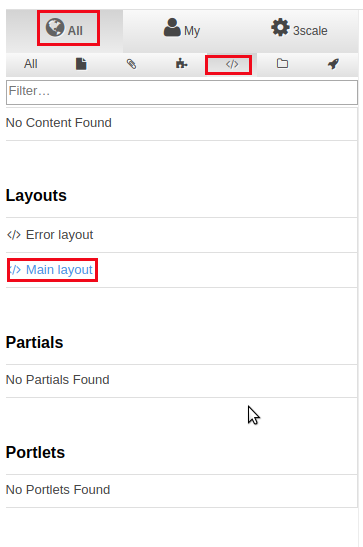
+
.. Delete line 46:
+
[source,text]
-----
            <a class="navbar-brand" href="/">{{  provider.name }}</a>
-----
+
.. Replace it with the following:
+
[source,text]
-----
            

               
            

-----
+
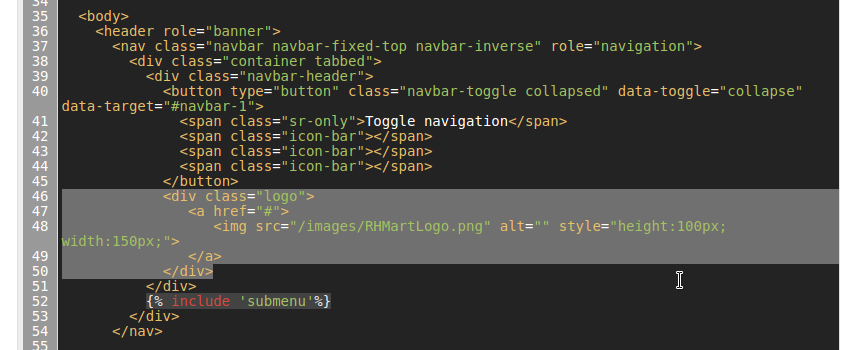

.. Scroll to the bottom of the page and click *Save*.

. Click the image:images/pages_ico.png[] (Pages) icon, and then click *Documentation*:
+
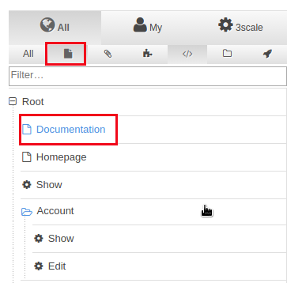

.. In line 3, replace `Echo` with `RHMart`.
.. Click *Save*:
+
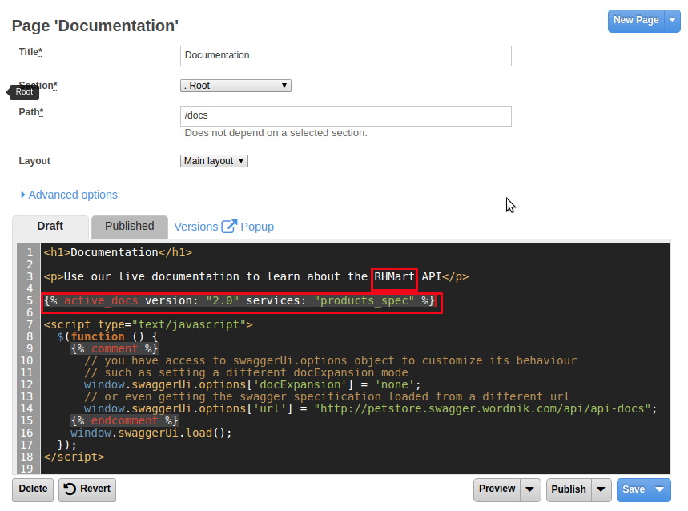
+
. Click on partial *shared/swagger_ui*:
+
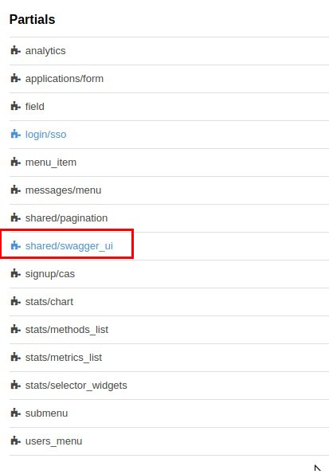
+
.. Change line 11 to following:
+
[source,text]
-----
    var url = "{{provider.api_specs.products_spec.url}}";
-----
+
.. Click *Save*.
+
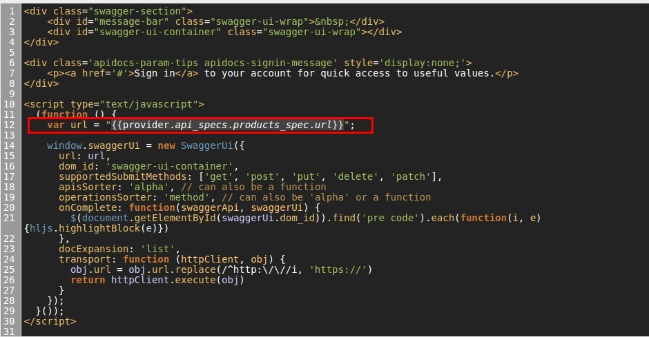
+
. Click *Homepage*:
+
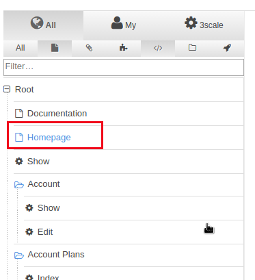

.. Go to the HTML editor, and perform a search and replace of `Echo` (with a capital _E_) to `RHMart` in lines 19, 98, and 112.
.. Replace line 5 with the following:
+
[source,text]
-----
            <h1 style="text-shadow: 4px 4px #000000;">RH Mart API</h1>
-----

.. Click *Save*.
. Under the *css* folder, click *default.css*:
+
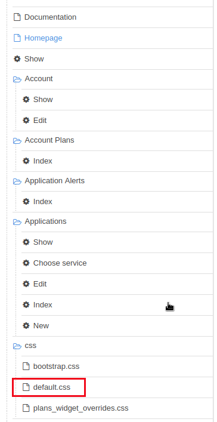

.. Replace line 22 with the following:
+
[source,text]
-----
            background-image: url('/images/RHMartBackground.jpg');
-----
+
.. Scroll down to the bottom of the page and click *Save*.
. Click the *0 Drafts* tab, and then click *Publish All*:
+
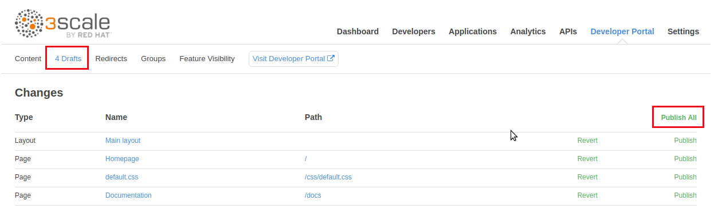

. When prompted to confirm the changes, click *OK*.

=== Test the Changes

. Click *Visit Developer Portal*:
+
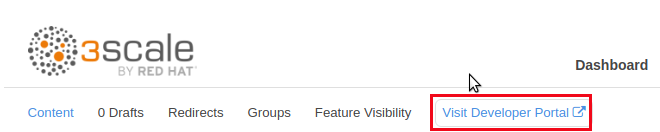
+
* The Developer Portal opens in a new tab on your browser:
+
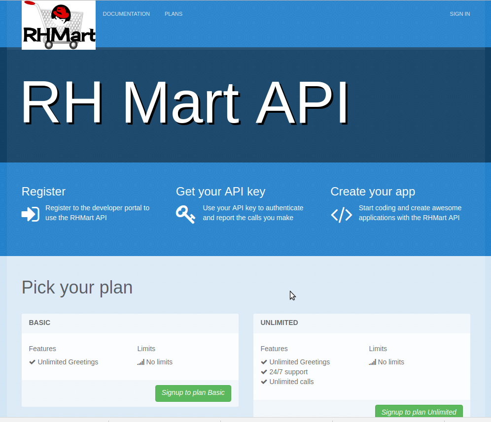

. Click *SIGN IN* at the top right, and log in as `rhbankdev` with the password provided in the previous lab.
. On the homepage, explore the *Applications*, *Statistics*, and *Credentials* sections.
+
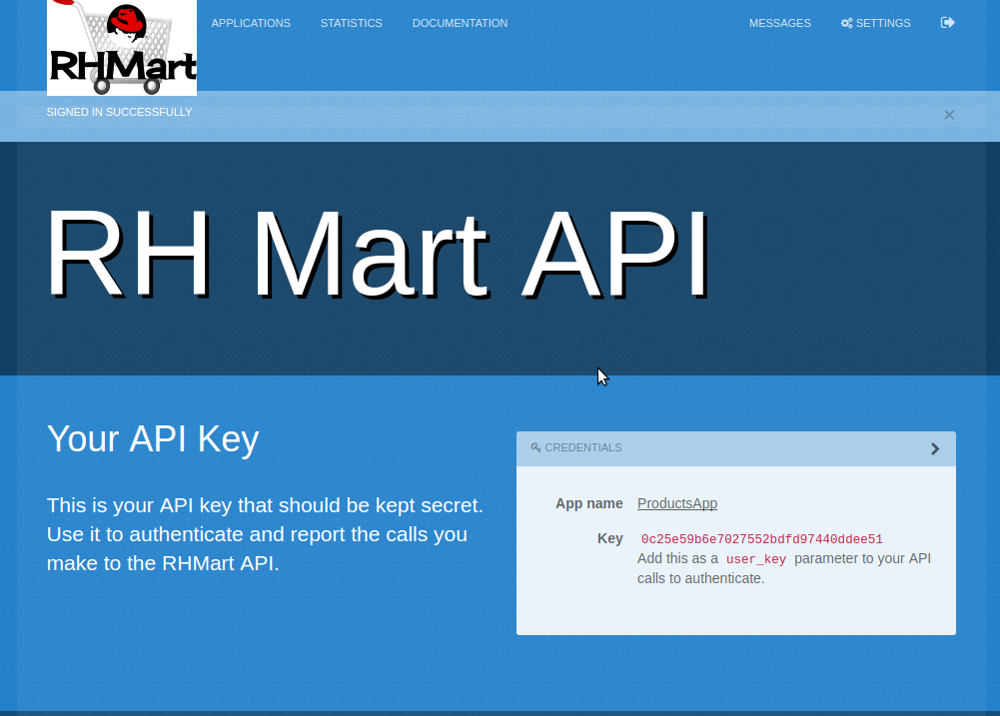

. Click *Documentation*. Note that the ActiveDocs documentation created earlier is shown.
* You can test the API requests from this page:
+
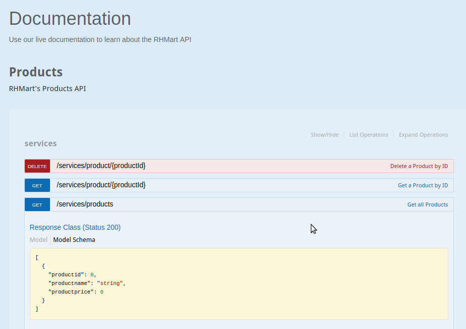

== Advanced Developer Portal Customizations

=== Different Groups for Developers and Admin

==== Create Admin Account Application Using `ProductsPremiumPlan`

In the first module, you set up the `rhbankdev` user as part of the `RHBank` group. While creating the rate limits, you disabled the `Create Account` and `Delete Account` methods, so exepct a request for either of these methods to result in a *HTTP 403: Not Authorized* error.

Using the same steps:

. Create a new user `rhadmin` as part of the `RHAdmin` group
. Create an application using the `ProductsPremiumPlan` application plan
. Try the `Create Account` and `Delete Account` requests using the *user key* generated for this account.

.. Example request for `Create Account`:
+
[source,text]
-----
$ curl -k -X POST --header "Content-Type: application/json" --header "Accept: application/json" -d "{
  \"productid\": null,
  \"productname\": \"Samsung LED TV\",
  \"productprice\": 499.95}" "https://products-stage-apicast-sjayanti-redhat-com-3scale-amp.apps.na1.openshift.opentlc.com:443/rest/services/product?user_key=6e1bec836da1b3705da23635823f4f2d"

-----
+
The response should be the following:
+
[source,text]
-----
{"message":"Product created"}
-----

.. Example request for `Delete Account`:
+
[source,text]
-----
$ curl -k -X DELETE --header "Accept: application/json" "https://products-stage-apicast-sjayanti-redhat-com-3scale-amp.apps.na1.openshift.opentlc.com:443/rest/services/product/13?user_key=6e1bec836da1b3705da23635823f4f2d"

-----
+
The response should be the following:
+
[source,text]
-----
{"message":"Product 13 deleted"}
-----

==== Create Admin Section and Groups

In this section you create a private section of the portal for access by admin users, create a group, and associate the group with `ProductsPremiumApp`.

. Log in to 3scale by Red Hat's Admin Portal using your credentials.
. Click the *Developer Portal* tab, and then click *New Section*:
+
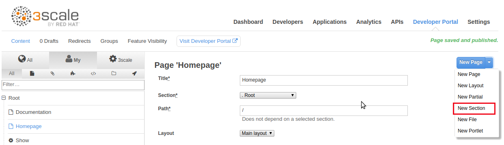

.. In the *New Section* form, provide the following information:
* *Title*: `admin`
* *Parent*: `Root`
* *Partial Path*: `/rhadmin`
+
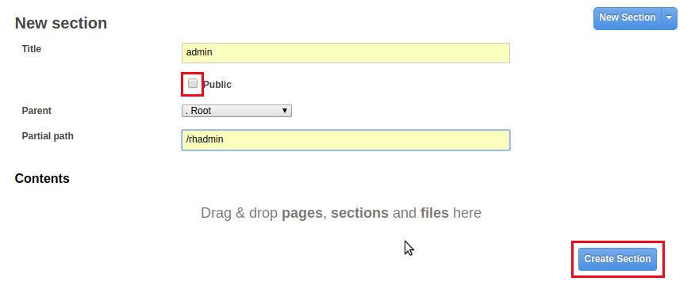

.. Verify that *public* is unchecked, and click *Create Section*.
* Your new section appears in the main menu:
+
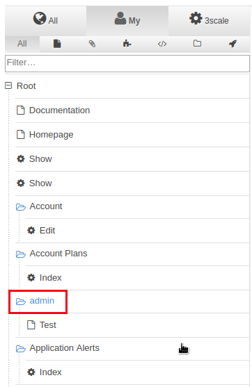

. Select *New Page -> New Page*:
+
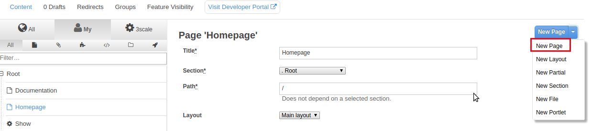

.. In the *New Page* form, enter the following values:
* *Title*: `Admin Page`
* *Section*: `admin`
* *Path*: `/rhadmin/welcome`
* *Liquid enabled*: Checked
* *Text box*: Enter the following:
+
[source,text]
-----
<h2>Administration Portal</h2>

Hello <B>{{ current_user.username }}</B>, you are an Admin user of  <B>Account organization  {{ current_account.name }}</B>.

Welcome to the Administration Section of the portal.
-----
+
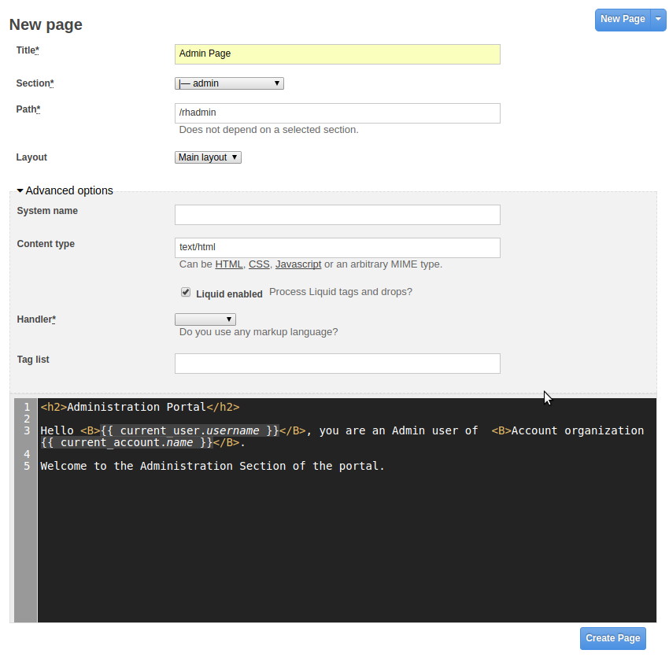

.. Click *Create Page*.
* You see the *Admin* page in the *admin* section on the menu:
+
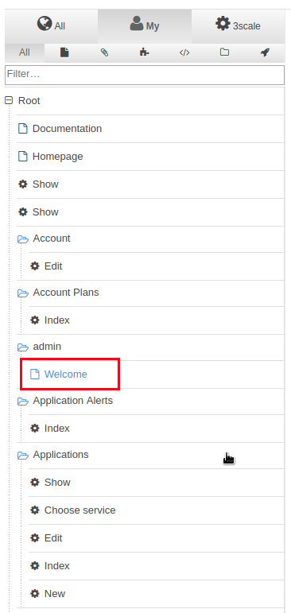

. Scroll down to the *Partials* section of the menu, and click *submenu*:
+
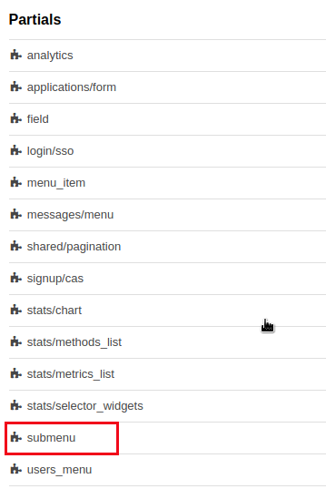

.. Add the following on line 38, after the `Documentation` item.
+
[source,text]
-----
        
          <li class="active">
            <a href="/rhadmin/welcome">Admin</a>
          </li>
        
-----
+
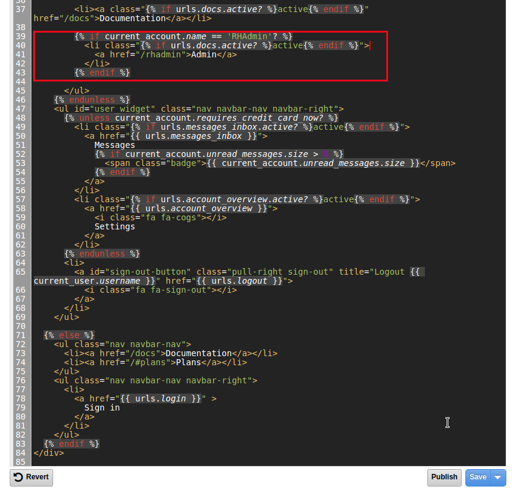

.. Click *Save*.
. Click the *Drafts* tab on the top, and then click *Publish All*:
+
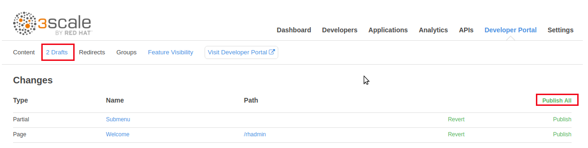
+
* All your changes are published and can be tested from the Developer Portal.

. Click *Groups*, and then click *Create Group*:
+
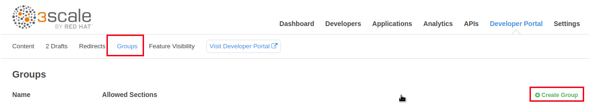

.. Enter the following values:
* *Name*: `RHAdmin`
* *Allowed Sections*: `admin`
.. Click *Create Group*.
. Navigate to the *Developers* section, and click the *RHAdmin* account.
+
TIP: This is the account you created in the previous lab to use the *ProductsPremiumPlan*.

.. Click *O Group Memberships*:
+
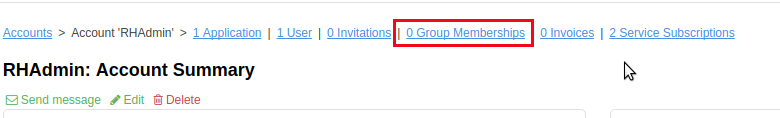

.. Select the *RHAdmin* group in the *Groups* list, and click *Save*:
+
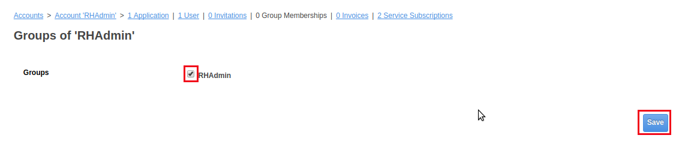

* The configuration for the Admin section and groups is complete and can be tested.

==== Test the Admin Group Section

. Open the Developer Portal and click *Sign In*.
. Log in as user `rhadmin` with the password you provided earlier:
+
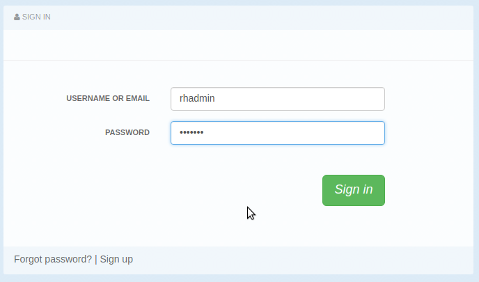
+

* Observe that the *ADMIN* link appears on the top menu.

. Click *ADMIN* and observe that the Administration Portal page appears:
+
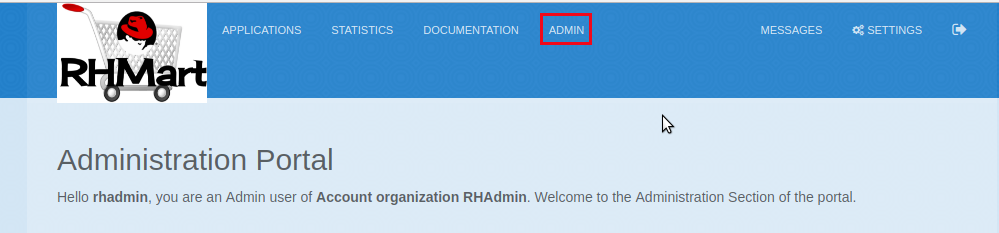

. Click the image:images/logout_ico.png[] (Log Out) icon to log out of the portal:
+
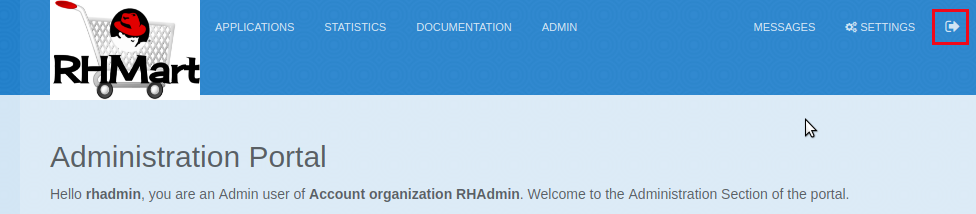

. Log in as user `rhbankdev` with the password provided during signup.
* Observe that because this user is a basic user, the *ADMIN* link is not available:
+
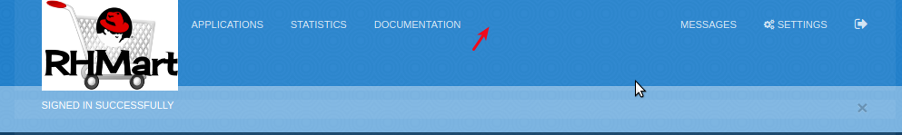

* If the `rhbankdev` user tries to access the `/rhadmin/welcome` link directly, an error message results:
+
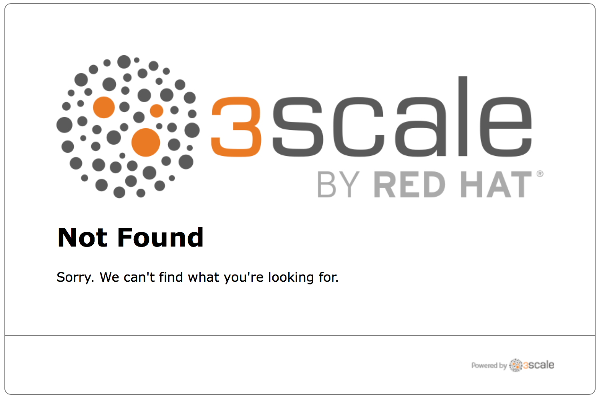

Groups and private sections can be used to control access to certain sections of the Developer Portal, or to ensure that different sections or layouts could be accessed depending on the user's role.

.References

* link:https://support.3scale.net/docs/developer-portal/overview[Developer Portal Overview^]
* link:https://support.3scale.net/docs/developer-portal/liquid-reference[Liquid Reference^]
