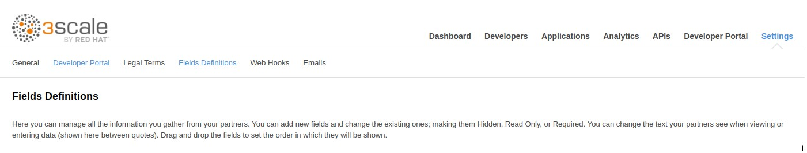
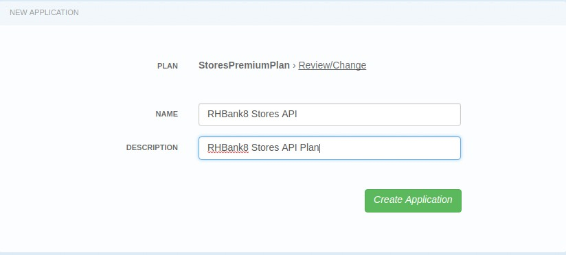

:scrollbar:
:data-uri:
:toc2:
:linkattrs:

== Custom Signup Flows Lab

In this lab you create custom signup flows for managing Developer signups for APIs managed through 3scale. A few scenarios covered are single application,  multiple application signups, group membership flows. 

.Goals
* Create API documentation for the Products API application
* Integrate the API documentation with 3scale API Management
* Create a custom development portal
* Create a client application to call the Products API

:numbered:

== Introduction

Please read this excellent article from Kevin Price on 3scale signup and signup flows.

https://developers.redhat.com/blog/2017/12/18/3scale-developer-portal-signup-flows/

In this lab, we will be following the 4 examples discussed in the blog and adapt it to the services and APIs managed here.

== Single Application Signup flow

This is the simplest signup flow that only allows a subscription to a single Service and Application Plan upon account creation. You do not need to enable any special features in the 3scale Developer portal to use this flow. 

The signup flow is provided in the partial *~/lab/3scale_development_labs/DevPortal/_single_app_signup_form.html.liquid*.

. Open the file *~/lab/3scale_development_labs/DevPortal/_single_app_signup_form.html.liquid* and examine the code for the signup:
.. Service/Application filter
+
[source, text]
----
             
      		<h2> {{ service.name }} </h2>
      		

            
----
+
NOTE: The above liquid filter allows to iterate through the list of all services for the provider, and further iterate through all the application plans. Thus, this filter allows you to display a list of all services along with the service plans.
+
.. Plan Features/Limits
+
[source, text]
----
            

                <article class="panel panel-default">
                    

                        <strong>{{ plan.name }}</strong>
                    

                    

                        

                            
                            

                                <h5>Features</h5>
                                <ul class="features list-unstyled">
                                    
                                    <li>
                                        <i class="fa fa-check"></i> {{ feature.name }}
                                    </li>
                                    
                                </ul>
                            

                            
                            

                                <h5>Limits</h5>
                                <ul class="limits list-unstyled">
                                     
                                    <li>
                                        <i class="fa fa-signal"></i> {{ limit.metric.name }} &ndash; {{ limit.value }} {{ limit.metric.unit }}s per {{ limit.period }}
                                    </li>
                                     
                                    <li>
                                        <i class="fa fa-signal"></i> No limits
                                    </li>
                                    
                                </ul>
                            

                        

                    

----
+
NOTE: The above code allows display of the plan name and features/limits setup for the plan.
+
.. Signup link
+
[source, text]
----
                   <a class="btn btn-cta-secondary pull-right" href="{{ urls.signup }}?{{ plan | to_param }}&{{ service.service_plans.first | to_param }}">Signup to plan {{ plan.name }}</a>
                          		
----
+
NOTE: This section shows the link to redirect to the signup form for the chosen plan and service.
+
. Add this partial to the developer portal.
.. click on *New Partial*
.. Provide System name* as *single_app_signup_form*
.. Copy the contents of the file *~/lab/3scale_development_labs/DevPortal/_single_app_signup_form.html.liquid* into the text field.
.. Click on *Create Partial*.
.. Confirm that the partial shows up in the menu list of partials.
+
image::images/3scale_amp_custom_signup_single_plan.png[]

. Edit the *Homepage*:
.. Delete the lines 119 - 230.
.. Add the following line to the bottom of the file:
+
[source, text]
....
  <section class="plan">
    
  </section>

....
+
NOTE: The include ensures the content of the partial is included to be displayed in the Homepage.
+
.. Save the file.
. Publish both the changes.
+

+
. Now click on *Visit Developer Portal* and ensure the Homepage now displays the Products service as well.
+

+
. Now sign up using the form by clicking on the *Signup for ProductsBasicPlan*.
. Fill up the form with a new user details and a valid email address.
+
image::images/3scale_amp_custom_signup_single_plan_4.png[]
+
. Once signup is successful, you will get a Success page.
+
image::images/3scale_amp_custom_signup_single_plan_5.png[]
+
. Look for the email to the email address provided.
+
image::images/3scale_amp_custom_signup_single_plan_6.png[]
+
. Click on the *activate your account* link and sign in with the username/password used to create the account. 
. Finally, in the admin portal click on the *Developers* tab, check that the Account & user are created.
+

== Multiple Application Signup Flow

The multiple application signup flow allows users to signup for multiple services (and the associated application plans) directly using a single signup form. To use this flow, the *Multiple Applications* feature needs to be enabled in the Developer Portal. 

. Login to the admin portal using your credentials and navigate to *Developer Portal*.
. Click on *Feature Visibility*.
. Ensure that the *Multiple Applications* feature is *_visible_*.
+

The signup flow is provided in the partial *~/lab/3scale_development_labs/DevPortal/_multiple_app_signup_form.html.liquid*.

. Open the file *~/lab/3scale_development_labs/DevPortal/_multiple_app_signup_form.html.liquid* and examine the code for the signup:
. You will notice that the form is quite similar to the *_single_app_signup_form.html.liquid*. The chief points to note are:
.. The signup form:
+
[source, text]
----
<form action="{{ urls.signup }}" method="get">
----
+
.. checkbox input:
+
[source, text]
----
<input type="checkbox" name="plan_ids[]" value="{{ plan.id }}">Signup to {{ plan.name }}</input>
<input type="hidden" name="plan_ids[]" value="{{ service.service_plans.first.id }}"></input>

----
+
.. A submit button to direct to the Signup form.
+
[source, text]
----
    <button type="submit" class="btn btn-cta-primary">Signup</a>
----
+
. Upload the partial to the Developer Portal.
.. System name* : *multi_app_signup_form*
.. Copy the contents of the file *~/lab/3scale_development_labs/DevPortal/_multiple_app_signup_form.html.liquid* and click on *Create Partial*.
. Ensure the partial shows up in the menu.
+

+
. Edit the *Homepage* and change the include section to use the *multi_app_signup_form* instead of *single_app_signup_form*.
. Now save and *Publish* the changes.
. Click on *Visit Developer Portal* and notice the home page now has the multiple signup form, with a checkbox for each application plan.
+

+
. Try to signup for 2 different applications (e.g API Unlimited and ProductsBasicPlan).
. In the signup form, provide the right email address and user details.
+
image::images/3scale_amp_custom_signup_multi_plan_4.png[]
+
. Now click on the link in the confirmation email and login.
. Login as the new user and notice the Application and Keys created for the chosen applications.
. Finally, in the admin portal click on the *Developers* tab, check that the Account & user are created.
+

+
NOTE: Note that if there are any services with default application plans, then a default application is created for the account created using the signup form. In order to prevent this, do NOT mark any application plan as default in the service specification.

== Custom Field Flow

This flow is used to control the services a user can see and subscribe. A typical usecase is if there are multiple application plans each with different access (e.g a different plan for internal developers and another for external developers). This field can be combined with signup flows including using *Account Approval* so that an admin can view and approve the user to a particular service.

NOTE: Please attempt this lab after completing the labs in Module 4.

In the below use case, we will take the scenario of using the Stores API. We have 2 different APIs, a StoresSOAP API that uses Lua script for accessing the SOAP endpoint. We can make this *internal* and only available to developers who are signed up as internal users. The other Stores API using Fuse endpoint could be used by *public* users. This could be our way to ensure proper integration using the right endpoints for different types of users. Signup to these APIs will be available only after the users are registered and sign in to the Developer Portal. We will also restrict *public* users to have an Account Approval required, so that before they could access the Stores API, an admin user will approve their request.

The below steps are required to accomplish this scenario.

=== Set up custom field

. Open the Admin Portal and navigate to the *Settings* tab.
. *Click on *Field Definitions*.
+

+
. Click on the *Create* link in the Account field.
. Enter the following values:
.. *Name*: access
.. *Label*: access
.. Do not check any of the *Required*, *Hidden* or *Read Only*.
.. *Choices*: internal, public
+

+
. Check that the field is successfully added to the Account object.
+

+
NOTE: Note that the field could be made a *Required* field so that any user signup will contain this field. Another usecase is to make it a *Hidden* field, and have a simple javascript provide this value (e.g depending on user's email address). This field can also be a Read Only field which cannot be changed by the developers, only by the admin.

=== Changes to Application Plans

. Navigate to the *API* tab in the admin portal.
. Click on the *StoresSOAPBasicPlan* Application Plan of the *StoresSOAP* API.
. Click on *Settings* link for the StoresSOAP API, and select *default* plan, and check the link for *Developers can select a plan when creating a new application*.
+

+
. Click on *Update Service*.
. Create a new *Feature* with following values:
.. *Name* : internal
.. *System name* : internal
.. *Description* : This Plan is intended for internal users.
. Click on *Save*
+

+
. Click on the *x* under *Enabled?* to enable the feature.
. Now select the *StoresPremiumPlan* of the *Stores* API.
. Select the checkbox for *Application require approval?*
. Click on *Update Application plan*.
+

+
. Navigate to *Application Plans* and click on *New feature* link.
. Enter the following values:
.. *Name* : public
.. *System name* : public
.. *Description* : This Plan is intended for public users.
. Click on *Save*
. Click on the *x* under *Enabled?* to enable the feature.
+

+
. Click on *Settings* link for the Stores API, and select *default* plan, and check the link for *Developers can select a plan when creating a new application*.
=== Developer Portal changes

. Add the partial *custom_field_signup_flow* with the contents of the file *~/lab/3scale_development_labs/DevPortal/_custom_field_plans.html.liquid*
. In the *Homepage*, add the following after line 87 (before the ** line.
+
[source, text]
----

----
. Save and publish all the changes.

=== Test the Custom Field flow for *Public* access

. Now click on *Visit Developer Portal*.
. Do not select any of the plans, scroll to the bottom of the page and click on *sign up* button.
. Provide a new user details (with a valid email address).
. Select *ACCESS* to be *public*.
. Click on *Sign up*.
+
image::images/3scale_amp_custom_signup_field_plan_7.png[]
+
. Navigate to the *Developers* tabs and note the new account is created.
+
image::images/3scale_amp_custom_signup_field_plan_8.png[]
+
NOTE: Note that even if no application is selected during signup, the *default* plans for each service are created for each account. 
+
. Now activate the user by clicking on the activation link in the email.
. Login as the new user created to the Developer Portal.
. Note the Homepage after sign-in shows the *public* plan for the user to subscribe.
+

+
. Click on *Signup to plan StoresPremiumPlan* link.
. Provide the details:
.. *Name* : RHBank8 Stores API
.. *Description* : RHBank8 Stores API Plan
+

+
. Click on *Create Application*. 
. Note the success page shows the application *Pending Approval*.
+

+
. Now in the Admin Portal, navigate to the *Developers*, select the Account and click on the Application created for Stores API.
. Notice the Application State. 
. Click on *Accept* to accept the application.
+

=== Test the Custom field flow for *Internal* access

Now repeat the steps from the above section to create a user with *internal* access, and ensure that you can subscribe the user to the *StoresSOAPBasicPlan*.

== Group Membership Flow

.References
* https://developers.redhat.com/blog/2017/12/18/3scale-developer-portal-signup-flows/
