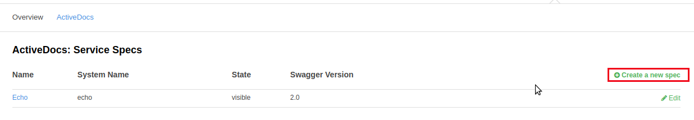
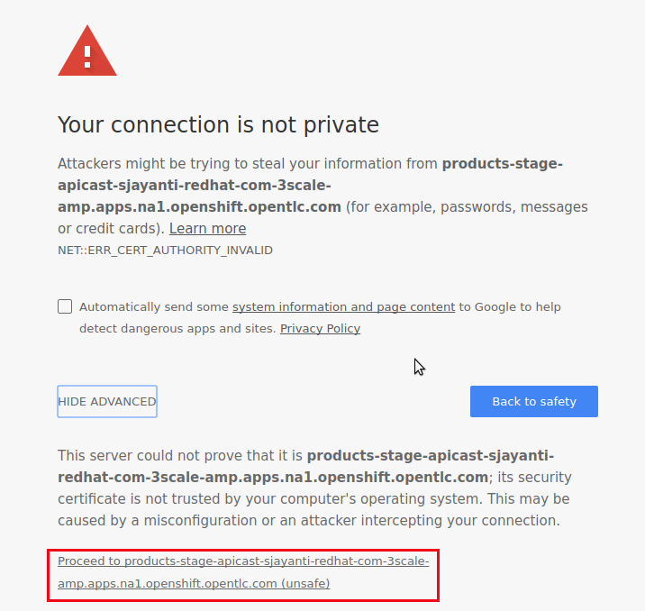
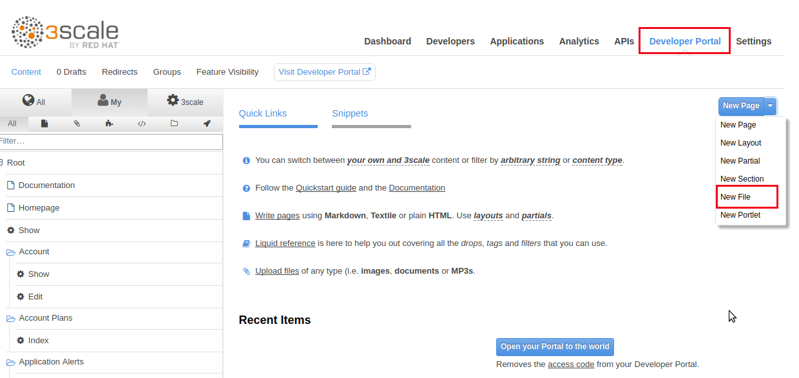
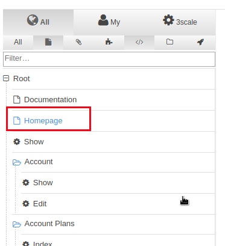
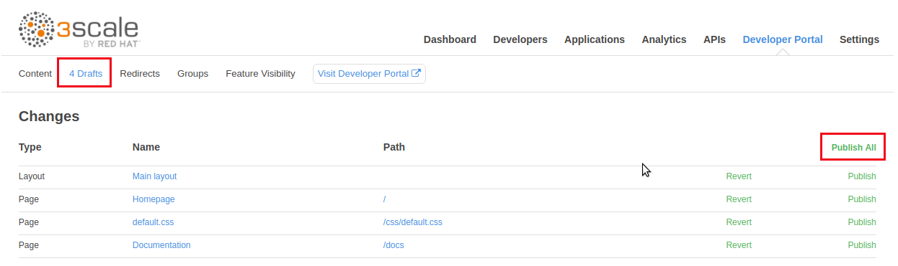
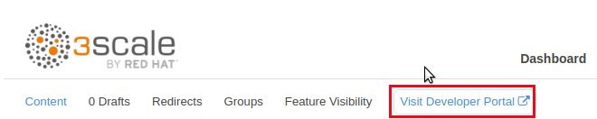
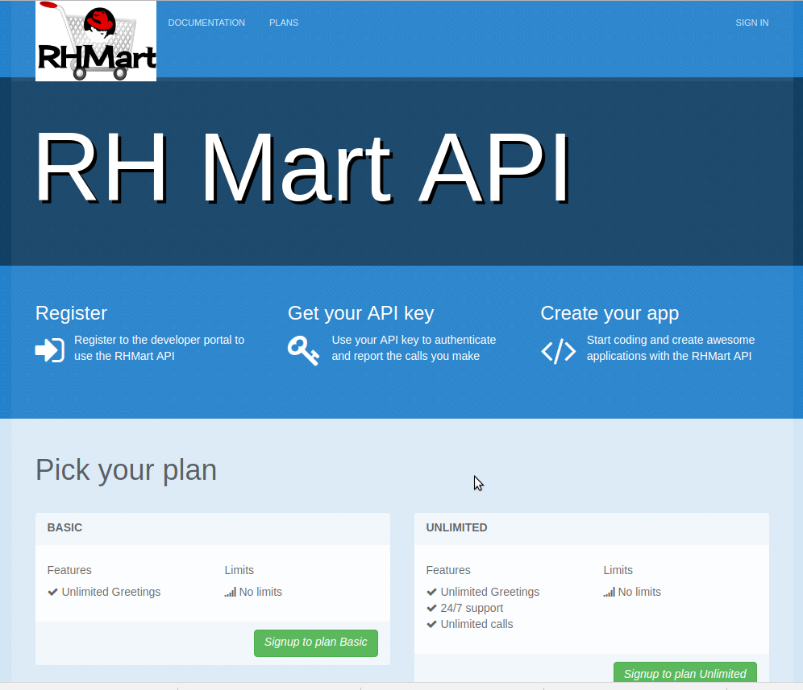
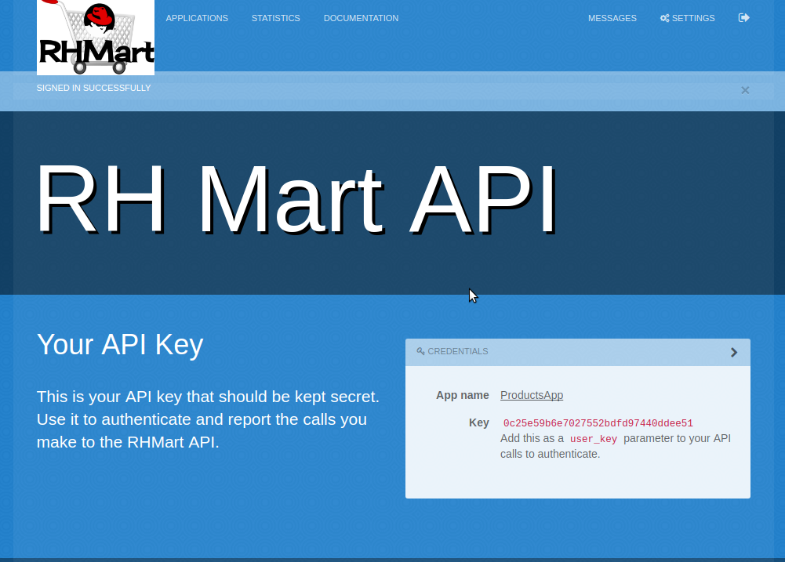
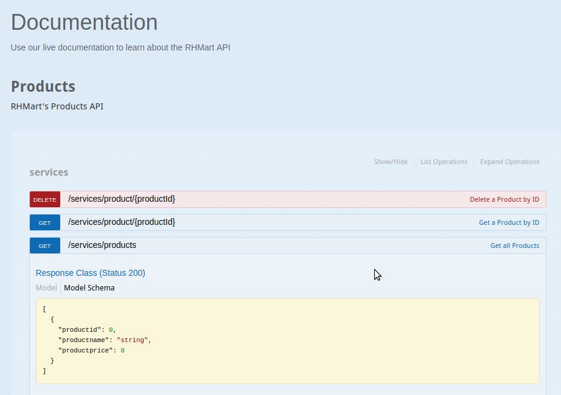

:scrollbar:
:data-uri:
:toc2:
:numbered:

= Custom Development Portal

In this lab, you will create APIdocs for the APIs managed by 3scale, learn about the developer portal and customization, and create a client application to consume the APIs exposed by 3scale.
 
.Goals
. Create API docs for the Products API application.
. Integrate the API docs with 3scale.
. Create a custom development portal
. Create a client application to call the Products API.

== API Documentation

In this lab, you will generate and test an ActiveDocs documentation for the API created in the previous module.

ActiveDocs is  not a Swagger replacement but an instantiation of it. With ActiveDocs, you don’t have to run your own Swagger server or deal with the UI components of the interactive documentation. The interactive documentation is served and rendered from your 3scale Developer Portal. For more information visit this link: https://support.3scale.net/docs/api-documentation/create-activedocs-spec

=== Create Swagger API Documentation

. In a new browser window, navigate to `http://editor.swagger.io/`
. Select *File -> Import URL*.
. Enter the URL of your business API swagger spec: *http://products-$OCP_PROJECT_PREFIX.$OCP_WILDCARD_DOMAIN/rest/swagger.yaml* 
+
IMPORTANT: Please note that the values will not be resolved on the browser, so you need to provide the full path, e.g http://products-sjayanti-redhat-com.apps.na1.openshift.opentlc.com:80/rest/swagger.yaml
+
. Click OK.
. In the YAML editor,make the following changes:
.. Line 6:  Change host to your products-apicast-staging route endpoint e.g *products-stage-apicast-sjayanti-redhat-com-3scale-amp.apps.na1.openshift.opentlc.com:443*
.. Line 11: Change scheme to *https*
.. Line 24: Add the following lines:
+
[source,YAML]
-----
        - name: "user_key"
          in: "query"
          type: string
          x-data-threescale-name: "user_keys"
          required: true      
-----
+
image::images/3scale_amp_products_swagger1.png[]
+
.. Line 50: repeat above step.
+
image::images/3scale_amp_products_swagger2.png[]
+
.. Line 74: repeat the above step.
.. Line 98: delete the curly brackets.
.. Line 99: repeat the step for adding user_key
+
[source,YAML]
-----
        - name: "user_key"
          in: "query"
          type: string
          x-data-threescale-name: "user_keys"
          required: true      
-----
+
image::images/3scale_amp_products_swagger3.png[]
+
. Click on `File -> Download JSON`.
+
image::images/3scale_amp_products_swagger4.png[]
+
. Save the JSON file to your disk.
. Close the browser tab.

=== Create ActiveDocs

. Login to your 3scale AMP management portal from the browser.
. Click on the `APIs` tab.
. Click on `ActiveDocs` link. 
+
image::images/3scale_amp_products_activedocs1.png[]
+
. Click on the `Create a new spec`.
+

+
. Enter the following values:
.. *Name*: Products
.. *System Name*: products_spec
.. *Publish?*: checked
.. *Description*: Products API Documentation
+
image::images/3scale_amp_products_activedocs3.png[]
+
. Open the *swagger.json* created in the previous step in a text editor.
. Paste the contents of *swagger.json* to the `API JSON Spec` window:
+
image::images/3scale_amp_products_activedocs4.png[]
+
. Click on `Create Service`.
+
image::images/3scale_amp_products_activedocs5.png[]
+
. If the `Publish` link is showing in the top, click on the link.

=== Test the API ActiveDocs

. Click on the `Get all Products` link to expand the method.
. Go to the *Parameters* section.
. Click on the *user_key* value field.
. Select the *ProductsApp* user_key.
. Click on the `Try it out` button.
+
image::images/3scale_amp_products_activedocs6.png[]
+
. If you get a *No response from server* error from server, you need to accept the SSL certificate of the server.
.. Open the request  URL in a browser window and click on `proceed to URL` as shown below:
+

+
. Now go back to the ActiveDocs and try the request again. It should return a HTTP 200 response and the response body as below.
+
image::images/3scale_amp_products_activedocs8.png[]

== Developer Portal Customization

In this lab you will work on the Developer Portal for the API’s customers/partners/users. 
The Developer can be fully customized to meet your needs and branding, you can find more information here: https://support.3scale.net/docs/developer-portal/overview 

=== Import Logo Files:

. Open a web browser and navigate to URL: https://github.com/gpe-mw-training/3scale_development_labs/tree/master/DevPortal
. Download the below 2 files locally:
.. RHMartBackground.jpg
.. RHMartLogo.png
. Now login to the 3scale AMP Portal with your userid/password.
. Click on the `Developer Portal` tab.
. Click on the arrow next to the `New Page` button.
. Click on `New File`.
+

+
. Enter the following:
.. *Section*: images
.. *Path*:  /images/RHMartLogo.png
.. *Attachment*: _Attach the file RHMartLogo.png from your localhost._
+
image::images/3scale_amp_products_dev_portal2.png[]
+
. Click on `Create File` button.
. Click on `New File`.
. Enter the following:
.. *Section*: images
.. *Path*:  /images/RHMartBackground.png
.. *Attachment*: _Attach the file RHMartBackground.png from your localhost._
+
image::images/3scale_amp_products_dev_portal3.png[]
+
. Click on `Create File` button.

=== Make Changes to the HTML/CSS

. Click on the *All* button.
. Click on the *Layouts* icon.
. Click on *Main Layout*.
+
image::images/3scale_amp_products_dev_portal4.png[]
+
. Go to line #46. delete this line:
+
[source,text]
-----
            <a class="navbar-brand" href="/">{{  provider.name }}</a>
-----
+
. Replace it with the following:
+
[source,text]
-----
            

               
            

-----
+
. Scroll down to the bottom of the page, and click on the *Save* button.
+
image::images/3scale_amp_products_dev_portal5.png[]
+
. Click on the Pages icon.
. Click on Documentation.
+
image::images/3scale_amp_products_dev_portal6.png[]
+
. Go to line #3 and replace “Echo” with “RHMart”.
Go to line #5. Replace the line with following:
+
[source,text]
-----
            
-----
+
. Click on *Save* button.
+
image::images/3scale_amp_products_dev_portal7.png[]
+
. Click on *Homepage*
+

+
. Go to the HTML editor, and perform a search and replace of “Echo” (with capital “E”) to “RHMart” in lines #19, #98 and #112.
. Go to line #5.
. Replace it with the following:
+
[source,text]
-----
            <h1 style="text-shadow: 4px 4px #000000;">RH Mart API</h1>
-----
+
. Click on *Save* button.
. Click on *default.css*, under the css folder.
+
image::images/3scale_amp_products_dev_portal9.png[]
+
. Go to line #22.
. Replace it with the following:
+
[source,text]
-----
            background-image: url('/images/RHMartBackground.jpg');
-----
+
. Scroll down to the bottom of the page.
. Click on the *Save* button.
. Click on the *0 Drafts* tab.
. Click on *Publish All*.
+

+
. In the pop-up window confirming the changes, click *OK* button.

=== Test the changes

. Click on the *Visit Developer Portal* button.
+

+
. The developer portal opens in a new tab on your browser.
+

+
. Click on *SIGN IN* on the top right.
. Login as `rhbankdev` and the password provided in the previous lab.
. Once logged in, you will be directed to the homepage.
+

+
. Explore the sections such as *Applications*, *Statistics* and *Credentials*.
. Click on *Documentation*. Notice that the ActiveDocs created earlier are shown here.
. You can choose to test the API requests from this page.
+

== Advanced Developer Portal Customisations

=== Different Groups for Developers & Admin	

==== Create Admin account application using `ProductsPremiumPlan` 

Recall that in Module 1, you set up the `rhbankdev` user as part of the `RHBank` group. While creating the rate limits, we have disabled the methods `Create Account` and `Delete Account`, so a request for either of these methods should result in a *HTTP 403: Not Authorized* error.

Now, follow the same steps and create a new user `rhbankadmin`, as part of the `RHAdmin` group, create an Application using `ProductsPremiumPlan` Application Plan, and then try the `Create Account` and `Delete Account` requests using the *user_key* generated for this account.

Example request for `Create Account`:

[source,text]
-----
$ curl -k -X POST --header "Content-Type: application/json" --header "Accept: application/json" -d "{                     
  \"productid\": null,
  \"productname\": \"Samsung LED TV\",
  \"productprice\": 499.95}" "https://products-stage-apicast-sjayanti-redhat-com-3scale-amp.apps.na1.openshift.opentlc.com:443/rest/services/product?user_key=6e1bec836da1b3705da23635823f4f2d"

-----

The response should be as below:

[source,text]
-----
{"message":"Product created"}
-----

Example request for `Delete Account`

[source,text]
-----
$ curl -k -X DELETE --header "Accept: application/json" "https://products-stage-apicast-sjayanti-redhat-com-3scale-amp.apps.na1.openshift.opentlc.com:443/rest/services/product/13?user_key=6e1bec836da1b3705da23635823f4f2d"

-----

The response should be as below:

[source,text]
-----
{"message":"Product 13 deleted"}
-----

==== Create Groups

TBD

 
[blue]#Congratulations!#.

ifdef::showscript[]
endif::showscript[]
