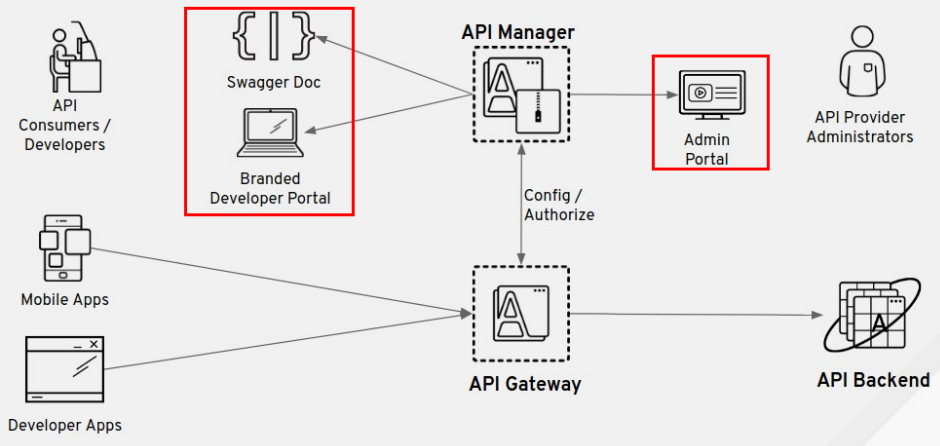

:scrollbar:
:data-uri:
:noaudio:

== 3scale Admin and Developer Portals

* Two portals are hosted in Red Hat 3scale API Management:
** *Admin Portal* for administration and API and account management
** *Branded Developer Portal* for exposing developer sign-ups and API documentation

ifdef::showscript[]

Transcript:

As shown in the diagram, Red Hat 3scale API Management provides the ability to expose two web portals:

* An Admin Portal for the API provider administrators to manage the APIs, accounts, services, applications, and documentation.

* A Developer Portal for API consumers and developers.

The Developer Portal is typically customized for each API provider to provide a branded customer experience for API access, sign-ups, and reference material for the APIs, Swagger documentation, and developer workflows.

The portals are hosted and deployed separately and do not interfere with the access to the API back end by the API consumers, which happens through the API gateway.

endif::showscript[]
