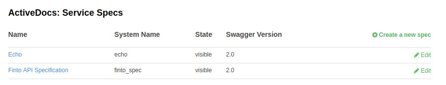

:scrollbar:
:data-uri:
:noaudio:

== API Documentations

* API JSON Spec: Based on Swagger 2.0
* Service Spec in 3scale:
** Name
** System Name
** Publish (Visible or Hidden)
** Description
** API JSON Spec

ifdef::showscript[]

=== Transcript

3scale offers a framework to create interactive documentation for your API.

With Swagger 2.0 (based on the Swagger Spec) you will have functional, attractive documentation for your API, which will help your developers to explore, to test and integrate with your API.
 
When you add a new service spec, you will have to provide:

* Name
* System name (required to reference the Servcie Spec from the Developer Portal)
* Whether you want the spec to be published or hidden
* A description that is only meant for your own consumption
* API JSON spec.

The API JSON spec is the "secret ingredient" of ActiveDocs.

You must generate the specification of your API according to the spec proposed by Swagger. 3scale does not help generate API specs, but assumes you have a valid Swagger 2.0-compliant specification of your API.

endif::showscript[]
