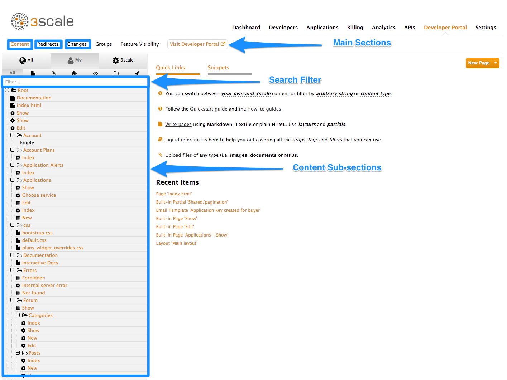

:scrollbar:
:data-uri:
:noaudio:

== 3scale Developer Portal CMS

.CMS Overview

* Main Section:
** Content - Site structure, hierarchy, pages and assets
** Redirects - Set up page redirects
** Changes - For draft and publish
* Content subsections
** Content
** Layouts and Partials
** Portlets
*** External RSS feed
*** Table of contents
*** Latest forum posts

ifdef::showscript[]

=== Transcript

This section introduces the Developer Portal CMS, including its structure, use, and functionality. You can customize the look and feel of the entire Developer Portal to match your own branding.

The CMS consists of a few elements:

* Horizontal menu in the Admin Portal with access to content, redirects, and changes
* The main area containing details of the sections above
* CMS mode, accessible through the preview option

The content section shows the site structure and hierarchy and provides editing functionality within the same page. This means you can manage the site structure, the pages, and other assets stored in it. The portal’s hierarchy is displayed in the form of a directory tree.

The layouts and partials sections manage the templates and the reusable parts of the page. Their functionality is similar to that of the content section. The layouts section consists of definitions of the templates used by pages. Layout is the main structure of the page, and the contents of this template will be rendered on every page that uses it. Partials are the reusable parts of code, which repeat in many places on different pages – for example, the footer is the same on every layout, and the sidebar is the same on a few pages with different layouts. 

CMS also provides three different portlets:

* External RSS feed - fetches the RSS feed from a given source
* Table of contents - generates the links list for the pages in a given section
* Latest forum posts - generates the list of the n latest forum posts

Redirects help you set up redirects from one portal URL to another. This is useful, for example, when you deprecate an old page and don’t want to change all the links. 
 

endif::showscript[]
