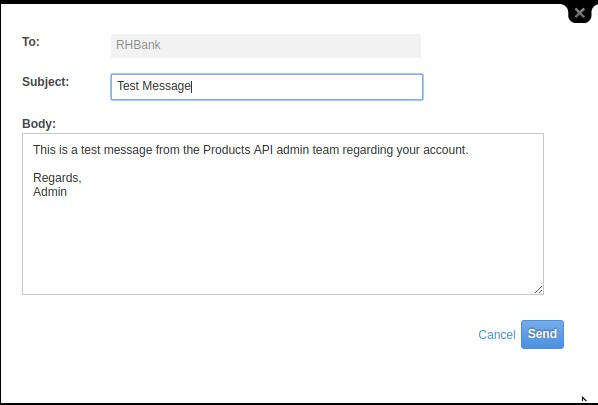
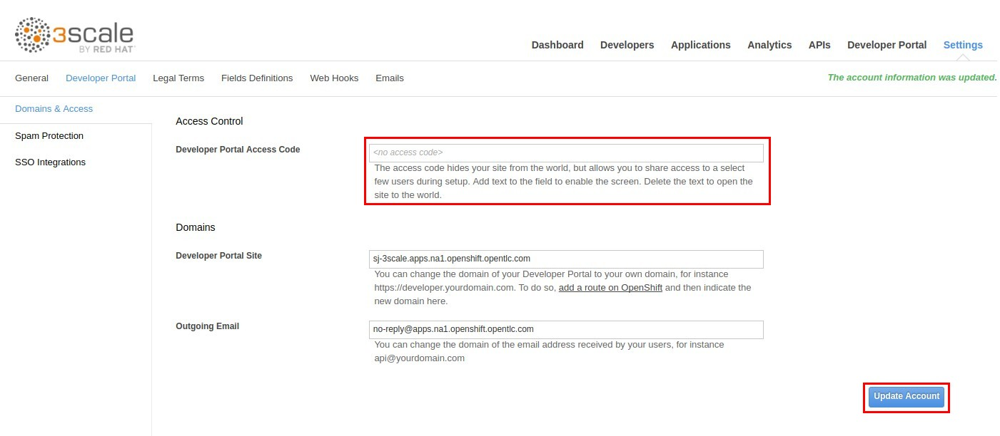

:scrollbar:
:data-uri:
:toc2:

== Users, Accounts & Applications Management Lab

.Overview

In this lab you will learn techniques for user communication, account management via invitations and using custom keys for applications. 

.Goals

* Send email message to users
* Send an email invitation to add user to an account
* Customize user key tokens
* Apply end user rate limits

.Prerequisites
* Completion of the previous labs in this course
* SMTP configured for your AMP to send email messages
* `OCP_WILDCARD_DOMAIN` environment variable set in your shell
+
TIP: To check if your shell still has this environment variable set, execute the `echo $OCP_WILDCARD_DOMAIN` command. If the variable is no longer set, return to the first lab in this course and follow the steps there to set it again.

* 3scale Admin Portal URL and user credentials to log in

:numbered:

== Send Email

In this section you will see how a 3scale administrator can send an email message to any account user registered.

=== Reconfirm SMTP setup

. Login to your OpenShift Management Console and navigate to the *Resources -> Config Maps -> smtp* config map .
. Check that the config map shows the SMTP credentials as configured.
+

+
NOTE: Note that the setup would store the password as plain text, so please ensure you use a separate account as your SMTP, instead of your personal email account.
+
. If the config map *smtp* needs to be updated, then you need to bounce the following deployments in order to re-read the config:
.. system-app
.. system-resque
.. system-sidekiq

=== Send Message from Admin Portal

. In 3scale by Red Hat's Admin Portal, verify that you are logged in, and then click the *Developers* tab.
. Click on the *RHBank* account.
. Click on *Send Message* link on the Account Summary page.
+
image::images/3scale_amp_products_account_send_message.png[]

. A pop up form appears on the page.
. Enter the following values:
.. *To*: RHBank
.. *Subject*: Test Message
.. *Body*: This is a test message from the Products API admin team regarding your account. Regards, Admin
+

. The sent message should be listed in the *Messages* tab by clicking on the *Sent messages* link:
+
image::images/3scale_amp_products_account_send_message_5.png[]

=== Confirm Email receipt in Developer account

. Now confirm that the email has been received in the email id registered for the user.
+
image::images/3scale_amp_products_account_send_message_3.png[]
+
NOTE: Note that the email is sent from the email address registered with AMP for the SMTP credentials.
IMPORTANT: If you are using a *gmail* account, you might encounter an issue with Google blocking the signin attempt from the OCP cluster on AWS. You might notice the following error:
+
image::images/3scale_amp_email_gmail_error.png[]
+
TIP: Login to your *gmail* account and update the permissions in gmail to permit the login for SMTP.
+
. Also confirm that the email is in the *Sent* folder of the SMTP account
+
image::images/3scale_amp_products_account_send_message_4.png[]

== Invite User to join a Developer Account

In 3scale, multiple users can be created for the same account. When the developer acccount for RHBank was created in the previous lab, notice that the account was created for a specific email id, Username and password. The Organization/Group Name provided is the name of the account. Now, the default user created is an *administrator* user of the developer account and as such can invite other users to the account.

=== Send Invite to User's email address

. Click the *Developers* tab.
. Click *RHBank* account.
. Click on *Invitations* breadcrumb.
+
image::images/3scale_amp_products_account_invite_user.png[]
+
. Click on *Invite user* link.
+

+
. Provide an email address of the user to be invited and click *send*.
. Now observe that the Invitation page has the status of the invitation.
+
image::images/3scale_amp_products_account_invite_user_3.png[]
+
NOTE: If the user does not receive the invitation, you can resend the invitation through this link.

=== Accept Invitation and Join

. Login to the email account of the invitee and look for the Invitation email from 3scale in the inbox.
+

. Click on the link in the email to join the developer account. This will open an *Invitation Sign In* form on the Developer Portal.
+
NOTE: The Developer Portal is by default restricted behind an access code, so you might encounter an error page on clicking the activation link. In order to prevent this, go to the *Settings -> Developer Portal* section of Admin Portal and delete the *Developer Portal Access Code*.
+

+
. Provide a username and password and click on *Sigun up*.
+

+
NOTE: An invited user can check their application plan and user key by logging in to the developer portal. We will observe this workflow in Module 2 of the course.

=== Check User in Admin Portal

. Now navigate back to the Admin Portal and click on *Accounts* and *RHBank*.
. Click on *Users* breadcrumb.
+
image::images/3scale_amp_products_account_invite_user_6.png[]
+
. Observe that the new user account is created with role `Member`.
+
image::images/3scale_amp_products_account_invite_user_7.png[]
+
. From the Admin Portal, an administrator has the ability to edit, suspend, delete or update the user to admin role.
+
image::images/3scale_amp_products_account_invite_user_8.png[]
+
. As this user has access to the same applications as the account, the user can request the APIs using the same application keys that were set up for the application.

=== User Account Administration

NOTE: Please attempt this lab after completing the lab *2.1 Development Portal customization*.

. Access the developer portal and login as the new user.
. See your application and credentials from the portal.
. Click on *Settings* and try to access the *Users* and *Invitations* link.
+

+
. Notice that you get an *Access Denied* error as these tabs are reserved for Admin users.
. Sign out of the developer portal

=== Admin Account Administration

. Now login as the admin user of the RHBank account (*rhbankdev*).
. Click on *Settings*.
. Click on *Users* tab.
. Observe that you can now view the users list, and also invite users through the portal.
+

+
. Now repeat the Invite user process through the developer portal.

== Regenerate & Customize User Keys

In this lab, we will see how users can manage the user_key for accessing APIs managed by 3scale. We will look at 2 scenarios: firstly, regenerate the random key generated, and secondly, to let the user enter their own custom key.

=== Regenerate `user_key` from Admin Portal

. In 3scale by Red Hat's Admin Portal, verify that you are logged in, and then click the *Applications* tab.
. Click on *ProductsApp*
. Click on the *Regenerate* button.
+
image::images/3scale_amp_products_app_userkey_regenerate.png[]
+
. Confirm the change by clicking *OK* in the pop up window.
. Notice that a new user key is generated.
. Now try the request to the Product API with the old key and notice that you get an *Authentication Failed* error.
. Change the user key in the request and try again. This time the request should succeed.
+
NOTE: Users can also manage their user key from the Developer Portal. After completing the labs in Module 2, try to repeat this lab with the regeneration of User Key from the Developer Portal.

=== Set a Custom Key

. In 3scale by Red Hat's Admin Portal, verify that you are logged in, and then click the *Applications* tab.
. Click on *ProductsApp*
. Click on the *Set Custom Key* button.
+
image::images/3scale_amp_products_app_userkey_custom.png[]
+
. Set an alphanumeric key. You can use a phrase/password that is easy to remember.
+
image::images/3scale_amp_products_app_userkey_custom_2.png[]
+
. Notice that the User Key is updated to your Custom key.
. Now test the API request by changing the User Key to ensure it works.
+
NOTE: A custom user key can also be provided in the Developer Portal, hence this lab can be retried after completing the labs in Module 2 by creating the custom key in Developer Portal.

== Change Authentication to App Id and App Key

An alternate to using the API Key (user_key) for authentication is to use a combination of App_ID and App_key. In this method, the application is identified via App Id and then authenticated via App Key. 

In this lab, we will change the Authentication for the Products service to use the App Id & App Key instead of API Key method.

=== Update the Service

. In 3scale by Red Hat's Admin Portal, verify that you are logged in, and then click the *API* tab.
. Click on the *Integration* link of the Products service.
+

+
. Click on the *Edit Integration Settings* link in the Integration page.
+

+
. Scroll down to the *Authentication* section, and change the Authentication to *App_ID and App_key Pair*.
+

+
. Click on *Update Service*.
. Click *OK* in the confirmation popup window to accept the changes.
. Now click on *Applicatios* and select *ProductsApp*.
. Notice that the *API Credentials* section is now changed to reflect the new authentication.
+

+
. Click on *Add Random key* to provide a new App_key for this application.
. Note that a new Application Key is generated. 
+
NOTE: You can have multiple Application Keys generated. Generate one more key.

=== Test the Authentication

. Navigate to *APIs* and choose *Products* Integration.
. Click on *edit APIcast configuration*.
+

+
. Scroll down to the bottom of the page and notice that the sample curl request generated has the app_id and app_key pre-filled.
+
image::images/3scale_amp_products_app_appid_key_6.png[]
+
. Click on *Update & test in Staging Environment*. The request should succeed and the Integration should be green without errors.
. Now you can test the other App_Key generated and ensure that the request succeeds.
+
NOTE: The App_Key can be created or deleted through the Developer Portal as well. Once you have completed Module 2, revisit this lab and try to manage App_Keys through the portal.

=== Change API Docs

Attempt this section after completing module 3 labs. As the authentication has changed from user_key to App_Id and App_key, you need to update the Swagger API to reflect this change. As a bonus exercise, update the APIDocs as suggested in Module 3, substituting the _user_key_ with _app_id_ and _app_key_ correctly, so that test requests can be sent from the Documentation page of the portal to this API endpoint.
