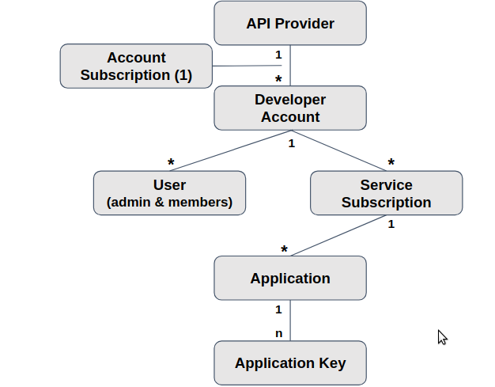

:noaudio:

:scrollbar:
:data-uri:

== Account Data Model

.*Account Data Model*

ifdef::showscript[]

Transcript:

Let us revisit the Account Data Model discussed in the previous model. 
This diagram shows the relationship between the various account-related data objects in 3scale. The relationships discussed here are the user and application entities. They show the data model from the perspective of the potential users, the developers. In the next slide, we will explain the roles and responsibilities of the different account types seen here. 

The account subscription relates to the API provider account. On a Red Hat 3scale API Management platform, usually SaaS, it is the account that the provider uses to log in to 3scale and manage APIs. In the 3scale AMP, this represents the "admin" account to access the Admin Portal.

Developer accounts are the accounts subscribed to a particular API. There represent the end user access to the APIs. These are the accounts used to access the "Developer Portal".

endif::showscript[]
