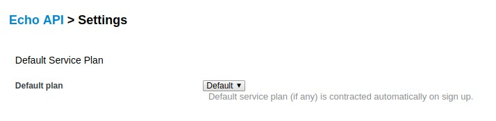

:noaudio:

:scrollbar:
:data-uri:

== Service Subscriptions

* Contract between account and service
* APIs (services) have default service plan
** Account subscription to default plan on creation
+

+
* APIs (services) with multiple service plans and no default:
** Account subscription to be selected by admin/self service
* Application Plan needs a service subscription

ifdef::showscript[]

Transcript:

Developer accounts need to be subscribed to a particular service in order to have access to the API (service). By default, on creation of a new API service in 3scale, a default service plan is created. Any developer account created in 3scale would then have a service subscription to the default service plan. The site administrator has the option to unselect the "default" service plan. In that case, no default service subcription is selected for the account on creation, and the subscription needs to be set up explicitly by the administrator or in the developer portal.

An application connecting the account to an application plan is dependent on the service subscription of the account. Hence, the service subscription is the first step to contract a service to an account.

endif::showscript[]
