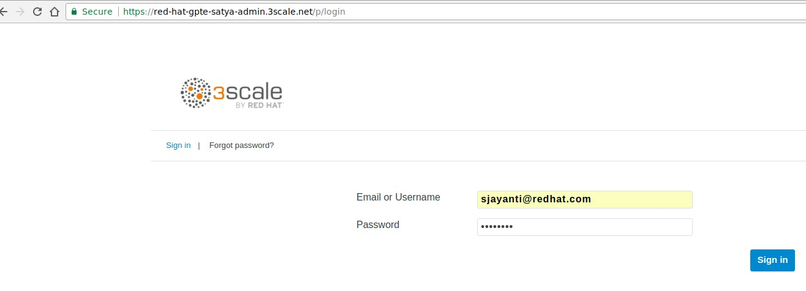
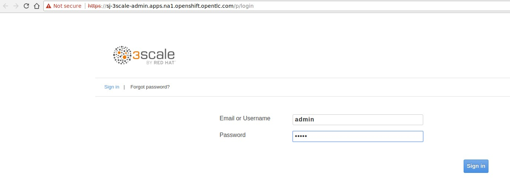

:noaudio:
:scrollbar:
:data-uri:

== Account Administrator

[cols="2"]
|===
|3scale API Management SaaS
|3scale API Management
a|* Sign in to Admin Portal using account user/email provided on sign-up:
+

a|* Sign in to Admin Portal using default `admin` user:
+

|===

ifdef::showscript[]

Transcript:

There is a default `admin` user with account subscription access. On SaaS Red Hat 3scale API Management, it is the account the provider uses to log in and manage APIs. In the API Management Platform (AMP) component, this represents the `admin` account used to access the Admin Portal.

Both of the figures above represent the `admin` user and sign-in credentials for accessing the Admin Portal. This is the `admin` user that has access to the account management features of the Admin Portal. This user can create other users and accounts for managing other aspects of administration for providers, as shown in the next slide.

endif::showscript[]
