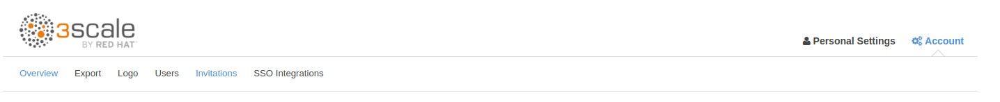

:noaudio:
:scrollbar:
:data-uri:

== Account Administrator Features

.*Account Management*

* Administration:
** Adding/editing organization details (company name, timezone, logo)
** Exporting data from Admin Portal
** Managing administrator users
** Integrating Red Hat Single Sign-On (SSO)

ifdef::showscript[]

Transcript:

The account administrator can manage provider accounts using the Admin Portal. A section in the Admin Portal lists the tasks that can be performed. These include editing the organizational details such as company name, time zone, and logo to be used in the Admin Portal, exporting data from the Admin Portal, managing administrator users, and providing SSO integration for administrator user accounts. Other tasks include inviting users to the Admin Portal and enabling administrator tasks to be carried out by multiple users with different roles.

endif::showscript[]
