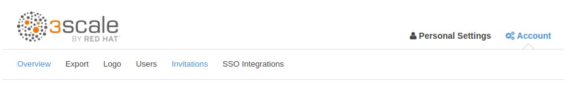

:noaudio:

:scrollbar:
:data-uri:

== Account Administrator Features

.Account Management

* Administration
** Organization Details (Company Name, Logo, TimeZone)
** Exporting data from Admin Portal
** Admin User Management 
** SSO Integration

ifdef::showscript[]

Transcript:

The account administrator can manage provider accounts using 3scale Admin Portal. The administor has a section in 3scale portal wherein the tasks shown here can be performed. These include editing the organisational details e.g company name, time zone & logo to be used for admin portal; providing Single sign on integration for admin user accounts, or inviting users to admin portal, and enabling admin tasks to be carried out by multiple users with different roles.

endif::showscript[]
