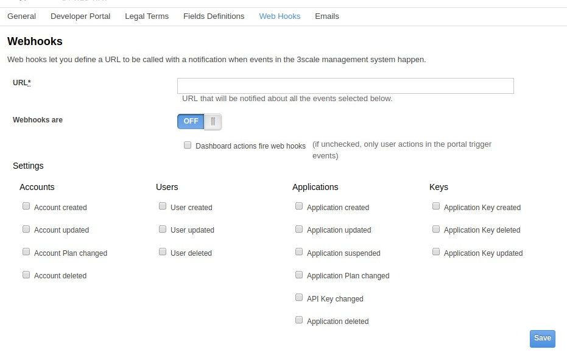

:noaudio:
:scrollbar:
:data-uri:

== Webhooks

.Webhook Events Setup in Admin Portal

* HTTP callback triggered by event
* Event can be related to Developer Portal or Admin Portal
* Sends XML document in standard format

ifdef::showscript[]

Transcript:

The use of webhooks allows you to tightly integrate 3scale API Management with your back-office workflow. When specified events happen within the system, your application is notified with a webhook message, and you can use the data, such as from a new account signup, to populate your CRM system.

A webhook is a custom HTTP callback triggered by an event. In the 3scale API Management system, all of the possible events are displayed as shown. When one of these events occurs, the system makes an HTTP or HTTPS request to the URI configured in the webhooks section. The default behavior is to trigger webhooks only by actions triggered from within the Developer Portal. You can also allow webhooks to be fired by actions in the Admin Portal. 

endif::showscript[]
