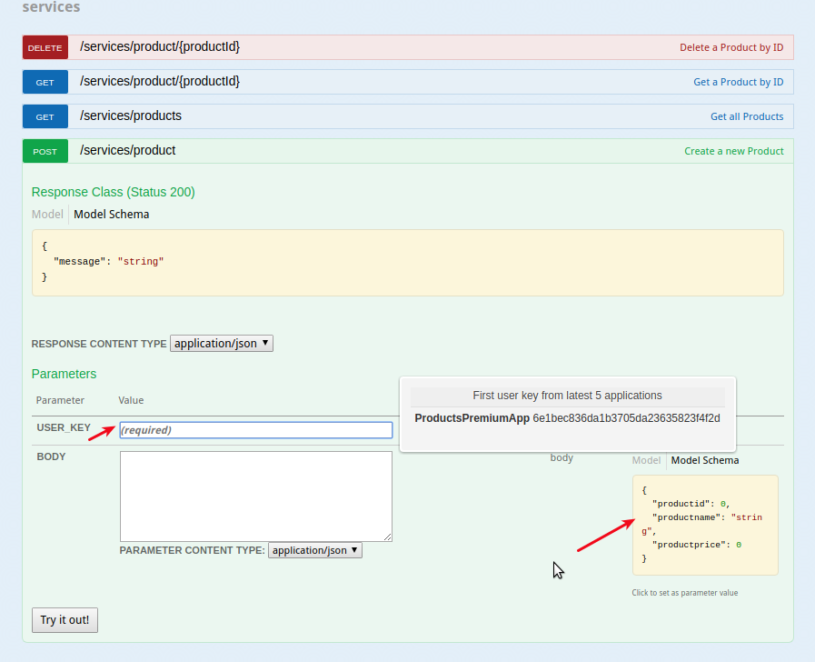

:scrollbar:
:data-uri:
:toc2:

== Analytics Lab

In this lab, you set up and view the analytics provided by Red Hat 3scale API Management. You also export data and events from 3scale API Management so that an external analytics tool can be used.

:numbered:

== Using Analytics on Red Hat 3scale API Management

In this section, you generate some load for the API and then check the analytics graphics to understand the API traffic.

=== Generate Load on Products API

. Log in to your 3scale Admin Portal with your user credentials.
. Navigate to the *Developer Portal* tab.
. Click *Visit Developer Portal*:
+
image::images/3scale_amp_products_visit_dev_portal.png[]

. Log in as the `rhbankadmin` user with the password provided in the earlier lab.
. Click the *Documentation* tab:
+
image::images/3scale_amp_products_analytics_1.png[]

. Expand the *POST* API.
. Click the user key *Value* field and accept the default key provided for this application:
+

. Note the `BODY` JSON format example on the right. Click the section to copy it into the *BODY* field.
. Edit the request as shown below:
+
[source,JSON]
-----
{
  "productid": null,
  "productname": "Samsung LED TV",
  "productprice": 299.95
}
-----

. Click *Try it Out*:
+
image::images/3scale_amp_products_analytics_3.png[]

* The product is created. Expect to see this response:
+
[source,text]
-----
{"message":"Product created"}
-----
+
TIP: Due to an SSL certificate issue, the request may not succeed on the portal when using 3scale AMP. In this case, copy and paste the `curl` request generated into a terminal and execute the request.

. Create more products as shown below:
+
[source,JSON]
-----
{
  "productid": null,
  "productname": "Panasonic LED TV",
  "productprice": 399.95
}

{
  "productid": null,
  "productname": "Panasonic Plasma TV",
  "productprice": 199.95
}

{
  "productid": null,
  "productname": "JVC OLED TV",
  "productprice": 1999.95
}
-----

. Submit a `Get Products` request, and verify that the products you created are available in the list of products:
+
image::images/3scale_amp_products_analytics_4.png[]

. Click *Try it out* a few more times to generate traffic.
. Try the `Delete` and `Get Product` methods.

=== Observe Analytics

==== Admin Portal for All Applications

. In 3scale by Red Hat's Admin Portal, log in with your user credentials.
. Navigate to the *Analytics* tab:
+
image::images/3scale_amp_products_analytics_5.png[]
+
. Click *Products*:
+
image::images/3scale_amp_products_analytics_6.png[]

. Observe the statistics provided:
+
image::images/3scale_amp_products_analytics_7.png[]

. Click *Top Applications*, *Daily Averages*, and *Alerts*, and observe the statistics shared.

==== Admin Portal for Specific Application

. Click the *Applications* tab and then *ProductsPremiumPlan*:
+
image::images/3scale_amp_products_analytics_8.png[]

. Click *Analytics* to view the statistics pertaining to this application:
+

==== Developer Portal for Specific User

. Log in to the Developer Portal as user `rhbankadmin` with the password you provided for the account.
. Click  the *Statistics* tab:
+
image::images/3scale_amp_products_analytics_10.png[]

. Observe the statistics for the user's application plan:
+
image::images/3scale_amp_products_analytics_11.png[]

. Click *Download CSV* at the bottom right to download the analytics data in a CSV format.
* The CSV file can be used as input for an external analytics tool.
