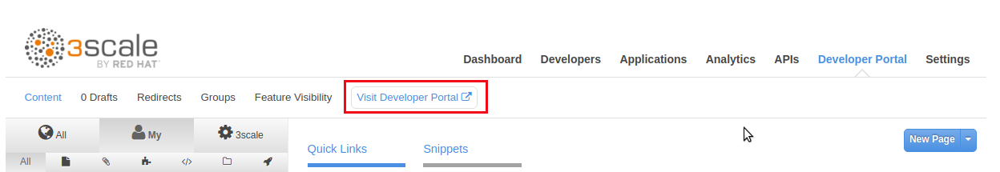
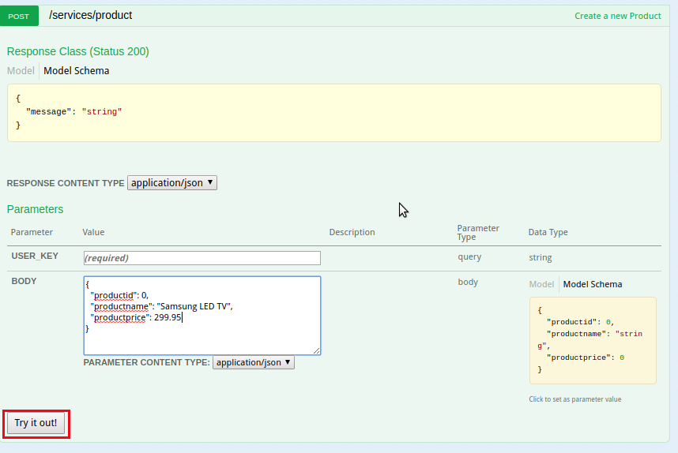
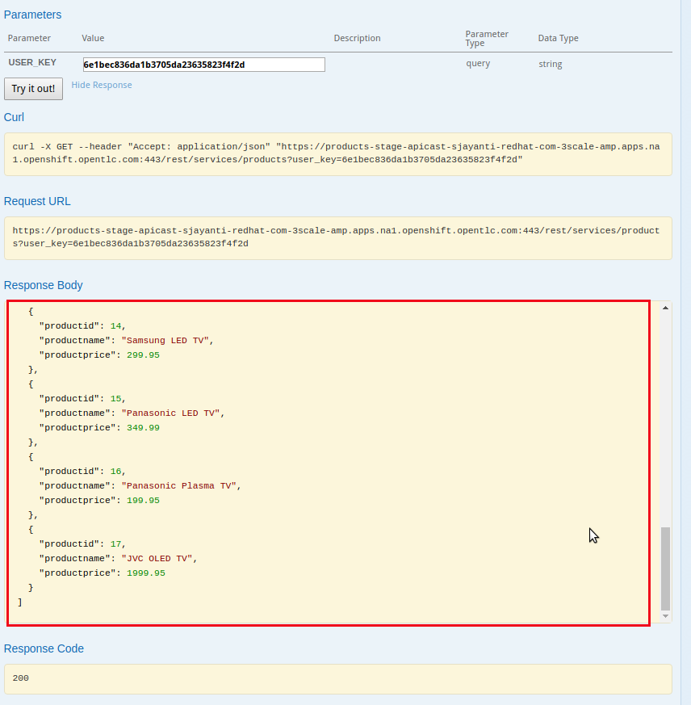
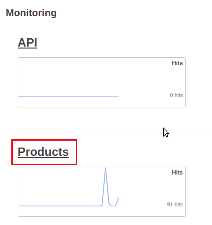
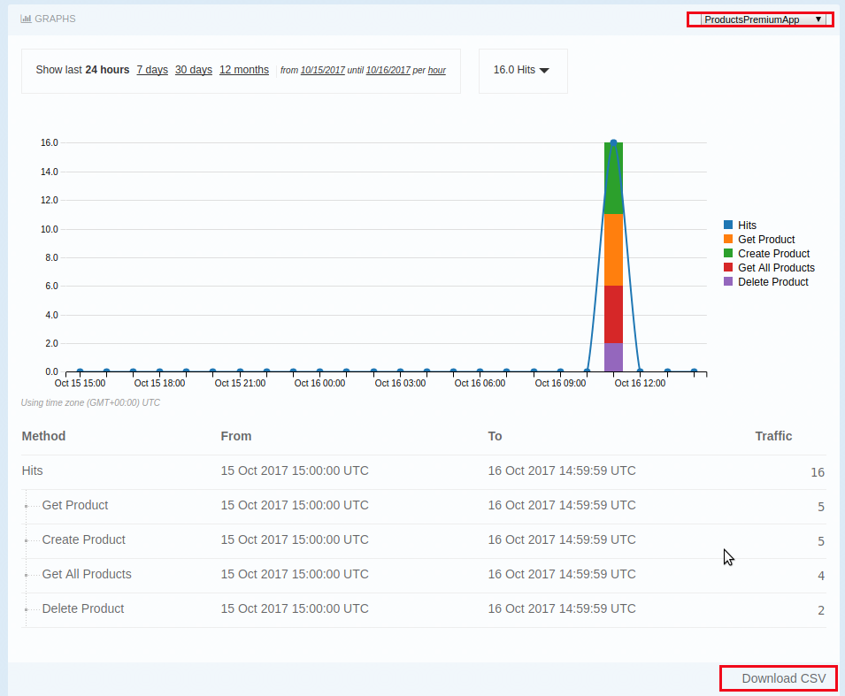

:scrollbar:
:data-uri:
:toc2:
:numbered:

= Analytics

In this lab, you will be looking at setting up and viewing the Analytics provided by 3scale API Management Platform. We will also look into exporting data & events from 3scale so that an external Analytics tool can be used.

== Using Analytics on 3scale

In this lab you will generate some load for the API and then check out the analytics graphics to understand API’s traffic.

=== Generate Load on Products API

. Login to your 3scale Admin Portal with your user credentials.
. Navigate to the `Developer Portal` tab.
. Click on `Visit Developer Portal`.
+

+
. Login as the `rhbankadmin` user with the password provided in the earlier lab.
. Click on `Documentation` tab.
+
image::images/3scale_amp_products_analytics_1.png[]
+
. Click to expand the `POST` API.
. Click on the `user_key` field and accept the default key provided for this application.
+
image::images/3scale_amp_products_analytics_2.png[]
+
. Notice the `BODY` JSON format example on the right. Click the section to copy it into the BODY field.
. Edit the request to below:
+
[source,JSON]
-----
{
  "productid": null,
  "productname": "Samsung LED TV",
  "productprice": 299.95
}     
-----
+
. Click on `Try it Out`.
+

+
. The product should be created, and you should see the response below:
+
[source,text]
-----
{"message":"Product created"}    
-----
+
TIP: Due to SSL certificate issue, the request may not succeed on the portal, when using 3scale AMP. In this case, copy and paste the curl request generated into a terminal and execute the request.
. Create 2-3 more products, as below:
+
[source,JSON]
-----
{
  "productid": null,
  "productname": "Panasonic LED TV",
  "productprice": 399.95
}  

{
  "productid": null,
  "productname": "Panasonic Plasma TV",
  "productprice": 199.95
}  

{
  "productid": null,
  "productname": "JVC OLED TV",
  "productprice": 1999.95
}          
-----
+
. Now try out the `Get Products` request, and check that the products you created are available in the list of products.
+

+
. Click on the `Try it out` button a few more times to generate traffic.
. Also try out the `Delete` and `Get Product` methods.

=== Observe the Analytics

==== In the Admin Portal for all applications

. In the 3scale Admin Portal, login with your user credentials.
. Navigate to the `Analytics` tab.
+
image::images/3scale_amp_products_analytics_5.png[]
+
. Click on the `Products` link.
+

+
. Observe the statistics provided.
+
image::images/3scale_amp_products_analytics_7.png[]
+
. Click on the other links e.g *Top Applications*, *Daily Averages*, *Alerts*, etc and observe the statistics shared.

==== In the Admin Portal for Specific Application

. Click on the `Applications` tab and select the `ProductsPremiumPlan` link.
+
image::images/3scale_amp_products_analytics_8.png[]
+
. Click on the `analytics` breadcrumb to view the statistics pertaining to this particular application.
+
image::images/3scale_amp_products_analytics_9.png[]
+

==== In the Development Portal for specific user

. Login to the developer portal as user `rhbankadmin` with the password you provided for the account. 
. On the Developer Portal, click on the `Statistics` tab.
+
image::images/3scale_amp_products_analytics_10.png[]
+
. Observe the statistics for the user's application plan.
+

+
. Notice the `Download CSV` link at the bottom right. Click on the link to download the analytics data in a CSV format.
. The CSV can now be used as input for any external analytics tools.

[blue]#Congratulations!#.

ifdef::showscript[]

endif::showscript[]
