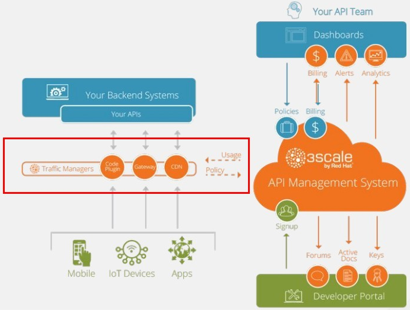

:scrollbar:
:data-uri:
:noaudio:

== 3scale API Traffic Controllers

ifdef::showscript[]

Transcript:

Red Hat 3scale API Management is a flexible and scalable API management platform based on a distributed architecture.

Another view of the basic architecture diagram is shown here. Red Hat 3scale API Management mediates between the API consumers and the API providers.

The architecture is hybrid, with separate traffic control and program management layers. The traffic management and API management layers can be deployed separately. The traffic between API consumer and API provider does not go through the 3scale cloud, which reduces latencies.

Integration with the 3scale platform is accomplished by deploying traffic management agents, which enforce traffic policies, access control, and rate limits. The traffic management can be a custom APIcast gateway built on an NGINX web server and OpenResty, or a code plug-in library embedded within the API provider.

endif::showscript[]
