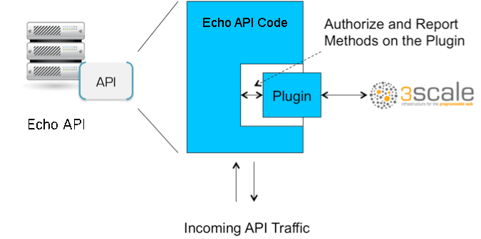

:scrollbar:
:data-uri:
:noaudio:

== Code Plug-ins

ifdef::showscript[]

Transcript:

Plug-ins are deployed within your API code to insert a traffic filter on all calls, as shown in the diagram.

endif::showscript[]
