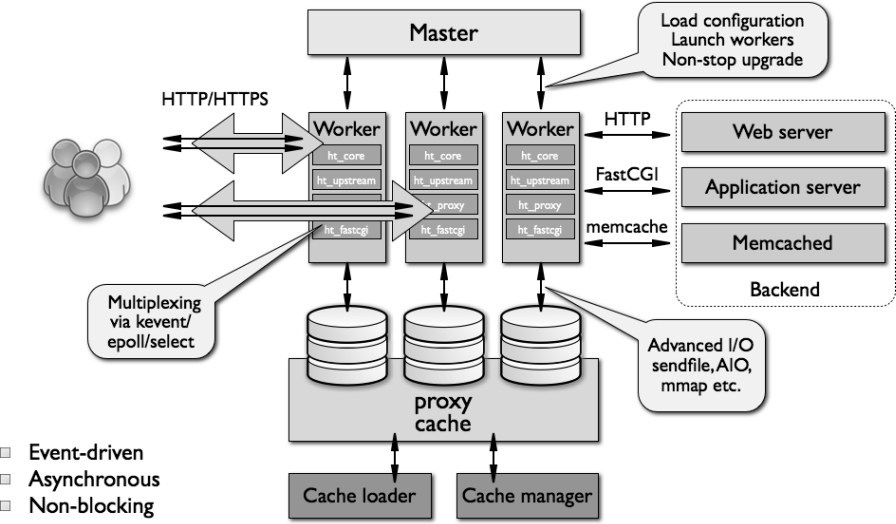

:scrollbar:
:data-uri:
:noaudio:

== NGINX Web Server

ifdef::showscript[]

Transcript:

The NGINX worker code includes the core and the functional modules. The core of NGINX is responsible for maintaining a tight run-loop and executing appropriate sections of module code at each stage of request processing. Modules constitute most of the presentation and application layer functionality. Modules read from and write to the network and storage, transform content, do outbound filtering, apply server-side include actions, and pass the requests to the upstream servers when proxying is activated.

endif::showscript[]
