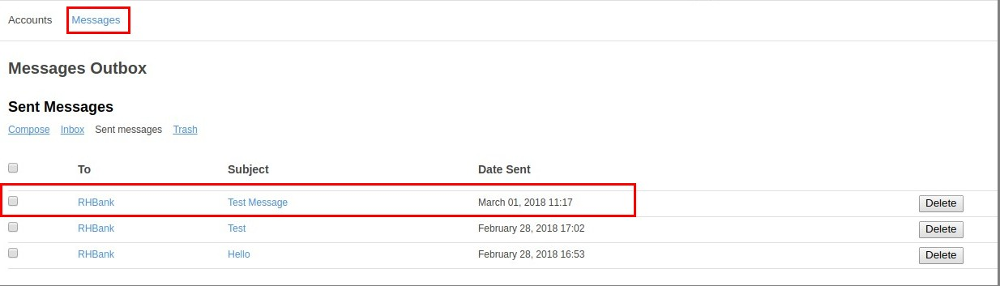
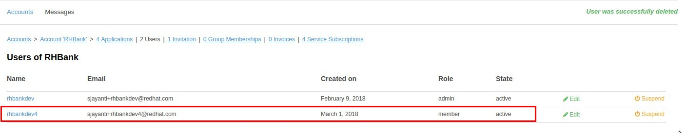

:scrollbar:
:data-uri:
:toc2:

== Users, Accounts, and Applications Management Lab

.Overview

In this lab you learn techniques for communication with API consumers, account management via invitations, and using custom keys for applications. 

.Goals

* Send email message to API consumers
* Send email invitation to add API consumer to account
* Customize user key tokens
* Apply end user rate limits

.Prerequisites
* Completion of the previous labs in this course
* SMTP configured for your API Management Platform (AMP) component to send email messages
* `OCP_WILDCARD_DOMAIN` environment variable set in your shell
+
TIP: To check if your shell still has this environment variable set, execute the `echo $OCP_WILDCARD_DOMAIN` command. If the variable is no longer set, return to the first lab in this course and follow the steps there to set it again.

* Admin Portal URL and API provider credentials to log in

:numbered:

== Send Email

In this section you see how an administrator of a API tenant can send an email message to any API consumer associated with that tenant.

Recall that SMTP configurations were set in the prerequisite course:  _Red Hat 3scale API Management Implementation_.

You can use the same SMTP configurations in this lab.

=== Reconfirm SMTP Setup

. Recall that the smtp configurations for your API manager are maintained in a configmap called:  _smtp_.
. Check that the ConfigMap is populated with your desired SMTP credentials :
+
-----
$ oc describe configmap smtp -n $API_MANAGER_NS

apiVersion: v1
data:
  address: smtp.sendgrid.net
  authentication: plain
  domain: ""
  openssl.verify.mode: ""
  password: xxxxxxxxxx
  port: "587"
  username: xxxxxx
kind: ConfigMap

-----
+
NOTE: Note that the setup stores the password as plain text, so use a separate account as your SMTP instead of your personal email account.
+
. If the smtp ConfigMap needs to be updated, then you need to bounce the following deployments to reread the configuration:
** `system-app`
** `system-sidekiq`

=== Send Message from Admin Portal

. In the 3scale API Management Admin Portal, verify that you are logged in to the default tenant, and then navigate to: `Audience -> Accounts`.
. Click the *RHBank* account.
. On the Account Summary page, click *Send Message*:
+
image::images/3scale_amp_products_account_send_message.png[]

* A pop-up form appears on the page.
. Enter the following values:
* *To*: `RHBank`
* *Subject*: `Test Message`
* *Body*: `This is a test message from the Products API admin team regarding your account. Regards, Admin`
+
image::images/3scale_amp_products_account_send_message_2.png[]

. Verify the sent message by navigating to: `Audience -> Messages -> *Sent messages`:
+

=== Confirm Email Receipt 

Check the email of the _RHBank_ API consumer.

. If your smtp provider is Gmail, you may encounter an issue with Google blocking the sign-in attempt from the Red Hat OpenShift Container Platform cluster on AWS. 

.. You might notice the following error:
+
image::images/3scale_amp_email_gmail_error.png[]

.. Log in to your Gmail account and update the permissions in Gmail to permit the login for SMTP.

. Confirm that the email has been received in _RHBank_'s email:
+
image::images/3scale_amp_products_account_send_message_3.png[]

. Confirm that the email is in the *Sent* folder of the account associated SMTP provider:
+

== Invite User to Join Developer Account

When the RHBank account was created in the previous lab, the account was created for a specific email ID, username, and password. 
In 3scale API Management, multiple users can be created for the same account. 

In this section of the lab, new user's will be invited to an account.

You'll do this initially as the admin of an API provider tenant and then do so again as the _RHBank_ account admin.

=== Tenant Admin: Send Invitation to User's Email Address

. Navigate to *Audience -> Accounts* .
. Click the *RHBank* account.
. Click *0 Invitations*:
+

+
. Click *Invite user*:
+
image::images/3scale_amp_products_account_invite_user_2.png[]
+
. Provide an email address of the user to be invited, and click *send*.
. Observe the status of the invitation on the Invitation page:
+

+
NOTE: If the user does not receive the invitation, you can resend the invitation through this link.

=== Accept Invitation and Join

. Log in to the email account of the invitee and look for the invitation email from 3scale API Management:
+
image::images/3scale_amp_products_account_invite_user_4.png[]

. Click the link in the email to join the API consumer account. This opens the *Invitation Sign In* form in the Developer Portal.
+

NOTE: The Developer Portal is by default restricted behind an access code, so you might encounter an error page after clicking the activation link. 
To prevent this, navigate to *Audience -> Developer Portal -> Settings -> Developer Portal -> Domains & Access* . Afterwards, delete the *Developer Portal Access Code*.
+
image::images/3scale_amp_products_account_invite_user_11.png[]

+
. Provide a username and password, and click *Sign up*:
+
image::images/3scale_amp_products_account_invite_user_5.png[]
+
NOTE: An invited user can check their application plan and user key by logging in to the Developer Portal.

=== Check User in Admin Portal

. Navigate back to the Admin Portal and click *Accounts* and *RHBank*.
. Click *Users*:
+

+
. Observe that the new user account was created with the role `member`:
+

+
. Observe in the Admin Portal that an administrator has the ability to edit, suspend, delete, or update a user, including changing the user's role to the `admin` role:
+
image::images/3scale_amp_products_account_invite_user_8.png[]
+
* Because this user has access to the same applications as the account, the user can request the APIs using the same application keys that were set up for the application.

=== Administer User Account

. Access the Developer Portal and log in as the new user.
. Review your application and credentials in the portal.
. Click *Settings* and try to access the *Users* and *Invitations* links:
+
image::images/3scale_amp_products_account_invite_user_9.jpg[]
+
. Notice that you get an *Access Denied* error because these tabs are reserved for `admin` users.
. Sign out of the Developer Portal.

=== Account Admin: Send Invitation to User’s Email Address

Previously you created an account called _RHBank_ and an account admin called: _rhbankdev_.

As an account admin, the user _rhbankdev_ can invite other users to the account via the Developer Portal.

NOTE:  Account admins (ie: _rhbankdev_ ) only have access to the Developer Portal.  
They do not have access to the 3scale Admin Portal.

. Log in to the Developer Portal as an `admin` user of the RHBank account (`rhbankdev`).
. Navigate to `Settings -> Users`.
. Observe that you can now view the users list, and also invite users using the portal:
+
image::images/3scale_amp_products_account_invite_user_10.png[]
+
. Repeat the invite-user process through the Developer Portal.

== Regenerate and Customize User Keys

In this section you learn how users can manage the user key for accessing APIs managed by 3scale API Management. 
You do two procedures: regenerating the random key generated, and letting the user enter a custom key.

=== Regenerate User Key from Admin Portal

. In the Admin Portal, verify that you are logged in to the default tenant.
. Navigate to: `API:Products -> Applications -> Listing`
. Click *ProductsApp*
. Click *Regenerate*:
+

+
. Confirm the change by clicking *OK* in the pop-up window and verify that a new user key was generated.
. Try the request to the Product API with the old key and observe the *Authentication Failed* error.
. Retry the request with the new user key and observe that the request succeeds.

=== Enable User to Manage their API Key

. As an admin logged into the default tenant of the Admin Portal, navigate to: `API:Products -> Integration -> Settings -> Application Requirements`
. Ensure that the following checkbox is enabled:  `Developers can manage applications`
. In the Developer Portal, log in as one of the users that was previously invited to the `RHBank` Account.
. As this account user, navigate to: `Applications` and click on _ProductsApp_
. Notice the account user's ability to `Regenerate` the API key
+

=== Set Custom Key

. In the Admin Portal, verify that you are logged in, and then click the *Applications* tab.
. Click *ProductsApp*.
. Click *Set Custom Key*:
+

+
. Set an alphanumeric key. Use a phrase/password that is easy to remember.
+
image::images/3scale_amp_products_app_userkey_custom_2.png[]
+
. Observe that the user key was updated to your custom key.
. Test the API request by changing the user key to ensure that it works.
+
NOTE: A custom user key can also be provided in the Developer Portal.  You could perform this procedure again after completing the labs in the "Custom Developer Portal" module, and create the custom key in the Developer Portal. 

== Change Authentication to App ID and App Key

An alternative to using the API key (user key) for authentication is to use a combination of app ID and app key. 
In this method, the application is identified by its app ID and then authenticated with the app key. 

This security mechanism tends to be superior to use of only a simple API key.
The App Id + App key security mechanism provides improved long term management.
Multiple App keys can be generated and each distributed to different API consumers of the same application.
The lifecycle of each of these App keys can be managed independently of eachother and of the application.

In this section you change the authentication for the Products service to use the app ID and app key instead of the API key.

=== Update Service

. In the Admin Portal, verify that you are logged in to the default teant.
. Navigate to `API:Product -> Integration -> Configuration` .
+
. Click *edit integration settings* in the Integration & Configuration page:
+
image::images/3scale_amp_products_app_appid_key_2.png[]
+
. Scroll down to the *Authentication* section, and change the authentication to *App_ID and App_Key Pair*:
+
image::images/3scale_amp_products_app_appid_key_3.png[]
+
. Click *Update Service*.
. Click *OK* in the confirmation pop-up window to accept the changes.
. Navigate to *Applications -> Listing* and select *ProductsApp*.
. Observe that the *API Credentials* section was changed to reflect the new authentication:
+
image::images/3scale_amp_products_app_appid_key_4.png[]
+
. Click *Add Random key* to provide a new app key for this application.
. Notice that a new application key was generated. 
+
NOTE: You can generate multiple application keys. Generate one more key.

=== Test Authentication

. For the _Products_ API, navigate to `Integration -> Configuration`.
. Click *edit APIcast configuration*:
+
. Scroll to the bottom of the page and notice that the sample curl request generated has `app_id` and `app_key` prefilled:
+
image::images/3scale_amp_products_app_appid_key_6.png[]
+
. Click *Update & test in Staging Environment and observe that the request succeeds and the integration becomes be green without errors.
. Test the other app key generated and ensure that the request succeeds.
+
NOTE: The app key can be created or deleted through the Developer Portal as well. 

=== Change API Docs

In a previous lab, you were introduced to the creation and updating of _ActiveDocs_ based API documentation.

In this section, you are encouraged to modify the _ActiveDocs_ for your Products API to reflect the use of the app ID and key security mechanism.
