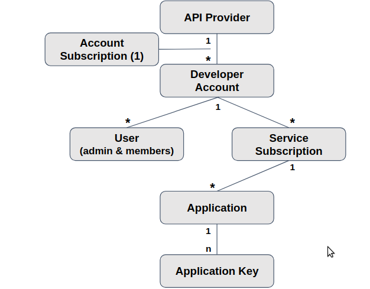

:scrollbar:
:data-uri:

== Account Data Model

.*Account Data Model*

ifdef::showscript[]

Transcript:

This diagram shows the account data model discussed in the previous module. It shows the relationship between the various account-related data objects in Red Hat 3scale API Management. The relationships shown here are the user and application entities. They show the data model from the perspective of  potential users--the developers. The next slide explains the roles and responsibilities of the account types shown here.

The account subscription relates to the API provider account. On a 3scale API Management platform, usually SaaS, it is the account the provider uses to log in and manage APIs. In 3scale API Management, this represents the `admin` account used to access the Admin Portal.

Developer accounts are the accounts subscribed to a particular API. They provide end user access to the APIs. These are the accounts used to access the Developer Portal.

endif::showscript[]
