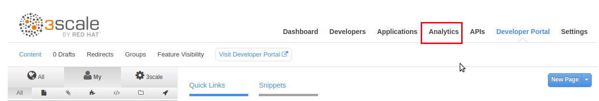

:scrollbar:
:data-uri:
:toc2:

= Analytics and Securit Lab

In this lab, you set up and view the analytics provided by Red Hat 3scale API Management. 

You also export data and events from 3scale API Management so that an external analytics tool can be used.

You start by generating some load for the API and then check the analytics graphics to understand the API traffic.

Towards the end of this lab, you change the security mechanism used on your Products API from _AppKey_ to _AppId + AppKey_.

:numbered:

== Generate Load on Products API

. As you've done in previous labs, navigate to the _Developer Portal_.
. Log in as the `rhadmin` user with the password utilized in the earlier lab.
. Click the *Documentation* tab:
+

. Expand the _/services/product_ resource that allows for a HTTP POST request.
. Click the user key *Value* field and accept the default key provided for this application:
+
image::images/3scale_amp_products_analytics_2.png[]

. Note the `BODY` JSON format example on the right. Click the section to copy it into the *BODY* field.
. Edit the request as shown below:
+

-----
{
  "productid": null,
  "productname": "Samsung LED TV",
  "productprice": 299.95
}
-----

. Click *Try it Out*:
+
image::images/3scale_amp_products_analytics_3.png[]

* The product is created. Expect to see this response:
+

-----
{"message":"Product created"}
-----
+
TIP: Due to an SSL certificate issue, the request may not succeed on the portal when using 3scale AMP. In this case, copy and paste the `curl` request generated into a terminal and execute the request.

. Create more products as shown below:
+

-----
{
  "productid": null,
  "productname": "Panasonic LED TV",
  "productprice": 399.95
}

{
  "productid": null,
  "productname": "Panasonic Plasma TV",
  "productprice": 199.95
}

{
  "productid": null,
  "productname": "JVC OLED TV",
  "productprice": 1999.95
}
-----

. Submit a `Get Products` request, and verify that the products you created are available in the list of products:
+
image::images/3scale_amp_products_analytics_4.png[]

. Click *Try it out* a few more times to generate traffic.
. Try the `Delete` and `Get Product` methods.

== Observe Analytics

=== Admin Portal for All Applications

. In 3scale by Red Hat's Admin Portal, log in with your user credentials.
. Navigate to the *Analytics* tab:
+

+
. Click *Products*:
+
image::images/3scale_amp_products_analytics_6.png[]

. Observe the statistics provided:
+
image::images/3scale_amp_products_analytics_7.png[]

. Click *Top Applications*, *Daily Averages*, and *Alerts*, and observe the statistics shared.

=== Admin Portal for Specific Application

. Click the *Applications* tab and then *ProductsPremiumPlan*:
+

. Click *Analytics* to view the statistics pertaining to this application:
+
image::images/3scale_amp_products_analytics_9.png[]

=== Developer Portal for Specific User

. Log in to the Developer Portal as user `rhadmin` with the password you provided for the account.
. Click  the *Statistics* tab:
+

. Observe the statistics for the user's application plan:
+
image::images/3scale_amp_products_analytics_11.png[]

. Click *Download CSV* at the bottom right to download the analytics data in a CSV format.
* The CSV file can be used as input for an external analytics tool.

== Change Authentication to App ID and App Key

An alternative to using the API key (user key) for authentication is to use a combination of app ID and app key. 
In this method, the application is identified by its app ID and then authenticated with the app key. 

This security mechanism tends to be superior to use of only a simple API key.
The App Id + App key security mechanism provides improved long term management.
Multiple App keys can be generated and each distributed to different API consumers of the same application.
The lifecycle of each of these App keys can be managed independently of eachother and of the application.

In this section you change the authentication for the Products service to use the app ID and app key instead of the API key.

=== Update Service

. In the Admin Portal, verify that you are logged in to the default teant.
. Navigate to `API:Product -> Integration -> Configuration` .
+
. Click *edit integration settings* in the Integration & Configuration page:
+

+
. Scroll down to the *Authentication* section, and change the authentication to *App_ID and App_Key Pair*:
+

+
. Click *Update Service*.
. Click *OK* in the confirmation pop-up window to accept the changes.
. Navigate to *Applications -> Listing* and select *ProductsApp*.
. Observe that the *API Credentials* section was changed to reflect the new authentication:
+

+
. Click *Add Random key* to provide a new app key for this application.
. Notice that a new application key was generated. 
+
NOTE: You can generate multiple application keys. Generate one more key.

=== Test Authentication

. For the _Products_ API, navigate to `Integration -> Configuration`.
. Click *edit APIcast configuration*:
+
. Scroll to the bottom of the page and notice that the sample curl request generated has `app_id` and `app_key` prefilled:
+
image::images/3scale_amp_products_app_appid_key_6.png[]
+
. Click *Update & test in Staging Environment and observe that the request succeeds and the integration becomes be green without errors.
. Test the other app key generated and ensure that the request succeeds.
+
NOTE: The app key can be created or deleted through the Developer Portal as well. 

=== Change API Docs

In a previous lab, you were introduced to the creation and updating of _ActiveDocs_ based API documentation.

In this section, you are encouraged to modify the _ActiveDocs_ for your Products API to reflect the use of the app ID and key security mechanism.
