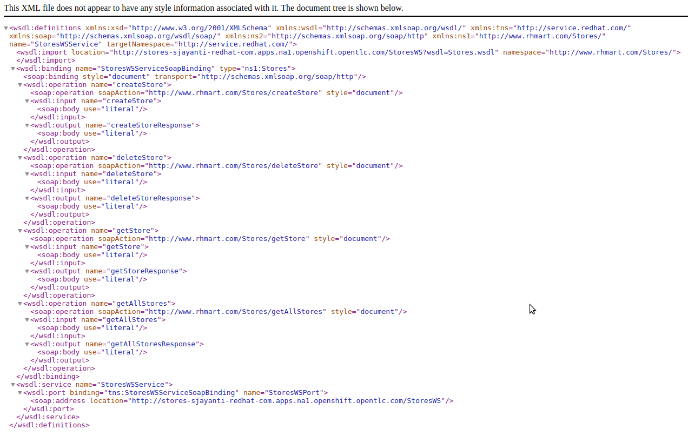
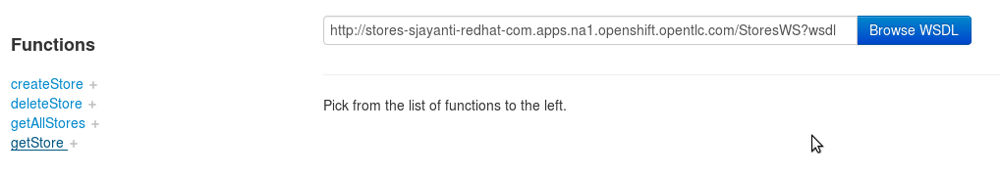
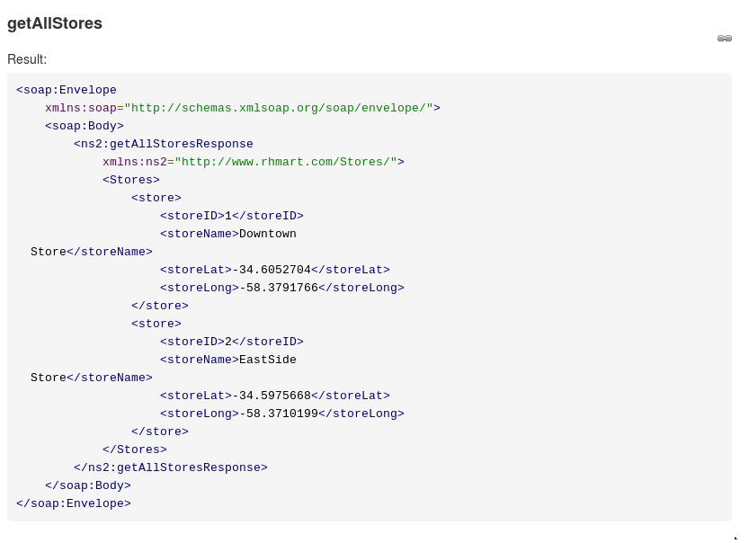
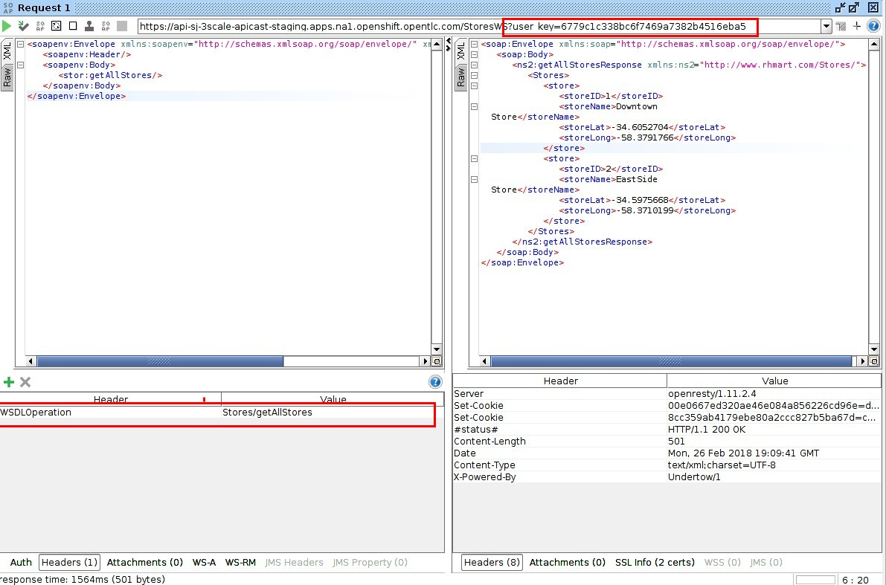
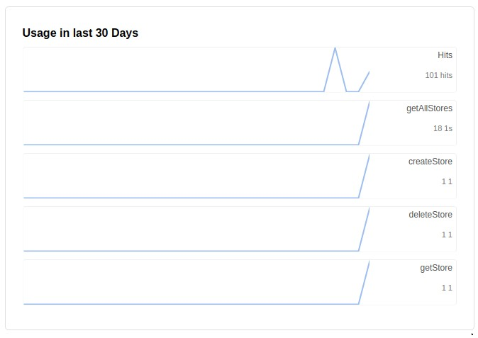
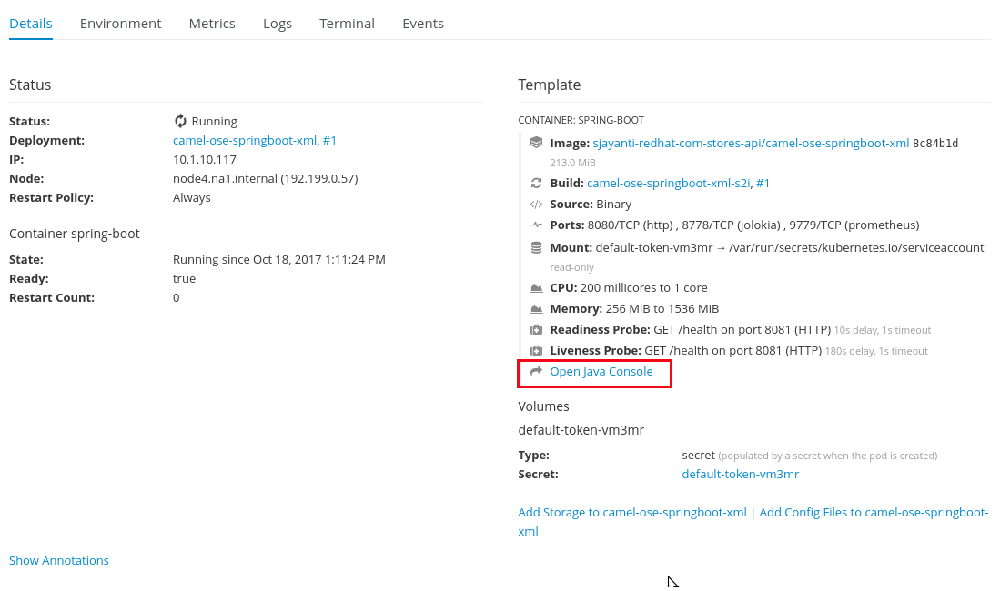
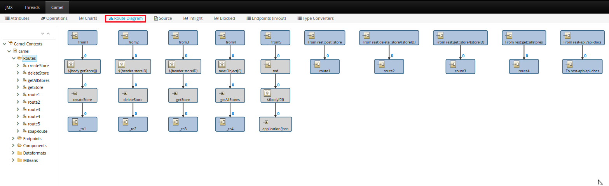

:scrollbar:
:data-uri:
:toc2:
:linkattrs:

== SOAP and OData Service Management Introduction Lab

.Goals

* Use Red Hat 3scale API Management's gateway to connect to SOAP web services
* Explore two SOAP solutions:
** Custom headers using Lua on NGINX to automatically map a REST request to a SOAP back end
** Camel route installed in Red Hat JBoss Fuse Integration Services to route a REST request from 3scale API Management's gateway to a SOAP web service endpoint
* Use 3scale API Management's gateway to connect to OData services

.Prerequisites
* Completion of previous labs of this course
* `OCP_WILDCARD_DOMAIN` environment variables set in your shell
+
TIP: To check if your shell still has these environment variables set, run the `echo $OCP_WILDCARD_DOMAIN` command. If the variables are no longer set, return to the first lab in this course and follow the steps there to set them again.
+
* 3scale Admin Portal URL and user credentials to log in
+
IMPORTANT: The URL for your lab environment is `https://$OCP_PROJECT_PREFIX-3scale-admin.$OCP_WILDCARD_DOMAIN`. The userID/password is `admin/admin`.
+
* Red Hat OpenShift Container Platform administration URL and userID/password.

:numbered:

== SOAP Service Management

=== Overview

In this lab you expose an existing SOAP-based JEE application running on a JBoss Enterprise Application Platform (EAP) container in the same OpenShift cluster. To do this, you use two different methods:

* Create custom modifications to Lua and NGINX configuration files to automatically map a REST request to a SOAP back end
* Deploy a JBoss Fuse Integration Services application to OpenShift, which is configured to expose it as a REST service

=== Deploy SOAP Service to OpenShift

In this section, you deploy a SOAP service running on JBoss EAP on the OpenShift Container Platform. 

Follow the instructions below.

. Inspect the SOAP service code:

* In this section you study the `Stores` web service interface and implementation.

.. Open the file ``$HOME/lab/3scale_development_labs/Stores/src/main/resources/wsdl`.
.. Inspect the `Stores` web service definition:
+
[source,xml]
-----
  <wsdl:portType name="Stores">
    <wsdl:operation name="getAllStores">
      <wsdl:input message="tns:getAllStoresRequest"/>
      <wsdl:output message="tns:getAllStoresResponse"/>
    </wsdl:operation>
    <wsdl:operation name="getStore">
    	<wsdl:input message="tns:getStoreRequest"></wsdl:input>
    	<wsdl:output message="tns:getStoreResponse"></wsdl:output>
    </wsdl:operation>
    <wsdl:operation name="createStore">
    	<wsdl:input message="tns:createStoreRequest"></wsdl:input>
    	<wsdl:output message="tns:createStoreResponse"></wsdl:output>
    </wsdl:operation>
    <wsdl:operation name="deleteStore">
    	<wsdl:input message="tns:deleteStoreRequest"></wsdl:input>
    	<wsdl:output message="tns:deleteStoreResponse"></wsdl:output>
    </wsdl:operation>
  </wsdl:portType>
-----

.. Open the file `$HOME/lab/3scale_development_labs/Stores/src/main/java/com/redhat/service/StoresWS.java`.
.. Inspect the SOAP web service implementation:
+
[source,java]
-----
@WebService(endpointInterface="com.redhat.service.Stores")
public class StoresWS implements Stores {

        @Inject
        StoreDao storeDAO;

        @Override
        public String createStore(Store store) {
                store = new Store(store.getStoreName(),store.getStoreLat(),store.getStoreLong());
                storeDAO.createStore(store);
                return "Store ID:" + store.getStoreID() + " CREATED";
        }

        @Override
        public String deleteStore(int storeID) {
                storeDAO.deleteStore(storeID);
                return "Store ID: " + storeID + " DELETED";
        }

        @Override
        public Store getStore(int storeID) {
                return storeDAO.getStoreById(storeID);
        }

        @Override
        public StoresType getAllStores() {
                StoresType st = new StoresType();
                st.store = storeDAO.getAll();
                return st;
        }

}
-----

* This service can be deployed on JBoss EAP and hosted on your shared OpenShift environment.

. Deploy the `Stores` web service to OpenShift:
+
IMPORTANT: When executing commands using the `oc` utility, you must be logged in to the master API of your OpenShift environment with your `OCP_USER_ID` credentials.

.. At the shell prompt of your VM, verify that you are using the `jboss` user.
.. Create a new project for your Stores API business service applications:
+
[source,text]
-----
$ oc new-project $OCP_PROJECT_PREFIX-stores-api \
     --display-name="Stores API" \
     --description="Stores API SOAP Services"
-----

.. If you are not already there, change to this new project:
+
[source,text]
-----
$ oc project $OCP_PROJECT_PREFIX-stores-api
-----
+
.. Import the `stores-api` template into your OpenShift environment:
+
[source,text]
-----
$ oc create -f $HOME/lab/3scale_development_labs/templates/stores-api.json
-----

.. Create the new application using the `stores-api` template:
+
[source,text]
-----
$ oc new-app --template=stores-soap --param HOSTNAME_HTTP=stores-api-$OCP_PROJECT_PREFIX.$OCP_WILDCARD_DOMAIN
-----

.. Wait a few minutes for the SOAP service to be deployed and for pods to be started, and then run this command:
+
[source,text]
-----
$ oc get pods
NAME                  READY     STATUS      RESTARTS   AGE
stores-soap-1-jnjrb   1/1       Running     0          2m
storesdb-1-6z5lx      1/1       Running     0          12m
-----

. Test the `Stores` API SOAP service:

.. In a web browser, navigate to the Stores Web Services Description Language (WSDL): `http://<<your stores api route>>/StoresWS?wsdl`
+
IMPORTANT: `<<your stores api route>>` is the hostname defined during the deployment.

* Expect to see the WSDL in the response:
+

.. In a new browser tab or window, open the URL link:http://wsdlbrowser.com["http://wsdlbrowser.com^"].
.. Provide the URL of the Stores WSDL and click *Browse*.
.. Check that the WSDL is imported successfully and that the list of functions is displayed on the page:
+

.. Click *getAllStores* to generate a sample request for the operation, and then click *Call function*.

* Expect a response similar to the following:
+

=== SOAP Request Using Lua and NGINX Customization

In this section, we create a custom Apicast configuration in order to customize 3scale API Management Platform to route to the SOAP service deployed above.

==== Create APIcast Staging and Production Routes

. Verify that you are in the `3scale AMP` project:
+
[source,text]
-----
$ oc project $OCP_PROJECT_PREFIX-3scale-amp
-----

. Create new routes for the Stores API staging and production APIcast:
+
[source,text]
-----
$ oc create route edge stores-soap-staging-route \
  --service=apicast-staging \
  --hostname=stores-soap-staging-apicast-$OCP_PROJECT_PREFIX.$OCP_WILDCARD_DOMAIN

$ oc create route edge stores-soap-production-route \
  --service=apicast-production \
  --hostname=stores-soap-production-apicast-$OCP_PROJECT_PREFIX.$OCP_WILDCARD_DOMAIN
-----

TIP: We will be using these routes to be configured as the production and sandbox API endpoints for the Stores SOAP service.

==== Custom Configuration to handle SOAP requests

. The custom `configuration.lua` is provided in $HOME/lab/3scale_development_labs/apicast_custom/configuration.lua file.
. This configuration should replace the default `configuration.lua` provided in the _apicast-staging_ and _apicast-production_ gateways.
. Study the code for `configuration.lua`. Notice the following 2 changes to handle SOAP requests:
.. Header `WSDLOperation`:
+
[source,text]
-----
        local headerParams = ngx.req.get_headers()
        system_name = headerParams["WSDLOperation"]
        if system_name~= nil then
          check_soap(system_name, usage_t, matched_rules, params)
        end

        -- if there was no match, usage is set to nil and it will respond a 404, this behavior can be changed
        return usage_t, concat(matched_rules, ", "), params
-----
+ 
NOTE: This section of code (lines 199-206) checks for a request header WSDLOperation and matches the same to a SOAP request operation. In a later section, we will configure Metrics for each SOAP operation supported by our SOAP service, so that 3scale can provide custom analytics for each SOAP request.
+
.. Function `check_soap`:
+
[source,text]
-----
local function check_soap(system_name, usage_t, matched_rules, params)

  local value = set_or_inc(usage_t, system_name, 1)

  usage_t[system_name] = value
  params['usage[' .. system_name .. ']'] = value
  insert(matched_rules, '/'.. system_name)

end
 
-----
+
NOTE: This section (line 69-77) provides matching of rules for metrics using the WSDLOperation. 
+
. Now follow the steps below to apply the changes to the _apicast-staging_ deployment:
.. Verify that you are logged in to OpenShift with your login credentials from the terminal.
.. Verify that you are using the `3scale AMP` project:
+
[source,text]
-----
$ oc project $OCP_PROJECT_PREFIX-3scale-amp
-----
+
.. Create a config map in the OpenShift project, making sure to provide the correct path to the `configuration.lua` file:
+
[source,text]
-----
$ oc create configmap apicast-soap --from-file=./configuration.lua
-----

.. Create a volume for the container, and mount it to the appropriate path:
+
[source,text]
-----
oc set volume dc/apicast-staging --add --name=apicast-soap --mount-path /opt/app-root/src/src/configuration.lua --source='{"configMap":{"name":"apicast-soap","items":[{"key":"configuration.lua","path":"configuration.lua"}]}}'
-----

.. The `oc volume` command does not support adding subpaths, so you need to apply a patch:
+
[source,text]
-----
$ oc patch dc/apicast-staging --type=json -p '[{"op": "add", "path": "/spec/template/spec/containers/0/volumeMounts/0/subPath", "value":"configuration.lua"}]'
-----
+
.. Now redeploy the apicast-staging container:
+
[source,text]
-----
$ oc rollout latest dc/apicast-staging
-----
.. Wait for a couple of minutes for the deployment to complete, and the pod to be in `Running` state.
+
[source,text]
-----
$ oc get pods | grep apicast-staging
apicast-staging-5-49cv1           1/1       Running   0          1m
-----

==== Configure 3scale API Management

. Log in to 3scale by Red Hat's Admin Portal with your userID/password credentials.
. Create a new service:
* *Name*: `Stores SOAP API`
* *System Name*: `stores-soap-api`
* *Description*: `Stores SOAP API`
. Create an application plan:
* *Name*: `StoresSOAPBasicPlan`
* *System Name*: `storesSOAPBasicPlan`
. Publish the application plan.
. In the *Developers* tab, select the *RHBank* account.
. Click *Applications* and then *Create Application*.
. Fill in the following information:
* *Application Plan*: `storesSOAPBasicPlan`
* *Name*: `StoresSOAPApp`
* *Description*: `Stores SOAP Application`
. In the *API* tab, click *Stores SOAP API*, and then click *Integration*.
* *Private Base URL*: URL to your SOAP service.
* *Staging Public Base URL*: URL of the route stores-soap-staging-apicast-$OCP_PROJECT_PREFIX.$OCP_WILDCARD_DOMAIN`, mapped to the `apicast-staging` service.
* *Production Public Base URL*: URL of the route `stores-soap-production-apicast-$OCP_PROJECT_PREFIX.$OCP_WILDCARD_DOMAIN`, mapped to the `apicast-production` service.
. Configure the Method:
.. *Friendly name*: StoresWS
.. *system name*: stores/storesws
.. *Description*: Stores SOAP Web Service
. Configure the metrics:
+
[options="header"]
|=======================
|Metric|System Name|Unit
|`getAllStores`|`Stores/getAllStores`|`1`
|`createStore`|`Stores/createStore`|`1`
|`deleteStore`|`Stores/deleteStore`|`1`
|`getStore`|`Stores/getStore`|`1`
|=======================
+ 
. Configure Mapping rules:
+
[options="header"]
|=======================
|Verb|Pattern|Increment|Metric or Method
|`POST`|`/StoresWS`|`1`|`stores/storesws`
|`GET`|`/StoresWS`|`1`|`hits`
|=======================
+ 
. Create an API Test GET request:
* *API Test GET Request*: `/StoresWS?wsdl`
.  Click *Update and test in the Staging Environment*.
. Make a test request to the staging URL.

.. Test the API by making a `curl` request to the staging URL:
+
[source,text]
-----
$ curl -k “<<stores-soap-staging-apicast route>>/StoresWS?wsdl&user_key=<<your user_key>>“
-----
+
.. Response should be similar to below:
+
[source,text]
-----
<wsdl:definitions xmlns:xsd="http://www.w3.org/2001/XMLSchema" xmlns:wsdl="http://schemas.xmlsoap.org/wsdl/" xmlns:tns="http://service.redhat.com/" xmlns:soap="http://schemas.xmlsoap.org/wsdl/soap/" xmlns:ns2="http://schemas.xmlsoap.org/soap/http" xmlns:ns1="http://www.rhmart.com/Stores/" name="StoresWSService" targetNamespace="http://service.redhat.com/">
<wsdl:import location="http://stores-api-sj.apps.na1.openshift.opentlc.com/StoresWS?wsdl=Stores.wsdl" namespace="http://www.rhmart.com/Stores/"></wsdl:import>
<wsdl:binding name="StoresWSServiceSoapBinding" type="ns1:Stores">
<soap:binding style="document" transport="http://schemas.xmlsoap.org/soap/http"/>
<wsdl:operation name="createStore">
<soap:operation soapAction="http://www.rhmart.com/Stores/createStore" style="document"/>
<wsdl:input name="createStore">
<soap:body use="literal"/>
</wsdl:input>
<wsdl:output name="createStoreResponse">
<soap:body use="literal"/>
</wsdl:output>
</wsdl:operation>
<wsdl:operation name="deleteStore">
<soap:operation soapAction="http://www.rhmart.com/Stores/deleteStore" style="document"/>
<wsdl:input name="deleteStore">
<soap:body use="literal"/>
</wsdl:input>
<wsdl:output name="deleteStoreResponse">
<soap:body use="literal"/>
</wsdl:output>
</wsdl:operation>
<wsdl:operation name="getStore">
<soap:operation soapAction="http://www.rhmart.com/Stores/getStore" style="document"/>
<wsdl:input name="getStore">
<soap:body use="literal"/>
</wsdl:input>
<wsdl:output name="getStoreResponse">
<soap:body use="literal"/>
</wsdl:output>
</wsdl:operation>
<wsdl:operation name="getAllStores">
<soap:operation soapAction="http://www.rhmart.com/Stores/getAllStores" style="document"/>
<wsdl:input name="getAllStores">
<soap:body use="literal"/>
</wsdl:input>
<wsdl:output name="getAllStoresResponse">
<soap:body use="literal"/>
</wsdl:output>
</wsdl:operation>
</wsdl:binding>
<wsdl:service name="StoresWSService">
<wsdl:port binding="tns:StoresWSServiceSoapBinding" name="StoresWSPort">
<soap:address location="http://stores-api-sj.apps.na1.openshift.opentlc.com/StoresWS"/>
</wsdl:port>
</wsdl:service>
</wsdl:definitions>

-----
+
.. Now make a POST request to the Web Service for each operation and check that you get the correct result:
+
[source,text]
-----
$ curl -X POST --header "WSDLOperation: Stores/getAllStores"  --header "Content-Type: application/soap+xml"  --header "Accept: application/soap+xml"  --header "SOAPAction: http://www.rhmart.com/Stores/getAllStores" -d '<soapenv:Envelope xmlns:soapenv="http://schemas.xmlsoap.org/soap/envelope/" xmlns:stor="http://www.rhmart.com/Stores/"><soapenv:Header/><soapenv:Body><stor:getAllStores/></soapenv:Body></soapenv:Envelope>' https://api-sj-3scale-apicast-staging.apps.na1.openshift.opentlc.com:443/StoresWS?user_key=6779c1c338bc6f7469a7382b4516eba5 --verbose -k

-----

.. Response should contain the correct SOAP response:
+
[source,text]
-----
...
<soap:Envelope xmlns:soap="http://schemas.xmlsoap.org/soap/envelope/">
   <soap:Body>
      <ns2:getAllStoresResponse xmlns:ns2="http://www.rhmart.com/Stores/">
         <Stores>
            <store>
               <storeID>1</storeID>
               <storeName>Downtown
  Store</storeName>
               <storeLat>-34.6052704</storeLat>
               <storeLong>-58.3791766</storeLong>
            </store>
            <store>
               <storeID>2</storeID>
               <storeName>EastSide
  Store</storeName>
               <storeLat>-34.5975668</storeLat>
               <storeLong>-58.3710199</storeLong>
            </store>
         </Stores>
      </ns2:getAllStoresResponse>
   </soap:Body>
</soap:Envelope>
-----
+
.. Now try the other SOAP requests for 'getStore`, `createStore` and `deleteStore`, and observe that the requests are served with correct responses.
+
NOTE: It can be easier to execute the SOAP requests using SOAPUI. 
+

==== Analytics

Notice that the metrics you have set up for each operation are captured correctly by Apicast. You should see the number of hits corresponding to each WSDLOperation that you have requested to the staging endpoint.

==== SOAP Requests to Production Endpoint(Bonus)

Now repeat the steps for updating the `configuration.lua` for the _apicast-production_ deployment, and repeat the SOAP requests once you have promoted the service to production.

=== SOAP Request Using JBoss Fuse Integration Services

An alternative to customizing Lua scripts on Apicast for supporting SOAP services is to use JBoss Fuse for mediating between API Management and SOAP Web services. In this section you create a Fuse camel integration to expose a REST endpoint and route to the SOAP service deployed earlier. The REST endpoint is then configured in 3scale API Management Platform as a service.

==== Deploy `stores fis` Project to OpenShift

IMPORTANT: When running commands using the `oc` utility, you must be logged in to the master API of your OpenShift environment with your `OCP_USER_ID` credentials.

. At the shell prompt of your VM, verify that you are using the `jboss` user.
. If you are not already there, change to this new project:
+
[source,text]
-----
$ oc project $OCP_PROJECT_PREFIX-stores-api
-----

. Import the `stores-fis` template to your OpenShift environment:
+
[source,text]
-----
$ oc create -f $HOME/lab/3scale_development_labs/templates/stores-fis.json
-----

. Create a new application using the `stores-fis` template:
+
[source,text]
-----
$ oc new-app --template=stores-fis --param ROUTE_HOST=stores-fis-$OCP_PROJECT_PREFIX.$OCP_WILDCARD_DOMAIN
-----

. Wait a few minutes for the `fis` service to be deployed and for the pods to be started:
+
[source,text]
-----
$ oc get pods
NAME                  READY     STATUS      RESTARTS   AGE
stores-fis-1-ff256    1/1       Running     0          35m
stores-soap-1-jnjrb   1/1       Running     0          1h
storesdb-1-6z5lx      1/1       Running     0          1h
-----

. Examine the Camel route:

.. Log in to the OpenShift administration console from a web browser using your login credentials.
.. Navigate to the `Stores API` project.
.. Click the *Stores-FIS* pod, and then click *Open Java Console*:
+

+
.. Click *Route Diagram*.
* Expect to see all of the Camel routes defined:
+

.. Alternatively, click *Source* and look into the Camel route:
* A REST route is exposed to provide HTTP methods and URLs for the different SOAP operations provided by the Stores API:
+
[source,xml]
-----
    <route id="route1" rest="true">
        <from uri="rest:post::store?routeId=route1&amp;componentName=servlet&amp;inType=com.redhat.service.CreateStore&amp;outType=com.redhat.service.CreateStoreResponse&amp;consumes=application%2Fjson"/>
        <restBinding component="servlet" consumes="application/json" id="restBinding1" outType="com.redhat.service.CreateStoreResponse" type="com.redhat.service.CreateStore"/>
        <to customId="true" id="route1" uri="direct:createStore"/>
    </route>
    <route id="route2" rest="true">
        <from uri="rest:delete::store/{storeID}?routeId=route2&amp;componentName=servlet&amp;outType=com.redhat.service.DeleteStoreResponse"/>
        <restBinding component="servlet" id="restBinding2" outType="com.redhat.service.DeleteStoreResponse"/>
        <to customId="true" id="route2" uri="direct:deleteStore"/>
    </route>
    <route id="route3" rest="true">
        <from uri="rest:get::store/{storeID}?routeId=route3&amp;produces=application%2Fjson&amp;componentName=servlet&amp;outType=com.redhat.service.GetStoreResponse"/>
        <restBinding bindingMode="json" component="servlet" id="restBinding3" outType="com.redhat.service.GetStoreResponse" produces="application/json"/>
        <to customId="true" id="route3" uri="direct:getStore"/>
    </route>
    <route id="route4" rest="true">
        <from uri="rest:get::allstores?routeId=route4&amp;produces=application%2Fjson&amp;componentName=servlet&amp;outType=com.redhat.service.StoresType"/>
        <restBinding bindingMode="json" component="servlet" id="restBinding4" outType="com.redhat.service.StoresType" produces="application/json"/>
        <to customId="true" id="route4" uri="direct:getAllStores"/>
    </route>

-----

* Note the two GET methods for `getStore` and `getAllStores`, the POST method for `postStore`, and the DELETE method for `deleteStore` operation.

* Each of the `direct` routes corresponds to the four operations defined in the REST service:
+
[source,xml]
-----
   <route customId="true" id="createStore">
        <from customId="true" id="_from1" uri="direct:createStore"/>
        <setBody customId="true" id="_setBody1">
            <simple>${body.getStore()}</simple>
        </setBody>
        <setHeader customId="true" headerName="soapMethod" id="_setHeader1">
            <constant>createStore</constant>
        </setHeader>
        <to customId="true" id="_to1" uri="direct:soap"/>
    </route>
    <route customId="true" id="deleteStore">
        <from customId="true" id="_from2" uri="direct:deleteStore"/>
        <setBody customId="true" id="_setBody2">
            <simple resultType="int">${header.storeID}</simple>
        </setBody>
        <setHeader customId="true" headerName="soapMethod" id="_setHeader2">
            <constant>deleteStore</constant>
        </setHeader>
        <to customId="true" id="_to2" uri="direct:soap"/>
    </route>
    <route customId="true" id="getStore">
        <from customId="true" id="_from3" uri="direct:getStore"/>
        <setBody customId="true" id="_setBody3">
            <simple resultType="int">${header.storeID}</simple>
        </setBody>
        <setHeader customId="true" headerName="soapMethod" id="_setHeader3">
            <constant>getStore</constant>
        </setHeader>
        <to customId="true" id="_to3" uri="direct:soap"/>
    </route>
    <route customId="true" id="getAllStores">
        <from customId="true" id="_from4" uri="direct:getAllStores"/>
        <setBody customId="true" id="_setBody4">
            <mvel>new Object[0]</mvel>
        </setBody>
        <setHeader customId="true" headerName="soapMethod" id="_setHeader4">
            <constant>getAllStores</constant>
        </setHeader>
        <to customId="true" id="_to4" uri="direct:soap"/>
    </route>
-----
** Each of the routes above gets the request, constructs the CXF request message object, and updates the header to the right `soapMethod` for calling the SOAP web service.

* A route to call the SOAP endpoint:
+
[source,xml]
-----
    <route customId="true" id="soapRoute">
        <from customId="true" id="_from5" uri="direct:soap"/>
        <toD customId="true" id="tod" uri="cxf:bean:wsStores?defaultOperationName=${header.soapMethod}&amp;exchangePattern=InOut"/>
        <setBody customId="true" id="_setBodySoap">
            <simple>${body[0]}</simple>
        </setBody>
        <setHeader customId="true" headerName="Content-Type" id="_setHeaderContextType">
            <constant>application/json</constant>
        </setHeader>
    </route>
-----

. Test the Camel REST route:

.. Send a `curl` request to the `stores-fis` route to make a call to the REST web service and check that the SOAP web service is called and that the response is converted to `application/json`:
+
[source,text]
-----
$ curl -k <<camel-rest-http route>>/allstores

-----

.. Check the response:
+
[source,text]
-----
{"store":[{"storeID":1,"storeName":"Downtown\n  Store","storeLat":-34.6052704,"storeLong":-58.3791766},{"storeID":2,"storeName":"EastSide\n  Store","storeLat":-34.5975668,"storeLong":-58.3710199}]}[sjayanti@localhost camel-webservice-fis]
-----
* You can also send sample requests to the other endpoints and ensure that there are no errors.

The REST-SOAP Camel proxy is now correctly deployed, and you can begin to configure the APIcast gateway to use this REST endpoint to communicate with the SOAP web service.

==== Use Swagger Tool to Import Documents (Optional)

* Follow the steps in the previous lab to import the API documents into 3scale API Management.

==== Create APIcast Staging and Production Routes

. Follow the steps in the API Management lab to create secure routes to the `apicast-staging` and `apicast-production` services for the Stores API.

. Verify that you are in the `3scale AMP` project:
+
[source,text]
-----
$ oc project $OCP_PROJECT_PREFIX-3scale-amp
-----

. Create new routes for the Stores API staging and production APIcast:
+
[source,text]
-----
$ oc create route edge stores-staging-route \
  --service=apicast-staging \
  --hostname=stores-staging-apicast-$OCP_PROJECT_PREFIX.$OCP_WILDCARD_DOMAIN

$ oc create route edge stores-production-route \
  --service=apicast-production \
  --hostname=stores-production-apicast-$OCP_PROJECT_PREFIX.$OCP_WILDCARD_DOMAIN
-----

==== Configure 3scale API Management

. Log in to 3scale by Red Hat's Admin Portal with your userID/password credentials.
. Create a new service:
* *Name*: `Stores API`
* *System Name*: `stores-api`
* *Description*: `Stores API`
. Create an application plan:
* *Name*: `StoresPremiumPlan`
* *System Name*: `storesPremiumPlan`
. Publish the application plan.
. In the *Developers* tab, select the *RHBank* account.
. Click *Applications* and then *Create Application*.
. Fill in the following information:
* *Application Plan*: `StoresPremiumPlan`
* *Name*: `StoresApp`
* *Description*: `Stores Application`
. In the *API* tab, click *Stores API*, and then click *Integration*.
* *Private Base URL*: URL to your JBoss Fuse Camel REST route.
* *Staging Public Base URL*: Create a new edge secure route in the `3scale_AMP` project to `stores-staging-apicast-$OCP_PROJECT_PREFIX.$OCP_WILDCARD_DOMAIN`, mapped to the `apicast-staging` service.
* *Production Public Base URL*: Create a new route in the `3scale_AMP` project to `stores-production-apicast-$OCP_PROJECT_PREFIX.$OCP_WILDCARD_DOMAIN`, mapped to the `apicast-production` service.
. Create an API Test GET request:
* *API Test GET Request*: `/allstores`
.  Click *Update and test in the Staging Environment*.
. Make a test request to the staging URL.
. Promote to production, and make a test request to the production URL:

.. Test the API by making a `curl` request to the staging URL, and check the response:
+
[source,text]
-----
$ curl -k “<<camel-stage-apicast route>>/allstores?user_key=<<your user_key>>“
{"store":[{"storeID":1,"storeName":"Downtown\n  Store","storeLat":-34.6052704,"storeLong":-58.3791766},{"storeID":2,"storeName":"EastSide\n  Store","storeLat":-34.5975668,"storeLong":-58.3710199}]}

-----

.. Promote the API to production, test the production URL, and check the response:
+
[source,text]
-----
$ curl -k “<<camel-prod-apicast route>>/allstores?user_key=<<your user_key>>“
{"store":[{"storeID":1,"storeName":"Downtown\n  Store","storeLat":-34.6052704,"storeLong":-58.3791766},{"storeID":2,"storeName":"EastSide\n  Store","storeLat":-34.5975668,"storeLong":-58.3710199}]}

-----

* A Camel route can be used to provide routing for 3scale API Management's gateway to the SOAP web service.

== OData Service Management

=== Introduction

In this section you deploy an OData(Open Data Protocol) service. link:http://www.odata.org/[OData^] is a standard that defines a set of best practices for building and consuming RESTful APIs. The service you deploy is based on a JBoss Data Virtualization for OpenShift Container Platform virtual database (VDB). This VDB has a virtual view that retrieves data from two database tables (MySQL and PostgreSQL) and presents them as a single SQL ANSI table. Then, out of the box, this view is exposed in JBoss Data Virtualization as an OData REST service. You can find more information here:

* link:https://www.redhat.com/en/technologies/jboss-middleware/data-virtualization[JBoss Data Virtualization^]

* link:https://access.redhat.com/documentation/en-us/red_hat_jboss_data_virtualization/6.3/html/red_hat_jboss_data_virtualization_for_openshift/[Red Hat JBoss Data Virtualization for OpenShift^].

=== Deploy `Stock API` Project to OpenShift

In this section you deploy the Stock API onto a JBoss EAP container running on OpenShift. The stock data exists in two databases: MySQL and PostgreSQL. JBoss Data Virtualization is used to provide data virtualization and present the combined data view as an OData REST service.

IMPORTANT: When executing commands using the `oc` utility, you must be logged in to the master API of your OpenShift Container Platform environment with your `OCP_USER_ID` credentials.

. At the shell prompt of your VM, verify that you are using the `jboss` user.
. Create a new project for your stock API business service applications:
+
[source,text]
-----
$ oc new-project $OCP_PROJECT_PREFIX-stock-api \
     --display-name="Stock API" \
     --description="Stock API ODATA Services"
-----

. If you are not already there, change to this new project:
+
[source,text]
-----
$ oc project $OCP_PROJECT_PREFIX-stock-api
-----
. Import the `stock-api` template to your OpenShift environment:
+
[source,text]
-----
$ oc create -f $HOME/lab/3scale_development_labs/templates/stock-api.json
-----

. Add the `datasources` environment variable secret to the project:
+
[source,text]
-----
$ oc secret new datavirt-app-config $HOME/lab/3scale_development_labs/Stock/datasources.env
-----

. Create a new service account for the `datavirt` user and provide view access:
+
[source,text]
-----
$ oc create serviceaccount datavirt-service-account
$ oc policy add-role-to-user view system:serviceaccount:stock-api:datavirt-service-account
-----

. Create the new application using the `stock-api` template:
+
[source,text]
-----
$ oc new-app --template=stock-api --param HOSTNAME_HTTP=stock-api-$OCP_PROJECT_PREFIX.$OCP_WILDCARD_DOMAIN
-----
. Test the `stock` API service deployed in your OpenShift environment:
+
[source,text]
-----
$ oc get pods
NAME                  READY     STATUS      RESTARTS   AGE
stock-api-2-34b7h     1/1       Running     0          16h
stockmysql-3-3g5v9    1/1       Running     0          18h
stockpg-5-j8181       1/1       Running     0          18h
-----

. Once the API and the database pods are running, test the `odata` service by making a request to the endpoint:
+
[source,text]
-----
$ curl -k http://stock-api-$OCP_PROJECT_PREFIX.$OCP_WILDCARD_DOMAIN/odata4/Stock-API/FederatedStock/stock?$format=JSON
-----

* Expect a response like the following:
+
[source,JSON]
-----
{"@odata.context":"$metadata#stock","value":[{"productid":1,"amount":20.0,"storeid":1},{"productid":1,"amount":30.0,"storeid":2},{"productid":2,"amount":30.0,"storeid":1},{"productid":2,"amount":14.0,"storeid":2},{"productid":3,"amount":1.0,"storeid":1},{"productid":3,"amount":40.0,"storeid":2},{"productid":4,"amount":14.0,"storeid":1},{"productid":4,"amount":100.0,"storeid":2},{"productid":5,"amount":22.0,"storeid":1},{"productid":5,"amount":2.0,"storeid":2},{"productid":6,"amount":880.0,"storeid":1},{"productid":6,"amount":10.0,"storeid":2},{"productid":7,"amount":1200.0,"storeid":1},{"productid":7,"amount":32.0,"storeid":2},{"productid":8,"amount":532.0,"storeid":1},{"productid":8,"amount":1.0,"storeid":2},{"productid":9,"amount":10.0,"storeid":1},{"productid":9,"amount":123.0,"storeid":2},{"productid":10,"amount":1.0,"storeid":1},{"productid":10,"amount":730.0,"storeid":2}]}[sjayanti@localhost camel-webservice-fis]
-----

* The REST `odata` service is now correctly deployed, and you can now begin to configure the APIcast gateway to use this REST endpoint to communicate with the service.

=== Create APIcast Staging and Production Routes

Follow the steps in the API Management lab to create secure routes to the `apicast-staging` and `apicast-production` services for the Stock API.

. Verify that you are in the `3scale AMP` project:
+
[source,text]
-----
$ oc project $OCP_PROJECT_PREFIX-3scale-amp
-----
+
. Create new routes for the Stock API staging and production APIcast:
+
[source,text]
-----
$ oc create route edge stock-staging-route \
  --service=apicast-staging \
  --hostname=stock-staging-apicast-$OCP_PROJECT_PREFIX.$OCP_WILDCARD_DOMAIN

$ oc create route edge stock-production-route \
  --service=apicast-production \
  --hostname=stock-production-apicast-$OCP_PROJECT_PREFIX.$OCP_WILDCARD_DOMAIN
-----

=== Configure 3scale API Management

. Log in to 3scale by Red Hat's Admin Portal with your userID/password credentials.
. Create a new service:
* *Name*: `Stock API`
* *System Name*: `stock-api`
* *Description*: `Stock API`
. Create an application plan:
* *Name*: `StockPremiumPlan`
* *System Name*: `stockPremiumPlan`
. Publish the application plan.
. In the *Developers* tab, click *RHBank*.
. Click *Applications* and then click *Create Application*:
* *Application Plan*: `StockPremiumPlan`
* *Name*: `StockApp`
* *Description*: `Stock Application`
. In the *API* tab, click *Stock API* and then click *Integration*:
* *Private Base URL*: URL to your JBoss Data Virtualization route.
* *Staging Public Base URL*: Create new edge secure route in `3scale_AMP` project to `stock-staging-apicast-$OCP_PROJECT_PREFIX.$OCP_WILDCARD_DOMAIN`, mapped to the `apicast-staging` service.
* *Production Public Base URL*: Create new route in `3scale_AMP` project to `stock-prod-apicast-$OCP_PROJECT_PREFIX.$OCP_WILDCARD_DOMAIN`, mapped to the `apicast-production` service.
. Create a mapping rule:
* *Operation*: `GET`
* *Pattern*: `/odata4/Stock-API/FederatedStock/stock`
. Create API Test GET request:
* *API Test GET Request*: `/odata4/Stock-API/FederatedStock/stock?$format=JSON`
.  Click *Update and test in the Staging Environment*.
. Make a test request to the staging URL.
. Promote to production and make a test request to the production URL.
