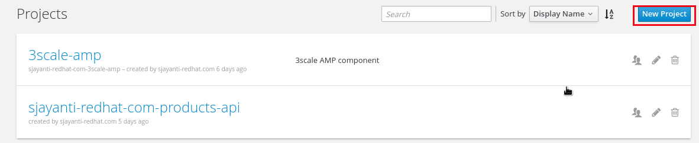
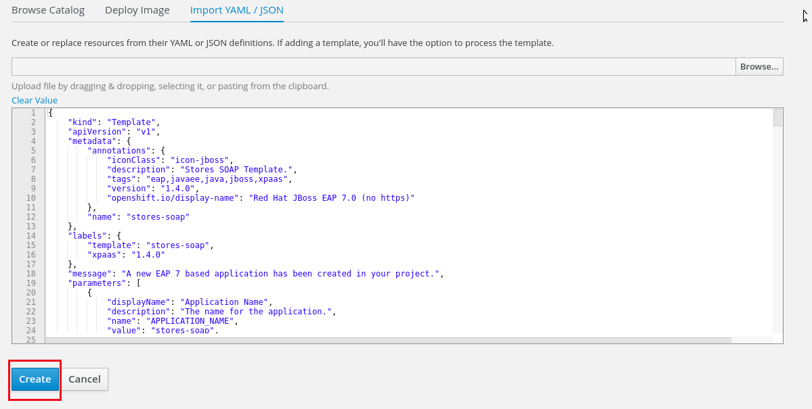
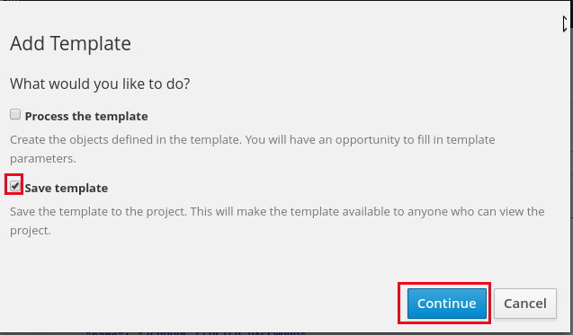
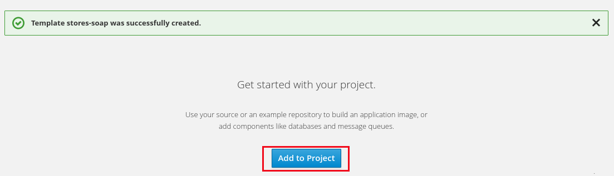
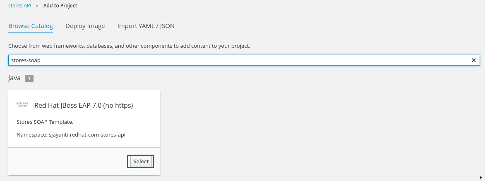
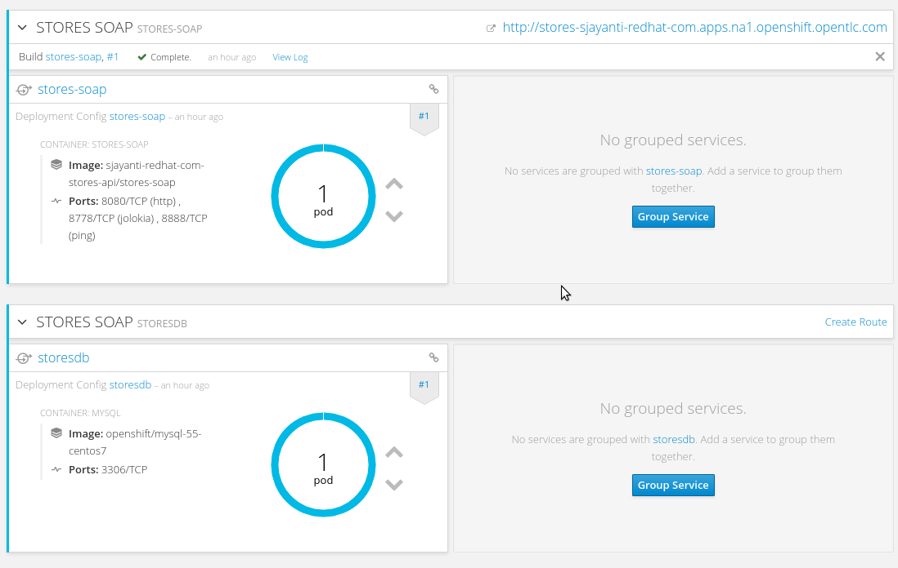
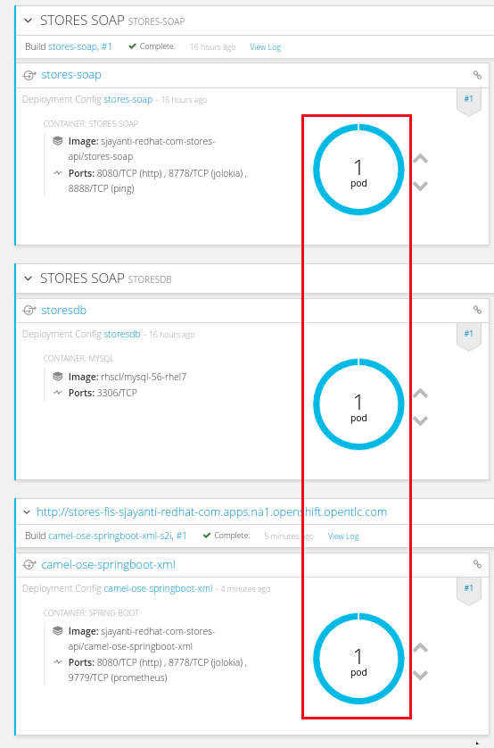

:scrollbar:
:data-uri:
:toc2:
:numbered:

= SOAP & OData Service Management Lab - Introduction

.Goals

. Use the 3scale API Management Gateway to connect to SOAP Web Services.
. Explore 2 solutions for SOAP:
.. Create custom headers using lua on NGINX to automatically map REST request to SOAP backend.
.. Create a Camel Route installed in Fuse Integration Services (FIS) to route the REST request from the 3scale Gateway to the SOAP Web Service endpoint.
. Use the 3scale API Management Gateway to connect to ODATA Services.

.Prerequisites
* Completion of the previous labs of this course
* * The `EXTERNAL_HOST` and `OCP_WILDCARD_DOMAIN` environment variables set in your shell
+
TIP: To check if your shell still has this environment variable set, execute the `echo $EXTERNAL_HOST` and `echo $OCP_WILDCARD_DOMAIN` commands. If the variable is no longer set, return to the first lab in this course and follow the steps there to set it again.
+
* 3scale Admin Portal URL and user credentials to login.
+
IMPORTANT: The 3scale URL for your lab environment will be `https://$OCP_PROJECT_PREFIX-3scale-admin.$OCP_WILDCARD_DOMAIN`. The userid/password is `admin/admin`.
+
* OCP Administration URL and userid/password.
+
IMPORTANT: The OCP URL for your lab environment will be `https://$EXTERNAL_HOST:8443/`. The userid/password for development is `developer/developer, and administration is `admin/admin`.

== SOAP Service Management Lab

=== Overview

In this lab you will expose an existing SOAP based JEE application running on a JBoss EAP container in the same OCP cluster. To do this, you will follow 2 different methods:

. Create custom modifications to lua and NGINX configuration files to automatically map REST request to SOAP backend.
. Deploy a Fuse Integration Services (FIS) application to OCP, which was configured to expose it as a REST service.

=== SOAP Request Using Lua & NGINX Customization

Reference: http://middlewareblog.redhat.com/2017/08/30/integrating-soap-based-web-services-into-red-hat-3scale-api-management/

=== SOAP Request Using Fuse Integration Services

In this lab you will expose an existing SOAP based JEE application running on a JBoss EAP container in the same OCP cluster. To do this, you will deploy a Fuse Integration Services (FIS) application to OCP, which was configured to expose it as a REST service. This REST endpoint is provided as the backend API for the APICast Gateway.

==== Deploy the Store WebService to OCP

===== Inspect SOAP Service Code

. Study the web Service interface and implementation for StoresWS.
.. Open the file `/home/sjayanti/git_share/PartnerTraining/3scale/3scale_development_labs/Stores/src/main/resources/wsdl`
.. Inspect the Stores Web Service definition:
+
[source,xml]
-----
  <wsdl:portType name="Stores">
    <wsdl:operation name="getAllStores">
      <wsdl:input message="tns:getAllStoresRequest"/>
      <wsdl:output message="tns:getAllStoresResponse"/>
    </wsdl:operation>
    <wsdl:operation name="getStore">
    	<wsdl:input message="tns:getStoreRequest"></wsdl:input>
    	<wsdl:output message="tns:getStoreResponse"></wsdl:output>
    </wsdl:operation>
    <wsdl:operation name="createStore">
    	<wsdl:input message="tns:createStoreRequest"></wsdl:input>
    	<wsdl:output message="tns:createStoreResponse"></wsdl:output>
    </wsdl:operation>
    <wsdl:operation name="deleteStore">
    	<wsdl:input message="tns:deleteStoreRequest"></wsdl:input>
    	<wsdl:output message="tns:deleteStoreResponse"></wsdl:output>
    </wsdl:operation>
  </wsdl:portType>
-----
+
.. Open the file `/home/jboss/lab/3scale_development_labs/Stores/src/main/java/com/redhat/service/StoresWS.java`
.. Inspect the SOAP Web Service Implementation:
+
[source,java]
-----
@WebService(endpointInterface="com.redhat.service.Stores")
public class StoresWS implements Stores {

        @Inject
        StoreDao storeDAO;

        @Override
        public String createStore(Store store) {
                store = new Store(store.getStoreName(),store.getStoreLat(),store.getStoreLong());
                storeDAO.createStore(store);
                return "Store ID:" + store.getStoreID() + " CREATED";
        }

        @Override
        public String deleteStore(int storeID) {
                storeDAO.deleteStore(storeID);
                return "Store ID: " + storeID + " DELETED";
        }

        @Override
        public Store getStore(int storeID) {
                return storeDAO.getStoreById(storeID);
        }

        @Override
        public StoresType getAllStores() {
                StoresType st = new StoresType();
                st.store = storeDAO.getAll();
                return st;
        }

}
-----

This service can be deployed on JBoss EAP, hosted on your shared OCP environment.

===== Deploy StoresWS to OCP

. Login to your OCP admin console with your OPENTLC userid and password from a web browser.
. Select `New Project` button.
+

+
. Create a new project with following values:
.. *Name*: $OCP_PROJECT_PREFIX-stores-api
+
IMPORTANT: Please provide the value of the $OCP_PROJECT_PREFIX in the form, e.g if the OCP_PROJECT_PREFIX is *sjayanti-redhat-com*, then the project name should be *sjayanti-redhat-com-stores-api*.
+
.. *Display Name*: Stores API
.. *Description*: Stores API Project
. Click on `Create`.
+
image::images/3scale_amp_stores_api_2.png[]
+
. Click on `Import YAML/JSON.
. Open the file `/home/jboss/lab/3scale_development_labs/templates/stores-api.json` in a text editor.
+
TIP: If you do not have access to the copy function in the VM, you can open the file on the browser : https://raw.githubusercontent.com/gpe-mw-training/3scale_development_labs/master/templates/stores-api.json . 
+
. Copy the contents of the file to the text field in the *Import YAML/JSON* page.
+

+
. Click on `Create`.
. In the pop-up form, uncheck `Process Template`, and check `Save Template.
. Click on `Create`.
+

+
. You should get a message that the template was saved successfully.
+

+
. Click on `Add to Project`.
. Search for the template `stores-soap`.
+

+
. Click on `Select`.
. In the form, provide the *Hostname* as `stores-$OCP_PROJECT_PREFIX.$OCP_WILDCARD_DOMAIN.
+
IMPORTANT: Please provide the value of $OCP_PROJECT_PREFIX and $OCP_WILDCARD_DOMAIN in the form, e.g if the OCP_PROJECT_PREFIX is *sjayanti-redhat-com* and $OCP_WILDCARD_DOMAIN is *apps.na1.openshift.opentlc.com*, then the Hostname should be *stores-sjayanti-redhat-com.apps.na1.openshift.opentlc.com*.
+
. Scroll down and click on `Create` button.
. Wait a few minutes for the SOAP service to be deployed and pods started.
+

+

===== Test the Stores API SOAP service

. On a web browser, navigate to the stores wsdl: http://<<your stores api route>>/StoresWS?wsdl
+
IMPORTANT: The <<your stores api route>> should be the *Hostname* you have defined during the deployment.
+
. You should see the WSDL in response:
+
image::images/3scale_amp_stores_api_8.png[]
+
. On a new browser tab/window, open the URL: http://wsdlbrowser.com
. Provide the WSDL URL of the Stores WSDL and click the `Browse` button.
. Check that the WSDL is imported successfully and the list of functions are displayed on the page.
+
image::images/3scale_amp_stores_api_9.png[]
+
. Click on `getAllStores` to generate a sample request for the operation. Click on `Call function`.

. The response should be as below:
+
image::images/3scale_amp_stores_api_11.png[]

==== Deploy `Stores FIS` Project to OCP

. Login to the OpenShift console using your OPENTLC userid and password.
. Choose the `Stores API` project.
. Click on `Import YAML/JSON and import the file /home/jboss/labs/3scale_development_labs/templates/stores-fis.json.
+
TIP: If you cannot copy the contents of the file, you can use the github URL https://raw.githubusercontent.com/gpe-mw-training/3scale_development_labs/master/templates/stores-fis.json.
+
. Import the template and choose to `Process Template`.
. Provide the host name as `stores-fis-$OCP_PROJECT_PREFIX.$OCP_WILDCARD_DOMAIN`.
+
IMPORTANT: Please provide the value of $OCP_PROJECT_PREFIX and $OCP_WILDCARD_DOMAIN in the form, e.g if the OCP_PROJECT_PREFIX is *sjayanti-redhat-com* and $OCP_WILDCARD_DOMAIN is *apps.na1.openshift.opentlc.com*, then the Hostname should be *stores-sjayanti-redhat-com.apps.na1.openshift.opentlc.com*.
+
. Scroll down and click on *Create*.
. Wait for a few minutes until the stores-fis pod is started.
. Now you should notice 3 pods running in your `Stores API` project.
+

+

===== Examine the Camel Route

. Click on the `Stores-FIS` pod and select `Open Java Console.`.
+
image::images/3scale_amp_stores_api_13.png[]
+
. Click on `Route Diagram` and you should see all the Camel routes defined:
+
image::images/3scale_amp_stores_api_14.png[]
+
. You can also click on the `Source` and look into the camel route.
.. A REST route is exposed to provide HTTP methods and URLs for the different SOAP operations provided by the Stores API.
+
[source,xml]
-----
    <route id="route1" rest="true">
        <from uri="rest:post::store?routeId=route1&amp;componentName=servlet&amp;inType=com.redhat.service.CreateStore&amp;outType=com.redhat.service.CreateStoreResponse&amp;consumes=application%2Fjson"/>
        <restBinding component="servlet" consumes="application/json" id="restBinding1" outType="com.redhat.service.CreateStoreResponse" type="com.redhat.service.CreateStore"/>
        <to customId="true" id="route1" uri="direct:createStore"/>
    </route>
    <route id="route2" rest="true">
        <from uri="rest:delete::store/{storeID}?routeId=route2&amp;componentName=servlet&amp;outType=com.redhat.service.DeleteStoreResponse"/>
        <restBinding component="servlet" id="restBinding2" outType="com.redhat.service.DeleteStoreResponse"/>
        <to customId="true" id="route2" uri="direct:deleteStore"/>
    </route>
    <route id="route3" rest="true">
        <from uri="rest:get::store/{storeID}?routeId=route3&amp;produces=application%2Fjson&amp;componentName=servlet&amp;outType=com.redhat.service.GetStoreResponse"/>
        <restBinding bindingMode="json" component="servlet" id="restBinding3" outType="com.redhat.service.GetStoreResponse" produces="application/json"/>
        <to customId="true" id="route3" uri="direct:getStore"/>
    </route>
    <route id="route4" rest="true">
        <from uri="rest:get::allstores?routeId=route4&amp;produces=application%2Fjson&amp;componentName=servlet&amp;outType=com.redhat.service.StoresType"/>
        <restBinding bindingMode="json" component="servlet" id="restBinding4" outType="com.redhat.service.StoresType" produces="application/json"/>
        <to customId="true" id="route4" uri="direct:getAllStores"/>
    </route>

-----
+
NOTE: Note the 2 GET methods for `getStore`, and `getAllStores`; the POST method for `postStore`, and the DELETE method for `deleteStore` operation respectively.
+
.. Each of the `direct` routes corresponds to the 4 operations defined in the REST service.
+
[source,xml]
-----
   <route customId="true" id="createStore">
        <from customId="true" id="_from1" uri="direct:createStore"/>
        <setBody customId="true" id="_setBody1">
            <simple>${body.getStore()}</simple>
        </setBody>
        <setHeader customId="true" headerName="soapMethod" id="_setHeader1">
            <constant>createStore</constant>
        </setHeader>
        <to customId="true" id="_to1" uri="direct:soap"/>
    </route>
    <route customId="true" id="deleteStore">
        <from customId="true" id="_from2" uri="direct:deleteStore"/>
        <setBody customId="true" id="_setBody2">
            <simple resultType="int">${header.storeID}</simple>
        </setBody>
        <setHeader customId="true" headerName="soapMethod" id="_setHeader2">
            <constant>deleteStore</constant>
        </setHeader>
        <to customId="true" id="_to2" uri="direct:soap"/>
    </route>
    <route customId="true" id="getStore">
        <from customId="true" id="_from3" uri="direct:getStore"/>
        <setBody customId="true" id="_setBody3">
            <simple resultType="int">${header.storeID}</simple>
        </setBody>
        <setHeader customId="true" headerName="soapMethod" id="_setHeader3">
            <constant>getStore</constant>
        </setHeader>
        <to customId="true" id="_to3" uri="direct:soap"/>
    </route>
    <route customId="true" id="getAllStores">
        <from customId="true" id="_from4" uri="direct:getAllStores"/>
        <setBody customId="true" id="_setBody4">
            <mvel>new Object[0]</mvel>
        </setBody>
        <setHeader customId="true" headerName="soapMethod" id="_setHeader4">
            <constant>getAllStores</constant>
        </setHeader>
        <to customId="true" id="_to4" uri="direct:soap"/>
    </route>
-----
+
NOTE: Each of the above routes gets the request, constructs the CXF request message object and updates the header to the right soapMethod for calling the SOAP Web Service.
+
.. A route to call the soap endpoint:
+
[source,xml]
-----
    <route customId="true" id="soapRoute">
        <from customId="true" id="_from5" uri="direct:soap"/>
        <toD customId="true" id="tod" uri="cxf:bean:wsStores?defaultOperationName=${header.soapMethod}&amp;exchangePattern=InOut"/>
        <setBody customId="true" id="_setBodySoap">
            <simple>${body[0]}</simple>
        </setBody>
        <setHeader customId="true" headerName="Content-Type" id="_setHeaderContextType">
            <constant>application/json</constant>
        </setHeader>
    </route>
-----

===== Test the Camel REST route

. Send a curl request to the `stores-fis` route to make a call to the REST Web Service and check that the SOAP Web Service is called and that response converted to `application/json`.
+
[source,text]
-----
$ curl -k <<camel-rest-http route>>/allstores

-----
+
. Check the response:
+
[source,text]
-----
{"store":[{"storeID":1,"storeName":"Downtown\n  Store","storeLat":-34.6052704,"storeLong":-58.3791766},{"storeID":2,"storeName":"EastSide\n  Store","storeLat":-34.5975668,"storeLong":-58.3710199}]}[sjayanti@localhost camel-webservice-fis]
-----
. You can also send sample requests to the other endpoints and ensure that there are no errors.

Thus, the REST - SOAP Camel Proxy is now correctly deployed, and hence we can now begin to configure the APICast Gateway to use this REST endpoint to communicate with the SOAP Web Service.

=== Use `Swagger Tool` to Import Docs (Optional)

Follow the steps in the previous lab to import the API Docs into 3scale.

=== Create APICast Staging and Production Routes

Follow the steps in the API Management lab to create secure routes to the `apicast-staging` and `apicast-production` services for the stores API.

. Ensure you are in the `3scale AMP` project.
+
[source,text]
-----
$ oc project $OCP_PROJECT_PREFIX-3scale-amp
-----
+
. Create new routes for `Stores API` staging and production APICast.
+
[source,text]
-----
$ oc create route edge stores-staging-route \
> --service=apicast-staging \
> --hostname=stores-staging-apicast-$OCP_PROJECT_PREFIX.$OCP_WILDCARD_DOMAIN

$ oc create route edge stores-production-route \
> --service=apicast-production \
> --hostname=stores-production-apicast-$OCP_PROJECT_PREFIX.$OCP_WILDCARD_DOMAIN
-----

=== Configure 3scale API Management
 

. Login to your 3scale admin console with your userid/password credentials.
. Create a new service:
.. *Name*: Stores API
.. *System Name*: stores-api
.. *Description*: Stores API
. Create Application Plan:
.. *Name*: StoresPremiumPlan
.. *System Name*: storesPremiumPlan
. *Publish* the application plan.
. In *Developers* tab, select the *RHBank* account.
. Select the *Applications* breadcrumb, and *Create Application*:
.. *Application Plan*: StoresPremiumPlan
.. *Name*: StoresApp
.. *Description*: Stores Application
. In API tab, select *Stores API*, and click on *Integration*.
.. *Private Base URL*: URL to your Fuse camel REST route
.. *Staging Public Base URL*: create a new edge secure route in 3scale_AMP project to stores-staging-apicast-$OCP_PROJECT_PREFIX.$OCP_WILDCARD_DOMAIN, mapped to the apicast-staging service.
.. *Production Public Base URL*: create a new route in 3scale_AMP project to stores-production-apicast-$OCP_PROJECT_PREFIX.$OCP_WILDCARD_DOMAIN, mapped to the apicast-production service.
. Create API Test GET request:
.. *API Test GET Request*: /allstores
.  Click on *Update and test in the Staging Environment
. Make a test request to the staging URL. 
. *Promote to production* and make a test request to the production URL.

Test the API by making a curl request to the staging URL and check the response.

[source,text]
-----
$ curl -k “<<camel-stage-apicast route>>/allcustomers?user_key=<<your user_key>>“
[{"name":"redhat","address":["FuseSource Office"],"numOrders":47,"revenue":4821.0,"test":100.0,"birthDate":null,"type":"BUSINESS"}]
-----

Promote the API to production and test the production URL and check the response.

[source,text]
-----
$ curl -k “<<camel-prod-apicast route>>/allcustomers?user_key=<<your user_key>>“
[{"name":"redhat","address":["FuseSource Office"],"numOrders":47,"revenue":4821.0,"test":100.0,"birthDate":null,"type":"BUSINESS"}]
-----

Thus, a camel route can be used to provide routing for the 3scale API Management Gateway to SOAP Web Service.

== ODATA Service Management Lab

=== Introduction

In this lab you will deploy an OData service based on a *JBoss Data Virtualization* for Openshift (JDV) virtual database (VDB).  This VDB has a virtual view that retrieves data from two databases’ tables (*MySQL* and *PostgreSQL*) and presents them as a single SQL ANSI table. Then, out of the box, this view is exposed in JDV as an OData REST service. You can find more info about JDV here: 
https://www.redhat.com/en/technologies/jboss-middleware/data-virtualization 
and here: https://access.redhat.com/documentation/en-us/red_hat_jboss_data_virtualization/6.3/html/red_hat_jboss_data_virtualization_for_openshift/ 

OData (Open Data protocol) is a standard that defines a set of best practices for building and consuming RESTful APIs (http://www.odata.org/) 

=== Deploy  `Stock API` Project to OCP

In this section, we deploy the Stock API, onto a JBoss EAP container running on OpenShift. The stock data exists in 2 databases - MySQL and PostgreSQL, and a JDV is used to provide Data Virtualization and present the combined data view as a ODATA REST service. 

IMPORTANT: When executing commands using the `oc` utility, you must be logged in to the master API of your OpenShift Container Platform environment with your OCP_USER_ID credentials.

. At the shell prompt of your VM, make sure you are using the `jboss` user.
. Create a new project for your stock API business service applications:
+
[source,text]
-----
$ oc new-project $OCP_PROJECT_PREFIX-stock-api \
     --display-name="Stock API" \
     --description="Stock API ODATA Services"
-----

. If not already there, switch to this new project:
+
[source,text]
-----
$ oc project $OCP_PROJECT_PREFIX-stock-api
-----
. Import the products-api template to your Openshift environment
+
[source,text]
-----
$ oc create -f /home/jboss/lab/3scale_development_labs/templates/stock-api.json
-----
+
. Add the datasources environment variable secret to the project:
+
[source,text]
-----
$ oc secret new datavirt-app-config /home/jboss/lab/3scale_development_labs/Stock/datasources.env
-----
+
. Now create a new service account for *datavirt* user and provide view access.
+
[source,text]
-----
$ oc create serviceaccount datavirt-service-account
$ oc policy add-role-to-user view system:serviceaccount:stock-api:datavirt-service-account
-----
+
. Create the new application using the above stock-api template:
+
[source,text]
-----
$ oc new-app --template=stock-api --param HOSTNAME_HTTP=stock-api-$OCP_PROJECT_PREFIX.$OCP_WILDCARD_DOMAIN
-----
. Test the Stock API service deployed in your OpenShift Container Platform environment:
+
[source,text]
-----
$ oc get pods
NAME                  READY     STATUS      RESTARTS   AGE
stock-api-2-34b7h     1/1       Running     0          16h
stockmysql-3-3g5v9    1/1       Running     0          18h
stockpg-5-j8181       1/1       Running     0          18h
-----
+
. Once the API and the database pods are running, you can test the ODATA service by making a request to the ODATA endpoint:
+
[source,text]
-----
$ curl -k http://stock-api-$OCP_PROJDCT_PREFIX.$OCP_WILDCARD_DOMAIN/odata4/Stock-API/FederatedStock/stock?$format=JSON
-----
+
. You should see a response as below:
+
[source,JSON]
-----
{"@odata.context":"$metadata#stock","value":[{"productid":1,"amount":20.0,"storeid":1},{"productid":1,"amount":30.0,"storeid":2},{"productid":2,"amount":30.0,"storeid":1},{"productid":2,"amount":14.0,"storeid":2},{"productid":3,"amount":1.0,"storeid":1},{"productid":3,"amount":40.0,"storeid":2},{"productid":4,"amount":14.0,"storeid":1},{"productid":4,"amount":100.0,"storeid":2},{"productid":5,"amount":22.0,"storeid":1},{"productid":5,"amount":2.0,"storeid":2},{"productid":6,"amount":880.0,"storeid":1},{"productid":6,"amount":10.0,"storeid":2},{"productid":7,"amount":1200.0,"storeid":1},{"productid":7,"amount":32.0,"storeid":2},{"productid":8,"amount":532.0,"storeid":1},{"productid":8,"amount":1.0,"storeid":2},{"productid":9,"amount":10.0,"storeid":1},{"productid":9,"amount":123.0,"storeid":2},{"productid":10,"amount":1.0,"storeid":1},{"productid":10,"amount":730.0,"storeid":2}]}[sjayanti@localhost camel-webservice-fis]
-----

Thus, the REST ODATA JDV service is now correctly deployed, and hence we can now begin to configure the APICast Gateway to use this REST endpoint to communicate with the ODATA Service.

=== Create APICast Staging and Production Routes

Follow the steps in the API Management lab to create secure routes to the `apicast-staging` and `apicast-production` services for the Stock API.

. Ensure you are in the `3scale AMP` project.
+
[source,text]
-----
$ oc project $OCP_PROJECT_PREFIX-3scale-amp
-----
+
. Create new routes for `Stock API` staging and production APICast.
+
[source,text]
-----
$ oc create route edge stock-staging-route \
> --service=apicast-staging \
> --hostname=stock-staging-apicast-$OCP_PROJECT_PREFIX.$OCP_WILDCARD_DOMAIN

$ oc create route edge stock-production-route \
> --service=apicast-production \
> --hostname=stock-production-apicast-$OCP_PROJECT_PREFIX.$OCP_WILDCARD_DOMAIN
-----

=== Configure 3scale API Management

. Login to your 3scale admin console with your userid/password credentials.
. Create a new service:
.. *Name*: Stock API
.. *System Name*: stock-api
.. *Description*: Stock API
. Create Application Plan:
.. *Name*: StockPremiumPlan
.. *System Name*: stockPremiumPlan
. *Publish* the application plan.
. In *Developers* tab, select the *RHBank* account.
. Select the *Applications* breadcrumb, and *Create Application*:
.. *Application Plan*: StockPremiumPlan
.. *Name*: StockApp
.. *Description*: Stock Application
. In API tab, select *Stock API*, and click on *Integration*.
.. *Private Base URL*: URL to your JDV route
.. *Staging Public Base URL*: create a new edge secure route in 3scale_AMP project to stock-staging-apicast-$OCP_PROJECT_PREFIX.$OCP_WILDCARD_DOMAIN, mapped to the apicast-staging service.
.. *Production Public Base URL*: create a new route in 3scale_AMP project to stock-prod-apicast-$OCP_PROJECT_PREFIX.$OCP_WILDCARD_DOMAIN, mapped to the apicast-production service.
. Create a Mapping Rule:
.. *Operation*: GET
.. *Pattern*: /odata4/Stock-API/FederatedStock/stock
. Create API Test GET request:
.. *API Test GET Request*: /odata4/Stock-API/FederatedStock/stock?$format=JSON
.  Click on *Update and test in the Staging Environment
. Make a test request to the staging URL. 
. *Promote to production* and make a test request to the production URL.

[blue]#Congratulations!#.

ifdef::showscript[]
endif::showscript[]
