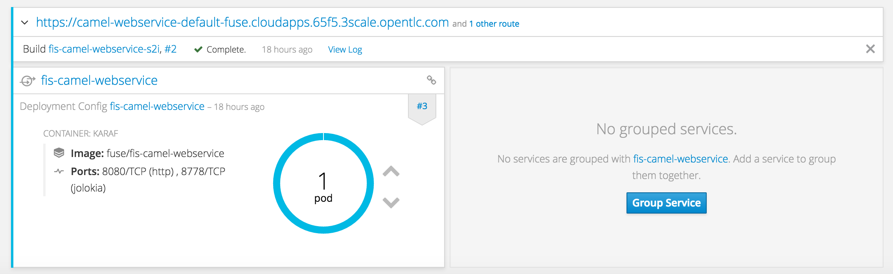
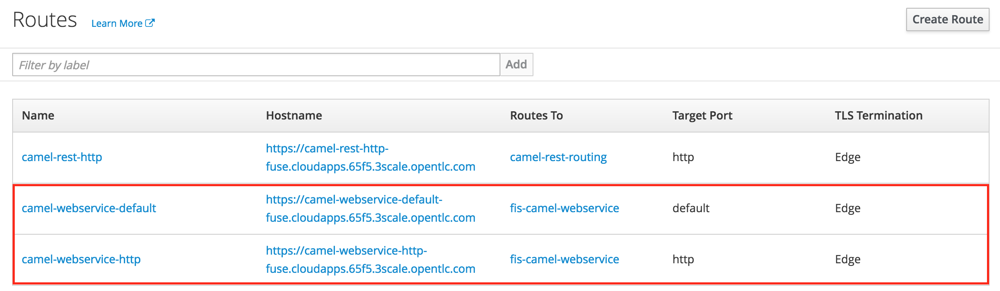
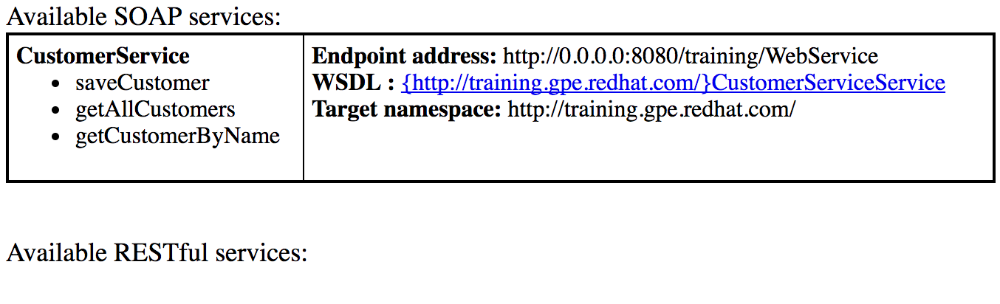
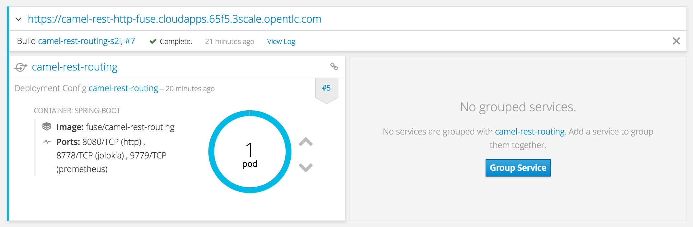
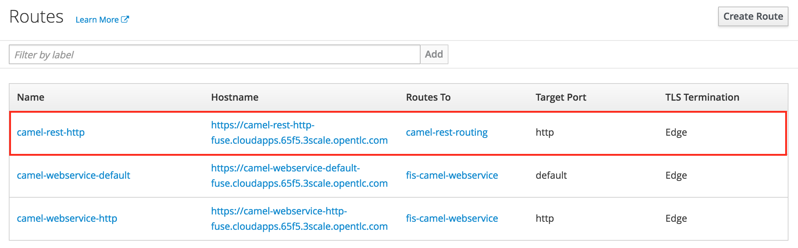

:scrollbar:
:data-uri:
:toc2:
:numbered:

= SOAP Service Management Lab

.Goals

. Use the 3scale API Management Gateway to connect to SOAP Web Services.
. Explore 2 solutions for SOAP:
.. Create custom headers using lua on NGINX to automatically map REST request to SOAP backend.
.. Create a Camel Route installed in Fuse Integration Services (FIS) to route the REST request from the 3scale Gateway to the SOAP Web Service endpoint.

.Prerequisites
* Completion of the previous labs of this course
* * The `EXTERNAL_HOST`and `OCP_WILDCARD_DOMAIN` environment variables set in your shell
+
TIP: To check if your shell still has this environment variable set, execute the `echo $EXTERNAL_HOST` and `echo $OCP_WILDCARD_DOMAIN` commands. If the variable is no longer set, return to the first lab in this course and follow the steps there to set it again.
+
* 3scale Admin Portal URL and user credentials to login.
+
IMPORTANT: The 3scale URL for your lab environment will be `https://3scale-admin.$OCP_WILDCARD_DOMAIN`. The userid/password is `admin/admin`.
+
* OCP Administration URL and userid/password.
+
IMPORTANT: The OCP URL for your lab environment will be `https://$EXTERNAL_HOST:8443/`. The userid/password for development is `developer/developer, and administration is `admin/admin`.

== Overview

In this lab you will expose an existing SOAP based JEE application running on a JBoss FIS container in the same OCP cluster. To do this, you will follow 2 different methods:

. Create custom modifications to lua and NGINX configuration files to automatically map REST request to SOAP backend.
. Deploy a Fuse Integration Services (FIS) application to OCP, which was configured to expose it as a REST service.

== SOAP Request Using Lua & NGINX Customization

== SOAP Request Using Fuse Integration Services

In this lab, we have a SOAP Web Services created using CXF and hosted on Karaf Container in FIS. The Web Service runs in the same OCP container in a different domain. A Springboot camel route is created to expose a REST endpoint and provide data transformation and routing to the SOAP Web Service. This REST endpoint is provided as the backend API for the APICast Gateway.

=== Install FIS ImageStreams

. Login to the client VM and switch user to `jboss`.
. Login to OpenShift Container using the `oc` command line.
+
[source,text]
-----

$ oc login https://$EXTERNAL_HOST:8443 -u admin

-----
+
NOTE: The password for admin user is `admin`.
+
. Install the `fis-java-openshift` and `fis-karaf-openshift` imagestreams.
+
[source,text]
-----

$ oc import-image fis-karaf-openshift -n openshift --from=registry.access.redhat.com/jboss-fuse-6/fis-karaf-openshift --confirm --all
$ oc import-image fis-java-openshift -n openshift --from=registry.access.redhat.com/jboss-fuse-6/fis-java-openshift --confirm --all
-----

=== Deploy `camel-webservice-fis` project

. Fetch the camel-webservice-fis` project from the Git repository:
+
[source,text]
-----
$ cd lab
$ git clone https://github.com/satyaj/camel-webservice-fis.git
-----
+
. Build the project locally and start the camel route:
+
[source,text]
-----
$ cd camel-webservice-fis
$ mvn clean camel:run
-----
+ 
. In a different terminal window, test the Web Service:
+
[source,text]
-----
$ cd camel-webservice-fis/src/main/resources/data
$ curl -X POST --header "content-type: text/xml" --header "SOAPAction:http://training.gpe.redhat.com/getAllCustomers" --data @soap-getAllCustomers.xml http://0.0.0.0:8080/training/WebService

-----
+ 
. Check that the SOAP response is received correctly:
+
[source,xml]
-----
<?xml version="1.0" encoding="UTF-8" standalone="yes"?>
<ns2:Envelope xmlns:ns2="http://schemas.xmlsoap.org/soap/envelope/" xmlns:ns3="http://training.gpe.redhat.com/">
    <ns2:Body>
        <ns3:getAllCustomersResponse>
            <return>
                <name>redhat</name>
                <address>FuseSource Office</address>
                <numOrders>47</numOrders>
                <revenue>4821.0</revenue>
                <test>100.0</test>
                <type>BUSINESS</type>
            </return>
        </ns3:getAllCustomersResponse>
    </ns2:Body>
</ns2:Envelope>
-----
+
. Now deploy the project to your `fuse` OCP project:
.. Login to your OCP console and create a new project `fuse`:
+
[source,text]
-----

$ oc login https://$EXTERNAL_HOST:8443 -u developer
$ oc project fuse
-----
+ 
. In the same terminal, navigate to the `camel-webservice-fis` project root folder and deploy to OCP using fabric8:maven plugin.
+
[source,text]
-----

$ cd ~/lab/camel-webservice-fis
$ mvn fabric8:deploy
-----
+ 
. Check for the build success notification:
+
[source,text]
-----

[INFO] F8: Using OpenShift at https://host.65f5.3scale.opentlc.com:8443/ in namespace openshift with manifest /home/jboss/lab/camel-webservice-fis/target/classes/META-INF/fabric8/openshift.yml
[INFO] OpenShift platform detected
[INFO] Using project: openshift
[INFO] Creating a Service from openshift.yml namespace openshift name fis-camel-webservice
[INFO] Created Service: target/fabric8/applyJson/openshift/service-fis-camel-webservice.json
[INFO] Creating a DeploymentConfig from openshift.yml namespace openshift name fis-camel-webservice
[INFO] Created DeploymentConfig: target/fabric8/applyJson/openshift/deploymentconfig-fis-camel-webservice.json
[INFO] Creating Route openshift:camel-webservice-default host: null
[INFO] Creating Route openshift:camel-webservice-http host: null
[INFO] F8: HINT: Use the command `oc get pods -w` to watch your pods start up
[INFO] ------------------------------------------------------------------------
[INFO] BUILD SUCCESS
[INFO] ------------------------------------------------------------------------
[INFO] Total time: 56.786 s
[INFO] Finished at: 2017-08-23T06:44:29-04:00
[INFO] Final Memory: 88M/1014M
[INFO] ------------------------------------------------------------------------
-----
+ 
. Check that the pod is started successfully.
+

+
NOTE: It could take a few minutes for the pod to be started.
+
. Notice the 2 routes defined for the `fis-camel-webservice` service.
+

+
. Check that the SOAP Web Service is running by accessing the CXF URL : <<camel-webservice-default route>>/cxf
+

+
NOTE: Substitute the value of the `<<camel-webservice-default>> route with the URL for the route as shown in the route details.
+
. Now go to the other terminal and send a request to the SOAP service:
+
[source,text]
-----
$ cd ~/lab/camel-webservice-fis/src/main/resources/data
$ curl -X POST --header "content-type: text/xml" --header "SOAPAction:http://training.gpe.redhat.com/getAllCustomers" --data @soap-getAllCustomers.xml <<camel-webservice-http route>>/training/WebService

-----
+ 
NOTE: Subsitute the value of the `<<camel-webservice-http>> route with the URL for the route as shown in the route details.
+
. Check that the SOAP response is received correctly:
+
[source,xml]
-----
<?xml version="1.0" encoding="UTF-8" standalone="yes"?>
<ns2:Envelope xmlns:ns2="http://schemas.xmlsoap.org/soap/envelope/" xmlns:ns3="http://training.gpe.redhat.com/">
    <ns2:Body>
        <ns3:getAllCustomersResponse>
            <return>
                <name>redhat</name>
                <address>FuseSource Office</address>
                <numOrders>47</numOrders>
                <revenue>4821.0</revenue>
                <test>100.0</test>
                <type>BUSINESS</type>
            </return>
        </ns3:getAllCustomersResponse>
    </ns2:Body>
</ns2:Envelope>
-----
. Additionally, you can also try the other 2 methods `getCustomerByName` and `saveCustomer` to ensure it works. The sample curl requests and request XML objects are the `camel-webservice-fis/src/main/resources/data` folder.

=== Deploy the Camel REST Proxy

Another Fuse project `camel-rest-routing` is available for providing a REST Proxy to the SOAP Web Service deployed in the previous section. This project contains a camel route to expose a REST service, which transforms the input _application/json_ message into a _SOAP Request_ object and calls the `fis-camel-webservice`.

. Fetch the `camel-rest-routing` project from the Git repository:
+
[source,text]
-----
$ cd lab
$ git clone https://github.com/satyaj/camel-rest-routing.git
-----
+
. Build the project locally and start the camel route:
+
[source,text]
-----
$ cd camel-rest-routing
$ mvn clean compile
-----
+
. Once the compile is successful, login to the OCP admin and deploy the project to `fuse` namespace.
.. Login to your OCP console and create a new project `fuse`:
+
[source,text]
-----

$ oc login https://$EXTERNAL_HOST:8443 -u developer
$ oc project fuse
-----
+ 
. In the same terminal, navigate to the `camel-rest-routing` project root folder and deploy to OCP using fabric8:maven plugin.
+
[source,text]
-----

$ cd ~/lab/camel-rest-routing
$ mvn fabric8:deploy
-----
+ 
. Check for the build success notification:
+
[source,text]
-----

[INFO] F8: Using OpenShift at https://host.65f5.3scale.opentlc.com:8443/ in namespace fuse with manifest /home/jboss/lab/camel-rest-routing/target/classes/META-INF/fabric8/openshift.yml
[INFO] OpenShift platform detected
[INFO] Using project: fuse
[INFO] Updating a Service from openshift.yml
[INFO] Updated Service: target/fabric8/applyJson/fuse/service-camel-rest-routing.json
[INFO] Updating DeploymentConfig from openshift.yml
[INFO] Updated DeploymentConfig: target/fabric8/applyJson/fuse/deploymentconfig-camel-rest-routing.json
[INFO] F8: HINT: Use the command `oc get pods -w` to watch your pods start up
[INFO] ------------------------------------------------------------------------
[INFO] BUILD SUCCESS
[INFO] ------------------------------------------------------------------------
[INFO] Total time: 44.849 s
[INFO] Finished at: 2017-08-23T07:16:16-04:00
[INFO] Final Memory: 78M/909M
[INFO] ------------------------------------------------------------------------
-----
+
. Wait for a few minutes, and then check that the `camel-rest-routing` pod is deployed successfully.
+

+
. Notice the route defined for the `camel-rest-routing` service.
+

==== Examine the Camel Route

Notice the camel route in the `src/main/resources/spring/camel-context.xml`. The are 4 routes defined:

* A REST route to expose a REST service endpoint and provide HTTP methods and URLs for the different operations in the service.
+
[source,xml]
-----
   <rest path="">
            <post consumes="application/json"
                outType="com.redhat.gpe.training.Customer"
                type="com.redhat.gpe.training.Customer" uri="customer">
                <param dataType="string" name="user_key" required="true" type="query"/>
                <to uri="direct:saveCustomer"/>
            </post>
            <get bindingMode="json"
                outType="com.redhat.gpe.training.GetCustomerByNameResponse"
                produces="application/json" uri="customer/{name}">
                <param dataType="string" name="user_key" required="true" type="query"/>
                <to uri="direct:getCustomerByName"/>
            </get>
            <get bindingMode="json"
                outType="com.redhat.gpe.training.CustomerType"
                produces="application/json" uri="allcustomers">
                <param dataType="string" name="user_key" required="true" type="query"/>
                <to uri="direct:getAllCustomers"/>
            </get>
        </rest>

-----
+
NOTE: Note the 2 GET methods for `getAllCustomers`, and `getCustomerByName`; and the POST request for `saveCustomer`.
+
* Each of the `direct` routes corresponds to the 3 operations defined in the REST service.
** Route `direct:saveCustomer`
+
[source,xml]
-----
     <route id="createCustomer">
            <from id="_from1" uri="direct:saveCustomer"/>
            <setBody id="_setBody1">
                <simple>${body.getCustomer()}</simple>
            </setBody>
            <setHeader headerName="soapMethod" id="_setHeader1">
                <constant>saveCustomer</constant>
            </setHeader>
            <to id="_to1" uri="direct:soap"/>
        </route>
-----
+
** Route `direct:getAllCustomers`
+
[source,xml]
-----
        <route id="getAllCustomers">
            <from id="_from4" uri="direct:getAllCustomers"/>
            <setBody id="_setBody4">
                <mvel>new Object[0]</mvel>
            </setBody>
            <setHeader headerName="soapMethod" id="_setHeader4">
                <constant>getAllCustomers</constant>
            </setHeader>
            <to id="_to4" uri="direct:soap"/>
        </route>
-----
+
** route `direct:getCustomerByName`
+
[source,xml]
-----
        <route id="getCustomer">
            <from id="_from3" uri="direct:getCustomerByName"/>
            <setBody id="_setBody3">
                <simple>${header.name}</simple>
            </setBody>
            <setHeader headerName="soapMethod" id="_setHeader3">
                <constant>getCustomerByName</constant>
            </setHeader>
            <to id="_to3" uri="direct:soap"/>
        </route>
-----
+
NOTE: Each of the above routes gets the request, constructs the CXF request message object and updates the header to the right soapMethod for calling the SOAP Web Service.
+
* A route to call the soap endpoint:
+
[source,xml]
-----
        <route id="soapRoute">
            <from id="_from5" uri="direct:soap"/>
            <camel:toD id="tod" uri="cxf:bean:wsCustomer?defaultOperationName=${header.soapMethod}&amp;exchangePattern=InOut"/>
            <setBody id="_setBodySoap">
                <simple>${body[0]}</simple>
            </setBody>
            <setHeader headerName="Content-Type" id="_setHeaderContextType">
                <constant>application/json</constant>
            </setHeader>
        </route>
-----
* The cxf bean `wsCustomer` is defined in the XML to connect to the SOAP Web Service running in the project `fis-camel-webservice`.
+
[source,xml]
-----
    <cxf:cxfEndpoint
        address="http://fis-camel-webservice.fuse.svc.cluster.local:8080/training/WebService"
        endpointName="CustomerServicePort" id="wsCustomer" serviceClass="com.redhat.gpe.training.CustomerService"/>

-----

==== Test the REST route

. Send a curl request to the `camel-rest-http` route to make a call to the REST Web Service and check that the SOAP Web Service is called and that response converted to `application/json`.
+
[source,text]
-----
$ curl -k <<camel-rest-http route>>/allcustomers

-----
+
. Check the response:
+
[source,text]
-----
{"return":[{"name":"redhat","address":["FuseSource Office"],"numOrders":47,"revenue":4821.0,"test":100.0,"birthDate":null,"type":"BUSINESS"}]}
-----
+
. Similarly, send a request to the `getCustomerByName` REST URL:
+
[source,text]
-----
$ curl -k <<camel-rest-http route>>/customer/redhat

-----
+
. Check the response:
+
[source,text]
-----
[{"name":"redhat","address":["FuseSource Office"],"numOrders":47,"revenue":4821.0,"test":100.0,"birthDate":null,"type":"BUSINESS"}]
-----

Thus, the REST - SOAP Camel Proxy is now correctly deployed, and hence we can now begin to configure the APICast Gateway to use this REST endpoint to communicate with the SOAP Web Service.

=== Configure 3scale API Management

Define a new route in OCP on 3scale-amp project for APICast staging called `camel-stage-apicast` and a new route in production APICast called `camel-prod-apicast`. 

In your 3scale API Management Admin Console, create a new service `camel_service`, define an application plan `camel_app_plan`, create new user/account for `camel_dev` and `camel_account`, and configure a new Application `camel_application` for the account `camel_account` to use the `camel_app_plan`. Note the User Key generated as this should be used for the API requests. Finally configure the Integration to use the `camel-rest-http` URL as the backend-url. Use the `camel-stage-apicast` and `camel-prod-apicast` routes for the staging and production endpoints respectively.

Test the API by making a curl request to the staging URL and check the response.

[source,text]
-----
$ curl -k “<<camel-stage-apicast route>>/allcustomers?user_key=<<your user_key>>“
[{"name":"redhat","address":["FuseSource Office"],"numOrders":47,"revenue":4821.0,"test":100.0,"birthDate":null,"type":"BUSINESS"}]
-----

Promote the API to production and test the production URL and check the response.

[source,text]
-----
$ curl -k “<<camel-prod-apicast route>>/allcustomers?user_key=<<your user_key>>“
[{"name":"redhat","address":["FuseSource Office"],"numOrders":47,"revenue":4821.0,"test":100.0,"birthDate":null,"type":"BUSINESS"}]
-----

Thus, a camel route can be used to provide routing for the 3scale API Management Gateway to SOAP Web Service.

[blue]#Congratulations!#.

ifdef::showscript[]
endif::showscript[]
